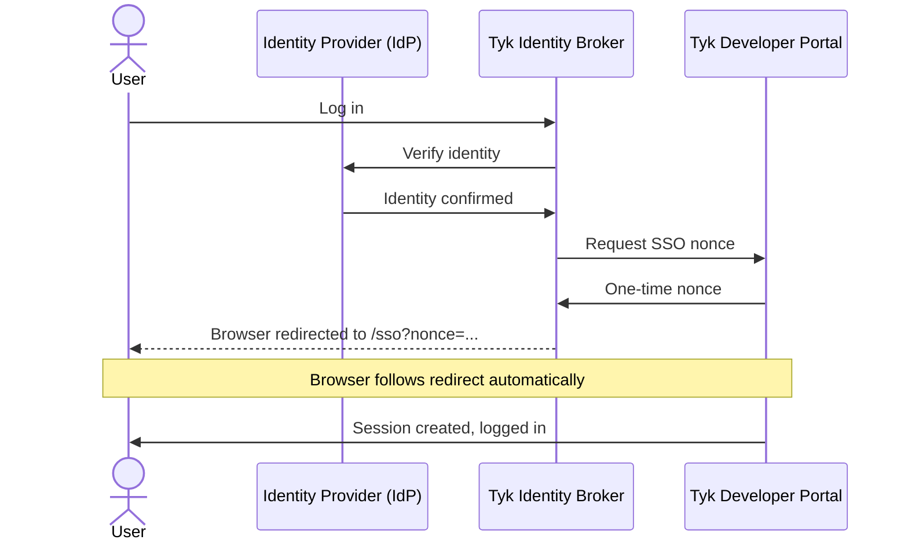
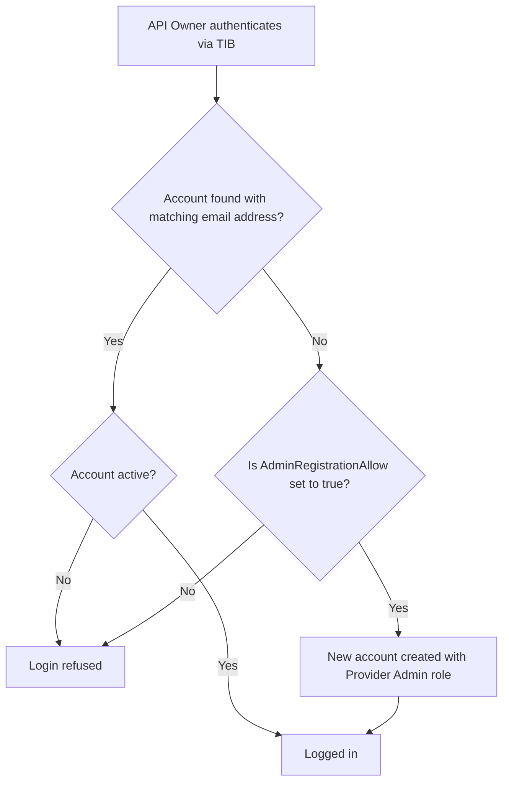
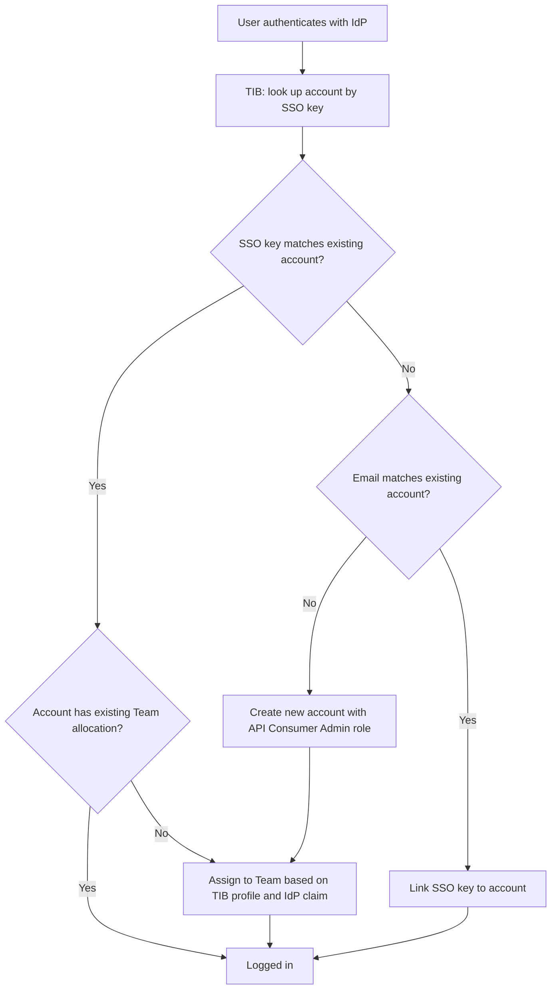
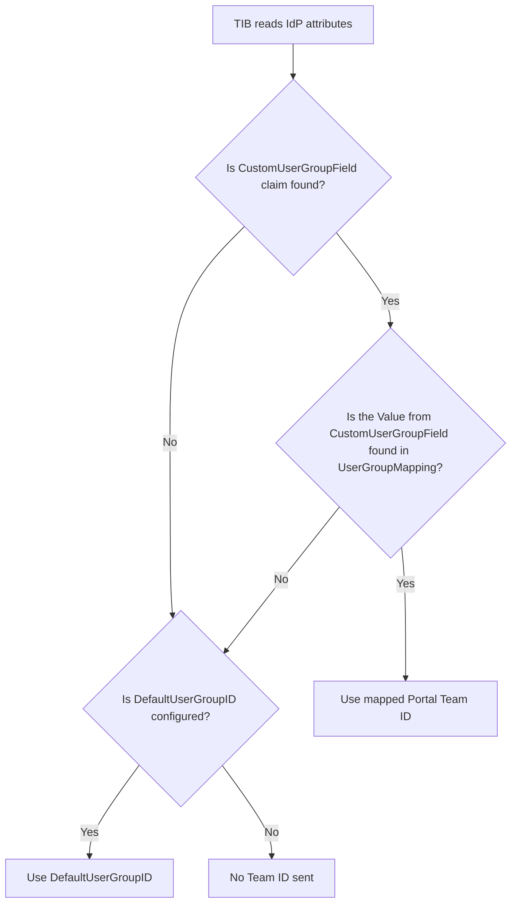
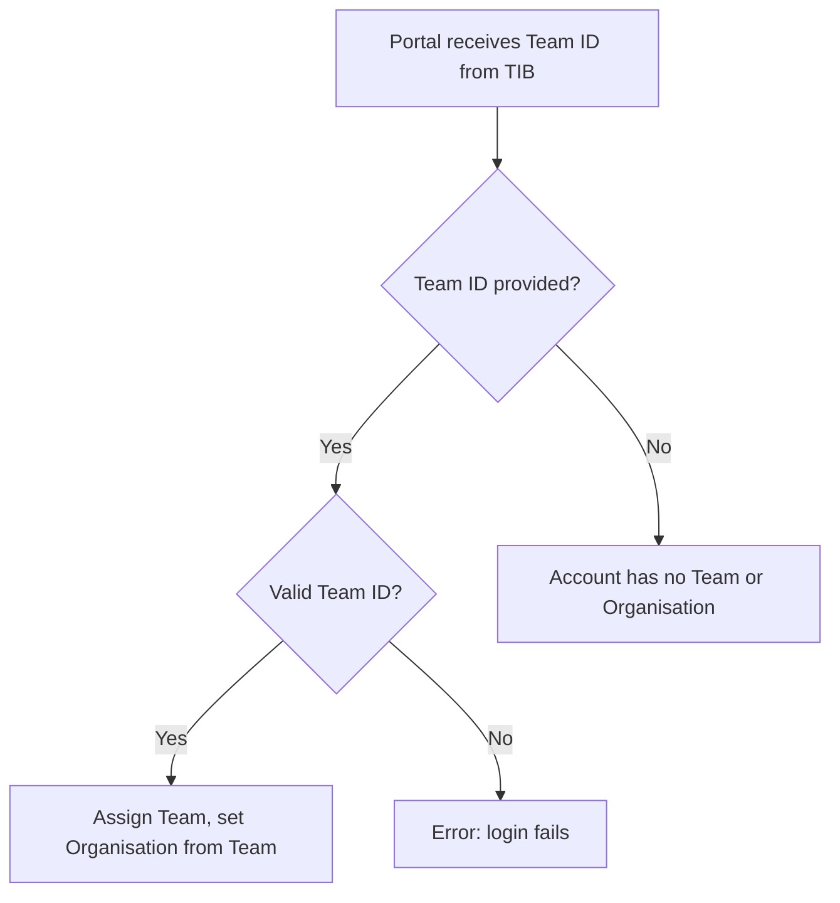

Tyk Identity Broker (TIB) enables Single Sign-On (SSO) for Tyk Developer Portal, allowing users to log in using their existing identity provider (IdP) credentials.

The Tyk Developer Portal has two distinct audiences, each requiring a different TIB configuration:

- **API Owners** - Portal administrators who manage APIs, plans, and developer access from the Admin Portal.
- **API Consumers** - External developers who browse the Live Portal and request API access.

<Note>
We recommend that you read the [Tyk Identity Broker overview](/5.13/tyk-identity-broker/overview) before configuring SSO for Developer Portal.
</Note>

## How It Works

When a user logs in via SSO, TIB authenticates them against the configured IdP and then calls the Tyk Developer Portal API to obtain a one-time nonce. TIB redirects the user's browser to the Portal API's `/sso` endpoint with the nonce appended. Tyk Developer Portal validates the nonce and creates a session automatically.



The outcome of a login depends entirely on which [TIB profile](/5.13/tyk-identity-broker/overview#profile) is used.

- You will typically configure two separate TIB profiles - one for each audience - and publish their respective login URLs to the appropriate users.
- The login URL contains the profile ID:

```
        http://{portal-host}/tib/auth/{profile-id}/{provider}
```

- The `ActionType` configured in that profile determines the result:

        | `ActionType` | Audience | Portal Access |
        |---|---|---|
        | `GenerateOrLoginUserProfile` | API Owners | Admin Portal |
        | `GenerateOrLoginDeveloperProfile` | API Consumers | Live Portal |


## Enabling Single Sign-On

To enable Single Sign-On with Portal you must set the following configuration:

- set `PORTAL_TIB_ENABLED=true` in [the portal configuration](/5.13/product-stack/tyk-enterprise-developer-portal/deploy/configuration#sample-env-file)
- set the `TYK_IB_SESSION_SECRET` environment variable with a secret that will be used to sign the [redirect session cookie](/5.13/tyk-identity-broker/overview#redirect-session-cookie) if you are using an IdP that implements the redirect flow, such as those using OpenID Connect.

<Note>
From Portal v1.12.0, TIB is embedded in the portal and no separate TIB installation is required. If you are running an earlier version, or have a specific infrastructure requirement, see [Using Standalone TIB](/5.13/#using-standalone-tib).
</Note>


## API Owner Login

Tyk Developer Portal maintains user accounts for all API Owners, identified by email address.

When a user is authenticated by the IdP and is directed to a TIB profile configured for action `GenerateOrLoginUserProfile`, the following decision tree is followed:



<Note>
By default, Tyk will automatically create a new account for any successful login where there is no existing admin account for the user's email address. Set `AdminRegistrationAllow` to `false` in the [Portal configuration](/5.13/product-stack/tyk-enterprise-developer-portal/deploy/configuration) to require that an admin account must already exist before SSO login is permitted.
</Note>

### API Owner Profile Configuration

The following [TIB profile](/5.13/tyk-identity-broker/overview#profile) fields are required for API Owner SSO:

| Field | Value |
|---|---|
| `ID` | Unique identifier for this profile. Forms part of the TIB authentication URL. |
| `ActionType` | `GenerateOrLoginUserProfile` |
| `OrgID` | Must be `"0"` |
| `ReturnURL` | `http://{portal-host}/sso` |
| `IdentityHandlerConfig.DashboardCredential` | Must match `PORTAL_API_SECRET` in the Portal configuration |
| `ProviderName` | Authentication method. See [IdP-specific guides](/5.13/#set-up-sso-with-your-identity-provider). |
| `ProviderConfig` | IdP-specific connection settings. See [IdP-specific guides](/5.13/#set-up-sso-with-your-identity-provider). |
| `Type` | `redirect` for OIDC/Social; `passthrough` for LDAP/Proxy. |

The following optional fields are also available:

| Field | Description |
|---|---|
| `CustomEmailField` | The IdP claim to use as the user's email address. If not set, TIB uses the standard email claim. |
| `CustomUserIDField` | The IdP claim to use as the user's unique identifier. If not set, TIB uses the standard subject claim. |

## API Consumer Login

When a user authenticates, the IdP returns a set of attributes about them, such as their name, email address, and group membership. TIB receives these attributes as a key-value map.

When configured with an API Consumer SSO profile, TIB derives an **SSO key** from the user's IdP identity. The SSO key is a combination of the user's unique IdP user ID and the provider name (for example, `abc123@okta`). It is stored on the Portal developer account and used to recognize the same user on subsequent logins, independently of their email address.

### Login Flow

TIB uses the SSO key to determine whether to create or update a Portal developer account:



<Note>
There is no configuration option to restrict API Consumer SSO login to pre-existing accounts only. A new user who successfully authenticates via SSO will always have a new [API Consumer Admin](/5.13/portal/api-consumer#api-consumer-admin) account created for them.
</Note>

### Team Assignment

When a user logs into an account which is not assigned to any Teams - either because it is newly created, or because all Teams were removed after the first login (as shown in the diagram above) - Team assignment takes place based on the TIB profile and claims in the attributes returned by the IdP.

This assignment involves two stages: TIB resolves the user's IdP group claim to a Portal Team ID, then the Portal looks up that Team and assigns the user.

**Stage 1: TIB resolves the Team ID**



**Stage 2: Portal assigns the Team and Organisation**



<Warning>
If `DefaultUserGroupID` is set to a Team ID that does not exist in the Portal, login will fail. Always ensure `DefaultUserGroupID` refers to a valid, existing Team.
</Warning>

<Note>
Once a user has been assigned to a Team - whether via SSO on first login or manually by an admin - subsequent SSO logins will never change their Team or Organisation. Any manual changes made in the Portal are preserved.
</Note>

### User Group Mapping Configuration

The following TIB profile fields control how IdP group claims are resolved to Portal Team IDs (Stage 1 above):

| Profile Field | Description |
|---|---|
| `CustomUserGroupField` | The key in the IdP attributes map that contains the user's group membership. |
| `UserGroupMapping` | Maps IdP group values to Portal Team IDs. If multiple values match, the first match is used. |
| `DefaultUserGroupID` | The Portal Team ID to use when no mapping matches. |


### API Consumer Profile Configuration

The following [TIB profile](/5.13/tyk-identity-broker/overview#profile) fields are required for API Consumer SSO:

| Field | Value |
|---|---|
| `ID` | Unique identifier for this profile. Forms part of the TIB authentication URL. |
| `ActionType` | `GenerateOrLoginDeveloperProfile` |
| `OrgID` | Must be `"0"` |
| `ReturnURL` | `http://{portal-host}/sso` |
| `IdentityHandlerConfig.DashboardCredential` | Must match `PORTAL_API_SECRET` in the Portal configuration |
| `ProviderName` | Authentication method. See [IdP-specific guides](/5.13/#set-up-sso-with-your-identity-provider). |
| `ProviderConfig` | IdP-specific connection settings. See [IdP-specific guides](/5.13/#set-up-sso-with-your-identity-provider). |
| `Type` | `redirect` for OIDC/Social; `passthrough` for LDAP/Proxy. |

The following optional fields are also available:

| Field | Description |
|---|---|
| `CustomUserGroupField` | The IdP claim that contains the user's group membership. Required for [User Group Mapping](/5.13/#user-group-mapping-configuration). |
| `UserGroupMapping` | Maps IdP group values to Portal Team IDs. See [User Group Mapping](/5.13/#user-group-mapping-configuration). |
| `DefaultUserGroupID` | The Portal Team ID to use when no group mapping matches. See [User Group Mapping](/5.13/#user-group-mapping-configuration). |
| `CustomEmailField` | The IdP claim to use as the user's email address. If not set, TIB uses the standard email claim. |
| `CustomUserIDField` | The IdP claim to use as the user's unique identifier. If not set, TIB uses the standard subject claim. |


## Creating a TIB Profile

TIB profiles are managed in the Portal UI under **Settings > SSO Profiles**.

1. Select **Add new SSO Profile**.
2. Complete the **Profile action** step. Choose a **Name** (this becomes the profile `ID`), select the **Profile type** - **Profile for admin users** for API Owner login or **Profile for developers** for API Consumer login - and set the failure redirect URL.

    

3. Select the **Provider type** for your IdP.

    

4. Complete the **Profile configuration** step with your IdP connection details.

    

5. For developer profiles, configure the **Group mapping**. Set **Custom user group claim name** to the IdP claim that contains the user's group membership. For admin profiles, skip this step.

    

6. Click **Continue** to create the profile.

You can view and edit the profile JSON directly from the **Raw editor** view.


<Note>
The SSO profile wizard supports OIDC, LDAP, and Social provider types. SAML is not available as a selectable option so you would need to create the TIB profile in the **Raw editor** view.
</Note>

## Initiating SSO Login

The TIB authentication URL for each profile is shown in the profile's **Provider configuration** section in **Settings > SSO Profiles**.


How users initiate login depends on the flow type used by their IdP.

### Redirect Flow (OIDC, Social)

For redirect-based IdPs, the IdP hosts the login page. Users need to be directed to the TIB authentication URL, which then redirects them to the IdP.

From Portal v1.16.0, you can configure `PORTAL_SSO_CUSTOM_LOGIN_URL` to automatically redirect users from the Portal login page to your IdP's login flow. When set, all login requests - including the Portal's **Log in** button - are redirected to the specified URL instead of displaying the built-in login form.

Set it to the TIB authentication URL for the profile:

<Tabs>
<Tab title="Environment variable">
```ini
PORTAL_SSO_CUSTOM_LOGIN_URL=http://{portal-host}:{portal-port}/tib/auth/{profile-id}/openid-connect
```
</Tab>
<Tab title="Config file">
```json
{
  "SSOCustomLoginURL": "http://{portal-host}:{portal-port}/tib/auth/{profile-id}/openid-connect"
}
```
</Tab>
</Tabs>

For the full reference, see [PORTAL_SSO_CUSTOM_LOGIN_URL](/5.13/product-stack/tyk-enterprise-developer-portal/deploy/configuration#portal_sso_custom_login_url) in the Portal configuration reference.

<Note>
This setting only redirects the login entry point. User registration and password reset pages are not affected.
</Note>

For earlier Portal versions, share the TIB authentication URL directly with users.

### Passthrough Flow (LDAP, Proxy)

For passthrough-based IdPs, there is no IdP-hosted login page. Users submit their credentials directly to TIB via a form `POST`. You must provide a custom HTML login page, for example:

```html expandable
<html>
  <head>
    <title>Developer Portal Login</title>
  </head>
  <body>
    <b>Login to the Developer Portal</b>
    <form method="post" action="http://{portal-host}:{portal-port}/tib/auth/{profile-id}/ldap">
      Username: <input type="text" name="username" /><br/>
      Password: <input type="password" name="password" /><br/>
      <button type="submit">Login</button>
    </form>
  </body>
</html>
```

Replace `{portal-host}`, `{portal-port}`, and `{profile-id}` with the values for your installation.

## Using Standalone TIB

By default, Tyk Developer Portal uses its embedded TIB for SSO from v1.12.0 onwards. If you need to use a standalone TIB instance instead - for example, if you are running an earlier Portal version - install and configure TIB separately and point it at the Portal.

The TIB configuration for standalone Portal SSO requires the `TykAPISettings.DashboardConfig` block to reference the Portal host and `PortalAPISecret`:

```json
{
  "TykAPISettings": {
    "DashboardConfig": {
      "Endpoint": "http://{portal-host}",
      "Port": "{portal-port}",
      "AdminSecret": "{portal-api-secret}"
    }
  }
}
```

| Setting | Description |
|---|---|
| `Endpoint` | URL of the Tyk Developer Portal. |
| `Port` | Port on which the Portal is running. |
| `AdminSecret` | Must match `PORTAL_API_SECRET` in the Portal configuration. |

For full installation and configuration instructions, see [Install Standalone TIB](/5.13/tyk-identity-broker/standalone-tib).

<Note>
TIB uses the same `DashboardConfig` block to connect to both Tyk Dashboard and Tyk Developer Portal - a single standalone TIB instance can only point at one. If you need standalone TIB for both Dashboard SSO and Portal SSO in the same deployment, you must run a separate TIB instance for each.
</Note>

## Set Up SSO with Your Identity Provider

Select your identity provider to get started:

| Identity Provider | Guide |
|---|---|
| Microsoft Entra ID (OIDC), ADFS | [SSO with Microsoft Entra ID](/5.13/tyk-identity-broker/sso-entra-id) |
| Okta (OIDC) | [SSO with Okta](/5.13/tyk-identity-broker/sso-okta) |
| Auth0 | [SSO with Auth0](/5.13/tyk-identity-broker/sso-auth0) |
| Keycloak | [SSO with Keycloak](/5.13/tyk-identity-broker/sso-keycloak) |
| Active Directory, OpenLDAP | [SSO with LDAP](/5.13/api-management/single-sign-on-ldap) |
| Google, GitHub, LinkedIn, and other OAuth providers | [SSO with Social Providers](/5.13/api-management/single-sign-on-social-idp) |
| Custom or legacy authentication endpoints | [SSO with Proxy Provider](/5.13/api-management/custom-auth-with-proxy-identity-provider) |
