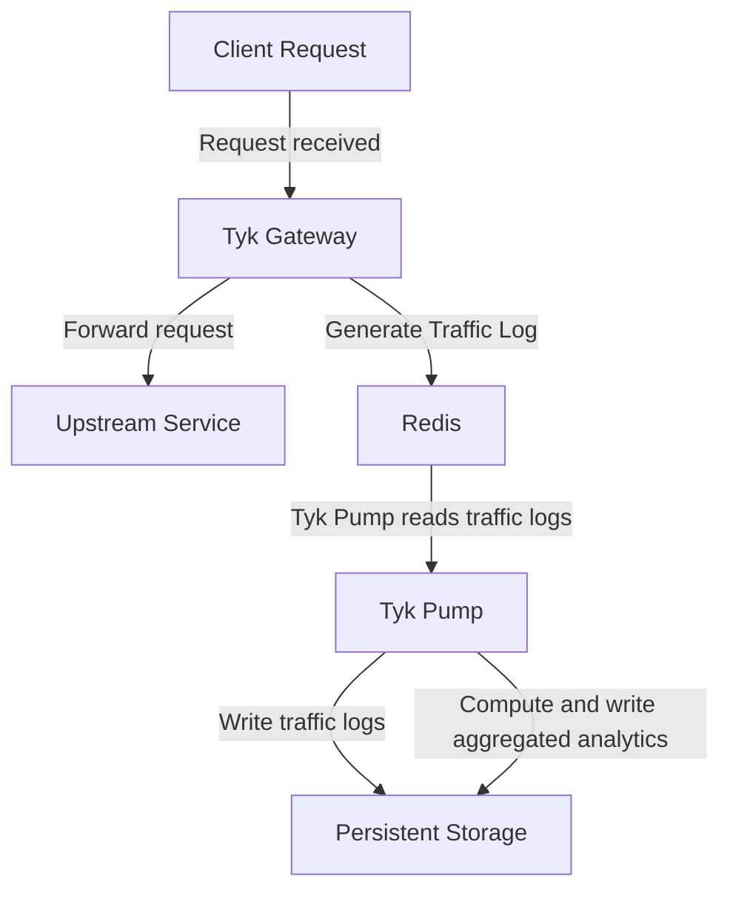
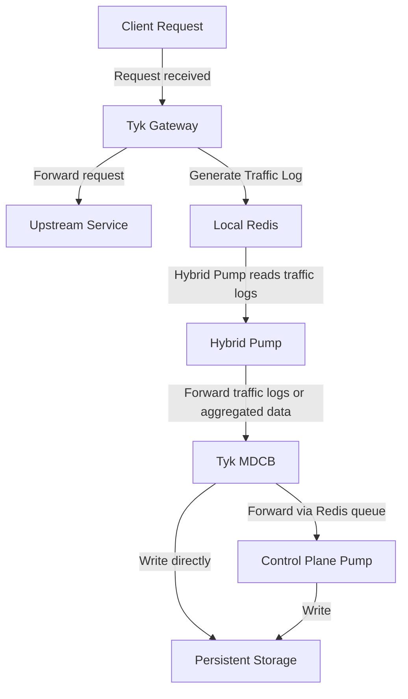

## What Is Dashboard Analytics

Tyk Dashboard presents [built-in analytics](/5.14/#traffic-analytics) giving visibility of the traffic passing through your APIs. It covers two levels of visibility, each gated by its own [Dashboard permission](/5.14/platform-management/user-permissions#user-permissions-in-the-tyk-dashboard-api):

- **Traffic Analytics** (`analytics:read`): graphs and breakdowns of request volume, error rates, and latency, sliced by dimensions such as API, access key, or OAuth client.
- **Log Browser** (`log:read`): inspect individual requests and responses.

This data comes from traffic logs generated by Tyk Gateway for every request, delivered to Tyk Dashboard's persistent storage by [Tyk Pump](/5.14/api-management/tyk-pump), not by OpenTelemetry (OTel). This is true regardless of how far you've adopted OTel elsewhere: OTel traces and metrics export to external observability backends, but they don't feed Tyk Dashboard's own UI.

### Two Kinds of Data

Traffic Analytics and the Log Browser need different data, and can be enabled independently of each other:

| Dashboard Feature | Needs |
| :-- | :-- |
| Traffic Analytics | Aggregated analytics: hourly summaries computed from traffic logs |
| Log Browser | Traffic logs: the full detail of each request |

Aggregated analytics is cheaper to store and query, since it's summarized, while traffic logs preserve full request detail at the cost of storage volume. Many deployments enable both.

### How Aggregation Works

Aggregation calculates hourly analytics from traffic logs, grouped into a fixed set of dimensions, offloading this processing from Tyk Dashboard and reducing storage compared to keeping every traffic log:

| Dashboard Screen | Aggregated By | Field |
| :-- | :-- | :-- |
| [Activity by API](/5.14/#activity-by-api) | API proxy | [`api_id`](/5.14/api-management/logs/traffic-logs#param-api-id) |
| [Activity by Endpoint](/5.14/#activity-by-endpoint) | API endpoint | [`track_path`](/5.14/api-management/logs/traffic-logs#param-track-path) |
| [Activity by Errors](/5.14/#activity-by-error) | HTTP status code | [`response_code`](/5.14/api-management/logs/traffic-logs#param-response-code) |
| [Activity by Key](/5.14/#activity-by-key) | Client access key or token | [`api_key`](/5.14/api-management/logs/traffic-logs#param-api-key) |
| [Traffic per OAuth Client](/5.14/#activity-by-oauth-client) | OAuth client | [`oauth_id`](/5.14/api-management/logs/traffic-logs#param-oauth-id) |
| [Activity by Location](/5.14/#activity-by-location) | Client geographic location | [`geo`](/5.14/api-management/logs/traffic-logs#param-geo) |
| n/a | API version | [`api_version`](/5.14/api-management/logs/traffic-logs#param-api-version) |

`track_path` decides whether an endpoint is broken out individually in the Activity by Endpoint breakdown above; see [Controlling Which Endpoints Are Tracked](/5.14/#controlling-which-endpoints-are-tracked) below for what sets it.

Additional [custom aggregation](/5.14/#custom-aggregation-tags) is also supported for users requiring data aggregated by different dimensions.

### Pre-Computed vs Live Aggregation

An Aggregate Pump is not the only way to get this aggregated data. Tyk Dashboard can also compute it itself: on every request to a Traffic Analytics screen, live, it runs the equivalent aggregation directly against the traffic log collection or table (a MongoDB aggregation pipeline, or a SQL query), and discards the result once the screen has rendered.

Which of the two Tyk Dashboard uses is controlled by a single setting, [`enable_aggregate_lookups`](/5.14/tyk-dashboard/configuration#enable_aggregate_lookups):

- `true`: Tyk Dashboard reads pre-computed aggregated analytics, written by an [Aggregate Pump](/5.14/api-management/dashboard-analytics/control-plane-pumps#choosing-a-pump-type).
- `false` (the default): Tyk Dashboard computes the aggregation live instead, regardless of whether an Aggregate Pump is deployed and running; any aggregated analytics it computes and stores go unread.

Live computation is a legitimate way to run Tyk Dashboard, and needs no extra pump configuration. But it has a cost:

- It runs inside Tyk Dashboard itself, competing for the same CPU and database resources, rather than on a dedicated process built for this job (Tyk Pump). This can make Traffic Analytics screens feel slower to load, especially at higher traffic volumes or with several users viewing the Dashboard UI at once.
- It repeats the same aggregation on every screen load, rather than once per hour, so the cost grows with the volume of traffic logs it has to scan.

Deploying an Aggregate Pump and setting `enable_aggregate_lookups: true` is the recommended approach. It also means you can [cap or evict old traffic logs](/5.14/api-management/dashboard-analytics/analytics-storage-management) without losing the historical data behind these screens, since the aggregated summaries are preserved separately.

<Note>
For MCP proxy traffic, there's no working live fallback: live computation has no MCP-specific aggregation logic. If you're using [MCP Analytics](/5.14/ai-management/mcp-gateway/mcp-analytics), running an MCP Aggregate Pump with `enable_aggregate_lookups: true` is required, not just recommended.
</Note>

<Note>
`enable_aggregate_lookups` doesn't apply to the **Activity by Graph** screen. That screen is fed by a dedicated `tyk_graph_aggregated` table, written by the [SQL GraphQL Aggregate Pump](/5.14/api-management/dashboard-analytics/control-plane-pumps#sql-graphql-aggregate-pump), which Tyk Dashboard's Postgres driver always queries directly. There's no live-computation fallback and no config flag for this screen, and it's PostgreSQL-only.
</Note>

## Where the Data Comes From

Tyk Gateway generates a traffic log for every request and writes it to Redis. See [Traffic Logs](/5.14/api-management/logs/traffic-logs) for how and when these are generated, and the full field reference.

## What Data Is Captured

The [Traffic Log Field Reference](/5.14/api-management/logs/traffic-logs#traffic-log-field-reference) documents every field. The rest of this section covers what specifically affects Dashboard Analytics: per-endpoint tracking, detailed recording, and custom tags.

### Controlling Which Endpoints Are Tracked

By default, only some endpoints are broken out individually in the per-endpoint aggregates: Activity by Endpoint, and the per-endpoint breakdowns nested within Activity by Key and Traffic per OAuth Client. Which ones depends on the `track_path` field; see [Controlling Which Endpoints Are Tracked](/5.14/api-management/logs/traffic-logs#controlling-which-endpoints-are-tracked) on the Traffic Logs page for what sets it.

- Endpoints with Track Endpoint enabled get `track_path: true`, and appear individually in these breakdowns.
- Endpoints without it get `track_path: false`. Their traffic is excluded from these per-endpoint breakdowns specifically, but still counted in every other aggregate dimension: API totals, error codes, API versions, key/OAuth-client counts, geo, and tags.

Set `track_all_paths: true` on an Aggregate Pump to override this and include every endpoint in these breakdowns, regardless of whether Track Endpoint is enabled on it.

<Note>
Track Endpoint only affects this aggregated per-endpoint breakdown. It has no effect on traffic logs or the Log Browser.
</Note>

### Detailed Recording

Detailed recording, [configured at the Gateway](/5.14/api-management/logs/traffic-logs#detailed-recording), includes the full request and response, in wire format and base64-encoded, in the traffic log's `raw_request` and `raw_response` fields. Enabling it significantly increases record size and storage requirements; Tyk Cloud users are subject to the subscription's storage quota.

### Custom Aggregation Tags

Aggregation groups traffic logs by a fixed set of [standard fields](/5.14/#how-aggregation-works). When those don't capture the dimension you care about, for example when several sub-accounts or environments share a single API key so the standard `api_key` aggregation can't separate them, Tyk Gateway can [tag traffic logs](/5.14/api-management/logs/traffic-logs#custom-tags) with the value of any HTTP request header, such as `X-Account-ID`. Tyk Pump's aggregate pumps then compute an hourly aggregate for each distinct tag value observed, the same way they do for the standard fields.

Because every distinct tag value gets its own aggregate bucket, tagging a header whose value is unique per request, such as a timestamp or request ID, creates one bucket per request: no aggregation benefit, just storage growth. Tyk Pump logs a warning if it detects this happening.

You might also tag a header you never intended to aggregate at all, for example a request ID useful for finding one specific transaction in the Log Browser, but meaningless as an aggregate dimension.

In both cases, you can add the tag, or its prefix, to the aggregate pump type's `ignore_tag_prefix_list` setting. This only affects aggregation: the tag itself is still recorded on the traffic log and remains visible in the Log Browser either way.

**Viewing the Aggregated Data**

In the Tyk Dashboard UI, use the **filter by tag** option on the [API Activity Dashboard](/5.14/#api-activity-dashboard) to see the aggregate graphs for a specific tag value. Programmatically, pass the tag as a `tags` parameter to the [Dashboard API](/5.14/tyk-dashboard-api)'s analytics endpoints.

### GraphQL-Specific Detail

Traffic logs for GraphQL APIs carry additional fields; see [GraphQL Fields](/5.14/api-management/logs/traffic-logs#graphql-fields) on the Traffic Logs page. This data is not currently surfaced in Tyk Dashboard; it's stored for export to external tools. See the Mongo GraphQL Pump and SQL GraphQL Pump sections of [Control Plane Pumps](/5.14/api-management/dashboard-analytics/control-plane-pumps#mongodb) for configuration.

### MCP-Specific Detail

Traffic logs for MCP proxy requests carry additional fields; see [MCP Fields](/5.14/api-management/logs/traffic-logs#mcp-fields) on the Traffic Logs page. See [MCP Analytics](/5.14/ai-management/mcp-gateway/mcp-analytics) for how Tyk Dashboard surfaces this data.

## How Data Reaches Tyk Dashboard

How that data actually reaches Tyk Dashboard depends on your deployment topology. Tyk Gateway's side of the job, generating the traffic log and writing it to Redis, is identical either way; what differs is what reads it next.

In a combined control and data plane (the `tyk-stack` chart, no Tyk MDCB), Tyk Pump reads directly from that Redis instance and writes straight to the persistent storage (MongoDB or SQL), forwarding traffic logs, aggregated analytics, or both, in parallel:

In a distributed deployment, with separate control and data planes connected via Tyk MDCB, the Hybrid Pump (the pump type that runs on each data plane) reads from its own local Redis and forwards the data to Tyk MDCB instead, which then writes it to the persistent storage in the control plane, either using its own built-in writer or by forwarding it via a Redis queue to a Control Plane Pump:

See [Data Plane Pump](/5.14/api-management/dashboard-analytics/data-plane-pump) for that mechanism in full, including which of the two paths applies to traffic logs versus aggregated analytics.

Both paths write to the same MongoDB or SQL collections that Tyk Dashboard reads from.

## Storage Backends

Whichever topology you use, Tyk Pump ultimately writes traffic logs and aggregated analytics into either MongoDB or SQL (PostgreSQL or MySQL), and Tyk Dashboard reads from that same database.

- MongoDB stores each kind of data, traffic logs and aggregated analytics, in its own collection, and can optionally split traffic logs into a separate collection per Organisation.
- SQL also stores each kind of data in its own table, but has no per-Organisation split: every Organisation's rows share the same table, distinguished by an indexed `org_id` column.

See [Control Plane Pumps](/5.14/api-management/dashboard-analytics/control-plane-pumps#choosing-a-pump-type) for the specific pump types and configuration for each (or [Data Plane Pump](/5.14/api-management/dashboard-analytics/data-plane-pump) if your control and data planes are separate).

Tyk Dashboard's own configuration file has a `storage` section, with `analytics` and `logs` sub-sections used to connect it to those same databases; see the [Tyk Dashboard configuration reference](/5.14/tyk-dashboard/configuration#storage) for the full field list, and [Database Management](/5.14/planning-for-production/database-settings) for production sizing guidance.

For guidance on managing the size of that stored data over time, see [Analytics Storage Management](/5.14/api-management/dashboard-analytics/analytics-storage-management).

## Traffic Analytics

The Tyk Dashboard provides a full set of analytics functions and graphs that you can use to segment and view your API traffic and activity. The Dashboard offers a great way for you to debug your APIs and quickly pin down where errors might be cropping up and for which clients.

[User Owned Analytics](/5.14/platform-management/user-permissions), introduced in Tyk v5.1, can be used to limit the visibility of aggregate statistics to users when API Ownership is enabled. Due to the way that the analytics data are aggregated, not all statistics can be filtered by API and so may be inaccessible to users with the Owned Analytics permission.

<Note>
For the Tyk Dashboard's analytics functionality to work, you must configure both per-request and aggregated pumps for the database platform that you are using. For more details see the [Control Plane Pumps](/5.14/api-management/dashboard-analytics/control-plane-pumps#choosing-a-pump-type) section.
</Note>

## Analyzing API Traffic Activity

### API Activity Dashboard

The first screen (and main view) of the Tyk Dashboard will show you an overview of the aggregate usage of your APIs, this view includes the number of hits, the number of errors and the average latency over time for all of your APIs as an average:

You can toggle the graphs by clicking the circular toggles above the graph to isolate only the stats you want to see.

Use the Start and End dates to set the range of the graph, and the version drop-down to select the API and version you wish to see traffic for.

You can change the granularity of the data by selecting the granularity drop down (in the above screenshot: it is set to “Day”).

The filter by tag option, in a graph view, will enable you to see the graph filtered by any tags you add to the search.

Below the aggregate graph, you’ll see an error breakdown and endpoint popularity chart. These charts will show you the overall error type (and code) for your APIs as an aggregate and the popularity of the endpoints that are being targeted by your clients:

<Note>
From Tyk v5.1 (and LTS patches v4.0.14 and v5.0.3) the Error Breakdown and Endpoint Popularity charts will not be visible to a user if they are assigned the [Owned Analytics](/5.14/platform-management/user-permissions) permission.
</Note>

### Activity Logs

When you look through your Dashboard and your error breakdown statistics, you'll find that you will want to drill down to the root cause of the errors. This is what the Log Browser is for.

The Log Browser will isolate individual log lines in your analytics data set and allow you to filter them by:

* API Name
* Token ID (hashed)
* Errors Only
* By Status Code

You will be presented with a list of requests, and their metadata:

Click a request to view its details.

#### Self-Managed Installations Option

In an Self-Managed installation, if you have request and response logging enabled, then you can also view the request payload and the response if it is available.
To enable request and response logging, please take a look at [useful debug modes](/5.14/api-management/troubleshooting-debugging#capturing-detailed-logs) .

**A warning on detailed logging:** This mode generates a very large amount of data, and that data exponentially increases the size of your log data set, and may cause problems with delivering analytics in bulk to your MongoDB instances. This mode should only be used to debug your APIs for short periods of time.

### Activity by API

To get a tabular view of how your API traffic is performing, you can select the **Activity by API** option in the navigation and see a tabular view of your APIs. This table will list out your APIs by their traffic volume and you'll be able to see when they were last accessed:

You can use the same range selectors as with the Dashboard view to modify how you see the data. However, granularity and tag views will not work since they do not apply to a tabulated view.

If you select an API name, you will be taken to the drill-down view for that specific API, here you will have a similar Dashboard as you do with the aggregate API Dashboard that you first visit on log in, but the whole view will be constrained to just the single API in question:

You will also see an error breakdown and the endpoint popularity stats for the API:

Tyk will try to normalize endpoint metrics by identifying IDs and UUIDs in a URL string and replacing them with normalized tags, this can help make your analytics more useful. It is possible to configure custom tags in the configuration file of your Tyk Self-Managed or Multi-Cloud installation.

<Note>
From Tyk v5.1 (and LTS patches v4.0.14 and v5.0.3) the Error Breakdown and Endpoint Popularity charts will not be visible to a user if they are assigned the [Owned Analytics](/5.14/platform-management/user-permissions) permission.
</Note>

### Activity by Key

You will often want to see what individual keys are up to in Tyk, and you can do this with the **Activity per Key** section of your analytics Dashboard. This view will show a tabular layout of all keys that Tyk has seen in the range period and provide analytics for them:

You'll notice in the screenshot above that the keys look completely different to the ones you can generate in the key designer (or via the API), this is because, by default, Tyk will hash all keys once they are created in order for them to not be snooped should your key-store be breached.

This poses a problem though, and that is that the keys also no longer have any meaning as analytics entries. You'll notice in the screenshot above, one of the keys is appended by the text **TEST_ALIAS_KEY**. This is what we call an Alias, and you can add an alias to any key you generate and that information will be transposed into your analytics to make the information more human-readable.

The key `00000000` is an empty token, or an open-request. If you have an API that is open, or a request generates an error before we can identify the API key, then it will be automatically assigned this nil value.

If you select a key, you can get a drill down view of the activity of that key, and the errors and codes that the token has generated:

(The filters in this view will not be of any use except to filter by API Version).

<Note>
From Tyk v5.1 (and LTS patches v4.0.14 and v5.0.3) the <b>Traffic per Key</b> screen will not be visible to a user if they are assigned the [Owned Analytics](/5.14/platform-management/user-permissions) permission.
</Note>

### Activity by Endpoint

To get a tabular view of how your API traffic is performing at the endpoint level, you can select the Activity by Endpoint option in the navigation and see a tabular view of your API endpoints. This table will list your API endpoints by their traffic volume and you’ll be able to see when they were last accessed:

Not every endpoint necessarily appears here: see [Controlling Which Endpoints Are Tracked](/5.14/#controlling-which-endpoints-are-tracked) for what controls that.

### Activity by Graph

The **Activity by Graph** page provides analytics for your [GraphQL APIs](/5.14/api-management/graphql) (Universal Data Graph / UDG). It allows you to monitor and analyze GraphQL-specific traffic through the following charts and tables:

* **Popularity by Graph API**: Displays the most popular GraphQL APIs based on request volume.
* **Errors by Graph API**: Shows the error rates and distribution across your GraphQL APIs.
* **All Graph APIs**: A comprehensive table listing all configured GraphQL APIs and their key metrics.

{/* TODO: Add screenshots of the Activity by Graph dashboard */}

### Activity by Location

Tyk will attempt to record GeoIP based information based on your inbound traffic. This requires a MaxMind IP database to be available to Tyk and is limited to the accuracy of that database.

You can view the overview of what the traffic breakdown looks like per country, and then drill down into the per-country traffic view by selecting a country code from the list:

<Note>
From Tyk v5.1 (and LTS patches v4.0.14 and v5.0.3) the <b>Geographic Distribution</b> screen will not be visible to a user if they are assigned the [Owned Analytics](/5.14/platform-management/user-permissions) permission.
</Note>

**MaxMind Settings**

To use a MaxMind database, see [MaxMind Database Settings](/5.14/tyk-oss-gateway/configuration#analytics_config-enable_geo_ip) in the Tyk Gateway Configuration Options.

### Activity by MCP

The **Activity by MCP** page provides analytics for your Model Context Protocol (MCP) [proxies and primitives](/5.14/ai-management/mcp-gateway/managing-proxies). It allows you to track and monitor MCP-specific traffic through the following charts and tables:

* **Activity per MCP**: Displays request volumes and traffic trends across your configured MCP servers.
* **Errors by MCP**: Tracks error rates and distribution across different MCP servers.
* **Primitives Traffic**: Shows the overall traffic volume handled by your MCP primitives (tools, resources, and prompts).
* **Most Used Primitives**: Identifies the most frequently invoked primitives.
* **Most Failing Primitives**: Highlights the primitives with the highest failure rates.
* **Slowest Primitives**: Measures latency and identifies the slowest-performing primitives.
* **Error Status Codes by Primitive**: Breaks down error responses by HTTP status codes for each primitive.

For more information, see [MCP Analytics](/5.14/ai-management/mcp-gateway/mcp-analytics).

### Activity by Error

The error overview page limits the analytics down to errors only, and gives you a detailed look over the range of the number of errors that your APIs have generated. This view is very similar to the Dashboard, but will provide more detail on the error types:

<Note>
From Tyk v5.1 (and LTS patches v4.0.14 and v5.0.3) the Errors by Category data will not be visible to a user if they are assigned the [Owned Analytics](/5.14/platform-management/user-permissions) permission.
</Note>

### Activity by OAuth Client

Traffic statistics are available on a per OAuth Client ID basis if you are using the OAuth mode for one of your APIs. To get a breakdown view of traffic aggregated to a Client ID, you will need to go to the **System Management -> APIs** section and then under the **OAuth API**, there will be a button called **OAuth API**. Selecting an OAuth client will then show its aggregate activity

In the API list view – an **OAuth Clients** button will appear for OAuth enabled APIs, use this to browse to the Client ID and the associated analytics for that client ID:

You can view the analytics of individual tokens generated by this Client ID in the regular token view.

<Note>
From Tyk v5.1 (and LTS patches v4.0.14 and v5.0.3) the Traffic per OAuth Client ID charts will not be visible to a user if they are assigned the [Owned Analytics](/5.14/platform-management/user-permissions) permission.
</Note>
