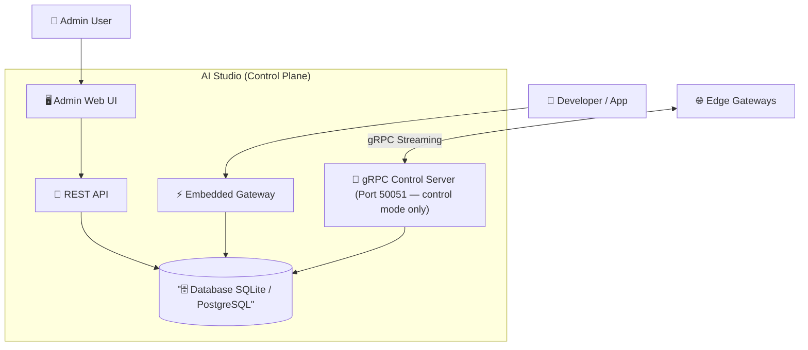
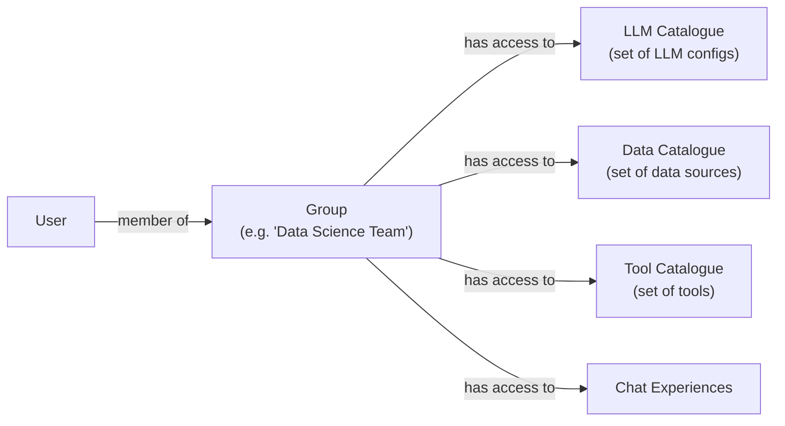
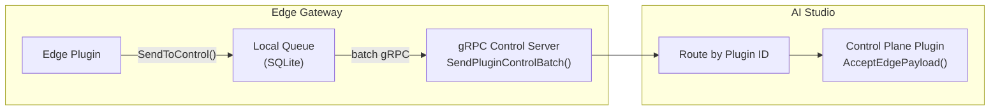
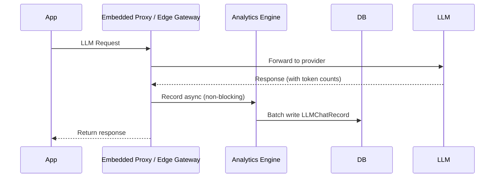
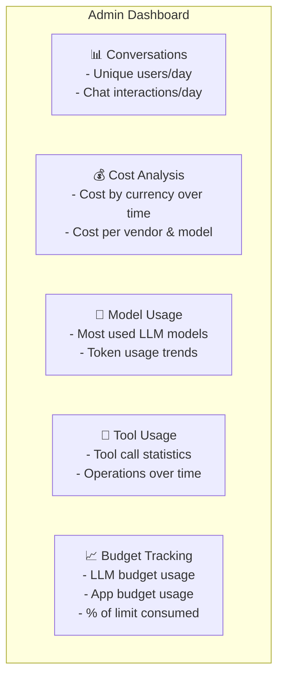
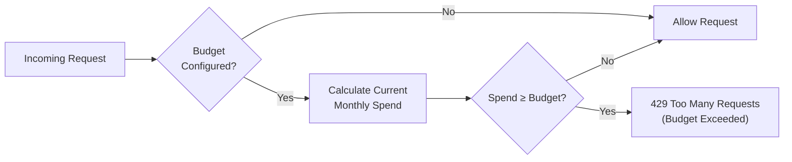
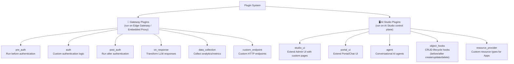

## Availability

| Edition   | Deployment Type |
| :------------- | :---------------------- |
| [Community & Enterprise]() | Self-Managed, Hybrid |

AI Studio is the **central management hub** of the Tyk AI platform. It is the brain of the system — where administrators configure LLM providers, manage users, monitor usage, and extend the platform with plugins. When deployed in a hub-and-spoke topology, it also acts as the **control plane** that governs all connected Edge Gateways.

## High-Level Architecture



AI Studio runs as a **single binary** that starts multiple servers:

| Server | Port | Purpose |
|---|---|---|
| REST API + Admin UI | `8080` | Web interface and programmatic management |
| Embedded Gateway | `9090` | Proxies LLM requests directly (standalone mode) |
| gRPC Control Server | `50051` | Hub-and-spoke control plane (only in `control` mode) |

<Note>
The gRPC Control Server only starts when `GATEWAY_MODE=control` is set. In `standalone` mode (the default), AI Studio handles everything locally without Edge Gateways.
</Note>

## Core Features

AI Studio provides the following capabilities out of the box:

| Feature | Description |
|---|---|
| **LLM Management** | Configure and manage connections to LLM providers |
| **Application Management** | Create apps with credentials, budgets, and LLM access |
| **User Management & RBAC** | Users, groups, roles, and access control |
| **Analytics & Monitoring** | Token usage, cost tracking, and dashboards |
| **Plugin System** | Extend AI Studio with UI, Agent, and Gateway plugins |
| **Secrets Management** | Secure storage and reference for API keys |
| **Embedded Gateway** | Built-in LLM proxy (standalone mode) |
| **Edge Gateway Management** | Register, monitor, and reload Edge Gateways (control mode) |
| **Plugin Marketplace** | Discover and install community plugins |
| **Documentation Server** | Built-in docs site served at port 8989 |

### Configuration Management

Configuration Management is the heart of AI Studio. It is where administrators define **what LLMs are available**, **how they are accessed**, and **what rules govern their use**.

#### LLM Provider Configuration

AI Studio supports multiple LLM vendors through a unified configuration model:

{/* ```mermaid
graph TD
    ADMIN["Admin"] -->|Configure| LLM_CONFIG["LLM Configuration"]
    LLM_CONFIG --> VENDOR["Vendor\n(openai / anthropic / vertex\ngoogle_ai / huggingface / ollama)"]
    LLM_CONFIG --> APIKEY["API Key / Credentials\n(stored securely or via $SECRET/name)"]
    LLM_CONFIG --> MODELS["Allowed Models\n(e.g. gpt-4, claude-3-opus)"]
    LLM_CONFIG --> BUDGET["Monthly Budget\n(optional spending cap)"]
    LLM_CONFIG --> PRIVACY["Privacy Score\n(0=Public → 100=Restricted/PII)"]
    LLM_CONFIG --> FILTERS["Content Filters\n(associated filter plugins)"]
    LLM_CONFIG --> NAMESPACE["Namespace\n(CE: default / ENT: custom)"]
```

Each LLM configuration gets a **slug** (auto-generated from its name) used in proxy endpoints:

```
/llm/call/{llmSlug}/...      ← Unified (streaming + non-streaming)
/llm/rest/{llmSlug}/...      ← REST only
/llm/stream/{llmSlug}/...    ← Streaming only
``` */}

##### Supported Vendors:

| Vendor | Key | Notes |
|---|---|---|
| OpenAI | `openai` | GPT-4, GPT-3.5, etc. |
| Anthropic | `anthropic` | Claude models |
| Google Vertex AI | `vertex` | Gemini via gcloud |
| Google AI | `google_ai` | Gemini via API key |
| Hugging Face | `huggingface` | Open-source models |
| Ollama | `ollama` | Self-hosted models |

#### Model Pricing

To enable cost tracking, administrators define per-token prices for each model:

TODO: Add correct diagram and more text
{/* ```mermaid
graph LR
    MODEL_PRICE["Model Price Record"] --> VENDOR_FIELD["Vendor"]
    MODEL_PRICE --> MODEL_NAME["Model Name\n(e.g. gpt-4-turbo)"]
    MODEL_PRICE --> INPUT_PRICE["Input Token Price\n(CPIT)"]
    MODEL_PRICE --> OUTPUT_PRICE["Output Token Price\n(CPT)"]
    MODEL_PRICE --> CACHE_WRITE["Cache Write Token Price"]
    MODEL_PRICE --> CACHE_READ["Cache Read Token Price"]
    MODEL_PRICE --> CURRENCY["Currency\n(e.g. USD)"]
``` */}

The Analytics Engine uses these prices to calculate the cost of every LLM interaction automatically.

#### Application (App) Management

Applications are the **access credentials** that developers and systems use to interact with LLMs through the proxy:

TODO: Add correct diagram and more text

{/* ```mermaid
graph TD
    APP["Application"] --> CRED["API Credentials\n(token for proxy auth)"]
    APP --> LLM_ACCESS["LLM Access\n(which LLMs this app can use)"]
    APP --> APP_BUDGET["Monthly Budget\n(per-app spending cap)"]
    APP --> TOOLS["Tool Access\n(which tools are available)"]
    APP --> DATASOURCES["Data Source Access\n(RAG sources)"]
    APP --> OWNER["Owner User"]
    APP --> NAMESPACE["Namespace\n(CE: default / ENT: custom)"]
``` */}

#### Secrets Management

API keys and sensitive values can be stored securely and referenced by name:

```
$SECRET/MyOpenAIKey   ← Reference in LLM config instead of raw key
```

This prevents sensitive credentials from being exposed in configuration exports or logs.

#### Content Filters

Filters are rules attached to LLMs that can block or modify requests/responses. They are implemented as plugins with the `pre_auth`, `auth`, or `post_auth` hook types and are associated with specific LLM configurations.

### User Management & RBAC

AI Studio uses a **group-based access control** model. Access to resources is granted through group membership, not individual user permissions.

{/* #### Role Hierarchy

```mermaid
graph TD
    SA["👑 Super Admin\n(User ID=1)\nFull system access\nManages all admins"] --> A["🔧 Admin\n(IsAdmin=true)\nManages users & groups\nCannot modify other admins"]
    A --> D["💻 Developer\n(ShowPortal=true)\nAccess to Portal UI\nCan create Apps"]
    D --> CU["💬 Chat User\n(Default)\nAccess to Chat UI only"]
``` */}

| Role | `IsAdmin` | `ShowPortal` | Capabilities |
|---|---|---|---|
| **Super Admin** | ✅ (ID=1) | ✅ | Full access, manages admins, SSO config, audit logs |
| **Admin** | ✅ | ✅ | Manages users, groups, LLMs, plugins |
| **Developer** | ❌ | ✅ | Portal access, creates apps, uses tools |
| **Chat User** | ❌ | ❌ | Chat interface access only |

{/* #### Authentication Methods

```mermaid
sequenceDiagram
    participant User
    participant AI_Studio
    participant DB

    Note over User, DB: Session-based (UI Login)
    User->>AI_Studio: POST /auth/login (email + password)
    AI_Studio->>DB: Validate credentials
    DB-->>AI_Studio: User record
    AI_Studio-->>User: Session cookie

    Note over User, DB: API Key (Programmatic Access)
    User->>AI_Studio: GET /llm/call/... (Authorization: Bearer <api_key>)
    AI_Studio->>DB: Validate API key → find user
    DB-->>AI_Studio: User + entitlements
    AI_Studio-->>User: LLM response
```

#### Group-Based Access Control



**Access Control Flow (API Request):**



> **CE vs Enterprise:** In Community Edition, all users are in a single "Default" group with access to all resources. In Enterprise Edition, you can create unlimited groups with fine-grained catalogue assignments.

--- */}

### Analytics & Monitoring

AI Studio automatically collects and stores analytics data for every LLM interaction that flows through the system.

#### Data Collection Flow



#### What Gets Recorded

Every LLM interaction records:

| Field | Description |
|---|---|
| `timestamp` | When the request occurred |
| `user_id` | Which user made the request |
| `app_id` | Which application was used |
| `llm_id` | Which LLM configuration was targeted |
| `vendor` | LLM provider (openai, anthropic, etc.) |
| `model_name` | Specific model used (e.g. gpt-4-turbo) |
| `prompt_tokens` | Input token count |
| `response_tokens` | Output token count |
| `total_tokens` | Combined token count |
| `cost` | Calculated cost (using model pricing) |
| `latency_ms` | Request duration in milliseconds |
| `interaction_type` | `chat` or `proxy` |
| `cache_write_tokens` | Tokens written to cache (Anthropic) |
| `cache_read_tokens` | Tokens read from cache (Anthropic) |

{/* #### Dashboard & Reporting



**Available Analytics API Endpoints:**

| Endpoint | Description |
|---|---|
| `GET /analytics/chat-records-per-day` | Daily chat volume |
| `GET /analytics/cost-analysis` | Cost over time by currency |
| `GET /analytics/most-used-llm-models` | Top models by usage |
| `GET /analytics/token-usage-per-user` | Token breakdown per user |
| `GET /analytics/token-usage-per-app` | Token breakdown per app |
| `GET /analytics/vendor-usage` | Usage by LLM vendor |
| `GET /analytics/model-usage` | Usage by specific model |
| `GET /analytics/total-cost-per-vendor-and-model` | Cost breakdown |
| `GET /analytics/budget-usage` | Budget consumption status |
| `GET /analytics/app-interactions-over-time` | App activity trends |

#### Budget Enforcement



> **CE vs Enterprise:** Community Edition tracks costs but does **not** enforce budget limits. Budget enforcement (blocking requests when over budget + email alerts at 80%/100%) is an **Enterprise Edition** feature.

--- */}

### Plugin System

The Plugin System is AI Studio's extensibility layer. Plugins run as **isolated processes** communicating over gRPC, providing security and fault tolerance. All plugins use a **Unified Plugin SDK** that works in both AI Studio and Edge Gateway contexts.

{/* #### Plugin Types



#### Plugin Lifecycle

```mermaid
sequenceDiagram
    participant Admin
    participant AI_Studio
    participant PluginManager
    participant PluginProcess

    Admin->>AI_Studio: Register plugin\n(command path or OCI reference)
    AI_Studio->>PluginManager: LoadPlugin(id)
    PluginManager->>PluginProcess: Start subprocess (go-plugin / gRPC)
    PluginProcess-->>PluginManager: GetManifest() → capabilities
    PluginManager->>AI_Studio: Update hook_types from manifest
    Note over AI_Studio: Plugin is now active

    Note over PluginProcess: On LLM request...
    AI_Studio->>PluginProcess: Execute hook (pre_auth / post_auth / etc.)
    PluginProcess-->>AI_Studio: PluginResponse (allow/block/modify)
``` */}

#### Plugin Distribution

Plugins can be distributed in three ways:

| Method | Description | Example |
|---|---|---|
| **Local Binary** | Path to executable on disk | `/usr/local/bin/my-plugin` |
| **Remote Binary** | URL to download | `https://example.com/plugin` |
| **OCI Artifact** | Container registry reference | `oci://ghcr.io/org/plugin:v1.0.0` |

#### Plugin Marketplace

AI Studio includes a built-in marketplace for discovering and installing community plugins:

{/* ```mermaid
graph LR
    MARKET_INDEX["Marketplace Index\n(GitHub / custom URL)"] -->|hourly sync| LOCAL_CACHE["Local Plugin Cache\n(marketplace_plugins table)"]
    LOCAL_CACHE --> BROWSE["Browse & Search\n(by category, publisher, maturity)"]
    BROWSE --> INSTALL["One-click Install\n(creates Plugin record + downloads OCI)"]
    INSTALL --> LOAD["Auto-load & fetch manifest"]
``` */}

> **CE vs Enterprise:** Community Edition supports one official Tyk marketplace. Enterprise Edition supports multiple custom marketplace sources with full management UI.

{/* #### Edge-to-Control Plugin Communication

In hub-and-spoke deployments, plugins running on Edge Gateways can send data back to plugins running on AI Studio:

```mermaid
graph LR
    subgraph Edge["Edge Gateway"]
        EP["Edge Plugin"] -->|"SendToControl()"| QUEUE["Local Queue\n(SQLite)"]
        QUEUE -->|batch gRPC| CTRL_SERVER
    end

    subgraph Control["AI Studio"]
        CTRL_SERVER["gRPC Control Server\nSendPluginControlBatch()"] --> ROUTE["Route by Plugin ID"]
        ROUTE --> CP["Control Plane Plugin\nAcceptEdgePayload()"]
    end
```

This enables use cases like: aggregating analytics from multiple edges, centralising audit data, or streaming events from distributed deployments back to a single dashboard. */}

## How Configuration Synchronization Works?

Tyk AI Studio uses a checksum-based system to track configuration synchronization between the control plane and edge gateways.

### How It Works

1. **Checksum Generation:** When configuration changes occur on the control plane, a SHA-256 checksum is computed from the serialized configuration snapshot
2. **Heartbeat Reporting:** Edge gateways report their loaded configuration checksum in each heartbeat
3. **Status Comparison:** The control plane compares reported checksums to determine sync status
4. **UI Notifications:** The admin UI displays sync status and notifies administrators when edges are out of sync
5. **On configuration change**, an admin pushes a reload signal. This can target all gateways or a specific namespace. Each gateway then pulls the latest snapshot.
6. **Namespaces** control what gets loaded onto each gateway. LLMs, Apps, Filters, and Plugins can all be namespaced.
7. **If the hub is unreachable**, gateways continue operating from their last-known snapshot stored in a local database (SQLite or PostgreSQL).

### What Gets Synced to Gateways

| Synced (part of config snapshot) | NOT synced (Studio-only) |
|---|---|
| LLM Configurations | Tools |
| Apps | Data Sources |
| Filters | Chat configurations |
| Plugins | User management |
| Model Prices | |
| Model Routers (Enterprise) | |

> **Note:** Apps are included in the sync but are **not** part of the checksum calculation because they change frequently. Credentials are **not** pulled until a gateway actually needs them — this is a pull-on-miss caching strategy that ensures the admin retains ongoing control over access tokens.

### Sync Status Values

| Status | Description | UI Indicator |
|--------|-------------|--------------|
| **In Sync** | Edge has the current configuration | Green chip |
| **Pending** | Edge needs a configuration update | Yellow chip |
| **Stale** | Edge has been out of sync for >15 minutes | Orange chip |
| **Unknown** | Edge hasn't reported a checksum yet | Gray chip |

### Pushing Configuration

Configuration changes are pushed to edge gateways on-demand (not automatically) to ensure administrators maintain control over when changes are deployed.

#### Push Configuration Modal

Click the **Push Configuration** button to open the push modal. You can choose to:

1. **Push to All Namespaces:** Sends configuration to all connected edge gateways
2. **Push to Specific Namespace:** Sends configuration only to edges in a selected namespace (Enterprise)

#### Push Process

When you push configuration:

1. The control plane generates a new configuration snapshot for the target namespace(s)
2. Edge gateways receive a reload signal via gRPC
3. Each edge fetches the new configuration and applies it
4. Edges report the new checksum in their next heartbeat
5. The sync status updates to reflect the new state

{/* 
### Analytics Flow

Both the Edge Gateway and AI Studio record analytics for all client interactions. In the Edge Gateway, analytics are batched and sent back to AI Studio every few seconds (configurable).

> **Important:** Analytics must be **explicitly enabled** in the Edge Gateway configuration for data to appear in Studio dashboards. This is a common stumbling block — see the [Analytics](./analytics.md) docs for configuration details.

### Distributed Budget Control

Since Edge Gateways can be horizontally scaled, budget tracking faces a split-brain problem. The solution:

1. All gateways send analytics batches back to AI Studio, giving Studio a complete view of token spend across the estate.
2. AI Studio sends a periodic **budget pulse** containing the total spend for each access token.
3. Gateways update their local spend counter if Studio's number is higher than what they have locally.

This provides **eventually-accurate** budget control across a multi-gateway environment. See [Budget Control](./budgeting.md) for details.
 */}
## Configuration Reference

To know more about configuring AI Studio, see the [Configuration Reference](/ai-management/ai-studio/ai-studio-env) for detailed documentation on all environment variables.