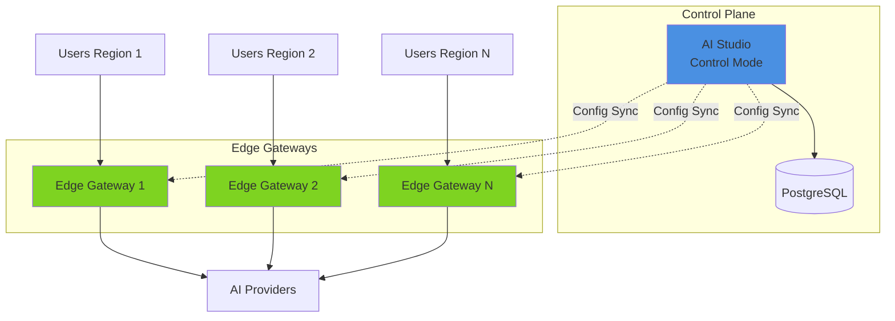

## Availability

| Edition   | Deployment Type |
| :------------- | :---------------------- |
| [Community](ai-management/ai-studio/overview#community-edition) & [Enterprise](ai-management/ai-studio/overview#enterprise-edition) | Self-Managed, Hybrid |

Tyk AI Studio uses a **hub-and-spoke** architecture that supports both standalone and distributed enterprise deployments. This design separates the control plane (configuration management) from the data plane (request processing), ensuring scalable, resilient AI gateway deployment.

## Architecture Diagram

TODO: Replace with a PNG diagram

### Community vs Enterprise Edition

The architecture remains identical in both Community and Enterprise Editions. The only difference is the feature set enabled at build time.

## Core Components

Tyk AI Studio consists of two main components:

### AI Studio (Control Plane)

AI Studio is the central management hub that provides:

- **Configuration Management**: LLMs, applications, policies, users
- **Policy Enforcement**: Rate limits, budgets, access controls
- **Analytics & Monitoring**: Usage tracking, cost analysis, performance metrics
- **User Management**: Authentication, authorization, RBAC
- **gRPC API**: Configuration distribution to edge gateways

It serves **three audiences** through three distinct sections:
1. **Administration**: Admins configure LLMs, tools, data sources, filters, plugins, users, groups, and budgets.
2. **AI Portal**: A self-service developer portal. LLM users browse available LLMs, MCP Servers, and Data Sources, then request access by creating an App. 
3. **Chat**: A managed chat interface for LLM users.

**AI Studio also runs these services:**

| Service | Description |
|---------|-------------|
| **Embedded Gateway** | A lightweight AI Gateway for testing LLM proxying. No filters, no middleware, no plugins — just basic proxying to verify an LLM works as expected. Also used by the Chat interface. |
| **API-based Tool Access** | Each Tool defined via OpenAPI spec is also available as a REST API endpoint for developers to call directly. |
| **MCP Tool Access** | An MCP-compliant interface (shim) for tools generated from OpenAPI specs. Provides MCP-API compatibility without a separate MCP proxy. |
| **Datasource API** | A unified REST endpoint for performing vector searches against registered data sources. |

To know more about the AI Studio component, see the [AI Studio Documentation](/ai-management/ai-studio/ai-studio).

### Edge Gateway (Data Plane)

The Edge Gateway operates as an independent, dedicated AI proxy. It processes AI requests, enforces policies, and reports analytics to the control plane. It is optimized for high performance and resilience in production.

- **Process Requests**: Handle AI API calls locally
- **Cache Configuration**: Store synced config in local SQLite
- **Enforce Policies**: Apply rate limits, budgets, filters
- **Report Analytics**: Send usage data back to control
- **Operate Independently**: Continue working if control plane is unreachable

The Edge Gateway provides the full middleware pipeline: authentication, filters, plugins, analytics, and budget enforcement.

**Key difference from the embedded gateway:** The embedded gateway in AI Studio is "gateway-lite" for testing and chat. The Edge Gateway is the production data plane with the full feature set.

To know more about the Edge Gateway, see the [Edge Gateway Architecture](/ai-management/ai-studio/edge-gateway) documentation.