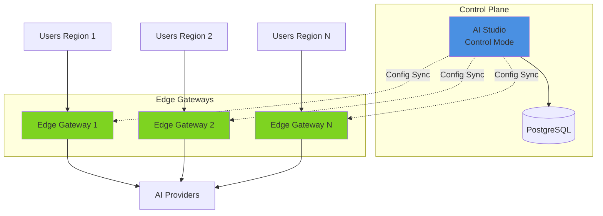

## Availability

| Edition   | Deployment Type |
| :------------- | :---------------------- |
| [Community](/ai-management/ai-studio/overview#community-edition) & [Enterprise](/ai-management/ai-studio/overview#enterprise-edition) | Self-Managed, Hybrid |

Tyk AI Studio uses a **hub-and-spoke** architecture that supports both standalone and distributed enterprise deployments. This design separates the control plane (configuration management) from the data plane (request processing), ensuring scalable, resilient AI gateway deployment.

## Architecture Diagram

```mermaid
graph TB
    subgraph "Control Plane"
        Control[AI Studio<br/>Control Mode]
        ControlDB[(PostgreSQL)]
        Control --> ControlDB
    end
    
    subgraph "Edge Gateways"
        Edge1[Edge Gateway 1]
        Edge2[Edge Gateway 2]
        EdgeN[Edge Gateway N]
    end
    
    Control -.->|Config Sync| Edge1
    Control -.->|Config Sync| Edge2
    Control -.->|Config Sync| EdgeN
    
    Users1[Users Region 1] --> Edge1
    Users2[Users Region 2] --> Edge2
    UsersN[Users Region N] --> EdgeN
    
    Edge1 --> Providers[AI Providers]
    Edge2 --> Providers
    EdgeN --> Providers
    
    style Control fill:#4A90E2
    style Edge1 fill:#7ED321
    style Edge2 fill:#7ED321
    style EdgeN fill:#7ED321
```

### Community vs Enterprise Edition

The architecture remains identical in both Community and Enterprise Editions. The only difference is the feature set enabled at build time.

## Core Components

Tyk AI Studio consists of two main components:

### AI Studio (Control Plane)

AI Studio is the central management hub that provides:

- **Configuration Management**: LLMs, applications, policies, users
- **Policy Enforcement**: Budgets and access controls
- **Analytics & Monitoring**: Usage tracking, cost analysis, performance metrics
- **User Management**: Authentication, authorization, RBAC
- **gRPC API**: Configuration distribution to edge gateways

It serves **three audiences** through three distinct sections:
1. **Administration**: Admins configure LLMs, tools, data sources, filters, plugins, users, groups, and budgets.
2. **AI Portal**: A self-service portal for developers. LLM users browse available LLMs, Tools, Data Sources, and (Enterprise) MCP Servers, then request access by creating an App. 
3. **Chat**: A managed chat interface for LLM users.

**AI Studio also runs these services:**

| Service | Description |
|---------|-------------|
| **Embedded Gateway** | A lightweight AI Gateway for testing LLM proxying. No filters, no middleware, no plugins — just basic proxying to verify an LLM works as expected. Also used by the Chat interface. |
| **API-based Tool Access** | Apps can call a Tool defined via OpenAPI spec as a REST API endpoint. From v2.2.0, an administrator turns on this access method for each tool. A new tool is available in chat only. |
| **MCP Tool Access** | The same access over MCP. A tool with MCP access on has an MCP endpoint that AI Studio serves, without a separate MCP proxy. |
| **Datasource API** | A unified REST endpoint for performing vector searches against registered data sources. |

To know more about the AI Studio component, see the [AI Studio Documentation](/ai-management/ai-studio/ai-studio).

### Edge Gateway (Data Plane)

The Edge Gateway operates as an independent, dedicated AI proxy. It processes AI requests, enforces policies, and reports analytics to the control plane. It is optimized for high performance and resilience in production.

- **Process Requests**: Handle AI API calls locally
- **Cache Configuration**: Store synced config in local SQLite
- **Enforce Policies**: Apply budgets, filters, and auth plugins
- **Report Analytics**: Send usage data back to control
- **Operate Independently**: Continue working if control plane is unreachable

The Edge Gateway provides the full middleware pipeline: authentication, filters, plugins, analytics, and budget enforcement.

**Key difference from the embedded gateway:** The embedded gateway in AI Studio is "gateway-lite" for testing and chat. The Edge Gateway is the production data plane with the full feature set. For example, only Edge Gateways route requests through Model Routers and run [auth plugins](/ai-management/ai-studio/plugins/edge-gateway).

### Supported Topology

In v2.2, run one active AI Studio instance, with an optional cold standby. Do not run more than one active AI Studio instance on the same database. You can run many Edge Gateways. With Helm, each Edge Gateway pod registers under its own pod name.

For the recommended production deployment, including failover, sizing, and production settings, refer to [Reference Architecture](/ai-management/ai-studio/reference-architecture).

To know more about the Edge Gateway, see the [Edge Gateway Architecture](/ai-management/ai-studio/proxy) documentation.