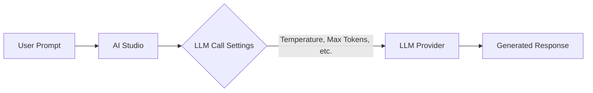

---
<<<<<<< HEAD
title: "Manage LLM Call Settings in Tyk AI Studio"
description: "How to configure default call settings for Large Language Models (LLMs) in Tyk AI Studio, including parameters like temperature, max tokens, and more."
keywords: "AI Studio, AI Management, LLMs, Large Language Models, LLM Call Settings"
---

## Availability

| Edition | Deployment Type |
| :------------- | :---------------------- |
| [Community](/ai-management/ai-studio/overview#community-edition) & [Enterprise](/ai-management/ai-studio/overview#enterprise-edition) | Self-Managed, Hybrid |

Model call settings let you configure how Large Language Models handle prompts. These settings control parameters like response length, temperature (creativity level), and other options that shape the output when a prompt is sent to the LLM.

### Use cases

- **Chats**: These settings control how the LLM responds in conversational interfaces within the Chat Room feature, allowing administrators to fine-tune the user experience.
- **Middleware Function Calls**: The settings guide LLM behavior in automated backend processes where the LLM is used for tasks such as data generation or content analysis.

## LLM Call Settings Details

The **LLM Call Settings** section allows administrators to configure default runtime parameters for Large Language Models (LLMs) used in chat interactions and middleware system function calls. These settings provide control over how the LLM processes inputs and generates outputs. 

It is important to note that these settings are not utilized in the AI Gateway proxy (Tyk Edge Gateway). Applications created in the AI portal by end users for accessing LLMs provide their own model configurations (like temperature and max tokens) in the API payload when making requests to the AI Gateway.

The Call Settings configured by the admin are specifically used for the built-in Chat Interface (accessed via the AI Portal) and for internal middleware system function calls (such as tool calling and RAG).

## Configuration

The **Edit/Create LLM Call Settings View** enables administrators to configure or update call-time options for a specific Large Language Model (LLM). Below is an explanation of each field and its purpose:

- **Model Name**: The name of the language model (e.g., `gpt-5.2`, `claude-opus-4-5-20251101`).
- **Temperature**: Controls randomness: `0` is deterministic, `1` is very random. Range: `0` to `1`.
- **Max Tokens**: The maximum number of tokens to generate in the response. Must be at least `1`.
- **Top P**: Controls diversity via nucleus sampling: `0.5` means half of all likelihood-weighted options are considered. Range: `0` to `1`.
- **Top K**: Controls diversity by limiting to `k` most likely tokens. `0` means no limit.
- **Min Length**: The minimum number of tokens to generate in the response.
- **Max Length**: The maximum number of overall tokens.
- **Repetition Penalty**: Penalizes repetition: `1.0` means no penalty, `>1.0` discourages repetition. Typically between `1.0` and `1.5`.
- **System Prompt**: A long-form text prompt that sets the context or behavior for the language model.

## How to Create LLM Call Settings

1. Navigate to the **LLM Call Settings** section in the AI Studio dashboard.
2. Click the green **+ ADD LLM CALL SETTING** button located at the top-right of the view.
3. Fill in the required fields such as **Model Name** and configure the desired parameters like **Temperature** and **Max Tokens**.
4. Click **Create LLM Call Settings** to save the configuration.

    
=======
title: "LLM Call Settings"
description: "How to configure LLMs in AI Studio?"
sidebarTitle: "LLM Call Settings"
tags: ['AI Studio', 'AI Management', 'LLMs', 'Large Language Models', 'LLM Call Settings']
---

The **LLM Call Settings** section allows administrators to configure default runtime parameters for Large Language Models (LLMs) used in chat interactions and middleware system function calls. These settings provide control over how the LLM processes inputs and generates outputs. It is important to note that these settings are not utilized in the AI Gateway proxy since applications are expected to define their own model configurations.

---

#### **Table Overview**
The table lists all configured call settings for available LLMs with the following columns:

1. **Model Name**:
   The specific name or version of the LLM for which the call settings apply (e.g., `claude-3.5-sonnet-20240620`, `gpt-4o`).

2. **Temperature**:
   A numerical value (e.g., `0.7`, `0.1`) that controls the randomness of the LLM's responses:
   - Higher values (e.g., `0.7`) produce more creative and varied outputs.
   - Lower values (e.g., `0.1`) generate more deterministic and focused responses.

3. **Max Tokens**:
   The maximum number of tokens the LLM can generate in a single response. This sets a hard limit on the length of the output to ensure efficiency and prevent excessive usage.

4. **Actions**:
   A menu (three-dot icon) with quick actions to edit or delete the call settings for a specific model.

---

#### **Features**
1. **Add LLM Call Setting Button**:
   A green button labeled **+ ADD LLM CALL SETTING**, located at the top-right of the view. Clicking this button opens a form to define call settings for a new model.

2. **Pagination Dropdown**:
   Found at the bottom-left corner, this dropdown allows users to control how many call settings are displayed per page (e.g., 10, 20, etc.).

---

#### **Use Cases**
- **Chats**:
   These settings control how the LLM responds in conversational interfaces within the Chat Room feature, allowing administrators to fine-tune the user experience.

- **Middleware Function Calls**:
   The settings guide LLM behavior in automated backend processes where the LLM is used for tasks such as data generation or content analysis.

---

#### **Quick Insights**
The **LLM Call Settings** section provides administrators with granular control over LLM behavior during runtime. While the settings are not used in the proxy, they are crucial for managing system-level and chat-specific interactions, ensuring consistent performance and efficiency. This section enables streamlined configuration for application-level integration of LLMs.

### Edit/Create Call Settings

The **Edit/Create LLM Call Settings View** enables administrators to configure or update call-time options for a specific Large Language Model (LLM). These settings determine how the LLM processes inputs and generates outputs in chat interactions or middleware system function calls. Below is an explanation of each field and its purpose:

---

#### **Form Fields and Descriptions**

1. **Model Preset** *(Dropdown)*:
   - Allows administrators to select a pre-configured preset for the LLM, or choose "Custom" to manually configure all settings.

2. **Model Name** *(Required)*:
   - Specifies the name of the LLM model these settings apply to (e.g., `claude-3.5-sonnet-20240620`).

3. **Temperature** *(Decimal, 0.0 to 1.0)*:
   - Controls the randomness of the model's responses:
     - **Higher values** (e.g., `0.7`): More creative and varied outputs.
     - **Lower values** (e.g., `0.1`): More deterministic and repetitive outputs.

4. **Max Tokens** *(Integer)*:
   - Defines the maximum number of tokens the LLM can generate in its response.
   - Helps to limit response length for efficiency and control.

5. **Top P** *(Decimal, 0.0 to 1.0)*:
   - Controls nucleus sampling, a method to limit token selection to the most probable subset:
     - **Higher values** (e.g., `0.9`): Includes more variability in token choices.
     - **Lower values** (e.g., `0.1`): Focuses on the most likely tokens.

6. **Top K** *(Integer)*:
   - Limits token selection to the top `K` most probable tokens at each step:
     - **Higher values** allow for more varied responses.
     - **Lower values** restrict outputs to fewer options.

7. **Min Length** *(Integer)*:
   - Sets the minimum number of tokens that must be included in the model's response.

8. **Max Length** *(Integer)*:
   - Specifies the upper limit for the length of the response (e.g., 200,000 tokens).

9. **Repetition Penalty** *(Decimal)*:
   - Penalizes repeated tokens to prevent the model from generating repetitive responses.
     - **Higher values** (e.g., `1.5`): Stronger penalty for repetition.
     - **Lower values** (e.g., `1.0`): Little or no penalty.

10. **System Prompt** *(Optional)*:
    - A predefined instruction for the LLM that sets the tone or context for its responses.
      Example:
      *"You are a helpful AI assistant specializing in API management and related topics. Respond in markdown and cite sources where appropriate."*

---

#### **Action Buttons**
1. **Update LLM Call Settings / Create LLM Call Settings**:
   - Saves the configuration or creates a new call settings entry. This button becomes active only when all required fields are valid.

2. **Back to LLM Call Settings**:
   - A link in the top-right corner to return to the main LLM Call Settings view without saving changes.

---

#### **Purpose**
This interface provides granular control over runtime parameters, allowing administrators to customize the LLM's behavior for different use cases. These settings are critical for ensuring that the model generates responses tailored to specific operational or user requirements.
>>>>>>> 94d4aceb (push initial code)
