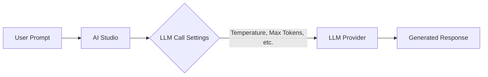

## Availability

| Edition | Deployment Type |
| :------------- | :---------------------- |
| [Community](/ai-management/ai-studio/overview#community-edition) & [Enterprise](/ai-management/ai-studio/overview#enterprise-edition) | Self-Managed, Hybrid |

Model call settings let you configure how Large Language Models handle prompts. These settings control parameters like response length, temperature (creativity level), and other options that shape the output when a prompt is sent to the LLM.

### Use cases

- **Chats**: These settings control how the LLM responds in conversational interfaces within the Chat Room feature, allowing administrators to fine-tune the user experience.
- **Middleware Function Calls**: The settings guide LLM behavior in automated backend processes where the LLM is used for tasks such as data generation or content analysis.

## LLM Call Settings Details

The **LLM Call Settings** section allows administrators to configure default runtime parameters for Large Language Models (LLMs) used in chat interactions and middleware system function calls. These settings provide control over how the LLM processes inputs and generates outputs. 

It is important to note that these settings are not utilized in the AI Gateway proxy (Tyk Edge Gateway). Applications created in the AI portal by end users for accessing LLMs provide their own model configurations (like temperature and max tokens) in the API payload when making requests to the AI Gateway.

The Call Settings configured by the admin are specifically used for the built-in Chat Interface (accessed via the AI Portal) and for internal middleware system function calls (such as tool calling and RAG).

## Configuration

The **Edit/Create LLM Call Settings View** enables administrators to configure or update call-time options for a specific Large Language Model (LLM). Below is an explanation of each field and its purpose:

- **Model Name**: The name of the language model (e.g., `gpt-5.2`, `claude-opus-4-5-20251101`).
- **Temperature**: Controls randomness: `0` is deterministic, `1` is very random. Range: `0` to `1`.
- **Max Tokens**: The maximum number of tokens to generate in the response. Must be at least `1`.
- **Top P**: Controls diversity via nucleus sampling: `0.5` means half of all likelihood-weighted options are considered. Range: `0` to `1`.
- **Top K**: Controls diversity by limiting to `k` most likely tokens. `0` means no limit.
- **Min Length**: The minimum number of tokens to generate in the response.
- **Max Length**: The maximum number of overall tokens.
- **Repetition Penalty**: Penalizes repetition: `1.0` means no penalty, `>1.0` discourages repetition. Typically between `1.0` and `1.5`.
- **System Prompt**: A long-form text prompt that sets the context or behavior for the language model.

## How to Create LLM Call Settings

1. Navigate to the **LLM Call Settings** section in the AI Studio dashboard.
2. Click the green **+ ADD LLM CALL SETTING** button located at the top-right of the view.
3. Fill in the required fields such as **Model Name** and configure the desired parameters like **Temperature** and **Max Tokens**.
4. Click **Create LLM Call Settings** to save the configuration.

    
