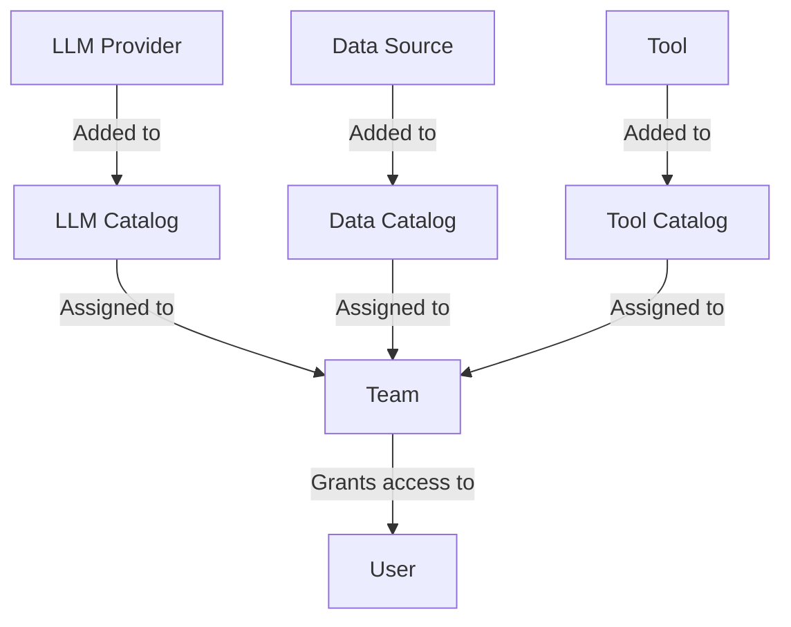

## Availability

| Edition | Deployment Type |
| :------------- | :---------------------- |
| [Enterprise](ai-management/ai-studio/overview#enterprise-edition) | Self-Managed, Hybrid |

Catalogs in Tyk AI Studio are collections of AI resources (LLM providers, Data sources, and Tools) that you can assign to specific [Teams](/ai-management/ai-studio/teams) to easily manage access. They act as the bridge between the raw AI capabilities and the users who need to consume them.

### Community vs Enterprise Edition
In the **Community Edition**, catalog management is automated. There are three built-in **"Default" Catalogs** (one for LLMs, one for Data Sources, and one for Tools). Any new resource you create is automatically added to its respective default catalog, and these catalogs are permanently linked to the "Default" Team.
In the **Enterprise Edition**, you can create custom Catalogs, group specific resources together, and assign them to different Teams to enforce strict resource isolation and Role-Based Access Control (RBAC). The "Default" catalogs still exist and cannot be deleted.

### Use cases
- **Resource Grouping**: Group all OpenAI models into an "OpenAI Models" catalog and all Anthropic models into an "Anthropic Models" catalog to manage vendor access easily.
- **Environment Separation**: Create a "Production Data" catalog and a "Staging Data" catalog, ensuring that only the production Team has access to the production data sources.
- **Tool Bundling**: Bundle specific tools (like web search and calculators) into a "Research Tools" catalog for your data science Team.

## Details About Entity
A Catalog is a logical grouping of a specific type of AI resource. There are three types of catalogs in Tyk AI Studio:
1. **LLM Catalogs**: Collections of LLM providers (e.g., OpenAI, Anthropic, local models).
2. **Data Catalogs**: Collections of data sources (e.g., vector databases, knowledge bases).
3. **Tool Catalogs**: Collections of tools (e.g., web scrapers, calculators, custom APIs).

Catalogs do not grant access on their own. To make the resources within a catalog available to [Users](/ai-management/ai-studio/users), the catalog must be assigned to a [Team](/ai-management/ai-studio/teams).

## Configuration
When configuring a Catalog, the options vary slightly depending on the type:

### LLM Catalog
- **Catalog Name**: A descriptive name for the collection.
- **LLMs in this Catalog**: A list where you can add or remove specific LLM providers.

### Data Catalog
- **Catalog Name**: A descriptive name for the collection.
- **Short Description**: A brief summary of the data sources included.
- **Long Description**: Detailed information about the catalog's contents.
- **Icon**: A visual identifier for the catalog.
- **Data Sources**: A list where you can add or remove specific data sources.
- **Tags**: Labels to help categorize and filter the catalog.

### Tool Catalog
- **Name**: A descriptive name for the collection.
- **Short Description**: A brief summary of the tools included.
- **Long Description**: Detailed information about the catalog's capabilities.
- **Icon**: A visual identifier for the catalog.
- **Tools**: A list where you can add or remove specific tools.
- **Tags**: Labels to help categorize and filter the catalog.

## How to Create the Entity
To create a new Catalog in Tyk AI Studio:
1. Navigate to the **Catalogs** section in the AI Studio dashboard.
2. Select the tab for the type of catalog you want to create (**LLM**, **Data**, or **Tools**).
3. Click on the **Add Catalog** button.
4. Fill in the required information (Name, Descriptions, Icon).
5. Add the specific resources (LLMs, Data Sources, or Tools) to the catalog.
6. (Optional) Add Tags for Data and Tool catalogs.
7. Click **Save** to create the catalog.
8. Once created, navigate to the [Teams](/ai-management/ai-studio/teams) section to assign this catalog to a Team.

<!-- TODO: Add screenshot of the Catalogs list view -->
<!-- TODO: Add screenshot of the Add Catalog form -->