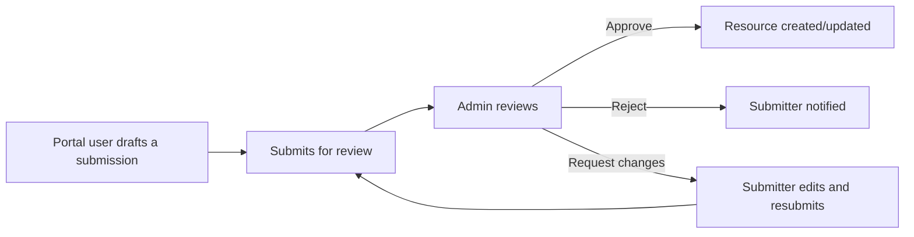
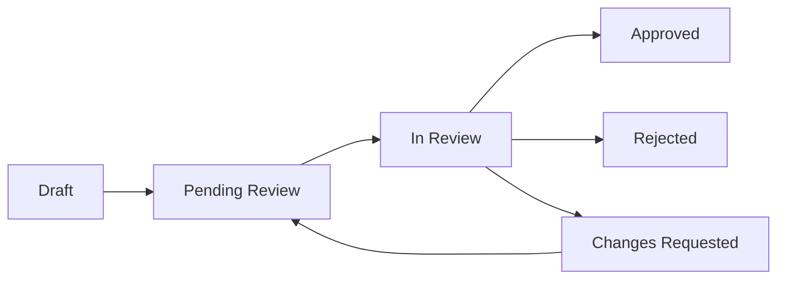

## Availability

| Edition   | Deployment Type |
| :------------- | :---------------------- |
| [Community](/ai-management/ai-studio/overview#community-edition) & [Enterprise](/ai-management/ai-studio/overview#enterprise-edition) | Self-Managed, Hybrid |

Community Submissions let AI Portal users propose their own [Data Sources](/ai-management/ai-studio/datasources-rag) and [Tools](/ai-management/ai-studio/tools) for admin review. An admin checks each submission, sets its privacy score, and approves it before it becomes a usable resource. Your resource catalog grows. Admin governance stays in place.

## Why Use Community Submissions

Without a submission workflow, every new data source or tool needs an admin to create it directly. This creates two problems:

- **Admin bottleneck.** Admins must do all the resource onboarding work themselves.
- **Shadow AI.** Developers share credentials informally instead of waiting for review. This creates ungoverned, duplicate data dependencies.

Community Submissions solves both problems. A Portal user can propose a resource themselves. The resource only goes live after an admin reviews it. This keeps governance in place and removes the bottleneck.

You can only submit Data Sources and Tools this way. LLM providers always need direct admin configuration. Every submission goes through the same review queue. Submitters have no reputation or trust tier.

<Note>
A plugin can also register a custom resource type that supports community submissions. See [Resource Provider Plugins](/ai-management/ai-studio/plugins/resource-types#community-submissions) for that variant of the workflow.
</Note>

## Submission Lifecycle

A submission moves through a fixed set of statuses:

| Status | Meaning |
|---|---|
| **Draft** | The submitter is still filling in the form. Only the submitter can see or edit it. |
| **Pending Review** | The submitter submitted it. It is waiting for an admin to claim it. |
| **In Review** | An admin claimed the submission and is actively reviewing it. |
| **Approved** | An admin approved the submission. The Data Source or Tool now exists (or was updated). |
| **Rejected** | An admin rejected the submission. It cannot be resubmitted. |
| **Changes Requested** | An admin asked the submitter to make changes. The submitter can edit and resubmit. |

A submitter can only edit a submission while it is in **Draft** or **Changes Requested**. Once it moves to **Pending Review** or **In Review**, only an admin can act on it.

### How to Submit a Resource

From the AI Portal, a user:

1. Open **My Contributions** and start a new submission.
2. Choose a resource type: **Data Source** or **Tool (OpenAPI)**.
3. Fill in the resource configuration. For a Tool, paste an OpenAPI spec.
4. Set a **Suggested Privacy Score** (0-100) with a justification. See [Privacy Scoring](#privacy-scoring).
5. Add support details: primary and secondary contact, an SLA expectation, a documentation URL, and free-text notes.
6. Accept any applicable [attestations](#attestation-templates).
7. Save the submission as a **Draft**, or submit it for review.

For a Tool, Tyk AI Studio checks a pasted spec for a supported OpenAPI version, valid server entries, operation IDs, and authentication schemes. It lists the operations it found, so the user can pick which ones to expose before they submit.

A submitter can save a **Draft** at any point, then come back later to finish it.

Credentials in a submission, such as database connection strings and API keys, are encrypted at rest. This matches how a published resource stores them. Every API response redacts credential fields to `[redacted]`. If a submitter edits a submission and leaves a credential field showing `[redacted]`, Tyk AI Studio keeps the original value instead.

### Updating a Published Resource

The owner of a resource that was originally community-submitted can propose changes to it, instead of an admin editing it directly. This uses the same review pipeline. See [Resource Updates and Version Snapshots](#resource-updates-and-version-snapshots).

## The Review Queue

An admin works submissions from the **Submissions** review queue. Access to the review queue, and to every review action on this page, requires the [Admin role](/ai-management/ai-studio/user-management#core-concepts). There is no separate reviewer or moderator role. Any user with `Admin` can review submissions, and no other role can.

The queue lists every submission with its status, resource type, submitter, and time waiting. An admin can filter by status and resource type.

To review a submission, an admin:

1. Opens it and, if it's still **Pending Review**, claims it. This moves it to **In Review** and records the admin as the reviewer.
2. Reviews the resource configuration, the submitter's suggested privacy score and justification, and the support and documentation details.
3. Optionally tests the submission before deciding:
   - For a **Tool**, this re-runs the OpenAPI spec validation.
   - For a **Data Source**, this tries a real connection to the embedding service with the submitted credentials. It reports whether the connection succeeded.
4. Makes a decision:
   - **Approve**: sets a **final privacy score** and internal review notes. See [Privacy Scoring](#privacy-scoring).
   - **Reject**: gives feedback for the submitter and internal review notes. A rejected submission is final. The submitter must start a new submission to try again.
   - **Request Changes**: gives feedback for the submitter and internal review notes. This returns the submission to the submitter for edits.

If notifications are configured (see [Notifications](/ai-management/ai-studio/notifications)), Tyk AI Studio notifies admins when a submission reaches **Pending Review**. It also notifies the submitter when their submission is approved, rejected, or sent back for changes.

## Attestation Templates

An Attestation Template is an admin-authored statement. A submitter must read and accept it before they can submit a resource for review. Examples include a data-handling agreement or a licensing declaration. Attestation text supports basic Markdown formatting, including links.

An admin manages attestation templates from the **Attestation Templates** admin page. Each template has:

| Field | Description |
|---|---|
| **Name** | An internal label for the template. |
| **Attestation Text** | The statement shown to the submitter. |
| **Applies To** | Which submissions this attestation applies to: `Data Source`, `Tool`, or `All`. |
| **Required** | Whether the submitter must accept it before they can submit. |
| **Active** | Whether the template is currently in use. Inactive templates aren't shown to submitters. |
| **Sort Order** | The order templates appear in on the submission form. |

A submitter sees every active template that applies to the resource type they're submitting. Tyk AI Studio blocks the submission, but not the draft, until the submitter accepts every **Required** attestation for that resource type. An optional attestation can still show for information, without blocking submission.

## Privacy Scoring

A privacy score is a number from 0 (public) to 100 (highly sensitive). It governs which LLMs a resource can be used with. Tyk AI Studio enforces this rule when a resource is added to an App. A Data Source or Tool's privacy score can never exceed the privacy score of its paired LLMs. See [Privacy Level Validation](/ai-management/ai-studio/admin-apps#privacy-level-validation) for details.

A community submission carries two privacy scores:

- **Suggested Privacy Score**: the submitter sets this when they fill in the form. They also write a justification describing what kind of data the resource contains. This is a starting point for the admin, not a binding value.
- **Final Privacy Score**: the admin sets this when they approve the submission. This is the score that actually applies to the resource once created.

There is no automatic formula that computes the final score. It's the reviewing admin's judgment call, informed by the submitter's suggestion and justification, and by anything the admin finds during testing or manual inspection.

## Approval and Resource Creation

When an admin approves a submission:

- If it's a new submission, Tyk AI Studio creates the Data Source or Tool from the submission's payload. It uses the admin's final privacy score.
- If it's an update to an existing resource, Tyk AI Studio updates that resource in place. It does not create a new one. See [Resource Updates](#resource-updates-and-version-snapshots).

Tyk AI Studio flags the resulting resource as community-submitted, and sets the original submitter as its owner.

<Note>
**"Catalog" has two meanings in AI Studio.** In [Enterprise Edition](/ai-management/ai-studio/catalogs), a Catalog is an admin-managed collection of LLMs, Data Sources, or Tools that you assign to Teams. In Community Edition, "catalog" refers to the built-in **Default catalog** for each resource type, which every user can see. This section is about which of these a newly-approved resource ends up in.
</Note>

Tyk AI Studio treats a resource created from an approved submission like any other new resource. If it isn't already in a catalog, Tyk AI Studio adds it to the **Default** catalog for its type (Data Source or Tool). In Community Edition, this is the only catalog, so every user can see the resource immediately. In Enterprise Edition, an admin can move the resource into other catalogs from the [Catalogs](/ai-management/ai-studio/catalogs) page afterwards. This works the same way as for a resource an admin creates directly.

## Resource Updates and Version Snapshots

The owner of a published community resource can submit an update to it, instead of an admin editing it directly. An update submission follows the same steps as a new one: draft, submit, review, and approve, reject, or request changes. The difference is that it targets an existing resource instead of creating a new one.

When an admin approves an update:

1. Tyk AI Studio takes a snapshot of the resource's current state, before it applies the update. It stores this snapshot as a **SubmissionVersion**.
2. The update payload is then applied to the resource in place.
3. The version number for that resource increments by one.

Each `SubmissionVersion` snapshot records the resource's field values at that point, who proposed the change, which admin approved it, and any change notes. Credentials are never included in a snapshot. Snapshotting only happens on an approved update or a rollback, not on every edit a submitter makes to a draft.

An admin can see the version history for a resource from its submission record.

### Rollback

An admin can restore a resource to any previous version. Rollback:

- Applies that version's stored field values back onto the resource.
- Does **not** touch credential fields, such as database connection strings and API keys. Snapshots never contain credentials, so a rollback leaves the resource's current credentials untouched.
- Takes its own "before" snapshot first, so an admin can undo a rollback by rolling forward again.

Rollback is available today as an API call (`POST /api/v1/submissions/:id/rollback/:version_id`), not from the admin UI.

## Activity Trail

Every submission keeps a chronological log of the actions taken on it: submitted, review claimed, approved, rejected, changes requested, and resubmitted. Each entry records who acted, when, and any submitter-facing feedback or internal note attached to that action. An admin sees this alongside the submission during review. A submitter sees the feedback, but not the internal notes, on their own submission.

A rollback does not add an entry to this activity log. Tyk AI Studio tracks it separately, on the version that was restored, which shows when it was rolled back to and by whom (see [Rollback](#rollback)).

## See Also

- [Data Sources](/ai-management/ai-studio/datasources-rag)
- [Tools](/ai-management/ai-studio/tools)
- [Catalogs](/ai-management/ai-studio/catalogs)
- [User Management & RBAC](/ai-management/ai-studio/user-management)
- [Resource Provider Plugins](/ai-management/ai-studio/plugins/resource-types) for extending submissions to plugin-defined resource types
