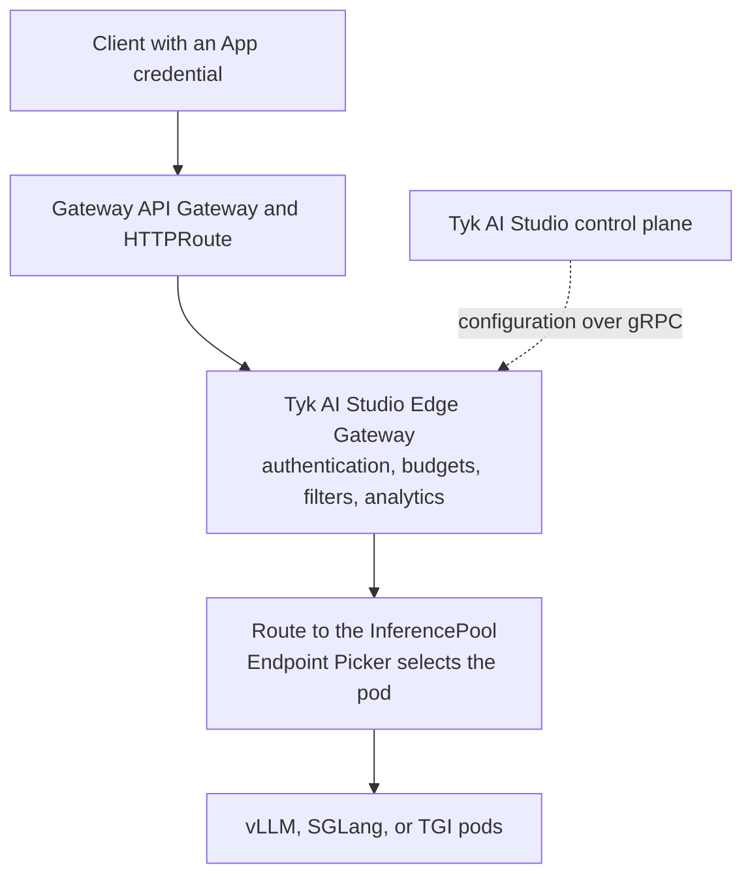

## Availability

| Edition | Deployment Type |
| :------------- | :---------------------- |
| [Community and Enterprise](/ai-management/ai-studio/overview#enterprise-edition) | Self-Managed, Hybrid |

Edge namespaces are an Enterprise feature. The Community Edition puts every Edge Gateway in the `default` namespace and does not show **Edge Availability**. In the Community Edition, every Edge Gateway receives all LLMs.

## Overview

The [Gateway API Inference Extension](https://gateway-api-inference-extension.sigs.k8s.io/) is a Kubernetes project that routes inference requests to self-hosted model servers, such as vLLM, SGLang, or TGI. Its `InferencePool` resource groups the model server pods. Its Endpoint Picker selects the pod for each request from the model server metrics, such as queue depth, KV-cache use, and LoRA adapters.

The Tyk AI Studio Edge Gateway does a different job. It decides if a request can go to an LLM, and it records what the request costs. It applies App authentication, access to LLMs, budgets, filters, and token and cost analytics. It does this for self-hosted models and for hosted vendors, such as OpenAI and Anthropic.

The two compose with no change to either side. The InferencePool serves an OpenAI-compatible API, and the Edge Gateway calls OpenAI-compatible upstreams. Thus, in AI Studio, the InferencePool is an LLM provider with the OpenAI vendor.



### What AI Studio Does Not Do

The Edge Gateway is not a Gateway API Inference Extension implementation:

- It does not watch `InferencePool` resources or write their status.
- It does not implement the Endpoint Picker protocol.
- It does not select model server pods.

For pod selection, use a Gateway API implementation that supports the Inference Extension, and put the Edge Gateway in front of it.

## Before You Start

You need:

- Tyk AI Studio installed with Helm. Refer to [Install Tyk AI Studio on Kubernetes](/ai-management/ai-studio/deployment-k8s).
- A Gateway API implementation with Inference Extension support, and an `InferencePool` that serves your models.
- The Prometheus Operator, if you turn on the `ServiceMonitor`. Without its CRDs, the install fails.
- An OpenTelemetry collector, if you turn on tracing.

## Deploy the Edge Gateway

The [AI Studio repository](https://github.com/TykTechnologies/ai-studio) includes reference values for this setup: `helm/my-values-inference-gateway.yaml`. The file does these things:

- Runs two Edge Gateway replicas with a PodDisruptionBudget and a spread across zones.
- Puts the Edge Gateways in the edge namespace `inference`.
- Blocks upstreams on internal addresses, except in-cluster Services. Refer to [Allow the Edge Gateway to Reach the InferencePool](#allow-the-edge-gateway-to-reach-the-inferencepool).
- Exposes metrics for Prometheus and sends traces to an OTLP collector.
- Uses a StatefulSet with a volume, so that buffered analytics survive a restart.
- Reads the Edge Gateway secrets from a Secret that you manage.

The file sets only the values for this setup. Use it with the values file of your AI Studio installation. Helm applies the files in order:

```bash
cd ai-studio/helm
helm upgrade --install midsommar . \
  -f values-production.yaml \
  -f my-values-inference-gateway.yaml
```

Before you install, check these values:

| Value | What to Set |
| :--- | :--- |
| `microgateway.config.controlEndpoint` | The AI Studio Service and its gRPC port `50051`. The file uses `midsommar:50051`. The Service name comes from the release name. If the release name contains `midsommar`, the Service name is the release name. If not, it is `<release>-midsommar`. For example, the release `ai-studio` gives `ai-studio-midsommar:50051`. |
| `microgateway.config.edgeNamespace` | The edge namespace of these Edge Gateways. The file uses `inference`. |
| `microgateway.secrets.existingSecret` | The name of a Secret that you create. It must contain the keys `EDGE_AUTH_TOKEN`, `ENCRYPTION_KEY`, and `TYK_AI_LICENSE`, with the same values as AI Studio. |

Each Edge Gateway pod registers with AI Studio under its pod name. To check the Edge Gateways, go to **AI Portal > Edge Gateways**.


## Allow the Edge Gateway to Reach the InferencePool

By default, the Edge Gateway can connect to internal addresses. If you block internal upstreams, it also blocks the InferencePool, because the InferencePool is on a cluster address. To keep the block and allow the cluster, set both values:

```yaml
microgateway:
  config:
    blockInternalUpstreams: true            # LLM_UPSTREAM_BLOCK_INTERNAL
    allowedInternalHosts: ".svc.cluster.local"  # LLM_UPSTREAM_ALLOWED_INTERNAL_HOSTS
```

`LLM_UPSTREAM_ALLOWED_INTERNAL_HOSTS` is a comma-separated list of hosts:

- An entry that starts with a dot matches the domain and its subdomains. For example, `.svc.cluster.local` matches `vllm.inference.svc.cluster.local`. It does not match `evilsvc.cluster.local`.
- Other entries must match the host exactly. The match is not case-sensitive.
- A host in this list is permitted, even when `LLM_UPSTREAM_ALLOWED_HOSTS` is set. The gateway checks this list first.
- The gateway applies the list when it checks the upstream URL and again when it connects.

Do not use `LLM_UPSTREAM_ALLOWED_HOSTS` for in-cluster hosts. When it is set, the gateway refuses every upstream host that is not in the list, including the hosted vendors.

`ALLOW_INTERNAL_NETWORK_ACCESS=true` turns off the internal-address block completely. Use it only for development.

## Create the LLM Provider

In AI Studio, create an LLM provider for the InferencePool. Refer to [How to Create a LLM Provider](/ai-management/ai-studio/llm-management#how-to-create-a-llm-provider).

| Field | Value |
| :--- | :--- |
| **Vendor** | **OpenAI**. The InferencePool serves the OpenAI-compatible API. |
| **API Endpoint** | The in-cluster URL that sends requests to the InferencePool, with `/v1`. |
| **API Key** | The key that the model server expects. If it needs no key, enter a placeholder. |
| **Allowed Models** | The models that the InferencePool serves, for example `^meta-llama/Llama-3\.1-8B-Instruct$`. The patterns are regular expressions that match anywhere in the model name. |
| **Edge Availability** (Enterprise) | The edge namespace of the Edge Gateways, for example `inference`. Leave it empty to send the LLM to all Edge Gateways. |

<Note>
The Endpoint Picker selects a pod only for requests that pass through a Gateway route to the InferencePool. If the API endpoint is the Service of the model server pods, the requests do not go through the Endpoint Picker.
</Note>


All other settings work as for a hosted vendor: privacy levels, budgets, filters, failover, and App access.

An Edge Gateway in the namespace `inference` receives the LLMs and Apps in that namespace and the global ones (no namespace). Make sure that the Apps that call the InferencePool are global or in the same namespace.


After you save, push the configuration to the Edge Gateways. Refer to [Admin Actions](/ai-management/ai-studio/manage-edge-gateway#admin-actions).

## Route Traffic to the Edge Gateway

Add the Edge Gateway Service as a backend of an `HTTPRoute`. With the release name `midsommar`, the Service is `midsommar-microgateway` on port `8080`:

```yaml expandable
apiVersion: gateway.networking.k8s.io/v1
kind: HTTPRoute
metadata:
  name: ai-gateway
spec:
  parentRefs:
    - name: inference-gateway
  hostnames:
    - ai.example.com
  rules:
    - matches:
        - path:
            type: PathPrefix
            value: /v1
      backendRefs:
        - name: midsommar-microgateway
          port: 8080
```

The same Gateway can also have the route to the InferencePool. In that case, use a different hostname or listener for each route. Then the two routes do not match the same requests.

Clients authenticate with an App credential and call the Edge Gateway:

- The Main Ingress, `/v1/chat/completions`, with the model string `{llmSlug}/{model}`.
- The OpenAI-compatible endpoint, `/ai/{llmSlug}/v1/chat/completions`.

Refer to [Endpoints](/ai-management/ai-studio/proxy#endpoints).

## Metrics and Traces

The reference values turn on metrics and tracing for the Edge Gateways:

| Value | Environment Variable | Effect |
| :--- | :--- | :--- |
| `microgateway.metrics.allowUnauthenticated` | `METRICS_ALLOW_UNAUTHENTICATED` | Serves `/metrics` without a token. Use it only for scrapes from inside the cluster. |
| `microgateway.metrics.serviceMonitor.enabled` | None | Creates a `ServiceMonitor` for the Prometheus Operator. |
| `microgateway.metrics.legacyNames` | `METRICS_LEGACY_NAMES` | Also sends the older `aistudio_*` metric names. Set it to `false` after your dashboards use the OpenTelemetry GenAI names. |
| `microgateway.tracing.endpoint` | `TRACING_ENDPOINT` | The OTLP/gRPC collector, for example `otel-collector.observability:4317`. |

The Edge Gateway continues the trace of an incoming `traceparent` header, and sends it to the upstream. Thus, one trace can show the request from the Gateway, through the Edge Gateway, to the model server.
