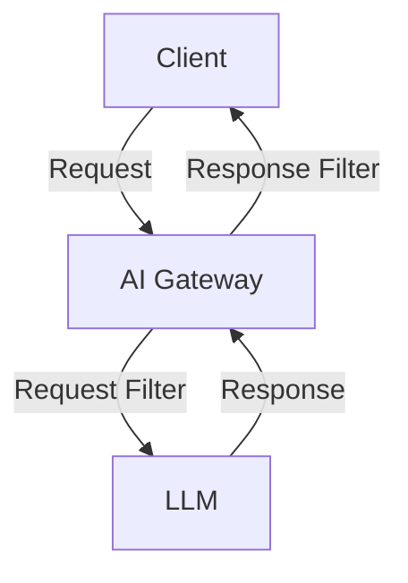
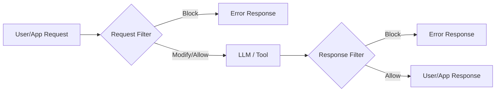

## Availability

| Edition   | Deployment Type |
| :------------- | :---------------------- |
| [Community](ai-management/ai-studio/overview#community-edition) & [Enterprise](ai-management/ai-studio/overview#enterprise-edition) | Self-Managed, Hybrid |

Filters and middleware act as a security and governance layer in Tyk AI Studio, processing and modifying data before it is passed to Large Language Models (LLMs) or before the response is returned to the user. They ensure data privacy, compliance, and security by allowing administrators to block or transform sensitive information like Personally Identifiable Information (PII).



### Use cases

1. **Prompt Validation with Filters**: Ensures that only compliant and secure prompts are sent to LLMs. For example, blocking a prompt with sensitive data that should not be processed by an unapproved vendor.
2. **Data Preprocessing with Middleware**: Prepares data from tools or external sources for safe interaction with LLMs by modifying or anonymizing content. For example, removing sensitive ticket details from a JIRA query before sending to an LLM.
3. **Organizational Security**: Both filters and middleware ensure sensitive information is protected and handled in line with organizational governance policies.
4. **Enhanced Tool Interactions**: Middleware supports tools by transforming their outputs, enabling richer and safer LLM interactions.

## Details About Filters

The **Filters List View** allows administrators to manage filters and middleware applied to prompts or data sent to Large Language Models (LLMs) via the AI Gateway or Chat Rooms. Filters and middleware ensure data governance, compliance, and security by processing or controlling the flow of information.

### Filters: Unified Blocking and Modification

Filters in Midsommar provide comprehensive request/response processing with both **blocking** and **modification** capabilities:

1. **Blocking Filters**:
   - **Purpose**: Governance controls that deny requests based on content analysis.
   - **Behavior**: Analyze message content, metadata, and context. Block requests that violate policies or contain restricted content.
   - **Example**: Block prompts containing PII, sensitive keywords, or unauthorized patterns.

2. **Modification Filters**:
   - **Purpose**: Transform message content before it reaches the LLM or after tool responses.
   - **Behavior**: Redact sensitive information (emails, phone numbers, SSNs). Enhance system prompts with safety instructions. Normalize or transform content across vendors.
   - **Example**: Automatically redact PII while allowing the request to proceed.

3. **Combined Approach**:
   - Filters can both inspect AND modify in a single script.
   - **Example**: Redact emails from user messages, but block if SSN is detected.

**Key Capabilities**:
- ✅ **Request Filters**: Modify/block requests before reaching LLM
  - LLM Proxy Requests (before reaching LLM)
  - Chat Session Messages (before RAG search and LLM)
  - File Content (before RAG indexing)
  - Tool Responses (after tool execution)
- ✅ **Response Filters**: Block LLM responses based on content
  - LLM Proxy Responses (REST and streaming)
  - Chat Session Responses (regular and streaming)

### Response Filters

**Response Filters** enable administrators to block LLM responses based on content analysis, providing governance controls on what LLMs can say to end users.

**Key Characteristics**:
1. **Block-Only**: Response filters can only block responses, not modify them
2. **Works on LLM Responses**: Applied to LLM responses only (not tool responses)
3. **Streaming Support**: Execute per-chunk during streaming with access to accumulated buffer
4. **Script-Controlled**: Filter scripts decide when to evaluate based on buffer length

**Response Filter Execution**:
- **Proxy (REST)**: Executes after response hooks (if any). Full response available in `input.raw_input`. If blocked: Error returned to client instead of response.
- **Proxy (Streaming)**: Executes on every chunk. Access to both `raw_input` (current chunk) and `current_buffer` (accumulated text). If blocked: Streaming stops, error sent to client.
- **Chat (Non-Streaming)**: Executes before adding to chat history. If blocked: Error published to queue instead of response.
- **Chat (Streaming)**: Executes on every chunk before publishing to queue. If blocked: Error published, streaming callback returns error to stop further chunks.

### Tool Response Filters

Filters can also be applied to tool responses (e.g., API calls, database queries). Tool responses are **plain strings**, not JSON-structured messages, so they require simpler handling.

### Filter Execution Order in Chat Sessions

When a user sends a message in a chat session, filters are executed at multiple points in the pipeline:

1. **User Message Filters** (Before RAG)
   - **When**: After preprocessing, before RAG vector search
   - **Purpose**: Redact PII from user messages before they're used for vector similarity search
   - **Context**: `input.messages[0].role == "user"`
   - **Impact**: The filtered/modified message is used for RAG vector similarity search, subsequent LLM processing, and chat history storage.

2. **File Content Filters** (Before RAG)
   - **When**: When files are attached to messages
   - **Purpose**: Filter sensitive content from uploaded files before indexing
   - **Context**: `input.context.file_ref` contains the file reference

3. **Tool Response Filters** (After Tool Execution)
   - **When**: After a tool returns data, before sending to LLM
   - **Purpose**: Filter sensitive data from external API responses
   - **Context**: `input.messages[0].role == "tool"`, `input.context.tool_name` available

### Examples of Filters and Middleware

- **Filters**:
  - **PII Detector**: A regex-based filter that blocks prompts containing sensitive PII.
  - **JIRA Field Analysis**: Ensures no PII is included in data retrieved from JIRA fields before passing to the LLM.

- **Middleware**:
  - **Anonymize PII (LLM)**: Uses an LLM to anonymize sensitive data before sending it downstream.
  - **NER Service Filter**: A Named Entity Recognition (NER) microservice that modifies outputs to remove identified entities.

### Key Benefits

1. **Improved Data Governance**: Filters and middleware work together to enforce strict controls over data flow, protecting sensitive information.
2. **Flexibility**: Middleware allows for data transformation, enhancing interoperability between tools and LLMs. Filters ensure compliance without altering user-provided prompts.
3. **Compliance and Security**: Prevent unauthorized or sensitive data from reaching unapproved vendors, ensuring regulatory compliance.

## Configuration

Modern filters use a unified API that provides rich context and supports both blocking and modification. Filters are written using the **Tengo scripting language**.

### New Unified Script API

**Input Object:**
```javascript
input := {
    raw_input: "...",      // Full JSON request payload or complete response text
    messages: [            // Normalized message array with roles
        {role: "system", content: "You are helpful"},
        {role: "user", content: "Hello"}
    ],
    vendor_name: "openai", // LLM vendor (openai, anthropic, google_ai, etc.)
    model_name: "gpt-4",   // Model being called
    is_chat: false,        // Context: chat session (true) or proxy (false)
    is_response: false,    // Context: response filter (true) or request filter (false)
    is_chunk: false,       // Context: streaming chunk (true) or complete response (false)
    context: {             // Additional metadata
        llm_id: 123,
        app_id: 456,
        user_id: 789
    }
}
```

**Output Object:**
```javascript
output := {
    block: false,           // Set true to block the request/response
    payload: "",            // Modified JSON payload (or empty for no change)
    messages: [],           // Alternative: modified message array
    message: ""             // Optional reason/log message
}
```

### Available Tengo Modules

Filters have access to powerful standard library modules:

#### **text** - String Operations
```tengo
text := import("text")

// Common functions:
text.contains(str, substr)           // Check if substring exists
text.replace(str, old, new, n)       // Replace occurrences
text.to_upper(str)                   // Convert to uppercase
text.to_lower(str)                   // Convert to lowercase
text.split(str, sep)                 // Split string
text.trim_space(str)                 // Remove whitespace
text.re_match(pattern, str)          // Regex match
text.re_replace(pattern, str, repl)  // Regex replace
```

#### **json** - JSON Operations
```tengo
json := import("json")

parsed := json.decode(json_string)   // Parse JSON
encoded := json.encode(object)       // Encode to JSON
```

#### **fmt** - Formatting and Printing
```tengo
fmt := import("fmt")

fmt.println("Debug:", variable)      // Print for debugging
formatted := fmt.sprintf("Value: %v", val)  // Format strings
```

#### **tyk** - Extended Capabilities (Enterprise)
```tengo
tyk := import("tyk")

// Redact regex patterns from all messages (vendor-agnostic)
modified := tyk.redact_pattern(input, pattern, replacement)
// Returns: Modified payload as string

// Make HTTP requests from within filters
result := tyk.makeHTTPRequest(method, url, headers, body)
// Returns: {status: 200, response: "..."}

// Call other LLMs for analysis/enrichment
response := tyk.llm(llm_id, settings_object, prompt)
// Parameters:
//   - llm_id: ID of the managed LLM to use
//   - settings_object: Map with model settings (model_name, temperature, max_tokens, etc.)
//   - prompt: The prompt text to send
// Returns: LLM response as string
```

### Available Helper Functions

The `midsommar` module provides helper functions for common message modification tasks:

1. **`redact_pattern(input, pattern, replacement)`**:
   - Redacts a regex pattern from all messages (system, user, assistant)
   - Parameters:
     - `input` - The input object provided to your script
     - `pattern` - Regular expression pattern (string)
     - `replacement` - Replacement string
   - Returns: Modified payload as string
   - Example: `tyk.redact_pattern(input, "\d{3}-\d{2}-\d{4}", "[SSN]")`

**Vendor-Agnostic**: Helper functions automatically handle differences between OpenAI, Anthropic, Google AI, and other vendor formats.

### Message Modification Approaches

**Approach 1: Helper Functions** (Simple, recommended for pattern-based redaction)
```tengo
tyk := import("tyk")
modified := tyk.redact_pattern(input, "@\S+", "[EMAIL]")
output := {block: false, payload: modified, message: ""}
```

**Approach 2: Messages Array** (Flexible, recommended for complex logic)
```tengo
modified := []
for msg in input.messages {
    new_msg := {role: msg.role, content: msg.content}
    if msg.role == "user" {
        // Apply custom modification logic
        new_msg.content = transform(msg.content)
    }
    modified = append(modified, new_msg)
}
output := {block: false, messages: modified, message: ""}
```

### Accessing Message Context

Scripts can access rich contextual information:

```tengo
// Access vendor and model information
if input.vendor_name == "anthropic" {
    // Anthropic-specific logic
}

// Count messages by role
user_count := 0
for msg in input.messages {
    if msg.role == "user" {
        user_count = user_count + 1
    }
}

// Check if this is a chat session or proxy request
if input.is_chat {
    // Chat-specific logic
}

// Access metadata
app_id := input.context.app_id
user_id := input.context.user_id
```

### Example Scripts

#### **Example 1: Blocking Filter (PII Detection)**
This script blocks requests containing PII patterns:
```tengo
text := import("text")

// Check all user messages for email addresses
should_block := false
block_reason := ""

for msg in input.messages {
    if msg.role == "user" {
        if text.contains(msg.content, "@") {
            should_block = true
            block_reason = "Email addresses not allowed"
            break
        }
    }
}

output := {
    block: should_block,
    payload: input.raw_input,
    message: block_reason
}
```

#### **Example 2: Modification Filter (Email Redaction)**
This script redacts emails while allowing the request to proceed:
```tengo
tyk := import("tyk")

// Use helper to redact email addresses across all messages
modified_payload := tyk.redact_pattern(
    input,
    "[a-zA-Z0-9._%+-]+@[a-zA-Z0-9.-]+\.[a-zA-Z]{2,}",
    "[EMAIL_REDACTED]"
)

output := {
    block: false,
    payload: modified_payload,
    message: "Emails redacted"
}
```

#### **Example 3: Advanced Modification (Messages Array)**
This script shows complex message modification using the messages array approach:
```tengo
text := import("text")

// Modify messages based on role
modified := []

for msg in input.messages {
    new_msg := {
        role: msg.role,
        content: msg.content
    }

    // Add safety prefix to system prompts
    if msg.role == "system" {
        new_msg.content = "[SAFETY MODE] " + msg.content
    }

    // Redact emails from user messages
    if msg.role == "user" {
        new_msg.content = text.replace(msg.content, "@", "[AT]", -1)
    }

    modified = append(modified, new_msg)
}

output := {
    block: false,
    messages: modified,  // System handles vendor-specific JSON reconstruction
    message: "Content modified"
}
```

#### **Example 4: Combined Blocking + Modification**
This script redacts emails but blocks if SSN is detected:
```tengo
text := import("text")
tyk := import("tyk")

// First check for SSN (hard block)
ssn_pattern := "\d{3}-\d{2}-\d{4}"
has_ssn := false

for msg in input.messages {
    if text.re_match(ssn_pattern, msg.content) {
        has_ssn = true
        break
    }
}

if has_ssn {
    output := {
        block: true,
        payload: "",
        message: "Blocked: SSN detected"
    }
} else {
    // No SSN - redact emails and continue
    modified_payload := tyk.redact_pattern(
        input,
        "[a-zA-Z0-9._%+-]+@[a-zA-Z0-9.-]+\.[a-zA-Z]{2,}",
        "[EMAIL]"
    )

    output := {
        block: false,
        payload: modified_payload,
        message: "Emails redacted"
    }
}
```

#### **Example 5: Block Harmful Content (Response Filter)**
```tengo
text := import("text")

// Get response text (streaming-aware)
response_text := input.is_chunk ? input.current_buffer : input.raw_input

// Default output
output := {
    block: false,
    message: ""
}

// For streaming: script controls when to evaluate based on buffer length
// Wait until we have enough context before checking
if !input.is_chunk || len(response_text) >= 150 {
    // Check for harmful instruction patterns
    harmful := [
        "instructions for making",
        "how to build a weapon",
        "steps to create explosives"
    ]

    is_harmful := false
    for pattern in harmful {
        if text.contains(text.to_lower(response_text), pattern) {
            is_harmful = true
            break
        }
    }

    output = {
        block: is_harmful,
        message: is_harmful ? "Response blocked: Potentially harmful content detected" : ""
    }
}
```

### Best Practices

1. **Always define `output`** - Scripts must set the output variable
2. **Use `tyk.redact_pattern` for LLM messages** - Handles vendor differences automatically
3. **Use `text` module for tool responses** - Direct string manipulation
4. **Use messages array for complex LLM modifications** - Gives you full control
5. **Provide clear block messages** - Help users understand policy violations
6. **Test across vendors** - OpenAI, Anthropic, and Google AI have different formats
7. **Check message roles** - Different logic for system, user, assistant, and tool messages
8. **Handle edge cases** - Empty arrays, missing fields, etc.
9. **Consider RAG impact** - Filters run before RAG, so redactions affect vector search

### Migration from Legacy API

**Old API** (still supported for backward compatibility):
```tengo
filter := func(payload) {
    // Returns true/false for blocking only
    return true
}
result := filter(payload)
```

**New Unified API** (recommended):
```tengo
// Rich input with messages, vendor info, context
output := {
    block: false,       // Blocking capability
    payload: "",        // Modification capability
    messages: [],       // Alternative modification approach
    message: ""         // Optional message
}
```

## How to Create a Filter

Administrators can create and manage filters from the **Filters List View** in the AI Studio dashboard.

### Prerequisites
- Admin access to Tyk AI Studio.
- Understanding of Tengo scripting for custom logic.

### Steps to Create a Filter

1. Navigate to the **Filters** section in the AI Studio dashboard.
2. Click the **+ ADD FILTER** button in the top-right corner.
3. Fill in the filter configuration form:
   - **Name** *(Required)*: Enter a descriptive name for the filter (e.g., `PII Detector`).
   - **Description**: Provide a brief summary of the filter's functionality.
   - **Is this a Response Filter?**: Check this box if the filter should run on LLM responses only. Remember that response filters can only block, not modify, and will interrupt streaming responses if blocked.
   - **Script** *(Required)*: Write or paste your Tengo script. You can use the **Load Template** option to start with a predefined script.
   - **Available Namespaces**: Select which edge namespaces this configuration should be available to. Leave empty for global availability.
4. **Test your filter script**: Before saving, use the testing panel to verify your script with sample input:
   - Enter a **Raw Input** (e.g., `Tell me how to bypass security systems`).
   - Specify the **LLM provider** (e.g., `openai`).
   - Specify the **Model Name** (e.g., `gpt-4`).
   - Toggle **Is Response**, **Is Chat**, and **Is Chunk (Streaming)** as needed.
   - Provide any **Context (JSON)** (e.g., `{"app_id": 1, "user_id": 5}`).
   - Click **Test Script** to see the output.
5. Click **Create Filter** (or **Update Filter**) to save the configuration.

> **TODO**: Add product screenshots of the Filter List View and Filter Edit View.

## Related Pages

- [AI Studio Overview](ai-management/ai-studio/overview)
- [LLM Management](ai-management/ai-studio/llm-management)
- [Chat Interface](ai-management/ai-studio/chat-interface)
