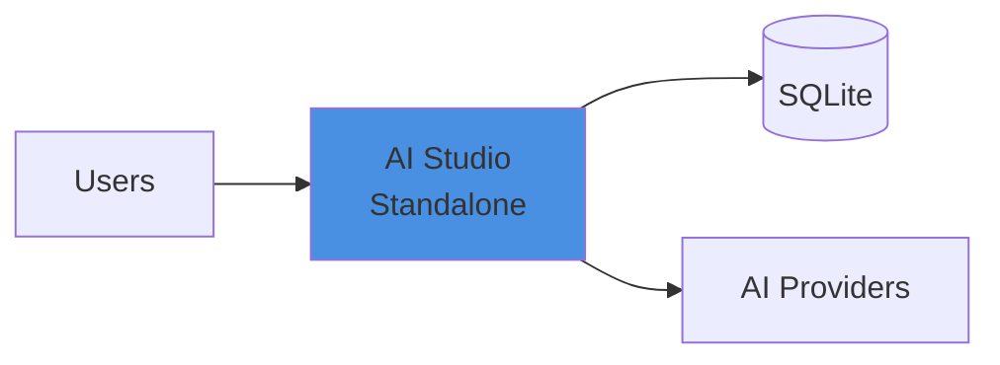
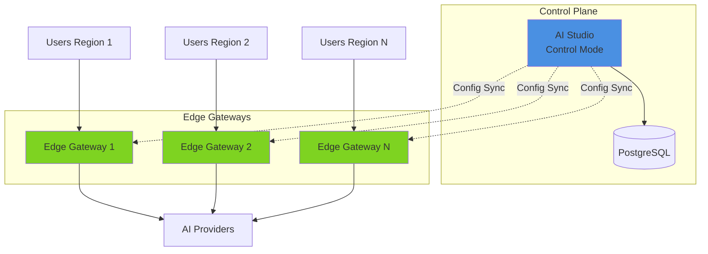

import { ResponsiveGrid } from '/snippets/5.12/ResponsiveGrid.mdx';

## Availability

| Edition   | Deployment Type |
| :------------- | :---------------------- |
| [Community](/ai-management/ai-studio/overview#community-edition) & [Enterprise](/ai-management/ai-studio/overview#enterprise-edition) | Self-Managed, Hybrid |

## Deployment Models

Tyk AI Studio supports two deployment modes:

### Standalone

Standalone mode operates as a single AI Studio instance with embedded gateway functionality. It is suitable for development, testing, and small teams.

**Characteristics**:
- Single instance deployment
- Built-in gateway functionality
- SQLite database (or PostgreSQL)
- No external dependencies

### Hub and Spoke (Control + Edge)

Control Plane with Edge Gateways uses AI Studio as the central control plane managing edge gateways for distributed request processing. This approach uses lightweight Edge Gateways instances that connect to the control plane.

It is suitable for production, enterprise, and multi-region deployments.

**Characteristics**:
- Centralized configuration management
- Distributed request processing
- Regional edge deployments
- High availability and fault tolerance
- Namespace-based multi-tenancy

## Choosing Your Deployment

| Scenario | Recommended Mode | Why |
|----------|-----------------|-----|
| Local development | Standalone | Simple, fast setup |
| Single office/location | Standalone | No distribution needed |
| Multiple regions | Hub-and-Spoke | Low latency for users |
| High availability | Hub-and-Spoke | Fault tolerance |
| Multi-tenant SaaS | Hub-and-Spoke | Namespace isolation |
| Compliance (data locality) | Hub-and-Spoke | Regional data processing |

## Requirements

**Tyk AI Studio** and **Edge Gateway** requires a persistent datastore for its operations. By default, SQLite is used, while PostgreSQL is recommended for production deployments.

### Required Components

| Component | AI Studio (Hub) | Edge Gateway (Edge) |
|-----------|----------------|---------------------|
| **SQLite** | ✅ **Supported** (default) | ✅ **Supported** (default) |
| **PostgreSQL** | ✅ **Supported** | ✅ **Supported** |

### Optional Components

**Tyk AI Studio** uses a message queue for chat interface. By default, an in-memory queue is used, which is suitable for development and single-instance deployments. 

For production and multi-instance deployments, you can configure AI Studio to use [NATS JetStream](/ai-management/ai-studio/installation/nats) as the message queue backend.

## Recommended Installation: Docker

For development, testing, and proof of concept purposes, we recommend using our Docker installation, which allows you to quickly spin up AI Studio on your local machine.

<ResponsiveGrid>

<Card href="/ai-management/ai-studio/quickstart" img="/img/docker.png">

Install with Docker
</Card>

</ResponsiveGrid>

## Alternative Installation Methods

<ResponsiveGrid>

<Card href="/ai-management/ai-studio/deployment-k8s" img="/img/k8s.png">

Install on Kubernetes
</Card>

<Card href="/ai-management/ai-studio/installation/linux" img="/img/linux-icon.svg">

Install on Linux
</Card>

</ResponsiveGrid>
