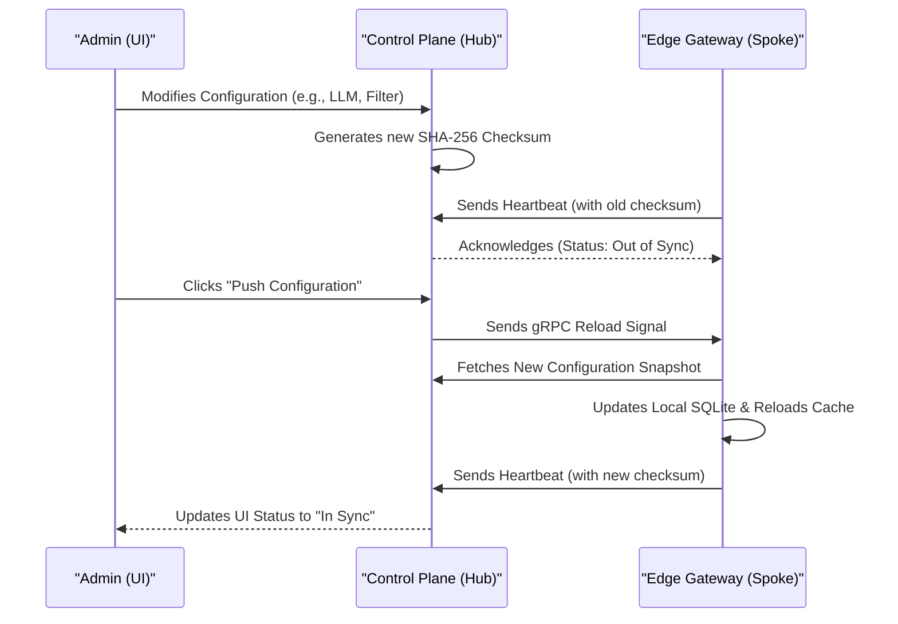

## Availability

| Edition   | Deployment Type |
| :------------- | :---------------------- |
| [Enterprise](ai-management/ai-studio/overview#enterprise-edition) | Self-Managed, Hybrid |

## What is Edge Gateway Management?

In a hub-and-spoke architecture, Tyk AI Studio acts as the central control plane (Hub), while distributed gateway proxy instances act as Edge Gateways (Spokes). Edge Gateway management provides administrators with the tools to monitor the health, connection status, and configuration synchronization of these distributed instances from a single interface.

This centralized management ensures that all edge instances are running the correct policies, routing rules, and configurations, while allowing data processing to remain local to the edge.

For more details on the data plane architecture and request processing, see the [Edge Gateway (Data Plane) Component](/ai-management/ai-studio/proxy) documentation.

## How it works

Tyk AI Studio uses a robust, checksum-based synchronization system to manage configurations across all connected Edge Gateways.

1. **Checksum Generation:** Whenever a configuration change occurs on the control plane (e.g., updating an LLM configuration, modifying a filter, or changing a tool), a SHA-256 checksum is computed from the serialized configuration snapshot.
2. **Heartbeat Reporting:** Edge gateways periodically send heartbeats to the control plane via gRPC. Each heartbeat includes the checksum of the configuration currently loaded on that edge.
3. **Status Comparison:** The control plane compares the reported checksum against the expected checksum for that edge's namespace to determine its synchronization status.
4. **Pull-on-miss for Credentials:** To balance performance and security, access tokens are not pushed in the initial snapshot. Instead, edges use a pull-on-miss strategy: they request validation for unknown tokens on-demand and cache them locally. This allows admins to revoke access instantly without waiting for a full configuration push.

## Edge Gateway Properties

When viewing the Edge Gateways list (**Admin > Edge Gateways**), administrators can monitor several key properties for each instance:

| Property | Description |
|--------|-------------|
| **Edge ID** | A unique identifier for the edge gateway instance. |
| **Namespace** | The isolated environment the edge belongs to (Enterprise feature). |
| **Connection** | The current network status based on heartbeats (`Connected`, `Disconnected`, or `Stale`). |
| **Config Sync** | Indicates if the edge has the latest configuration (`In Sync`, `Pending`, `Stale`, or `Unknown`). |
| **Version** | The software version and build hash of the running Edge Gateway. |
| **Last Heartbeat** | The time elapsed since the control plane last received a heartbeat from this edge. |

Clicking on an individual Edge Gateway reveals additional details, such as the exact loaded and expected configuration checksums, session IDs, and custom metadata reported by the edge (e.g., region or environment).

## Admin Actions

Administrators have full control over the lifecycle and configuration of Edge Gateways through the AI Studio UI.

### Pushing Configuration

Configuration changes are not applied automatically. Administrators must explicitly push configurations to ensure they maintain control over deployment rollouts. 

When you click the **Push Configuration** button:
1. You can select the target scope: **All Namespaces** or a **Specific Namespace**.
2. The control plane generates a new configuration snapshot.
3. A reload signal is sent to the targeted edge gateways via gRPC.
4. The edges fetch the new configuration, update their local SQLite databases, and reload their in-memory caches.
5. The sync status updates automatically as edges report their new checksums in subsequent heartbeats.

### Removing Edge Gateways

If an edge gateway is decommissioned or needs to be reset, administrators can remove it from the control plane:
1. Open the three-dot menu (⋮) on the edge row or navigate to its detail view.
2. Select **Remove Entry**.
3. Confirm the removal.

> **Note:** This action only removes the entry from the control plane database. If the edge gateway process is still running, it will automatically re-register on its next connection attempt.

## Troubleshooting Synchronization

If an Edge Gateway shows a `Pending` or `Stale` sync status, or if a checksum mismatch persists:
- **Check Connectivity:** Ensure the edge gateway is running and firewall rules allow gRPC traffic (default port 50051) to the control plane.
- **Wait for Heartbeat:** After a push, it may take a few seconds for the heartbeat cycle to complete and the UI to update.
- **Review Logs:** Check the edge gateway logs for configuration load errors or permission issues preventing it from fetching the latest snapshot.
