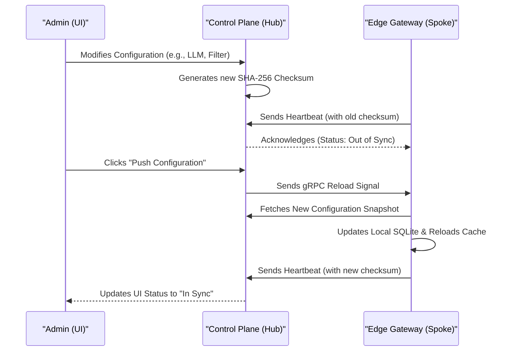

## Availability

| Edition   | Deployment Type |
| :------------- | :---------------------- |
| [Enterprise](/ai-management/ai-studio/overview#enterprise-edition) | Self-Managed, Hybrid |

## What is Edge Gateway Management?

In a hub-and-spoke architecture, Tyk AI Studio acts as the central control plane (Hub), while distributed gateway proxy instances act as Edge Gateways (Spokes). Edge Gateway management provides administrators with the tools to monitor the health, connection status, and configuration synchronization of these distributed instances from a single interface.

This centralized management ensures that all edge instances are running the correct policies, routing rules, and configurations, while allowing data processing to remain local to the edge.

For more details on the data plane architecture and request processing, see the [Edge Gateway (Data Plane) Component](/ai-management/ai-studio/proxy) documentation.

## How it works

Tyk AI Studio uses a robust, checksum-based synchronization system to manage configurations across all connected Edge Gateways.

```mermaid
sequenceDiagram
    participant Admin as "Admin (UI)"
    participant CP as "Control Plane (Hub)"
    participant Edge as "Edge Gateway (Spoke)"

    Admin->>CP: Modifies Configuration (e.g., LLM, Filter)
    CP->>CP: Generates new SHA-256 Checksum
    Edge->>CP: Sends Heartbeat (with old checksum)
    CP-->>Edge: Acknowledges (Status: Out of Sync)
    Admin->>CP: Clicks "Push Configuration"
    CP->>Edge: Sends gRPC Reload Signal
    Edge->>CP: Fetches New Configuration Snapshot
    Edge->>Edge: Updates Local SQLite & Reloads Cache
    Edge->>CP: Sends Heartbeat (with new checksum)
    CP-->>Admin: Updates UI Status to "In Sync"
```

1. **Checksum Generation:** Whenever a configuration change occurs on the control plane (e.g., updating an LLM configuration, modifying a filter, or changing a tool), a SHA-256 checksum is computed from the serialized configuration snapshot.
2. **Heartbeat Reporting:** Edge gateways periodically send heartbeats to the control plane via gRPC. Each heartbeat includes the checksum of the configuration currently loaded on that edge.
3. **Status Comparison:** The control plane compares the reported checksum against the expected checksum for that edge's namespace to determine its synchronization status.
4. **Pull-on-miss for Credentials:** To balance performance and security, access tokens are not pushed in the initial snapshot. Instead, edges use a pull-on-miss strategy: they request validation for unknown tokens on-demand and cache them locally. This allows admins to revoke access instantly without waiting for a full configuration push.

## Edge Gateway Properties

When viewing the Edge Gateways list (**AI Portal > Edge Gateways**), administrators can monitor several key properties for each instance:

| Property | Description |
|--------|-------------|
| **Edge ID** | A unique identifier for the edge gateway instance. |
| **Namespace** | The isolated environment the edge belongs to (Enterprise feature). |
| **Connection** | The current network status based on heartbeats (`Connected`, `Disconnected`, or `Stale`). |
| **Config Sync** | Indicates if the edge has the latest configuration (`In Sync`, `Pending`, `Stale`, or `Unknown`). |
| **Version** | The software version and build hash of the running Edge Gateway. |
| **Last Heartbeat** | The time elapsed since the control plane last received a heartbeat from this edge. |

Clicking on an individual Edge Gateway reveals additional details, such as the exact loaded and expected configuration checksums, session IDs, and custom metadata reported by the edge (e.g., region or environment).

The list and the detail page also show **Last pushed** with the time of the last push to the namespace.

### Checksum Behavior

*   **Stable checksum:** The snapshot encrypts secrets, such as LLM API keys, tool auth keys, and data source credentials, for the Edge Gateways. This encryption is different from the encryption of [secrets at rest](/ai-management/ai-studio/secrets), which uses a random salt for each value. An unchanged configuration always gives the same encrypted snapshot and the same checksum.
*   **Change detection:** A recalculation can give the same checksum. In that case, AI Studio does not change the sync status of the namespace or the edges. Only a change to the snapshot marks edges as pending.

### Sync Status Banner

When an edge is out of sync, a banner shows at the top of the admin UI. The banner shows what is waiting, for example "3 changes not yet pushed to 1 edge gateway in namespace default". Click the banner to open the **Push Configuration** dialog. After a push, the banner refreshes every 3 seconds, for a maximum of 30 seconds, until the edges confirm the new configuration.

## Admin Actions

Administrators have full control over the lifecycle and configuration of Edge Gateways through the AI Studio UI.

### Pushing Configuration

Configuration changes are not applied automatically. Administrators must explicitly push configurations to ensure they maintain control over deployment rollouts.

<Note>
AI Studio 2.2 supports one active instance, with an optional cold standby. Do not run more than one active AI Studio instance.
</Note>

To push configuration:

1. Click **Push Configuration**.
2. Select the target scope: **All Namespaces** or a **Specific Namespace** (Enterprise).
3. Read the list of changes. The dialog shows each object that was created, updated, or deleted since the last push to the namespace, grouped by type. Each object links to its admin page. A summary line shows the number of changes, for example "12 changes since the last push at 13:12". With **All Namespaces**, each namespace has its own section.
4. Click **Push**. If nothing has changed, the button is **Push anyway**. A push can still be useful, for example after an edge registers again.

AI Studio then does these steps:

1. It records the push, with one entry for each target edge and a deadline of 5 minutes. The dialog shows which edges are connected, and shows a warning for the others.
2. It sends a reload request to each edge.
3. Each edge gets the current configuration, applies it, and reports **ready** or **failed** with the reason.
4. The dialog shows the result of each edge:
    - **Updated**: The edge loaded the configuration.
    - **Updated, with a warning**: The edge loaded a configuration that changed again after the push. Push again.
    - **Failed**: The edge could not apply the configuration (the dialog shows the error), or three delivery attempts in sequence did not complete.
    - **Timed out**: The edge did not connect, or did not finish, before the deadline.

You can close the dialog at any time. The push continues. An edge that is offline receives the push when it reconnects, until the deadline. If an edge disconnects during a reload, AI Studio sends the push again when the edge reconnects. A push to a namespace or to all namespaces does not include edges that are offline for more than 5 minutes. The dialog lists these edges. If no edge can receive the push, the dialog shows a message and disables **Push**.

The Community Edition shows the overall result of a push. The result for each edge is an Enterprise Edition feature.

### How an Edge Applies a Snapshot

- **In one transaction:** If a snapshot fails to apply, the edge keeps the previous configuration.
- **Apps and LLMs are retired, not deleted:** A snapshot can remove an App or an LLM. The edge then stops serving it, but keeps the row. Its analytics and budget data stay valid. If the App comes back, the edge serves it again.
- **Newer Apps are kept:** An edge can learn about an App from token validation after AI Studio took the snapshot. The snapshot does not remove that App.
- **Spend is never lowered:** The snapshot contains the spend of each App as AI Studio knows it. This value can be older than the edge's own value. The edge uses the higher of the two.

### Removing Edge Gateways

If an edge gateway is decommissioned or needs to be reset, administrators can remove it from the control plane:
1. Open the three-dot menu (⋮) on the edge row or navigate to its detail view.
2. Select **Remove Entry**.
3. Confirm the removal.

> **Note:** This action only removes the entry from the control plane database. If the edge gateway process is still running, it will automatically re-register on its next connection attempt.

## Connection Settings

### TLS

AI Studio serves the control connection with TLS, unless `GRPC_TLS_INSECURE=true`. It uses `GRPC_TLS_CERT_PATH` and `GRPC_TLS_KEY_PATH`. The edge verifies the certificate with these settings:

| Edge setting | Purpose |
| :--- | :--- |
| `EDGE_TLS_CA_PATH` | A PEM file with the CA certificates that issued the AI Studio certificate, for a private CA. When set, it replaces the system root certificates. When not set, the edge uses the system root certificates. |
| `EDGE_TLS_SERVER_NAME` | The name to verify on the certificate, when it is different from the host in `CONTROL_ENDPOINT`. For example, an IP address or the internal name of a load balancer. From v2.2.1. |
| `EDGE_TLS_CERT_PATH`, `EDGE_TLS_KEY_PATH` | A client certificate for mutual TLS. |
| `EDGE_SKIP_TLS_VERIFY` | Turns off verification. Use it for development only. |

The edge requires TLS 1.2 or later. If the edge cannot read `EDGE_TLS_CA_PATH`, or the file has no PEM certificates, the connection stops with an error that names the setting.

<Warning>
Before v2.2.1, the edge checked that `EDGE_TLS_CA_PATH` existed, but did not use it. If you set this variable, make sure that it points to the issuer of the AI Studio certificate before you upgrade.
</Warning>

### Keepalive and Message Size

Edges ping AI Studio every 30 seconds, also when no stream is open. An edge drops a connection if a ping gets no answer in 5 seconds. AI Studio accepts pings as often as every 10 seconds, and pings idle edges on the same schedule. This finds connections that are half open behind a load balancer or NAT.

| AI Studio setting | Default | Purpose |
| :--- | :--- | :--- |
| `GRPC_MAX_MESSAGE_SIZE` | 16 MB | The largest message in each direction: configuration snapshots to edges, and analytics pulses and plugin data from edges. Set it to the same value as `GRPC_MAX_MESSAGE_SIZE` on the edges. From v2.2.1. |

## Edge Gateway Resilience

| Edge setting | Default | Purpose |
| :--- | :--- | :--- |
| `OVERLOAD_SHEDDING_ENABLED` | `true` | Refuses new requests with `503` and `Retry-After` when memory use is near the limit. The edge recovers when memory use falls. |
| `OVERLOAD_MEMORY_LIMIT` | automatic | The memory limit for load shedding. If not set, the edge uses `GOMEMLIMIT`, and then the container limit. If no limit is known, load shedding is off. |
| `OVERLOAD_MEMORY_THRESHOLD` | `0.85` | The fraction of the memory limit at which load shedding starts. |
| `MAX_INFLIGHT_REQUESTS` | `0` (off) | An optional limit on the number of proxy requests at the same time. |
| `EDGE_TOKEN_CACHE_STALE_GRACE` | `0` | Lets the edge use a token validation that just expired, but only while AI Studio cannot be reached. `0` fails closed. Any grace period lets a token that was revoked in AI Studio work on the edge for that time during an outage. |
| `ANALYTICS_RETENTION_DAYS` | `7` with the analytics pulse, `90` without | The edge deletes older analytics. After an upgrade, the first cleanup deletes old rows in small batches. |

Edge SQLite databases use WAL mode, unless the DSN sets a different mode. Make sure that the database directory is writable, because SQLite creates `-wal` and `-shm` files next to the database.

## Troubleshooting Synchronization

If an Edge Gateway shows a `Pending` or `Stale` sync status, or if a checksum mismatch persists:
- **Check Connectivity:** Ensure the edge gateway is running and firewall rules allow gRPC traffic (default port 50051) to the control plane.
- **Wait for Heartbeat:** After a push, it may take a few seconds for the heartbeat cycle to complete and the UI to update.
- **Review Logs:** Check the edge gateway logs for configuration load errors or permission issues preventing it from fetching the latest snapshot.
- **Reconnect After an Outage:** After AI Studio restarts or has an outage, edges reconnect automatically. They retry with exponential backoff, from `EDGE_RECONNECT_INTERVAL` (default 5 seconds) to a maximum of 30 seconds.
- **Analytics Missing in AI Studio:** Edges send analytics and spend to AI Studio in the analytics pulse. They load the pulse from `PLUGINS_CONFIG_PATH`. If AI Studio shows no data for an edge that serves traffic, make sure that `PLUGINS_CONFIG_PATH` points to an existing analytics pulse configuration. Search the edge logs for `startup path` and for `Failed to send analytics pulse`.
