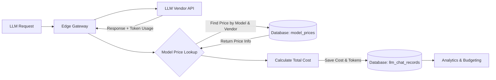

---
<<<<<<< HEAD
title: "Model Prices Management in Tyk AI Studio"
description: "How to manage Large Language Model (LLM) pricing in Tyk AI Studio, including setting costs for input/output tokens and cache usage."
keywords: "AI Studio, AI Management, Model Price"
sidebarTitle: "Model Prices"
---

## Availability

| Edition   | Deployment Type |
| :------------- | :---------------------- |
| [Community](/ai-management/ai-studio/overview#community-edition) & [Enterprise](/ai-management/ai-studio/overview#enterprise-edition) | Self-Managed, Hybrid |

Model Prices define the cost per million tokens for using different language models. This helps track usage costs, allowing you to manage and optimize expenses when interacting with different models.

### Use cases

- **AI Gateway Tracking:** Ensures that token-based costs for API calls through the AI Gateway are accurately logged and monitored.
- **Chat Room Cost Analysis:** Tracks and evaluates expenses associated with user interactions in the Chat Room feature.
- **Budget Enforcement:** Provides the underlying cost data needed to enforce monthly budgets set on LLMs and Applications.

## Model Prices

The Model Prices system allows administrators to define the cost structure for specific Large Language Models (LLMs). The pricing information configured here is used by the Analytics system for cost tracking and billing purposes.

Key components of a Model Price entity include:
- **Model Identification:** The exact name of the model (e.g., `claude-3.5-sonnet-20240620`) and the vendor providing it.
- **Token Costs:** The price charged per million input tokens and output tokens.
- **Cache Costs:** Optional pricing for tokens written to or read from the LLM's prompt cache.
- **Currency:** The currency in which the model's pricing is defined (e.g., USD).

The Model Price entity is closely related to [LLM Management](/ai-management/ai-studio/llm-management), as the pricing defined here applies to the models configured in the LLM settings.

## Configuration

Administrators can configure pricing for specific models through the UI or API. The configuration includes:

- **Model Name:** Must match the exact name used in client API calls or the LLM settings in the portal for correct mapping.
- **Vendor:** Selectable from pre-configured vendors in the portal.
- **Cost per Million Input Tokens:** The price charged per million input tokens sent to the LLM.
- **Cost per Million Output Tokens:** The price charged per million output tokens generated by the LLM.
- **Cost per Million Cache Write Tokens:** The price charged per million tokens written to the prompt cache (defaults to input token pricing if not set).
- **Cost per Million Cache Read Tokens:** The price charged per million cached tokens read (typically much lower than input costs).
- **Currency:** The currency in which the pricing is defined.

## How to Create the Entity

You can create and manage Model Prices through the Tyk AI Studio Admin UI.

1. **Navigate:** Go to the Model Prices section in the Admin UI. This view lists all configured model prices, showing the Model Name, Vendor, Cost per Input Token, Cost per Output Token, Cost per Cache Write Token, Cost per Cache Read Token, and Currency.
2. **Add New Model Price:** Click the "+ ADD MODEL PRICE" button.
3. **Fill in the Model Price Details:**
   - **Model Name:** The exact name of the model this price configuration applies to (Required).
   - **Vendor:** Select the name of the LLM provider (e.g., Anthropic, OpenAI).
   - **Cost per Million Input Tokens:** The price charged per million input tokens sent to the LLM (Required).
   - **Cost per Million Output Tokens:** The price charged per million output tokens generated by the LLM (Required).
   - **Cost per Million Cache Write Tokens:** The price charged per million tokens written to the prompt cache (Optional).
   - **Cost per Million Cache Read Tokens:** The price charged per million cached tokens read (Optional).
   - **Currency:** The currency in which the pricing is defined (e.g., USD) (Required).
4. **Save:** Click "Update Model Price" or "Create Model Price" to save the configuration.

   
=======
title: "Model Prices View for Tyk AI Studio"
description: "How to manage model prices in AI Studio?"
sidebarTitle: "Model Prices View for Tyk AI Studio"
tags: ['AI Studio', 'AI Management', 'Model Price']
---

The **Model Prices View** allows administrators to manage and track the cost associated with Large Language Model (LLM) usage. This section is essential for monitoring expenses and setting pricing for LLM use within the AI Gateway and Chat Room features. Below is a detailed breakdown of the table and its features:

---

#### **Table Overview**
The table displays the following columns:

1. **Model Name**:
   - The name of the LLM model for which pricing is defined (e.g., `claude-3.5-sonnet-20240620`, `gpt-4o`).

2. **Vendor**:
   - The organization providing the LLM (e.g., Anthropic, OpenAI).

3. **Cost per Input Token**:
   - The price charged for each input token processed by the LLM.
   - Example: A value of `0.000001` represents the cost in the specified currency per token.

4. **Cost per Output Token**:
   - The price charged for each output token generated by the LLM.
   - Example: A value of `0.000015` reflects the token generation cost in the specified currency.

5. **Currency**:
   - The currency in which the model's pricing is defined (e.g., USD).

6. **Actions**:
   - A menu (three-dot icon) with quick actions for each model, allowing administrators to:
     - Edit the pricing.
     - Delete the pricing configuration.

---

#### **Features**

1. **Add Model Price Button**:
   - A green button labeled **+ ADD MODEL PRICE**, located in the top-right corner. Clicking this button opens a form to configure the pricing for a new LLM model.

2. **Pagination Dropdown**:
   - Located at the bottom-left corner, this control allows users to adjust how many pricing entries are displayed per page.

---

#### **Use Cases**
- **AI Gateway Tracking**:
   - Ensures that token-based costs for API calls through the AI Gateway are accurately logged and monitored.

- **Chat Room Cost Analysis**:
   - Tracks and evaluates expenses associated with user interactions in the Chat Room feature.

---

#### **Quick Insights**
This section simplifies the process of tracking and updating LLM pricing, ensuring transparency and control over usage costs. The ability to edit or add prices directly from this interface provides flexibility for managing vendor costs dynamically as new models or pricing structures are introduced.

### Edit/Create Model Prices

The **Edit/Create Model Price Form** allows administrators to define or update the cost structure for a specific Large Language Model (LLM). The pricing information configured here is used for cost tracking and billing purposes and must align with the model names used in API calls or the model settings screen.

---

#### **Form Fields and Descriptions**

1. **Model Name** *(Required)*:
   - The exact name of the model this price configuration applies to (e.g., `claude-3.5-sonnet-20240620`).
   - **Important**: This name must match the name used in client API calls or the LLM settings in the portal for correct mapping.

2. **Vendor** *(Dropdown)*:
   - The name of the LLM provider (e.g., Anthropic, OpenAI).
   - Selectable from pre-configured vendors in the portal.

3. **Cost per Input Token** *(Decimal, Required)*:
   - The price charged per input token sent to the LLM.
   - Example: A value of `0.000001` indicates the cost per input token in the specified currency.

4. **Cost per Output Token** *(Decimal, Required)*:
   - The price charged per output token generated by the LLM.
   - Example: A value of `0.000015` specifies the output token cost in the specified currency.

5. **Currency** *(Text, Required)*:
   - The currency in which the pricing is defined (e.g., USD).
   - Example: Use "USD" for United States Dollar pricing.

---

#### **Action Buttons**
1. **Update Model Price / Create Model Price**:
   - A green button at the bottom of the form that saves the price configuration. It updates an existing price or creates a new one depending on the context.

2. **Back to Model Prices**:
   - A link in the top-right corner to return to the **Model Prices View** without saving changes.

---

#### **Usage and Purpose**
- **Price Tracking**:
   - Ensures token-level costs are recorded for API calls and Chat Room interactions.
   - Provides transparency for usage billing.

- **Integration Consistency**:
   - Ensures that the configured pricing aligns with the exact model names used in client interactions or other system settings to avoid mismatches.

---

This form is essential for cost management and aligns LLM usage with its associated financial metrics, providing a streamlined approach to managing expenses in the portal.
>>>>>>> 94d4aceb (push initial code)
