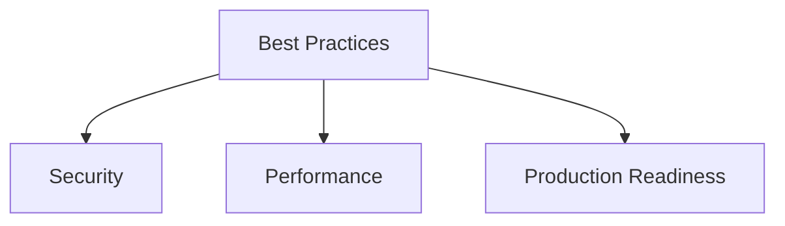

## Availability

| Edition   | Deployment Type |
| :------------- | :---------------------- |
| [Community](ai-management/ai-studio/overview#community-edition) & [Enterprise](ai-management/ai-studio/overview#enterprise-edition) | Self-Managed, Hybrid |



Production-ready patterns, performance optimization, and security guidelines for Tyk AI Studio plugins using the **Unified Plugin SDK**.

## Architecture

### Single Responsibility

Each plugin should have a clear, focused purpose:

```go
// Good: Focused on one concern
type RateLimiterPlugin struct {
    plugin_sdk.BasePlugin
}

// Avoid: Doing too many unrelated things
type EverythingPlugin struct {
    plugin_sdk.BasePlugin
    // rate limiting + auth + logging + analytics + ...
}
```

**When to combine capabilities**:
- ✅ UI + PostAuth for rate limiting dashboard
- ✅ PostAuth + Response for request/response correlation
- ✅ Object Hooks + UI for approval workflows
- ❌ Unrelated features that could be separate plugins

### BasePlugin Usage

Always use `BasePlugin` for consistent lifecycle management:

```go Expandable
type MyPlugin struct {
    plugin_sdk.BasePlugin
    config *Config
    client *http.Client
}

func NewMyPlugin() *MyPlugin {
    return &MyPlugin{
        BasePlugin: plugin_sdk.NewBasePlugin(
            "my-plugin",
            "1.0.0",
            "Clear description of what it does",
        ),
    }
}
```

### Configuration Management

Parse configuration in `Initialize()`, validate early:

```go Expandable
func (p *MyPlugin) Initialize(ctx plugin_sdk.Context, config map[string]string) error {
    // Extract broker ID for Service API
    if brokerIDStr, ok := config["_service_broker_id"]; ok {
        var brokerID uint32
        fmt.Sscanf(brokerIDStr, "%d", &brokerID)
        ai_studio_sdk.SetServiceBrokerID(brokerID)
    }

    // Validate required configuration
    apiKey, ok := config["api_key"]
    if !ok || apiKey == "" {
        return fmt.Errorf("api_key is required")
    }

    // Parse optional configuration with defaults
    timeout := 30
    if timeoutStr, ok := config["timeout"]; ok {
        if t, err := strconv.Atoi(timeoutStr); err == nil {
            timeout = t
        }
    }

    // Initialize resources
    p.config = &Config{
        APIKey:  apiKey,
        Timeout: time.Duration(timeout) * time.Second,
    }

    p.client = &http.Client{
        Timeout: p.config.Timeout,
    }

    ctx.Services.Logger().Info("Plugin initialized",
        "timeout", timeout,
    )

    return nil
}
```

## Error Handling

### Fail Fast, Fail Clearly

Return errors early with descriptive messages:

```go Expandable
func (p *MyPlugin) HandlePostAuth(ctx plugin_sdk.Context, req *pb.EnrichedRequest) (*pb.PluginResponse, error) {
    // Validate input
    if req.Method != "POST" {
        return &pb.PluginResponse{
            Block:        true,
            ErrorMessage: "Only POST requests are allowed",
        }, nil
    }

    // Check external dependency
    status, err := p.checkExternalService(ctx)
    if err != nil {
        ctx.Services.Logger().Error("External service check failed",
            "error", err,
            "app_id", ctx.AppID,
        )
        return &pb.PluginResponse{
            Block:        true,
            ErrorMessage: "Service temporarily unavailable",
        }, nil
    }

    return &pb.PluginResponse{Modified: false}, nil
}
```

### Log Errors with Context

Always include relevant context in error logs:

```go
ctx.Services.Logger().Error("Failed to validate request",
    "error", err,
    "app_id", ctx.AppID,
    "user_id", ctx.UserID,
    "path", req.Path,
    "method", req.Method,
)
```

### Graceful Degradation

Don't fail hard if non-critical operations fail:

```go
// Bad: Plugin fails if KV write fails
err := ctx.Services.KV().Write(ctx, "cache", data)
if err != nil {
    return nil, err // Blocks entire request!
}

// Good: Log and continue
err := ctx.Services.KV().Write(ctx, "cache", data)
if err != nil {
    ctx.Services.Logger().Warn("Failed to cache data", "error", err)
    // Continue processing
}
```

## Performance

### Minimize Blocking Operations

Avoid blocking in request path:

```go Expandable
// Bad: Synchronous external call in request path
func (p *MyPlugin) HandlePostAuth(ctx plugin_sdk.Context, req *pb.EnrichedRequest) (*pb.PluginResponse, error) {
    // This blocks the request!
    result, err := p.callSlowExternalAPI(req.Body)
    return &pb.PluginResponse{Modified: false}, nil
}

// Good: Async processing for non-critical operations
func (p *MyPlugin) HandlePostAuth(ctx plugin_sdk.Context, req *pb.EnrichedRequest) (*pb.PluginResponse, error) {
    // Fire and forget for analytics
    go func() {
        p.trackRequest(req)
    }()

    return &pb.PluginResponse{Modified: false}, nil
}
```

### Use Connection Pooling

Reuse HTTP clients and database connections. The SDK provides a `DefaultHTTPClient()` with sensible defaults (30s timeout, connection pooling, TLS handshake timeout):

```go
func NewMyPlugin() *MyPlugin {
    return &MyPlugin{
        BasePlugin: plugin_sdk.NewBasePlugin("my-plugin", "1.0.0", "desc"),
        // Use the SDK default client with connection pooling
        httpClient: plugin_sdk.DefaultHTTPClient(),
    }
}
```

You can also configure your own client if you need different settings:

```go
httpClient: &http.Client{
    Timeout: 10 * time.Second,
    Transport: &http.Transport{
        MaxIdleConns:        100,
        MaxIdleConnsPerHost: 10,
        IdleConnTimeout:     90 * time.Second,
    },
}
```

**Important**: Always use `http.NewRequestWithContext(ctx, ...)` to respect context cancellation and timeouts. Never use the default `http.Client{}` with zero timeout in production plugins.

### Cache Frequently Accessed Data

Use KV storage or in-memory caching:

```go Expandable
type MyPlugin struct {
    plugin_sdk.BasePlugin
    cache     sync.Map // In-memory cache
    cacheTime time.Duration
}

func (p *MyPlugin) getConfig(ctx plugin_sdk.Context, appID uint32) (*AppConfig, error) {
    // Check memory cache first
    key := fmt.Sprintf("config:%d", appID)
    if val, ok := p.cache.Load(key); ok {
        cached := val.(*cachedConfig)
        if time.Since(cached.timestamp) < p.cacheTime {
            return cached.config, nil
        }
    }

    // Check KV storage
    data, err := ctx.Services.KV().Read(ctx, key)
    if err == nil {
        var config AppConfig
        json.Unmarshal(data, &config)

        // Update memory cache
        p.cache.Store(key, &cachedConfig{
            config:    &config,
            timestamp: time.Now(),
        })

        return &config, nil
    }

    // Fetch from Service API (slowest)
    app, err := ctx.Services.Studio().GetApp(ctx, appID)
    // ... cache and return
}
```

### Batch Operations

Batch external calls when possible:

```go
// Bad: N+1 queries
for _, appID := range appIDs {
    app, _ := ctx.Services.Studio().GetApp(ctx, appID)
    // process app
}

// Good: Batch fetch
apps, _ := ctx.Services.Studio().ListApps(ctx, 1, 100)
```

## Security

### Input Validation

Always validate and sanitize inputs:

```go Expandable
func (p *MyPlugin) HandleObjectHook(ctx plugin_sdk.Context, req *pb.ObjectHookRequest) (*pb.ObjectHookResponse, error) {
    // Validate object JSON
    var llm LLM
    if err := json.Unmarshal([]byte(req.ObjectJson), &llm); err != nil {
        return &pb.ObjectHookResponse{
            AllowOperation:  false,
            RejectionReason: "Invalid LLM configuration",
        }, nil
    }

    // Validate required fields
    if llm.Name == "" {
        return &pb.ObjectHookResponse{
            AllowOperation:  false,
            RejectionReason: "LLM name is required",
        }, nil
    }

    // Validate URL format
    if llm.APIEndpoint != "" {
        u, err := url.Parse(llm.APIEndpoint)
        if err != nil || (u.Scheme != "https" && u.Scheme != "http") {
            return &pb.ObjectHookResponse{
                AllowOperation:  false,
                RejectionReason: "Invalid API endpoint URL",
            }, nil
        }
    }

    return &pb.ObjectHookResponse{AllowOperation: true}, nil
}
```

### Least Privilege Permissions

Only request permissions you actually need:

```json Expandable
// Bad: Requesting everything
{
  "permissions": {
    "services": [
      "llms.read", "llms.write", "llms.proxy",
      "tools.read", "tools.write", "tools.execute",
      "apps.read", "apps.write",
      "analytics.read", "kv.readwrite"
    ]
  }
}

// Good: Only what's needed
{
  "permissions": {
    "services": [
      "llms.read",      // Read LLM configs
      "kv.readwrite"    // Store plugin state
    ]
  }
}
```

### Secrets Management

Never hardcode secrets, use configuration:

```go
// Bad: Hardcoded secrets
apiKey := "sk-1234567890abcdef"

// Good: From configuration
apiKey, ok := config["api_key"]
if !ok {
    return fmt.Errorf("api_key configuration required")
}

// Better: From environment or secrets manager
apiKey := os.Getenv("PLUGIN_API_KEY")
```

### Sanitize Logs

Don't log sensitive data:

```go
// Bad: Logging sensitive data
ctx.Services.Logger().Info("Request received",
    "headers", req.Headers, // May contain auth tokens!
    "body", req.Body,       // May contain PII!
)

// Good: Log only safe metadata
ctx.Services.Logger().Info("Request received",
    "app_id", ctx.AppID,
    "method", req.Method,
    "path", req.Path,
    "content_length", len(req.Body),
)
```

## Observability

### Structured Logging

Use key-value pairs for searchable logs:

```go Expandable
// Good structured logging
ctx.Services.Logger().Info("Request processed",
    "app_id", ctx.AppID,
    "user_id", ctx.UserID,
    "duration_ms", time.Since(startTime).Milliseconds(),
    "status", "success",
)

ctx.Services.Logger().Error("External API call failed",
    "error", err,
    "endpoint", endpoint,
    "status_code", statusCode,
    "retry_count", retryCount,
)
```

### Request Tracing

Include request IDs for correlation:

```go Expandable
func (p *MyPlugin) HandlePostAuth(ctx plugin_sdk.Context, req *pb.EnrichedRequest) (*pb.PluginResponse, error) {
    requestID := generateRequestID()

    // Add to request for downstream
    if req.Headers == nil {
        req.Headers = make(map[string]string)
    }
    req.Headers["X-Request-ID"] = requestID

    ctx.Services.Logger().Info("Processing request",
        "request_id", requestID,
        "app_id", ctx.AppID,
    )

    // Use request ID in all logs for this request
    defer func() {
        ctx.Services.Logger().Info("Request completed",
            "request_id", requestID,
            "duration_ms", time.Since(startTime).Milliseconds(),
        )
    }()

    return &pb.PluginResponse{
        Modified: true,
        Request:  req,
    }, nil
}
```

### Metrics Collection

Track plugin performance:

```go Expandable
type MyPlugin struct {
    plugin_sdk.BasePlugin
    stats struct {
        sync.RWMutex
        requestCount   int64
        errorCount     int64
        totalDuration  time.Duration
    }
}

func (p *MyPlugin) HandlePostAuth(ctx plugin_sdk.Context, req *pb.EnrichedRequest) (*pb.PluginResponse, error) {
    startTime := time.Now()
    defer func() {
        duration := time.Since(startTime)

        p.stats.Lock()
        p.stats.requestCount++
        p.stats.totalDuration += duration
        p.stats.Unlock()

        if duration > 100*time.Millisecond {
            ctx.Services.Logger().Warn("Slow plugin execution",
                "duration_ms", duration.Milliseconds(),
            )
        }
    }()

    // ... plugin logic
}

// Expose metrics via RPC (for UI plugins)
func (p *MyPlugin) HandleCall(method string, payload []byte) ([]byte, error) {
    if method == "get_metrics" {
        p.stats.RLock()
        defer p.stats.RUnlock()

        return json.Marshal(map[string]interface{}{
            "request_count":   p.stats.requestCount,
            "error_count":     p.stats.errorCount,
            "avg_duration_ms": p.stats.totalDuration.Milliseconds() / p.stats.requestCount,
        })
    }
    return nil, fmt.Errorf("unknown method")
}
```

## Testing

### Unit Tests

Test plugin logic in isolation:

```go Expandable
func TestValidation(t *testing.T) {
    plugin := NewValidatorPlugin()

    tests := []struct {
        name        string
        llm         LLM
        shouldAllow bool
        reason      string
    }{
        {
            name:        "valid HTTPS endpoint",
            llm:         LLM{APIEndpoint: "https://api.example.com"},
            shouldAllow: true,
        },
        {
            name:        "HTTP endpoint blocked",
            llm:         LLM{APIEndpoint: "http://api.example.com"},
            shouldAllow: false,
            reason:      "API endpoint must use HTTPS",
        },
    }

    for _, tt := range tests {
        t.Run(tt.name, func(t *testing.T) {
            llmJSON, _ := json.Marshal(tt.llm)
            req := &pb.ObjectHookRequest{
                ObjectType: "llm",
                ObjectJson: string(llmJSON),
            }

            resp, err := plugin.HandleObjectHook(mockContext(), req)
            assert.NoError(t, err)
            assert.Equal(t, tt.shouldAllow, resp.AllowOperation)
            if !tt.shouldAllow {
                assert.Contains(t, resp.RejectionReason, tt.reason)
            }
        })
    }
}
```

### Integration Tests

Test with Service API:

```go Expandable
func TestServiceAPIIntegration(t *testing.T) {
    // Requires test environment
    if os.Getenv("INTEGRATION_TEST") == "" {
        t.Skip("Skipping integration test")
    }

    plugin := NewMyPlugin()
    ctx := testContext()

    // Test KV operations
    err := ctx.Services.KV().Write(ctx, "test-key", []byte("value"))
    assert.NoError(t, err)

    data, err := ctx.Services.KV().Read(ctx, "test-key")
    assert.NoError(t, err)
    assert.Equal(t, "value", string(data))
}
```

## Object Hooks Best Practices

### Hook Priority

Use priority to control execution order:

- **0-10**: Critical validation (security, compliance)
- **11-50**: Business logic validation
- **51-100**: Enrichment and metadata

```go
func (p *SecurityPlugin) GetObjectHookRegistrations() ([]*pb.ObjectHookRegistration, error) {
    return []*pb.ObjectHookRegistration{
        {
            ObjectType: "llm",
            HookTypes:  []string{"before_create", "before_update"},
            Priority:   5, // Run early for security checks
        },
    }, nil
}
```

### Before vs After Hooks

**Use `before_*` hooks for**:
- Validation that can block operations
- Required field checks
- Security policy enforcement
- Approval workflows

**Use `after_*` hooks for**:
- Notifications
- Audit logging
- External system sync
- Non-blocking enrichment

### Metadata Storage

Use PluginMetadata for tracking:

```go
return &pb.ObjectHookResponse{
    AllowOperation: true,
    PluginMetadata: map[string]string{
        "validated_by":  "security-plugin",
        "validated_at":  time.Now().Format(time.RFC3339),
        "security_scan": "passed",
        "risk_score":    "low",
    },
}, nil
```

## Multi-Capability Patterns

### Shared State

Share data structures between capabilities:

```go Expandable
type RateLimiterPlugin struct {
    plugin_sdk.BasePlugin
    limits sync.Map // app_id -> limit config
}

// PostAuth uses limits
func (p *RateLimiterPlugin) HandlePostAuth(ctx plugin_sdk.Context, req *pb.EnrichedRequest) (*pb.PluginResponse, error) {
    limit, _ := p.limits.Load(ctx.AppID)
    // Check limit
}

// UI reads limits
func (p *RateLimiterPlugin) HandleCall(method string, payload []byte) ([]byte, error) {
    if method == "get_limits" {
        var limits []LimitInfo
        p.limits.Range(func(key, value interface{}) bool {
            limits = append(limits, LimitInfo{
                AppID: key.(uint32),
                Limit: value.(int),
            })
            return true
        })
        return json.Marshal(limits)
    }
}
```

### State Persistence

Use KV storage for durable state:

```go Expandable
func (p *MyPlugin) Initialize(ctx plugin_sdk.Context, config map[string]string) error {
    // Load state from KV on startup
    data, err := ctx.Services.KV().Read(ctx, "plugin_state")
    if err == nil {
        json.Unmarshal(data, &p.state)
    }
    return nil
}

func (p *MyPlugin) Shutdown(ctx plugin_sdk.Context) error {
    // Save state to KV on shutdown
    data, _ := json.Marshal(p.state)
    ctx.Services.KV().Write(ctx, "plugin_state", data)
    return nil
}
```

## Deployment

### Version Management

Use semantic versioning:

```go
plugin_sdk.NewBasePlugin(
    "my-plugin",
    "1.2.3", // MAJOR.MINOR.PATCH
    "Description",
)
```

- **MAJOR**: Breaking changes (incompatible API changes)
- **MINOR**: New features (backward-compatible)
- **PATCH**: Bug fixes (backward-compatible)

### Resource Cleanup

Always clean up in `Shutdown()`:

```go Expandable
func (p *MyPlugin) Shutdown(ctx plugin_sdk.Context) error {
    // Close database connections
    if p.db != nil {
        p.db.Close()
    }

    // Close HTTP clients
    if p.httpClient != nil {
        p.httpClient.CloseIdleConnections()
    }

    // Flush any pending operations
    p.flushPendingData(ctx)

    ctx.Services.Logger().Info("Plugin shutdown complete")
    return nil
}
```

### Health Checks

Implement health check methods:

```go Expandable
func (p *MyPlugin) HandleCall(method string, payload []byte) ([]byte, error) {
    if method == "health" {
        status := map[string]interface{}{
            "status": "healthy",
            "uptime": time.Since(p.startTime).Seconds(),
        }

        // Check external dependencies
        if err := p.checkDependencies(); err != nil {
            status["status"] = "unhealthy"
            status["error"] = err.Error()
        }

        return json.Marshal(status)
    }
    // ... other methods
}
```

## Common Pitfalls

### AUTH Plugins: App Linking Requirement

The most common AUTH plugin pitfall is **not linking credentials to App objects**. A valid credential alone is insufficient—the system needs the App context for access control.

**Why This Matters:**

Apps provide the access control context that governs what authenticated requests can do:
- Policy enforcement (rate limits, quotas)
- Tool and datasource permissions
- LLM access restrictions
- Budget controls

**Required Interface Methods:**

AUTH plugins must implement all three methods of the `AuthHandler` interface:

```go
type AuthHandler interface {
    HandleAuth(ctx Context, req *pb.AuthRequest) (*pb.AuthResponse, error)
    GetAppByCredential(ctx Context, credential string) (*pb.App, error)      // Often forgotten!
    GetUserByCredential(ctx Context, credential string) (*pb.User, error)
}
```

**Common Mistakes:**

```go Expandable
// BAD: Only validates token, doesn't return App ID
func (p *MyPlugin) HandleAuth(ctx plugin_sdk.Context, req *pb.AuthRequest) (*pb.AuthResponse, error) {
    if isValidToken(req.Credential) {
        return &pb.AuthResponse{
            Authenticated: true,
            // Missing AppId and UserId! Request will fail.
        }, nil
    }
    return &pb.AuthResponse{Authenticated: false}, nil
}

// GOOD: Returns both App ID and User ID
func (p *MyPlugin) HandleAuth(ctx plugin_sdk.Context, req *pb.AuthRequest) (*pb.AuthResponse, error) {
    tokenConfig, valid := p.lookupToken(req.Credential)
    if !valid {
        return &pb.AuthResponse{Authenticated: false, ErrorMessage: "Invalid token"}, nil
    }
    return &pb.AuthResponse{
        Authenticated: true,
        AppId:         tokenConfig.AppID,   // Links to access control
        UserId:        tokenConfig.UserID,  // Links to identity
    }, nil
}
```

**Validation Checklist:**

- [ ] `HandleAuth` returns a valid `AppId` that exists in the database
- [ ] `HandleAuth` returns a valid `UserId` that exists in the database
- [ ] `GetAppByCredential` fetches the complete App object via Service API
- [ ] `GetUserByCredential` fetches the complete User object via Service API
- [ ] The App has the required permissions for the tools/LLMs the user needs

See [Plugin SDK Reference - AuthHandler](/ai-management/ai-studio/plugins/sdk#2-authhandler) for complete documentation.

### 1. Modifying Shared Data Without Locking

```go Expandable
// Bad: Race condition
type MyPlugin struct {
    counter int // Not thread-safe!
}

// Good: Use sync primitives
type MyPlugin struct {
    mu      sync.Mutex
    counter int
}

func (p *MyPlugin) increment() {
    p.mu.Lock()
    defer p.mu.Unlock()
    p.counter++
}
```

### 2. Blocking in Defer

```go
// Bad: Blocking operations in defer
defer func() {
    p.sendAnalytics(data) // Blocks shutdown!
}()

// Good: Use timeouts
defer func() {
    ctx, cancel := context.WithTimeout(context.Background(), 5*time.Second)
    defer cancel()
    p.sendAnalyticsWithContext(ctx, data)
}()
```

### 3. Not Handling Context Cancellation

```go
// Good: Respect context cancellation
func (p *MyPlugin) longRunningOperation(ctx context.Context) error {
    for {
        select {
        case <-ctx.Done():
            return ctx.Err()
        default:
            // Do work
        }
    }
}
```

### 4. Excessive Logging

```go
// Bad: Log spam
for _, item := range items {
    ctx.Services.Logger().Debug("Processing item", "item", item)
}

// Good: Batch logging
ctx.Services.Logger().Info("Processing items",
    "count", len(items),
    "batch_id", batchID,
)
```
