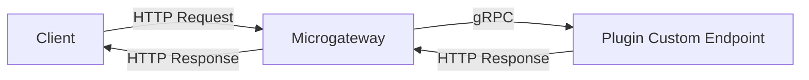
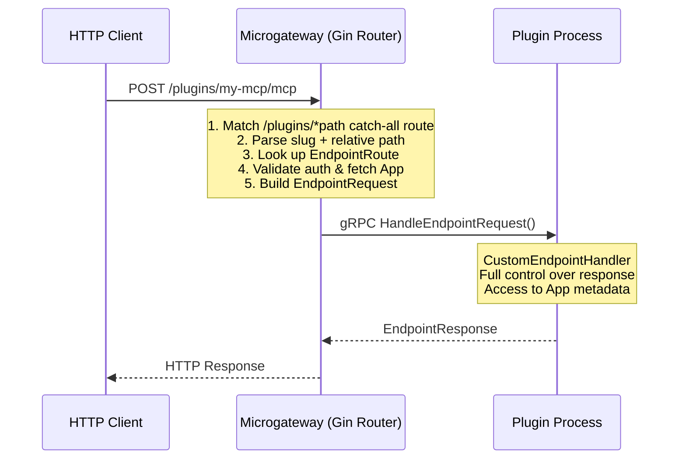

Custom Endpoint plugins allow you to **register and serve arbitrary HTTP endpoints** on the microgateway under the `/plugins/{slug}/` URL namespace. This gives plugins full control over request handling, enabling use cases like OAuth identity providers, MCP proxy servers, webhook receivers, and custom protocol-specific APIs.

## Overview

Custom Endpoints provide plugins with the ability to:

- **Serve custom HTTP APIs** alongside the standard LLM/Tool/Datasource proxy endpoints
- **Handle arbitrary URL paths** with pre-split path segments for easy routing
- **Stream responses** via Server-Sent Events (SSE) for protocols like MCP Streamable HTTP
- **Authenticate requests** using the gateway's existing token system, with full App context (including metadata)
- **Support any HTTP method** (GET, POST, PUT, DELETE, PATCH, OPTIONS, HEAD)

### Working Example

See [`examples/plugins/gateway/custom-echo-endpoint/`](../../../examples/plugins/gateway/custom-echo-endpoint/) for a complete, working example that combines **CustomEndpointHandler** + **UIProvider** + **ConfigProvider**. It echoes request metadata and serves content configurable via the Studio admin UI.

### URL Pattern

All custom endpoints are mounted under:

```
/plugins/{slug}/{path...}
```

Where `{slug}` is declared in the plugin's configuration (the `slug` key in the config map), and `{path...}` is the sub-path handled by the plugin.

### How It Works

```


## Implementing Custom Endpoints

### Step 1: Implement CustomEndpointHandler Interface

```go
type CustomEndpointHandler interface {
    Plugin
    GetEndpointRegistrations() ([]*pb.EndpointRegistration, error)
    HandleEndpointRequest(ctx Context, req *pb.EndpointRequest) (*pb.EndpointResponse, error)
    HandleEndpointRequestStream(ctx Context, req *pb.EndpointRequest, stream grpc.ServerStreamingServer[pb.EndpointResponseChunk]) error
}
```

### Step 2: Register Your Endpoints

Declare which paths and HTTP methods your plugin handles:

```go
func (p *MyPlugin) GetEndpointRegistrations() ([]*pb.EndpointRegistration, error) {
    return []*pb.EndpointRegistration{
        {
            Path:           "/*",                            // Catch-all wildcard
            Methods:        []string{"GET", "POST", "DELETE"},
            Description:    "MCP Streamable HTTP endpoint",
            RequireAuth:    true,                            // Gateway enforces auth
            StreamResponse: true,                            // Use streaming RPC
        },
    }, nil
}
```

**Registration Options:**

| Field | Type | Description |
|-------|------|-------------|
| `path` | string | Relative path under the plugin slug. Use `/*` for catch-all. |
| `methods` | []string | HTTP methods to handle. Valid: GET, POST, PUT, DELETE, PATCH, OPTIONS, HEAD. |
| `description` | string | Human-readable description of the endpoint. |
| `require_auth` | bool | If true, gateway validates the token and passes the full `App` object to the plugin. |
| `stream_response` | bool | If true, gateway uses `HandleEndpointRequestStream` (SSE). Otherwise uses `HandleEndpointRequest`. |
| `metadata` | map[string]string | Plugin-defined metadata. |

### Step 3: Handle Requests

#### Unary (Non-Streaming) Endpoints

For standard request/response:

```go
func (p *MyPlugin) HandleEndpointRequest(ctx plugin_sdk.Context, req *pb.EndpointRequest) (*pb.EndpointResponse, error) {
    // Route based on path segments
    segments := req.PathSegments

    switch {
    case len(segments) == 0:
        return p.handleRoot(req)
    case segments[0] == ".well-known" && len(segments) >= 2:
        return p.handleWellKnown(segments[1], req)
    case segments[0] == "users" && len(segments) >= 2:
        return p.handleUser(segments[1], req)
    default:
        return &pb.EndpointResponse{
            StatusCode: 404,
            Headers:    map[string]string{"Content-Type": "application/json"},
            Body:       []byte(`{"error": "not found"}`),
        }, nil
    }
}
```

#### Streaming (SSE) Endpoints

For Server-Sent Events or MCP Streamable HTTP:

```go
func (p *MyPlugin) HandleEndpointRequestStream(
    ctx plugin_sdk.Context,
    req *pb.EndpointRequest,
    stream grpc.ServerStreamingServer[pb.EndpointResponseChunk],
) error {
    // Send headers first
    stream.Send(&pb.EndpointResponseChunk{
        Type:       pb.EndpointResponseChunk_HEADERS,
        StatusCode: 200,
        Headers: map[string]string{
            "Content-Type":  "text/event-stream",
            "Cache-Control": "no-cache",
            "Connection":    "keep-alive",
        },
    })

    // Send SSE data chunks — each is flushed immediately to the HTTP client
    for i := 0; i < 5; i++ {
        data := fmt.Sprintf("data: {\"count\": %d}\n\n", i)
        stream.Send(&pb.EndpointResponseChunk{
            Type: pb.EndpointResponseChunk_BODY,
            Data: []byte(data),
        })
        time.Sleep(1 * time.Second)
    }

    // Signal stream completion
    stream.Send(&pb.EndpointResponseChunk{
        Type: pb.EndpointResponseChunk_DONE,
    })

    return nil
}
```

**Chunk Protocol:** HEADERS → BODY* → DONE

| Chunk Type | When | Fields Used |
|------------|------|-------------|
| `HEADERS` | First chunk | `status_code`, `headers` |
| `BODY` | Zero or more times | `data` (raw bytes flushed to client) |
| `DONE` | Final chunk | — |
| `ERROR` | On failure | `error_message` |

### Step 4: Configure the Plugin Slug and Register

The plugin slug (used in the URL path) must be set explicitly in the plugin's config map. The slug determines the URL namespace: `/plugins/{slug}/...`.

#### Manifest

Declare `custom_endpoint` in the manifest's capabilities:

```json
{
  "id": "com.example.my-plugin",
  "name": "My Custom Endpoint",
  "version": "1.0.0",
  "capabilities": {
    "hooks": ["custom_endpoint"],
    "primary_hook": "custom_endpoint"
  }
}
```

If the plugin also provides a Studio UI, include `"studio_ui"` in hooks:

```json
"hooks": ["custom_endpoint", "studio_ui"]
```

#### Registration via AI Studio

Register the plugin in AI Studio (Admin > Plugins) with:

| Field | Value |
|-------|-------|
| **Hook type** | `custom_endpoint` |
| **Hook types** | `["custom_endpoint"]` (add `"studio_ui"` if plugin has UI) |
| **Config** | Must include `"slug"` key — e.g., `{"slug": "my-mcp"}` |

The `slug` in the config determines the URL path on the gateway. For example, `{"slug": "my-mcp"}` makes endpoints available at `http://gateway:8081/plugins/my-mcp/...`.

**Important:** The `slug` must be set in the config map. Without it, endpoints will not be registered and you'll see a warning in the gateway logs:
```
Plugin has endpoint registrations but no 'slug' in config
```

#### Building and Deploying

```bash
# Build the plugin
cd examples/plugins/gateway/custom-echo-endpoint
go build -o custom-echo-endpoint

# Register with file:// for local development
# Command: file:///path/to/custom-echo-endpoint
# Config: {"slug": "custom-echo-endpoint", "custom_content": "Hello World"}
```

#### Gateway Loading

Custom endpoint plugins are loaded automatically at gateway startup via the pre-warming system. The gateway:
1. Queries all active plugins with `custom_endpoint` hook type
2. Loads each plugin (starts the binary, initializes via gRPC)
3. Calls `GetEndpointRegistrations()` to discover endpoints
4. Registers routes using the `slug` from config

After a control plane config sync, routes are refreshed automatically.

## EndpointRequest Fields

When a request arrives, the plugin receives a rich `EndpointRequest`:

| Field | Type | Description |
|-------|------|-------------|
| `method` | string | HTTP method (GET, POST, etc.) |
| `path` | string | Full request path (`/plugins/my-mcp/users/123`) |
| `relative_path` | string | Path relative to plugin mount (`/users/123`) |
| `path_segments` | []string | Pre-split segments: `["users", "123"]` |
| `headers` | map[string]string | Request headers |
| `body` | bytes | Request body |
| `query_string` | string | Raw query string (`foo=bar&baz=1`) |
| `remote_addr` | string | Client IP address |
| `host` | string | Request Host header |
| `protocol` | string | `"http"` (future: `"websocket"`, `"sse"`) |
| `context` | PluginContext | Request ID, metadata |
| `authenticated` | bool | Whether request was authenticated |
| `app` | App | Full App object (when authenticated) |
| `scopes` | []string | Token scopes (when authenticated) |

### Path Segments

The `path_segments` field pre-splits the relative path for easy pattern matching:

| Request URL | `relative_path` | `path_segments` |
|-------------|-----------------|-----------------|
| `/plugins/my-mcp/` | `/` | `[]` |
| `/plugins/my-mcp/mcp` | `/mcp` | `["mcp"]` |
| `/plugins/my-mcp/users/123/profile` | `/users/123/profile` | `["users", "123", "profile"]` |
| `/plugins/my-mcp/.well-known/openid-configuration` | `/.well-known/openid-configuration` | `[".well-known", "openid-configuration"]` |

## Authentication and App Context

When `require_auth: true`, the gateway:

1. Extracts the token from `Authorization: Bearer <token>` header or `?token=` query param
2. Validates the token via the gateway's auth provider
3. Fetches the **full App object** linked to the token
4. Populates `EndpointRequest` with `authenticated=true`, `app`, and `scopes`

The `App` object includes:

| Field | Type | Description |
|-------|------|-------------|
| `id` | uint32 | App ID |
| `name` | string | App name |
| `description` | string | App description |
| `owner_email` | string | Owner email address |
| `is_active` | bool | Whether app is active |
| `monthly_budget` | double | Monthly budget limit |
| `rate_limit` | int32 | Rate limit (requests per minute) |
| `metadata` | map[string]string | Custom key-value metadata |

### Access Control via App Metadata

The recommended pattern for per-app access control is to store ACL rules in App metadata, which admins configure per-app:

```go
func (p *MyPlugin) HandleEndpointRequest(ctx plugin_sdk.Context, req *pb.EndpointRequest) (*pb.EndpointResponse, error) {
    if !req.Authenticated || req.App == nil {
        return &pb.EndpointResponse{StatusCode: 401, Body: []byte("Unauthorized")}, nil
    }

    // Check custom ACL in App metadata
    if req.App.Metadata["mcp_access"] != "allowed" {
        return &pb.EndpointResponse{StatusCode: 403, Body: []byte("Forbidden")}, nil
    }

    // Check allowed operations
    allowedOps := req.App.Metadata["allowed_operations"]
    if allowedOps != "" && !strings.Contains(allowedOps, req.Method) {
        return &pb.EndpointResponse{StatusCode: 405, Body: []byte("Method not allowed for this app")}, nil
    }

    // Access granted — handle request
    return p.processRequest(req)
}
```

## Route Matching

The gateway matches routes in this order:

1. **Exact match** — `GET:/plugins/my-oauth/.well-known/openid-configuration`
2. **Wildcard catch-all** — `GET:/plugins/my-oauth/*`

**Recommended:** Register a single `/*` catch-all and handle routing internally using `path_segments`. This is the simplest and most flexible approach.

A plugin can also register multiple specific paths:

```go
func (p *MyPlugin) GetEndpointRegistrations() ([]*pb.EndpointRegistration, error) {
    return []*pb.EndpointRegistration{
        {
            Path:        "/.well-known/openid-configuration",
            Methods:     []string{"GET"},
            Description: "OpenID Connect discovery",
        },
        {
            Path:        "/token",
            Methods:     []string{"POST"},
            Description: "Token endpoint",
            RequireAuth: false,
        },
        {
            Path:        "/userinfo",
            Methods:     []string{"GET"},
            Description: "UserInfo endpoint",
            RequireAuth: true,
        },
    }, nil
}
```

## MCP Streamable HTTP Support

Custom endpoints are designed to support MCP (Model Context Protocol) Streamable HTTP out of the box.

### MCP Protocol Summary

MCP Streamable HTTP uses a single endpoint with:
- **POST**: Client sends JSON-RPC messages; server responds with `application/json` or `text/event-stream`
- **GET**: Client opens an inbound SSE stream for server-initiated messages
- **DELETE**: Client terminates the session
- Session tracking via `Mcp-Session-Id` header

### MCP Proxy Plugin Pattern

```go
type MCPProxyPlugin struct {
    plugin_sdk.BasePlugin
    sessions sync.Map // sessionID → session state
}

func (p *MCPProxyPlugin) GetEndpointRegistrations() ([]*pb.EndpointRegistration, error) {
    return []*pb.EndpointRegistration{
        {
            Path:           "/*",
            Methods:        []string{"POST", "GET", "DELETE"},
            Description:    "MCP Streamable HTTP proxy",
            RequireAuth:    true,
            StreamResponse: true, // Use streaming for all requests
        },
    }, nil
}

func (p *MCPProxyPlugin) HandleEndpointRequestStream(
    ctx plugin_sdk.Context,
    req *pb.EndpointRequest,
    stream grpc.ServerStreamingServer[pb.EndpointResponseChunk],
) error {
    switch req.Method {
    case "POST":
        return p.handleMCPPost(ctx, req, stream)
    case "GET":
        return p.handleMCPGet(ctx, req, stream)
    case "DELETE":
        return p.handleMCPDelete(ctx, req, stream)
    default:
        stream.Send(&pb.EndpointResponseChunk{
            Type:       pb.EndpointResponseChunk_HEADERS,
            StatusCode: 405,
        })
        stream.Send(&pb.EndpointResponseChunk{Type: pb.EndpointResponseChunk_DONE})
        return nil
    }
}

func (p *MCPProxyPlugin) handleMCPPost(ctx plugin_sdk.Context, req *pb.EndpointRequest, stream grpc.ServerStreamingServer[pb.EndpointResponseChunk]) error {
    // Parse JSON-RPC request
    var rpcReq map[string]interface{}
    json.Unmarshal(req.Body, &rpcReq)

    // Check if client accepts SSE
    acceptsSSE := strings.Contains(req.Headers["Accept"], "text/event-stream")

    if acceptsSSE {
        // Stream response as SSE
        stream.Send(&pb.EndpointResponseChunk{
            Type:       pb.EndpointResponseChunk_HEADERS,
            StatusCode: 200,
            Headers: map[string]string{
                "Content-Type":  "text/event-stream",
                "Cache-Control": "no-cache",
            },
        })

        // Send SSE events...
        for _, event := range p.processRPCRequest(rpcReq) {
            data := fmt.Sprintf("data: %s\n\n", event)
            stream.Send(&pb.EndpointResponseChunk{
                Type: pb.EndpointResponseChunk_BODY,
                Data: []byte(data),
            })
        }
    } else {
        // Single JSON response
        result := p.processRPCRequestSync(rpcReq)
        body, _ := json.Marshal(result)
        stream.Send(&pb.EndpointResponseChunk{
            Type:       pb.EndpointResponseChunk_HEADERS,
            StatusCode: 200,
            Headers:    map[string]string{"Content-Type": "application/json"},
        })
        stream.Send(&pb.EndpointResponseChunk{
            Type: pb.EndpointResponseChunk_BODY,
            Data: body,
        })
    }

    stream.Send(&pb.EndpointResponseChunk{Type: pb.EndpointResponseChunk_DONE})
    return nil
}
```

The gateway is a transparent pipe — all MCP protocol logic (JSON-RPC, sessions, resumability) lives in the plugin.

## Complete Example: Webhook Receiver

```go
package main

import (
    "crypto/hmac"
    "crypto/sha256"
    "encoding/hex"
    "encoding/json"
    "fmt"

    "github.com/TykTechnologies/midsommar/v2/pkg/plugin_sdk"
    pb "github.com/TykTechnologies/midsommar/v2/proto"
)

type WebhookPlugin struct {
    plugin_sdk.BasePlugin
    secret string
}

func NewWebhookPlugin() *WebhookPlugin {
    return &WebhookPlugin{
        BasePlugin: plugin_sdk.NewBasePlugin("webhook-receiver", "1.0.0", "Receives and validates webhooks"),
    }
}

func (p *WebhookPlugin) Initialize(ctx plugin_sdk.Context, config map[string]string) error {
    p.secret = config["webhook_secret"]
    if p.secret == "" {
        return fmt.Errorf("webhook_secret is required")
    }
    ctx.Services.Logger().Info("Webhook receiver initialized")
    return nil
}

func (p *WebhookPlugin) GetEndpointRegistrations() ([]*pb.EndpointRegistration, error) {
    return []*pb.EndpointRegistration{
        {
            Path:        "/*",
            Methods:     []string{"POST"},
            Description: "Webhook receiver endpoint",
            RequireAuth: false, // Webhooks use their own auth (HMAC signature)
        },
    }, nil
}

func (p *WebhookPlugin) HandleEndpointRequest(ctx plugin_sdk.Context, req *pb.EndpointRequest) (*pb.EndpointResponse, error) {
    // Validate HMAC signature
    signature := req.Headers["X-Webhook-Signature"]
    if !p.validateSignature(req.Body, signature) {
        return &pb.EndpointResponse{
            StatusCode: 401,
            Headers:    map[string]string{"Content-Type": "application/json"},
            Body:       []byte(`{"error": "invalid signature"}`),
        }, nil
    }

    // Route by path segments
    segments := req.PathSegments
    if len(segments) == 0 {
        return &pb.EndpointResponse{StatusCode: 400, Body: []byte(`{"error": "missing event type"}`)}, nil
    }

    eventType := segments[0]
    ctx.Services.Logger().Info("Webhook received", "event", eventType, "body_size", len(req.Body))

    // Process webhook
    switch eventType {
    case "payment":
        return p.handlePaymentWebhook(ctx, req)
    case "user":
        return p.handleUserWebhook(ctx, req)
    default:
        return &pb.EndpointResponse{
            StatusCode: 200,
            Headers:    map[string]string{"Content-Type": "application/json"},
            Body:       []byte(`{"status": "acknowledged"}`),
        }, nil
    }
}

func (p *WebhookPlugin) HandleEndpointRequestStream(ctx plugin_sdk.Context, req *pb.EndpointRequest, stream pb.PluginService_HandleEndpointRequestStreamServer) error {
    return fmt.Errorf("streaming not supported for webhooks")
}

func (p *WebhookPlugin) validateSignature(body []byte, signature string) bool {
    mac := hmac.New(sha256.New, []byte(p.secret))
    mac.Write(body)
    expected := hex.EncodeToString(mac.Sum(nil))
    return hmac.Equal([]byte(expected), []byte(signature))
}

func main() {
    plugin_sdk.Serve(NewWebhookPlugin())
}
```

## Lifecycle Management

Custom endpoint routes are managed automatically across all plugin lifecycle events:

| Event | Route Behavior |
|-------|----------------|
| **Plugin loaded** | Endpoints registered after `Initialize()` |
| **Plugin unloaded** | All routes for this plugin removed |
| **Plugin reloaded** | Routes cleared then re-registered |
| **Plugin deactivated** | Plugin unloaded, routes removed |
| **Plugin deleted** | Plugin unloaded, routes removed |
| **Gateway shutdown** | All routes cleared |
| **Health check failure** | Plugin auto-restarted, routes re-registered |
| **Control plane sync** | Routes refreshed to match new config |

## Error Handling

| Scenario | HTTP Status |
|----------|-------------|
| No route match | 404 Not Found |
| Plugin not loaded / unhealthy | 503 Service Unavailable |
| Plugin returns error via gRPC | 502 Bad Gateway |
| gRPC timeout (60s unary / configurable stream) | 504 Gateway Timeout |
| Auth required but missing/invalid | 401 Unauthorized |
| Streaming error after headers sent | Connection closed, error logged |

## Configuration

### Streaming Timeout

The streaming endpoint timeout is configurable via environment variable:

| Environment Variable | Default | Description |
|---------------------|---------|-------------|
| `PLUGIN_ENDPOINT_STREAM_TIMEOUT` | `5m` | Maximum duration for streaming endpoint responses (SSE) |
| `PLUGIN_ENDPOINT_MAX_BODY_SIZE` | `1048576` (1MB) | Maximum request body size for custom plugin endpoints |

For long-running streaming connections (e.g., MCP proxy, real-time data feeds), increase the timeout:

```bash
PLUGIN_ENDPOINT_STREAM_TIMEOUT=30m
```

The upstream server should send periodic data to keep the connection alive within the timeout window.
