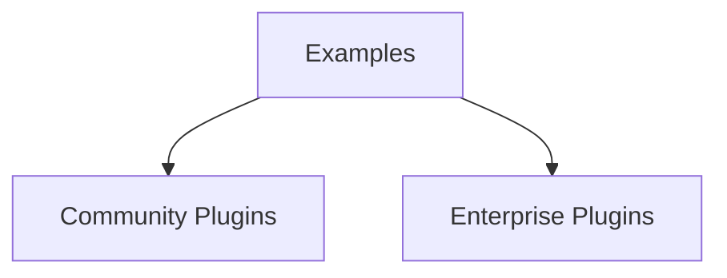

## Availability

| Edition   | Deployment Type |
| :------------- | :---------------------- |
| [Community](ai-management/ai-studio/overview#community-edition) & [Enterprise](ai-management/ai-studio/overview#enterprise-edition) | Self-Managed, Hybrid |



Comprehensive reference of working plugin examples in the Tyk AI Studio repository. All examples use the **Unified Plugin SDK** (`pkg/plugin_sdk`) and demonstrate real-world patterns for different plugin capabilities.

## Production-Ready Plugins

The following plugins in `community/plugins/` and `enterprise/plugins/` are **production-tested** and serve as the best reference implementations:

### Community Plugins

#### LLM Cache

**Path**: [`community/plugins/llm-cache/`](https://github.com/TykTechnologies/ai-studio/tree/main/community/plugins/llm-cache)

**Capabilities**: PostAuth, Response, StreamComplete, UI, RPC, EdgePayloadReceiver, SessionAware, Config

**Description**: Semantic caching for LLM responses using request hash matching. Reduces costs and latency by returning cached responses for similar prompts.

**Key Features**:
- Request hashing for cache key generation
- Streaming response caching
- Edge-to-control cache synchronization
- WebComponent UI for cache management
- KV storage for cache state
- Session-aware broker connection warmup

**Why Use This Example**:
- **Best example of multi-capability plugin** - Shows how to combine 8 different capabilities
- **Edge-to-control pattern** - Demonstrates hub-and-spoke communication
- **SessionAware warmup** - Critical pattern for Service API access

**Complexity**: Advanced

---

#### LLM Firewall

**Path**: [`community/plugins/llm-firewall/`](https://github.com/TykTechnologies/ai-studio/tree/main/community/plugins/llm-firewall)

**Capabilities**: PreAuth, PostAuth, Config

**Description**: Content filtering for LLM prompts using configurable phrase/pattern matching. Blocks requests containing disallowed content.

**Key Features**:
- Regex and literal phrase matching
- Per-model rule configuration
- Multi-vendor content extraction (OpenAI, Anthropic, Google AI, Vertex)
- Configurable block messages
- Case-sensitive/insensitive matching

**Why Use This Example**:
- **Best example of content filtering** - Clean implementation of request inspection
- **Multi-vendor support** - Shows how to handle different LLM formats
- **Configuration-driven rules** - JSON schema for rule management

**Complexity**: Intermediate

---

#### GitHub RAG Ingest

**Path**: [`community/plugins/github-rag-ingest/`](https://github.com/TykTechnologies/ai-studio/tree/main/community/plugins/github-rag-ingest)

**Capabilities**: UI, RPC, Scheduler, SessionAware

**Description**: Scheduled ingestion of GitHub repository content for RAG (Retrieval-Augmented Generation). Indexes code, docs, and issues.

**Key Features**:
- Cron-based scheduled execution
- GitHub API integration
- Custom UI for ingest configuration
- RPC methods for manual triggers
- Session-aware initialization

**Why Use This Example**:
- **Best example of scheduled data ingestion** - Complete Scheduler implementation
- **UI + backend integration** - Shows RPC pattern for UI communication
- **External API integration** - GitHub API usage patterns

**Complexity**: Advanced

---

### Enterprise Plugins

> **Note**: Enterprise plugins require a valid license.

#### LLM Load Balancer

**Path**: [`enterprise/plugins/llm-load-balancer/`](https://github.com/TykTechnologies/ai-studio/tree/main/enterprise/plugins/llm-load-balancer)

**Capabilities**: PostAuth, Response, UI

**Description**: Intelligent request distribution across multiple LLM backends with health checking and failover.

**Complexity**: Advanced

---

#### Advanced LLM Cache

**Path**: [`enterprise/plugins/advanced-llm-cache/`](https://github.com/TykTechnologies/ai-studio/tree/main/enterprise/plugins/advanced-llm-cache)

**Capabilities**: PostAuth, Response, UI

**Description**: Extended caching with semantic similarity matching, cache invalidation policies, and advanced analytics. Extends the community LLM Cache.

**Complexity**: Advanced

---

## Example Plugins

The following examples in `examples/plugins/` demonstrate specific patterns and are useful for learning:

## AI Studio Plugins

### Echo Agent

**Path**: [`examples/plugins/studio/echo-agent/`](https://github.com/TykTechnologies/ai-studio/tree/main/examples/plugins/studio/echo-agent)

**Capabilities**: Agent

> **Experimental**: Agent plugins are currently experimental. See [Agent Plugins Guide](/ai-management/ai-studio/plugins/studio-agent) for full documentation.

**Description**: Simple conversational agent that wraps LLM responses with custom prefix/suffix formatting. Demonstrates basic agent implementation with streaming responses and LLM integration.

**Architecture**: Agent plugins follow the **Plugin → Agent Object → App Object** pattern:
- **Plugin**: Implements `HandleAgentMessage` for conversations (long-running gRPC)
- **Agent Object**: Binds the plugin to an App with configuration and group access
- **App Object**: Provides LLM access, tools, datasources, and budget control

**Key Features**:
- Streaming server-side responses via gRPC
- LLM integration via `ai_studio_sdk.CallLLM()`
- Per-agent configuration (prefix, suffix, metadata)
- Fallback echo mode when no LLM available
- JSON schema configuration
- SessionAware warmup for Service API connection

**Use Cases**:
- Learning agent plugin basics
- Response formatting and wrapping
- Custom agent configuration
- Reference implementation for agent architecture

**Complexity**: Beginner

---

### LLM Validator

**Path**: [`examples/plugins/studio/llm-validator/`](https://github.com/TykTechnologies/ai-studio/tree/main/examples/plugins/studio/llm-validator)

**Capabilities**: Object Hooks (before_create, before_update)

**Description**: Validates LLM configurations before they're saved to the database. Enforces HTTPS endpoints, blocks specific vendors, validates privacy scores, and requires descriptions.

**Key Features**:
- Object hook registration for LLM objects
- `before_create` and `before_update` hooks
- Configurable validation rules
- Block operations with rejection reasons
- Add validation metadata to approved objects
- Priority ordering (runs early in chain)

**Use Cases**:
- Enforcing security policies (HTTPS-only endpoints)
- Vendor compliance and blocking
- Privacy score validation
- Required field enforcement

**Complexity**: Intermediate

---

### LLM Rate Limiter (Multi-Phase)

**Path**: [`examples/plugins/studio/llm-rate-limiter-multiphase/`](https://github.com/TykTechnologies/ai-studio/tree/main/examples/plugins/studio/llm-rate-limiter-multiphase)

**Capabilities**: PostAuth, Response, UI Provider

**Description**: Comprehensive example showing a **multi-capability plugin** that implements rate limiting across the entire request/response lifecycle with a custom UI dashboard.

**Key Features**:
- **PostAuth**: Check rate limits before proxying to LLM
- **Response**: Update counters after successful response
- **UI Provider**: Custom dashboard showing rate limit status
- KV storage for rate limit state
- Per-app and per-user rate limiting
- WebComponent-based UI
- Custom RPC methods for UI interaction

**Use Cases**:
- Advanced rate limiting beyond built-in budget controls
- Multi-phase request processing
- Building plugins with custom UIs
- Stateful plugin logic with KV storage

**Complexity**: Advanced

---

### Hook Test Plugin

**Path**: [`examples/plugins/studio/hook-test-plugin/`](https://github.com/TykTechnologies/ai-studio/tree/main/examples/plugins/studio/hook-test-plugin)

**Capabilities**: Object Hooks (all types)

**Description**: Comprehensive testing plugin demonstrating all object hook types (before/after create/update/delete) for all supported objects (llm, datasource, tool, user).

**Key Features**:
- Registers hooks for all 4 object types
- Demonstrates all 6 hook types per object
- Shows blocking vs non-blocking hooks
- Metadata enrichment patterns
- Priority ordering examples
- Extensive logging for debugging

**Use Cases**:
- Learning object hook patterns
- Testing hook behavior
- Understanding hook execution order
- Reference implementation for all hooks

**Complexity**: Intermediate

---

### Service API Test

**Path**: [`examples/plugins/studio/service-api-test/`](https://github.com/TykTechnologies/ai-studio/tree/main/examples/plugins/studio/service-api-test)

**Capabilities**: PostAuth (for testing purposes)

**Description**: Comprehensive test plugin demonstrating all Studio Service API operations including LLMs, Tools, Apps, Datasources, Filters, Tags, and Plugins management.

**Key Features**:
- Complete Studio Services API coverage
- CRUD operations for all object types
- Broker ID initialization
- Error handling patterns
- Service API authentication

**Use Cases**:
- Learning Service API usage
- Testing Service API operations
- Reference for API method signatures
- Understanding broker connection setup

**Complexity**: Advanced

---

### Custom Auth UI

**Path**: [`examples/plugins/studio/custom-auth-ui/`](https://github.com/TykTechnologies/ai-studio/tree/main/examples/plugins/studio/custom-auth-ui)

**Capabilities**: UI Provider, Auth

**Description**: UI plugin with custom authentication extension. Shows how to add custom pages, sidebars, and authentication flows to the AI Studio dashboard.

**Key Features**:
- Custom sidebar integration
- Route registration
- WebComponent implementation
- Asset serving (JS/CSS bundles)
- Custom authentication integration

**Use Cases**:
- Extending dashboard UI
- Custom authentication flows
- Adding new admin pages
- WebComponent integration

**Complexity**: Advanced

---

### Portal Feedback

**Path**: [`examples/plugins/studio/portal-feedback/`](https://github.com/TykTechnologies/ai-studio/tree/main/examples/plugins/studio/portal-feedback)

**Capabilities**: UI Provider, Portal UI Provider

**Description**: Example plugin demonstrating portal UI with user feedback form. Shows how to build pages visible to end-users in the AI Portal alongside an admin dashboard for managing submissions.

**Key Features**:
- Portal sidebar integration with group-based visibility
- Portal RPC with authenticated user context (`HandlePortalRPC`)
- Admin RPC for management operations (`HandleRPC`)
- Separate WebComponents for portal and admin UIs
- `waitForAPIAndLoad()` pattern for API injection timing
- Shared asset serving between admin and portal contexts

**Use Cases**:
- Learning portal UI plugin development
- User-facing forms and data collection
- Dual admin/portal plugin architecture
- Portal RPC with user context

**Complexity**: Beginner

---

## Gateway Plugins

### Custom Echo Endpoint

**Path**: [`examples/plugins/gateway/custom-echo-endpoint/`](https://github.com/TykTechnologies/ai-studio/tree/main/examples/plugins/gateway/custom-echo-endpoint)

**Capabilities**: CustomEndpointHandler, UIProvider, ConfigProvider

**Description**: Demonstrates custom HTTP endpoints on the gateway combined with a Studio admin UI. Registers a catch-all endpoint at `/plugins/custom-echo-endpoint/` that echoes request metadata and user-configured content.

**Key Features**:
- CustomEndpointHandler with `/*` catch-all registration
- Full request metadata echo (method, path, headers, query, body, path_segments)
- Studio UI (WebComponent) for editing custom content
- Config persistence via `ai_studio_sdk.UpdatePluginConfig()`
- Config sync from Studio → Gateway via gRPC ConfigurationSnapshot
- Manifest with `custom_endpoint` + `studio_ui` hooks

**Use Cases**:
- Learning custom endpoint basics
- Understanding the config sync flow (Studio UI → DB → Gateway)
- Combining CustomEndpointHandler with UIProvider
- Reference implementation for custom endpoints

**Complexity**: Beginner

---

### Request Enricher

**Path**: [`examples/plugins/gateway/request_enricher/`](https://github.com/TykTechnologies/ai-studio/tree/main/examples/plugins/gateway/request_enricher)

**Capabilities**: PostAuth

**Description**: Enriches authenticated requests with additional metadata and instructions before proxying to LLM. Most common gateway plugin pattern.

**Key Features**:
- PostAuth hook implementation
- Header injection
- Request body modification
- Configurable enrichment via plugin config
- Context-aware enrichment (app_id, user_id)

**Use Cases**:
- Adding custom headers
- Injecting additional instructions
- Request metadata enrichment
- Per-app request modification

**Complexity**: Beginner

---

### Response Modifier

**Path**: [`examples/plugins/gateway/response_modifier/`](https://github.com/TykTechnologies/ai-studio/tree/main/examples/plugins/gateway/response_modifier)

**Capabilities**: Response (OnBeforeWriteHeaders, OnBeforeWrite)

**Description**: Modifies LLM responses before returning to client. Demonstrates two-phase response processing (headers then body).

**Key Features**:
- Header modification (OnBeforeWriteHeaders)
- Body transformation (OnBeforeWrite)
- Response filtering
- Content injection
- Streaming response handling

**Use Cases**:
- Content filtering and moderation
- Response formatting
- Adding custom response headers
- Injecting metadata into responses

**Complexity**: Intermediate

---

### Message Modifier

**Path**: [`examples/plugins/gateway/message_modifier/`](https://github.com/TykTechnologies/ai-studio/tree/main/examples/plugins/gateway/message_modifier)

**Capabilities**: PostAuth

**Description**: Similar to request enricher but focuses on modifying the message content specifically for chat/completion requests.

**Key Features**:
- Message content transformation
- Chat-specific request handling
- System message injection
- Context-aware modifications

**Use Cases**:
- Chat message preprocessing
- System prompt injection
- Message format standardization

**Complexity**: Beginner

---

### Elasticsearch Collector

**Path**: [`examples/plugins/gateway/elasticsearch_collector/`](https://github.com/TykTechnologies/ai-studio/tree/main/examples/plugins/gateway/elasticsearch_collector)

**Capabilities**: DataCollector

**Description**: Exports proxy logs, analytics, and budget data to Elasticsearch for external analysis and monitoring.

**Key Features**:
- HandleProxyLog implementation
- HandleAnalytics implementation
- HandleBudgetUsage implementation
- Elasticsearch bulk API integration
- Async export with error handling
- Configurable index names

**Use Cases**:
- Exporting logs to data warehouses
- Real-time analytics pipelines
- External monitoring systems
- Custom dashboards (Kibana, Grafana)

**Complexity**: Advanced

---

### Gateway Service Test

**Path**: [`examples/plugins/gateway/gateway-service-test/`](https://github.com/TykTechnologies/ai-studio/tree/main/examples/plugins/gateway/gateway-service-test)

**Capabilities**: PostAuth (for testing purposes)

**Description**: Demonstrates all Gateway-specific Service API operations including app management, LLM info, budget status, and credential validation.

**Key Features**:
- GetApp, ListApps
- GetLLM, ListLLMs
- GetBudgetStatus
- GetModelPrice
- ValidateCredential
- Runtime detection (Gateway vs Studio)

**Use Cases**:
- Learning Gateway Services API
- Budget-aware request handling
- App configuration access
- Testing Gateway-specific features

**Complexity**: Intermediate

---

### Custom Echo Endpoint

**Path**: [`examples/plugins/gateway/custom-echo-endpoint/`](https://github.com/TykTechnologies/ai-studio/tree/main/examples/plugins/gateway/custom-echo-endpoint)

**Capabilities**: CustomEndpoint, UI, Config

**Description**: Serves a custom HTTP endpoint on the gateway that echoes back request metadata alongside user-configured custom content. Includes a Studio admin UI for editing the content.

**Key Features**:
- Custom endpoint registration (catch-all `/*`)
- Request metadata echo (method, path, headers, query, body)
- Configurable custom content via Studio UI
- Config persistence via `UpdatePluginConfig` Service API
- Config sync from Studio to gateway via gRPC
- WebComponent-based admin UI

**Use Cases**:
- Learning custom endpoint development
- Understanding Studio-to-gateway config flow
- Multi-capability plugin patterns (CustomEndpoint + UI + Config)
- MCP/webhook plugin starting point

**Complexity**: Beginner

---

### File Data Collectors (Unified SDK)

**Path**: [`examples/plugins/unified/data-collectors/`](https://github.com/TykTechnologies/ai-studio/tree/main/examples/plugins/unified/data-collectors)

**Capabilities**: DataCollector

**Examples**:
- `file-proxy-collector/` - Exports proxy logs to JSONL files
- `file-analytics-collector/` - Exports analytics to CSV or JSONL files
- `file-budget-collector/` - Exports budget data to CSV or JSONL files with optional aggregation

**Description**: Simple file-based data collectors for testing and local development. Write telemetry data (proxy logs, analytics, budget usage) to files instead of or in addition to the database.

**Features**:
- Multiple output formats (CSV, JSONL)
- Daily log rotation
- Optional aggregate summaries (budget collector)
- Configurable output directories
- Environment variable support
- Replace or supplement database storage

**Use Cases**:
- Local development and debugging
- Understanding DataCollector interface
- Simple log export without external dependencies
- Custom analytics pipelines
- Reduced database load in high-throughput scenarios
- Backup and archival of telemetry data

**Configuration Example**:
```yaml
data_collection_plugins:
  - name: "analytics-files"
    path: "./examples/plugins/unified/data-collectors/file-analytics-collector/file_analytics_collector"
    enabled: true
    priority: 200
    replace_database: false
    hook_types:
      - "analytics"
    config:
      output_directory: "./data/collected/analytics"
      enabled: "true"
      format: "jsonl"  # or "csv"
```

**Complexity**: Beginner

**Migration Status**: ✅ Migrated to unified SDK. Old examples remain available at [`examples/plugins/gateway/file_*_collector/`](https://github.com/TykTechnologies/ai-studio/tree/main/examples/plugins/gateway) for reference.

---

## Example Organization

### By Capability

| Capability | Examples |
|------------|----------|
| **Agent** | echo-agent |
| **Object Hooks** | llm-validator, hook-test-plugin |
| **PreAuth** | **llm-firewall** ★ |
| **PostAuth** | **llm-cache** ★, **llm-firewall** ★, request_enricher, message_modifier, service-api-test, gateway-service-test |
| **Response** | **llm-cache** ★, response_modifier, llm-rate-limiter-multiphase |
| **DataCollector** | elasticsearch_collector, file-analytics-collector, file-budget-collector, file-proxy-collector |
| **UI Provider** | **llm-cache** ★, **llm-firewall** ★, llm-rate-limiter-multiphase, custom-auth-ui, portal-feedback |
| **Portal UI** | portal-feedback |
| **Scheduler** | **github-rag-ingest** ★ |
| **EdgePayloadReceiver** | **llm-cache** ★ |
| **Custom Endpoints** | custom-echo-endpoint |
| **Multi-Capability** | **llm-cache** ★ (8 capabilities), llm-rate-limiter-multiphase (PostAuth + Response + UI), custom-echo-endpoint (CustomEndpoint + UI + Config) |

★ = Production-ready community/enterprise plugins (recommended as reference)

### By Runtime

| Runtime | Examples |
|---------|----------|
| **Studio Only** | echo-agent, llm-validator, hook-test-plugin, llm-rate-limiter-multiphase, custom-auth-ui, portal-feedback, service-api-test |
| **Gateway Only** | request_enricher, response_modifier, message_modifier, elasticsearch_collector, gateway-service-test, file-analytics-collector, file-budget-collector, file-proxy-collector |
| **Both** | custom-echo-endpoint (UI in Studio + CustomEndpoint on Gateway) |

### By Complexity

| Level | Examples |
|-------|----------|
| **Beginner** | echo-agent, portal-feedback, request_enricher, message_modifier, custom-echo-endpoint, file-analytics-collector, file-budget-collector, file-proxy-collector |
| **Intermediate** | llm-validator, hook-test-plugin, response_modifier, gateway-service-test |
| **Advanced** | llm-rate-limiter-multiphase, service-api-test, elasticsearch_collector, custom-auth-ui |

## Running Examples

### Build an Example

```bash
cd examples/plugins/studio/echo-agent
go build -o echo-agent server/main.go
```

### Deploy to AI Studio

```bash
# Create plugin
curl -X POST http://localhost:3000/api/v1/plugins \
  -H "Authorization: Bearer $TOKEN" \
  -d '{
    "name": "Echo Agent",
    "slug": "echo-agent",
    "command": "file:///path/to/echo-agent",
    "hook_type": "agent",
    "plugin_type": "agent",
    "is_active": true
  }'
```

### Deploy to Gateway

Configure in gateway config:

```yaml
plugins:
  - name: request-enricher
    command: file:///path/to/request-enricher
    enabled: true
```

## Common Patterns

### 1. Basic Plugin Structure

All examples follow this pattern:

```go Expandable
import "github.com/TykTechnologies/midsommar/v2/pkg/plugin_sdk"

type MyPlugin struct {
    plugin_sdk.BasePlugin
}

func NewMyPlugin() *MyPlugin {
    return &MyPlugin{
        BasePlugin: plugin_sdk.NewBasePlugin("name", "version", "desc"),
    }
}

func main() {
    plugin_sdk.Serve(NewMyPlugin())
}
```

### 2. Configuration Handling

```go
func (p *MyPlugin) Initialize(ctx plugin_sdk.Context, config map[string]string) error {
    // Parse plugin-specific config
    p.apiKey = config["api_key"]

    // Extract broker ID for Service API access (Studio plugins)
    if brokerIDStr, ok := config["_service_broker_id"]; ok {
        var brokerID uint32
        fmt.Sscanf(brokerIDStr, "%d", &brokerID)
        ai_studio_sdk.SetServiceBrokerID(brokerID)
    }

    return nil
}
```

### 3. Universal Services

```go
func (p *MyPlugin) HandlePostAuth(ctx plugin_sdk.Context, req *pb.EnrichedRequest) (*pb.PluginResponse, error) {
    // Logging
    ctx.Services.Logger().Info("Processing", "app_id", ctx.AppID)

    // KV storage
    data, _ := ctx.Services.KV().Read(ctx, "key")
    ctx.Services.KV().Write(ctx, "key", []byte("value"))

    return &pb.PluginResponse{Modified: false}, nil
}
```

### 4. Runtime Detection

```go
if ctx.Runtime == plugin_sdk.RuntimeStudio {
    // Studio-specific code
    llms, _ := ctx.Services.Studio().ListLLMs(ctx, 1, 10)
} else if ctx.Runtime == plugin_sdk.RuntimeGateway {
    // Gateway-specific code
    app, _ := ctx.Services.Gateway().GetApp(ctx, ctx.AppID)
}
```

