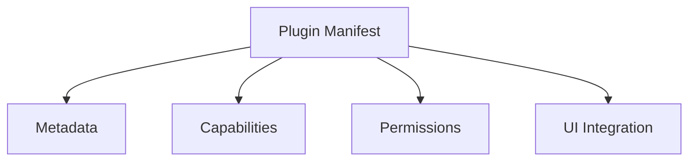

## Availability

| Edition   | Deployment Type |
| :------------- | :---------------------- |
| [Community](/ai-management/ai-studio/overview#community-edition) & [Enterprise](/ai-management/ai-studio/overview#enterprise-edition) | Self-Managed, Hybrid |




Plugin manifests define plugin metadata, capabilities, permissions, and UI integration. Understanding manifests is essential for building secure, well-integrated plugins.

## Manifest Structure

### Edge Gateway Plugins

Edge Gateway plugins don't use JSON manifests. Configuration is provided via the API when creating the plugin:

```json expandable
{
  "name": "Custom Auth Plugin",
  "slug": "custom-auth",
  "description": "Custom authentication logic",
  "command": "file:///path/to/plugin",
  "hook_type": "auth",
  "plugin_type": "gateway",
  "config": {
    "valid_token": "secret123"
  },
  "is_active": true
}
```

Hook types for Edge Gateway plugins:
- `pre_auth` - Before authentication
- `auth` - Custom authentication
- `post_auth` - After authentication
- `on_response` - Response modification
- `data_collection` - Data export

### AI Studio UI Plugins

Complete manifest structure for UI plugins:

```json Expandable expandable
{
  "id": "com.example.plugin",
  "name": "My Plugin",
  "version": "1.0.0",
  "description": "Plugin description",
  "plugin_type": "ai_studio",
  "permissions": {
    "services": [
      "llms.read",
      "llms.write",
      "llms.proxy",
      "tools.read",
      "tools.execute",
      "tools.write",
      "datasources.read",
      "datasources.query",
      "apps.read",
      "apps.write",
      "plugins.read",
      "analytics.read",
      "kv.read",
      "kv.readwrite"
    ]
  },
  "ui": {
    "slots": [
      {
        "slot": "sidebar.section",
        "label": "My Plugin",
        "icon": "/assets/icon.svg",
        "items": [
          {
            "type": "route",
            "path": "/admin/my-plugin",
            "title": "Dashboard",
            "mount": {
              "kind": "webc",
              "tag": "my-plugin-dashboard",
              "entry": "/ui/webc/dashboard.js",
              "props": {
                "apiBase": "/plugin/com.example.plugin/rpc"
              }
            }
          }
        ]
      }
    ]
  },
  "rpc": {
    "basePath": "/plugin/com.example.plugin/rpc"
  },
  "assets": [
    "/assets/icon.svg",
    "/ui/webc/dashboard.js"
  ],
  "compat": {
    "app": ">=2.6 <3.0",
    "api": ["ui-v1", "kv-v1", "rpc-v1"]
  },
  "security": {
    "csp": "script-src 'self'; object-src 'none'"
  }
}
```

### AI Studio Agent Plugins

Agent plugin manifests are simpler (no UI):

```json Expandable expandable
{
  "id": "com.example.agent",
  "name": "My Agent",
  "version": "1.0.0",
  "description": "Custom conversational agent",
  "plugin_type": "agent",
  "permissions": {
    "services": [
      "llms.proxy",
      "tools.execute",
      "datasources.query",
      "kv.readwrite"
    ]
  },
  "ui": {
    "slots": []
  }
}
```

### Object Hooks Plugins

Object hooks plugins intercept CRUD operations on platform objects. These plugins use the unified SDK and register hooks programmatically, so the manifest doesn't need special hook configuration.

#### Basic Object Hooks Manifest

```json Expandable expandable
{
  "id": "com.example.validator",
  "name": "LLM Validator",
  "version": "1.0.0",
  "description": "Validates LLM configurations before saving",
  "plugin_type": "ai_studio",
  "permissions": {
    "services": [
      "llms.read",
      "kv.readwrite"
    ]
  },
  "ui": {
    "slots": []
  }
}
```

**Note**: Object hooks are registered via the `GetObjectHookRegistrations()` method in the plugin code, not in the manifest. The plugin_type is `"ai_studio"` since object hooks are Studio-only.

#### Hook Registration (Code, Not Manifest)

Object hooks are registered programmatically:

```go Expandable expandable
func (p *ValidatorPlugin) GetObjectHookRegistrations() ([]*pb.ObjectHookRegistration, error) {
    return []*pb.ObjectHookRegistration{
        {
            ObjectType: "llm",               // llm, datasource, tool, user
            HookTypes:  []string{            // before_create, after_create, etc.
                "before_create",
                "before_update",
            },
            Priority: 10,                    // Lower runs first
        },
        {
            ObjectType: "datasource",
            HookTypes:  []string{"before_create"},
            Priority:   5,                   // Runs before priority 10
        },
    }, nil
}
```

**Supported Objects**:
- `llm` - LLM provider configurations
- `datasource` - Data source connections
- `tool` - External tool definitions
- `user` - User accounts

**Supported Hook Types** (per object):
- `before_create` - Before object creation (can block)
- `after_create` - After object creation (notification only)
- `before_update` - Before object update (can block)
- `after_update` - After object update (notification only)
- `before_delete` - Before object deletion (can block)
- `after_delete` - After object deletion (notification only)

**Priority**: Lower numbers run first (e.g., priority 5 runs before priority 10). Use priority to control hook execution order when multiple plugins register hooks for the same object/event.

#### Multi-Capability with Hooks

Object hooks plugins can combine hooks with UI:

```json Expandable expandable
{
  "id": "com.example.approval-system",
  "name": "Approval System",
  "version": "1.0.0",
  "description": "Requires approval for datasource creation",
  "plugin_type": "ai_studio",
  "permissions": {
    "services": [
      "datasources.read",
      "kv.readwrite"
    ]
  },
  "ui": {
    "slots": [
      {
        "slot": "sidebar.section",
        "label": "Approvals",
        "items": [
          {
            "type": "route",
            "path": "/admin/approvals",
            "title": "Pending Approvals",
            "mount": {
              "kind": "webc",
              "tag": "approval-dashboard",
              "entry": "/ui/webc/approvals.js"
            }
          }
        ]
      }
    ]
  },
  "rpc": {
    "basePath": "/plugin/com.example.approval-system/rpc"
  }
}
```

This plugin would:
1. Register `before_create` hooks for datasources (via code)
2. Block creation and add to pending approvals
3. Provide UI dashboard to approve/reject
4. Use RPC methods for approval actions

See `examples/plugins/studio/llm-validator/` and `examples/plugins/studio/hook-test-plugin/` for complete examples.

### Resource Provider Plugins

Resource Provider plugins register custom resource types that integrate into the App creation flow. Declare resource types in the manifest's `resource_types` section:

```json Expandable expandable
{
  "id": "com.example.mcp-registry",
  "name": "MCP Registry",
  "version": "1.0.0",
  "description": "Manages MCP server resources",
  "capabilities": {
    "hooks": ["resource_provider", "studio_ui"]
  },
  "resource_types": [
    {
      "slug": "mcp_servers",
      "name": "MCP Servers",
      "description": "Model Context Protocol servers",
      "icon": "Hub",
      "has_privacy_score": true,
      "supports_submissions": true,
      "access_granted_via_app": true,
      "form_component": {
        "tag": "mcp-server-selector",
        "entry_point": "ui/webc/mcp-selector.js"
      }
    }
  ],
  "permissions": {
    "services": ["apps.read", "kv.readwrite"]
  }
}
```

Resource types declared in the manifest are automatically registered when the plugin loads. The plugin also implements `ResourceProvider` methods programmatically for runtime behavior.

| Field | Required | Description |
|-------|:---:|-------------|
| `slug` | Yes | Machine-readable identifier, unique per plugin |
| `name` | Yes | Display name shown in the App form |
| `has_privacy_score` | No | Whether instances carry privacy scores (default: `false`) |
| `supports_submissions` | No | Whether community users can submit instances (default: `false`) |
| `supports_metadata` | No | Whether instances can have [governed metadata](/ai-management/ai-studio/governed-metadata) (Enterprise Edition). Registers the object type `plugin_resource:<plugin_id>:<slug>` (default: `false`). |
| `submission_schema` | No | JSON Schema (`"type": "object"`) for community submissions, as an object or a JSON string. AI Studio uses it for the AI Portal submission form and for validation. |
| `access_granted_via_app` | No | Whether an App credential gives access to instances of this type. Only these types appear in the App forms, show **Build app** in the AI Portal, and go to the gateway snapshot. If you leave it out, the value is `true` when the plugin hooks include `resource_provider` and `custom_endpoint`, and `false` if not. |
| `portal_detail_path` | No | A same-origin path template to the AI Portal page of an instance. AI Studio replaces `{id}` with the escaped instance ID, for example `/portal/plugins/asset-catalog#/assets/{id}`. |
| `default_access` | No | `auto` (default): AI Studio grants active instances to the Default Team. `explicit` (Enterprise Edition, v2.2.1 and later): instances reach only the Teams that they are granted to. |
| `form_component` | No | Custom Web Component for the App form selector |

To register types that are known only at runtime, use `plugin_sdk.SyncResourceTypes`. This needs the `resource-types.manage` scope.

See [Resource Provider Plugins](/ai-management/ai-studio/plugins/resource-types) for the full guide.

## Service Scopes Reference

### LLM Scopes

| Scope | Description | Operations |
|-------|-------------|------------|
| `llms.read` | Read LLM configurations | List LLMs, Get LLM details, Get LLM counts |
| `llms.write` | Create/update LLMs | Create LLM, Update LLM, Delete LLM |
| `llms.proxy` | Call LLMs via proxy | CallLLM (streaming/non-streaming) |

### Tool Scopes

| Scope | Description | Operations |
|-------|-------------|------------|
| `tools.read` | Read tool configurations | List Tools, Get Tool details |
| `tools.execute` | Execute tools | ExecuteTool with operation and parameters |
| `tools.write` | Create/update tools | Create Tool, Update Tool, Delete Tool |
| `tools.operations` | Manage tool operations | Add/remove operations |

### Datasource Scopes

| Scope | Description | Operations |
|-------|-------------|------------|
| `datasources.read` | Read datasource configurations | List Datasources, Get Datasource details |
| `datasources.query` | Query datasources | QueryDatasource with SQL/query DSL |
| `datasources.write` | Create/update datasources | Create, Update, Delete Datasources |

### App Scopes

| Scope | Description | Operations |
|-------|-------------|------------|
| `apps.read` | Read app configurations | List Apps, Get App details |
| `apps.write` | Create/update apps | Create App, Update App, Delete App, PatchAppMetadata, StoreApp (Gateway) |
| `apps.lifecycle` | Suspend, resume, or flag an App (v2.2.1 and later) | SetAppGovernanceState |

### Plugin Scopes

| Scope | Description | Operations |
|-------|-------------|------------|
| `plugins.read` | Read plugin configurations | List Plugins, Get Plugin details, Get counts |
| `plugins.write` | Create/update plugins | Create Plugin, Update Plugin |

### KV Storage Scopes

| Scope | Description | Operations |
|-------|-------------|------------|
| `kv.read` | Read plugin KV storage | ReadPluginKV, ListPluginKVKeys |
| `kv.readwrite` | Read/write plugin KV storage | Read + WritePluginKV, DeletePluginKV |

### Analytics Scopes

| Scope | Description | Operations |
|-------|-------------|------------|
| `analytics.read` | Read analytics data | GetUsageStats, GetCostAnalytics |
| `analytics.write` | Write analytics data | RecordCustomMetric |

### Pricing Scopes

| Scope | Description | Operations |
|-------|-------------|------------|
| `pricing.read` | Read model prices | ListModelPrices, GetModelPricesByVendor |

### Notification Scopes

| Scope | Description | Operations |
|-------|-------------|------------|
| `notifications.write` | Create in-app notifications for administrators or a user | CreateNotification |

### Resource Type Scopes

| Scope | Description | Operations |
|-------|-------------|------------|
| `resource-types.manage` | Register or deactivate the plugin's own resource types at runtime | RegisterResourceTypes, SyncResourceTypes |
| `resource-access.manage` | Manage the Team grants of the plugin's own resource instances (v2.2.1 and later) | ListGroups, GetResourceInstanceGroups, SetResourceInstanceGroups, ListAccessibleResourceInstances |

### RBAC Scopes

| Scope | Description | Operations |
|-------|-------------|------------|
| `rbac.register` | Register the plugin's own permission resources (rows in the role editor) at runtime | RegisterPermissionResources |

### Governance Scopes (Enterprise)

| Scope | Description | Operations |
|-------|-------------|------------|
| `metadata.read` | Read and validate governed metadata | GetObjectMetadata, GetResolvedMetadataSchema, ValidateObjectMetadata, ListObjectMetadataAudit |
| `metadata.write` | Write and delete governed metadata | SetObjectMetadata, DeleteObjectMetadata |
| `audit.read` | Read the audit records of a resource (v2.2.1 and later) | ListAuditRecords |
| `mcp-servers.read` | Read MCP servers, without upstream URLs or auth details (v2.2.1 and later) | ListMCPServers, GetMCPServer |
| `routers.read` | Read Model Routers and Semantic Routers (v2.2.1 and later) | ListModelRouters, GetModelRouter, ListSemanticRouters, GetSemanticRouter |

## Permissions (RBAC) Block

From v2.2.0, administrators assign roles that are built from a permission catalog. Every plugin that declares `studio_ui`, `portal_ui`, or `resource_provider` adds one resource, `plugin:<manifest id>`, with three actions:

- `read`: Open the plugin pages and configuration.
- `write`: Call the admin RPC methods of the plugin, and edit its configuration.
- `execute`

Users with the platform permission `plugins:execute` have every plugin permission. Administrators can give a role access to one plugin with a grant for that plugin. The optional `rbac` block adds more detail:

```json expandable
"rbac": {
  "sensitive": false,
  "resources": [
    {"key": "asset-types", "label": "Asset types", "description": "Define asset classes", "actions": ["read", "write", "delete"]},
    {"key": "assets", "label": "Assets", "actions": ["read", "write", "delete", "publish"]}
  ],
  "rpc_methods": {
    "admin_list_types": "asset-types:read",
    "admin_upsert_type": "asset-types:write",
    "admin_release_asset": "assets:publish",
    "admin_stats": "read"
  }
}
```

| Field | Notes |
| :--- | :--- |
| `sensitive` | Removes the plugin `read` permission from the read-only system roles (Viewer and Auditor). |
| `resources[]` | Sub-resources that the role editor shows under the plugin, as `plugin:<manifest id>:<key>`. `key` is kebab-case and unique in the plugin. `actions` is a subset of `read`, `write`, `delete`, `execute`, and `publish`, with `read` first. |
| `rpc_methods` | The permission that each admin RPC method (`POST /api/v1/plugins/:id/rpc/<method>`) needs. AI Studio checks it before the call reaches the plugin. `read`, `write`, and `execute` refer to the base resource of the plugin. `<key>:<action>` refers to a declared sub-resource. A platform permission, such as `plugins:execute`, is used without changes. Methods that are not in the list need the base `write` permission. |

- To set the permission for a page, add `required_permission` to its mount, for example `"mount": {"kind": "webc", "tag": "...", "entry": "...", "required_permission": "asset-types:read"}`. The default is the base `read` permission of the plugin.
- To add resources that exist only at runtime, use [RegisterPermissionResources](/ai-management/ai-studio/plugins/service-api#permission-resources-runtime) with the `rbac.register` scope. In plugin code, check the caller with `userCtx.Can("<key>:<action>")`.
- Roles do not control AI Portal RPC (`/common/plugins/:id/portal-rpc/...`). AI Portal users have no roles.

## UI Slot System

### Available Slots

#### sidebar.section

Add a collapsible section to the sidebar with nested items:

```json Expandable expandable
{
  "slot": "sidebar.section",
  "label": "My Plugin",
  "icon": "/assets/icon.svg",
  "items": [
    {
      "type": "route",
      "path": "/admin/my-plugin/dashboard",
      "title": "Dashboard",
      "mount": { }
    },
    {
      "type": "route",
      "path": "/admin/my-plugin/settings",
      "title": "Settings",
      "mount": { }
    }
  ]
}
```

A route item with `"hidden": true` is mounted and you can open it by URL, but the sidebar does not show it. Use hidden routes for pages that open from another page, such as a detail or editor view (`/admin/my-plugin/item#/items/42`). Hidden routes use the same permission rules as other routes. AI Portal routes match the path exactly, so put the item ID in the hash, not in the path.

```json
{
  "type": "route",
  "path": "/admin/my-plugin/item",
  "title": "Item",
  "hidden": true,
  "mount": { }
}
```

#### sidebar.link

Add a single link to the sidebar:

```json
{
  "slot": "sidebar.link",
  "label": "Quick Action",
  "icon": "/assets/icon.svg",
  "path": "/admin/quick-action"
}
```

#### settings.section

Add a section to the Settings page:

```json
{
  "slot": "settings.section",
  "label": "Plugin Settings",
  "path": "/admin/settings/plugin",
  "mount": {
    "kind": "webc",
    "tag": "plugin-settings",
    "entry": "/ui/webc/settings.js"
  }
}
```

#### app.detail.tab

Add a tab to App detail pages:

```json expandable
{
  "slot": "app.detail.tab",
  "label": "Custom View",
  "mount": {
    "kind": "webc",
    "tag": "app-custom-view",
    "entry": "/ui/webc/app-view.js",
    "props": {
      "appId": "{{app.id}}"
    }
  }
}
```

#### llm.detail.tab

Add a tab to LLM detail pages:

```json expandable
{
  "slot": "llm.detail.tab",
  "label": "Analytics",
  "mount": {
    "kind": "webc",
    "tag": "llm-analytics",
    "entry": "/ui/webc/llm-analytics.js",
    "props": {
      "llmId": "{{llm.id}}"
    }
  }
}
```

### Mount Configuration

#### WebComponent Mount

```json
{
  "kind": "webc",
  "tag": "my-component",
  "entry": "/ui/webc/component.js",
  "props": {
    "apiBase": "/plugin/com.example/rpc",
    "theme": "dark"
  }
}
```

- `kind`: Must be `"webc"` for WebComponents
- `tag`: Custom element tag name
- `entry`: Path to JavaScript file (relative to plugin)
- `props`: Properties passed to the component

## Permission Validation

Permissions are validated when plugins call the Service API:

```go
// This call requires "llms.read" scope
llmsResp, err := ai_studio_sdk.ListLLMs(ctx, 1, 10)
if err != nil {
    // Error: insufficient permissions
    log.Printf("Permission denied: %v", err)
}
```

If your plugin doesn't declare the required scope in its manifest, Service API calls will fail with permission errors.

## Configuration Schema

Plugins can provide JSON Schema for their configuration:

```go Expandable expandable
func (p *MyPlugin) GetConfigSchema() ([]byte, error) {
    schema := map[string]interface{}{
        "$schema": "http://json-schema.org/draft-07/schema#",
        "type":    "object",
        "title":   "My Plugin Configuration",
        "properties": map[string]interface{}{
            "api_key": map[string]interface{}{
                "type":        "string",
                "description": "API key for external service",
                "minLength":   1,
            },
            "endpoint": map[string]interface{}{
                "type":        "string",
                "format":      "uri",
                "description": "Service endpoint URL",
                "default":     "https://api.example.com",
            },
            "rate_limit": map[string]interface{}{
                "type":        "integer",
                "description": "Requests per minute",
                "minimum":     1,
                "maximum":     1000,
                "default":     100,
            },
            "enabled": map[string]interface{}{
                "type":        "boolean",
                "description": "Enable plugin",
                "default":     true,
            },
        },
        "required": []string{"api_key"},
    }

    return json.Marshal(schema)
}
```

The platform uses this schema to:
- Validate configuration on save
- Generate UI forms
- Provide inline documentation
- Set default values

## Security Best Practices

### Principle of Least Privilege

Only request scopes your plugin actually needs:

```json
{
  "permissions": {
    "services": [
      "llms.read",      // ✅ Need to list LLMs
      "kv.readwrite"    // ✅ Need to store settings
      // ❌ Don't add "llms.write" if not creating LLMs
      // ❌ Don't add "llms.proxy" if not calling LLMs
    ]
  }
}
```

### Content Security Policy

Define CSP headers for UI plugins:

```json
{
  "security": {
    "csp": "default-src 'self'; script-src 'self'; style-src 'self' 'unsafe-inline'; img-src 'self' data: https:; connect-src 'self' https://api.example.com; object-src 'none'; frame-ancestors 'none'"
  }
}
```

### Input Validation

Always validate inputs in RPC methods:

```go Expandable expandable
func (p *MyPlugin) HandleCall(method string, payload []byte) ([]byte, error) {
    // Validate method
    allowedMethods := map[string]bool{
        "get_data":    true,
        "save_config": true,
    }

    if !allowedMethods[method] {
        return nil, fmt.Errorf("invalid method: %s", method)
    }

    // Validate payload
    var data map[string]interface{}
    if err := json.Unmarshal(payload, &data); err != nil {
        return nil, fmt.Errorf("invalid payload: %w", err)
    }

    // Additional validation...
    return p.processMethod(method, data)
}
```

### Secrets Management

Never hardcode secrets in manifests or code:

```go expandable
// ❌ Bad: Hardcoded secret
func (p *MyPlugin) OnInitialize(...) error {
    p.apiKey = "secret123"  // Don't do this!
}

// ✅ Good: Configuration from secure storage
func (p *MyPlugin) OnInitialize(...) error {
    // Read from config (stored securely by platform)
    config, _ := ai_studio_sdk.ReadPluginKV(ctx, "config")
    var cfg Config
    json.Unmarshal(config, &cfg)
    p.apiKey = cfg.APIKey
}
```

## Versioning and Compatibility

### Semantic Versioning

Use semantic versioning for plugin versions:

```json
{
  "version": "1.2.3"  // MAJOR.MINOR.PATCH
}
```

- MAJOR: Breaking changes
- MINOR: New features, backward compatible
- PATCH: Bug fixes, backward compatible

### Minimum Versions

Declare the minimum AI Studio and Edge Gateway versions in `compat`:

```json
{
  "compat": {
    "min_studio_version": "2.2.1",
    "min_gateway_version": "1.0.0"
  }
}
```

<Warning>
AI Studio shows `min_studio_version` in the marketplace, but does not enforce it when you install a plugin. A plugin that needs a newer AI Studio version can install on an older version and then fail.
</Warning>

### Compatibility Declaration

Declare platform compatibility:

```json
{
  "compat": {
    "app": ">=2.6 <3.0",
    "api": ["ui-v1", "kv-v1", "rpc-v1"]
  }
}
```

## Testing Manifests

### Validation

Validate your manifest before deployment:

```bash
# Check JSON syntax
cat plugin.manifest.json | jq .

# Validate required fields
jq '.id, .name, .version, .plugin_type' plugin.manifest.json
```

### Common Errors

| Error | Cause | Solution |
|-------|-------|----------|
| "Invalid plugin_type" | Wrong plugin type | Use `"ai_studio"` or `"agent"` |
| "Missing required field" | Missing manifest field | Add `id`, `name`, `version` |
| "Invalid scope" | Unknown service scope | Check scope name spelling |
| "Duplicate UI slot" | Slot registered twice | Remove duplicate slot |
| "Asset not found" | Missing embedded file | Verify `//go:embed` directive |

## Complete Examples

### Minimal UI Plugin

```json Expandable expandable
{
  "id": "com.example.minimal",
  "name": "Minimal Plugin",
  "version": "1.0.0",
  "plugin_type": "ai_studio",
  "permissions": {
    "services": ["kv.readwrite"]
  },
  "ui": {
    "slots": [
      {
        "slot": "sidebar.link",
        "label": "Minimal",
        "path": "/admin/minimal"
      }
    ]
  }
}
```

### Full-Featured UI Plugin

See [plugins-studio-ui.md](/ai-management/ai-studio/plugins/studio-ui) for complete rate-limiting-ui example.

### Minimal Agent Plugin

```json expandable
{
  "id": "com.example.simple-agent",
  "name": "Simple Agent",
  "version": "1.0.0",
  "plugin_type": "agent",
  "permissions": {
    "services": ["llms.proxy"]
  },
  "ui": {
    "slots": []
  }
}
```

### Advanced Agent Plugin

```json Expandable expandable
{
  "id": "com.example.rag-agent",
  "name": "RAG Agent",
  "version": "1.0.0",
  "description": "Agent with retrieval-augmented generation",
  "plugin_type": "agent",
  "permissions": {
    "services": [
      "llms.proxy",
      "datasources.query",
      "tools.execute",
      "kv.readwrite",
      "analytics.read"
    ]
  },
  "ui": {
    "slots": []
  }
}
```

## Governed Metadata Contributions (Enterprise)

From v2.2.0, a plugin can ship controlled vocabularies and metadata schemas. Administrators turn them on in **Governance > Metadata schemas**. AI Studio creates contributed schemas as inactive and advisory, with `source: plugin:<id>`. Administrators can change only `active` and `enforcement`. The manifest owns the structure, and AI Studio updates it each time the plugin loads.

```json expandable
{
  "metadata": {
    "vocabularies": [
      { "slug": "widget_kind", "name": "Widget Kind",
        "terms": [ { "value": "big", "label": "Big" }, { "value": "small", "label": "Small" } ] }
    ],
    "schemas": [
      { "slug": "widget-governance", "name": "Widget Governance",
        "applies_to": ["plugin_resource:self:widgets", "llm"],
        "fields": [
          { "key": "widget_kind", "label": "Widget kind", "type": "vocabulary", "vocabulary_slug": "widget_kind", "required": true, "gateway_visible": true }
        ] }
    ]
  }
}
```

- `applies_to` accepts `llm`, `tool`, `datasource`, `*`, `plugin_resource:<plugin_id>:<slug>`, and `plugin_resource:self:<slug>`. Other values fail manifest validation.
- `plugin_resource:self:<slug>` refers to a resource type of the same plugin, which must have `supports_metadata: true`. AI Studio replaces `self` with the plugin ID when it loads the manifest.
- Field definitions use the same format as the admin API: `key`, `label`, `type`, `required`, `severity`, `vocabulary_slug`, `pattern`, `min`, `max`, `max_length`, `warn_if_past`, `portal_visible`, `gateway_visible`, and `order`.
- AI Studio skips, with a warning, a slug that an administrator or another plugin already owns. It also skips a field key that is already in an active schema for the same object type.
