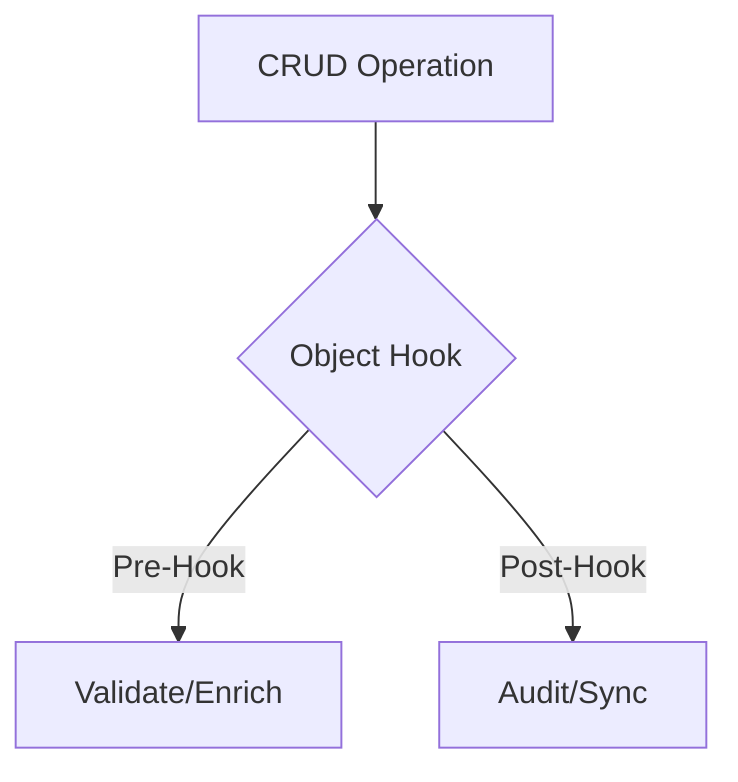

## Availability

| Edition   | Deployment Type |
| :------------- | :---------------------- |
| [Community](/ai-management/ai-studio/overview#community-edition) & [Enterprise](/ai-management/ai-studio/overview#enterprise-edition) | Self-Managed, Hybrid |

# Object Hooks Plugin Guide





Object Hooks are a powerful plugin capability that allows you to **intercept and control CRUD operations** on AI Studio objects before they are saved to the database. This enables validation, enrichment, policy enforcement, and integration with external systems.

## Overview

Object Hooks provide plugins with the ability to:

- **Validate** objects before creation or modification
- **Reject** operations that don't meet requirements
- **Enrich** objects with additional data
- **Enforce policies** (security, compliance, naming conventions)
- **Integrate** with external systems (ticketing, approval workflows)
- **Audit** changes with custom metadata
- **Transform** data before it reaches the database

### Supported Objects

Object Hooks work with four core AI Studio object types:

| Object Type | Description | Common Use Cases |
|-------------|-------------|------------------|
| **llm** | LLM Providers | Validate endpoints, enforce HTTPS, check privacy scores |
| **datasource** | Data Sources | Validate connections, enforce security policies |
| **tool** | External Tools | Validate OpenAPI specs, check endpoints |
| **user** | Users | Enforce naming conventions, integrate with LDAP/AD |

### Hook Types

Each object type supports six hook types that fire at different points in the lifecycle:

| Hook Type | When It Fires | Can Block? | Can Modify Object? | Common Use Cases |
|-----------|---------------|------------|-------------------|------------------|
| **before_create** | Before object creation | Yes | Yes | Validation, default values, policy enforcement |
| **after_create** | After object creation | No | No | Notifications, external system sync, audit logging |
| **before_update** | Before object update | Yes | Yes | Change validation, approval workflows |
| **after_update** | After object update | No | No | Change notifications, audit trails |
| **before_delete** | Before object deletion | Yes | No | Prevent deletion, cleanup checks |
| **after_delete** | After object deletion | No | No | Cleanup external resources, notifications |

**Important Notes:**
- `before_*` hooks can block operations by setting `AllowOperation: false`
- `after_*` hooks are informational only and cannot block operations
- Only `before_create` and `before_update` can modify the object itself
- All hooks can add plugin metadata that is stored with the object

## Implementing Object Hooks

### Step 1: Implement ObjectHookHandler Interface

```go
type ObjectHookHandler interface {
    GetObjectHookRegistrations() ([]*pb.ObjectHookRegistration, error)
    HandleObjectHook(ctx Context, req *pb.ObjectHookRequest) (*pb.ObjectHookResponse, error)
}
```

### Step 2: Register Your Hooks

Declare which object types and hook types your plugin handles:

```go Expandable
func (p *MyPlugin) GetObjectHookRegistrations() ([]*pb.ObjectHookRegistration, error) {
    return []*pb.ObjectHookRegistration{
        {
            ObjectType: "llm",
            HookTypes:  []string{"before_create", "before_update"},
            Priority:   10, // Lower numbers run first
        },
        {
            ObjectType: "datasource",
            HookTypes:  []string{"before_create"},
            Priority:   20,
        },
    }, nil
}
```

**Priority Ordering:**
- Lower priority numbers execute **first** (e.g., priority 10 runs before priority 50)
- Use priorities to control execution order when multiple plugins handle the same hook
- Common priority ranges:
  - `1-10`: Critical validation that should run first
  - `11-49`: Standard validation and policy enforcement
  - `50-89`: Enrichment and transformation
  - `90-99`: Logging and audit (should run last)

### Step 3: Handle Hook Invocations

Process the hook request and return a response:

```go Expandable
func (p *MyPlugin) HandleObjectHook(ctx plugin_sdk.Context, req *pb.ObjectHookRequest) (*pb.ObjectHookResponse, error) {
    // Parse the object
    var obj MyObjectType
    if err := json.Unmarshal([]byte(req.ObjectJson), &obj); err != nil {
        return &pb.ObjectHookResponse{
            AllowOperation:  false,
            RejectionReason: fmt.Sprintf("Invalid object data: %v", err),
        }, nil
    }

    // Perform validation/processing
    if err := validateObject(&obj); err != nil {
        return &pb.ObjectHookResponse{
            AllowOperation:  false,
            RejectionReason: err.Error(),
            Message:         fmt.Sprintf("Validation failed: %v", err),
        }, nil
    }

    // Allow operation with metadata
    return &pb.ObjectHookResponse{
        AllowOperation: true,
        PluginMetadata: map[string]string{
            "validated_by": "my-plugin",
            "validated_at": time.Now().Format(time.RFC3339),
        },
        Message: "Validation passed",
    }, nil
}
```

## Hook Request Structure

The `ObjectHookRequest` provides context about the operation:

```go
type ObjectHookRequest struct {
    ObjectType   string                 // "llm", "datasource", "tool", or "user"
    ObjectID     uint32                 // Object ID (0 for create operations)
    ObjectJson   string                 // JSON representation of the object
    HookType     string                 // e.g., "before_create", "after_update"
    OperationId  string                 // Unique operation identifier
    UserId       uint32                 // User performing the operation
    PreviousJson string                 // Previous state (for updates only)
    Metadata     map[string]string      // Additional context
}
```

**Key Fields:**
- `ObjectJson`: The object being created/updated/deleted (JSON string)
- `PreviousJson`: Previous object state for update operations (compare before/after)
- `ObjectID`: 0 for create operations, actual ID for update/delete
- `OperationId`: Unique ID for correlating logs and debugging

## Hook Response Structure

Your plugin returns an `ObjectHookResponse`:

```go
type ObjectHookResponse struct {
    AllowOperation  bool              // true = allow, false = block (before_* only)
    RejectionReason string            // Error message when blocking
    Modified        bool              // true if ModifiedObjectJson is provided
    ModifiedObjectJson string         // Modified object (before_create/before_update only)
    PluginMetadata  map[string]string // Metadata to store with object
    Message         string            // User-friendly message
}
```

**Response Patterns:**

### 1. Allow Without Changes
```go
return &pb.ObjectHookResponse{
    AllowOperation: true,
    Modified:       false,
}, nil
```

### 2. Allow With Metadata
```go
return &pb.ObjectHookResponse{
    AllowOperation: true,
    PluginMetadata: map[string]string{
        "validated": "true",
        "validator_version": "1.0",
    },
    Message: "Validation passed",
}, nil
```

### 3. Block Operation
```go
return &pb.ObjectHookResponse{
    AllowOperation:  false,
    RejectionReason: "API endpoint must use HTTPS",
    Message:         "Security policy violation",
}, nil
```

### 4. Modify Object (before_create/before_update only)
```go Expandable
// Modify the object
obj.Name = strings.ToUpper(obj.Name)
obj.Metadata["enriched"] = "true"

// Marshal back to JSON
modifiedJSON, _ := json.Marshal(obj)

return &pb.ObjectHookResponse{
    AllowOperation:     true,
    Modified:           true,
    ModifiedObjectJson: string(modifiedJSON),
    PluginMetadata: map[string]string{
        "enriched_by": "my-plugin",
    },
}, nil
```

## Complete Example: LLM Validator

This example validates LLM objects to enforce security and quality policies:

```go Expandable
package main

import (
    "encoding/json"
    "fmt"
    "strings"

    "github.com/TykTechnologies/midsommar/v2/pkg/plugin_sdk"
    pb "github.com/TykTechnologies/midsommar/v2/proto"
)

type LLMValidatorPlugin struct {
    plugin_sdk.BasePlugin
    config *Config
}

type Config struct {
    RequireHTTPS       bool     `json:"require_https"`
    BlockedVendors     []string `json:"blocked_vendors"`
    MinPrivacyScore    int      `json:"min_privacy_score"`
    RequireDescription bool     `json:"require_description"`
}

type LLM struct {
    ID               uint     `json:"id"`
    Name             string   `json:"name"`
    APIEndpoint      string   `json:"api_endpoint"`
    Vendor           string   `json:"vendor"`
    PrivacyScore     int      `json:"privacy_score"`
    ShortDescription string   `json:"short_description"`
}

func NewLLMValidatorPlugin() *LLMValidatorPlugin {
    return &LLMValidatorPlugin{
        BasePlugin: plugin_sdk.NewBasePlugin(
            "llm-validator",
            "1.0.0",
            "Validates LLM configurations",
        ),
        config: &Config{
            RequireHTTPS:       true,
            BlockedVendors:     []string{},
            MinPrivacyScore:    0,
            RequireDescription: true,
        },
    }
}

func (p *LLMValidatorPlugin) Init(ctx plugin_sdk.Context, config map[string]string) error {
    if configJSON, ok := config["config"]; ok {
        if err := json.Unmarshal([]byte(configJSON), p.config); err != nil {
            return fmt.Errorf("failed to parse config: %w", err)
        }
    }
    return nil
}

// Register hooks for LLM objects
func (p *LLMValidatorPlugin) GetObjectHookRegistrations() ([]*pb.ObjectHookRegistration, error) {
    return []*pb.ObjectHookRegistration{
        {
            ObjectType: "llm",
            HookTypes:  []string{"before_create", "before_update"},
            Priority:   10, // Run early
        },
    }, nil
}

// Handle hook invocations
func (p *LLMValidatorPlugin) HandleObjectHook(ctx plugin_sdk.Context, req *pb.ObjectHookRequest) (*pb.ObjectHookResponse, error) {
    // Only handle LLM objects
    if req.ObjectType != "llm" {
        return &pb.ObjectHookResponse{AllowOperation: true}, nil
    }

    // Parse LLM object
    var llm LLM
    if err := json.Unmarshal([]byte(req.ObjectJson), &llm); err != nil {
        return &pb.ObjectHookResponse{
            AllowOperation:  false,
            RejectionReason: fmt.Sprintf("Invalid LLM data: %v", err),
        }, nil
    }

    // Run validations
    if err := p.validateLLM(&llm); err != nil {
        return &pb.ObjectHookResponse{
            AllowOperation:  false,
            RejectionReason: err.Error(),
            Message:         fmt.Sprintf("LLM validation failed: %v", err),
        }, nil
    }

    // Add validation metadata
    return &pb.ObjectHookResponse{
        AllowOperation: true,
        PluginMetadata: map[string]string{
            "validated_by": "llm-validator",
            "validation_rules": fmt.Sprintf("https=%v,privacy>=%d",
                p.config.RequireHTTPS, p.config.MinPrivacyScore),
        },
        Message: fmt.Sprintf("LLM '%s' validated successfully", llm.Name),
    }, nil
}

func (p *LLMValidatorPlugin) validateLLM(llm *LLM) error {
    // Check HTTPS requirement
    if p.config.RequireHTTPS && llm.APIEndpoint != "" {
        if !strings.HasPrefix(strings.ToLower(llm.APIEndpoint), "https://") {
            return fmt.Errorf("API endpoint must use HTTPS (got: %s)", llm.APIEndpoint)
        }
    }

    // Check blocked vendors
    for _, blocked := range p.config.BlockedVendors {
        if strings.EqualFold(llm.Vendor, blocked) {
            return fmt.Errorf("vendor '%s' is blocked by policy", llm.Vendor)
        }
    }

    // Check minimum privacy score
    if llm.PrivacyScore < p.config.MinPrivacyScore {
        return fmt.Errorf("privacy score %d is below minimum %d",
            llm.PrivacyScore, p.config.MinPrivacyScore)
    }

    // Check description requirement
    if p.config.RequireDescription && strings.TrimSpace(llm.ShortDescription) == "" {
        return fmt.Errorf("short description is required")
    }

    return nil
}

func main() {
    plugin_sdk.Serve(NewLLMValidatorPlugin())
}
```

## Use Case Examples

### 1. Enforce HTTPS for LLM Endpoints

```go Expandable
func (p *SecurityPlugin) HandleObjectHook(ctx plugin_sdk.Context, req *pb.ObjectHookRequest) (*pb.ObjectHookResponse, error) {
    if req.ObjectType == "llm" && strings.HasPrefix(req.HookType, "before_") {
        var llm LLM
        json.Unmarshal([]byte(req.ObjectJson), &llm)

        if llm.APIEndpoint != "" && !strings.HasPrefix(llm.APIEndpoint, "https://") {
            return &pb.ObjectHookResponse{
                AllowOperation:  false,
                RejectionReason: "API endpoint must use HTTPS for security",
            }, nil
        }
    }
    return &pb.ObjectHookResponse{AllowOperation: true}, nil
}
```

### 2. Auto-Enrich Objects with Defaults

```go Expandable
func (p *EnrichmentPlugin) HandleObjectHook(ctx plugin_sdk.Context, req *pb.ObjectHookRequest) (*pb.ObjectHookResponse, error) {
    if req.ObjectType == "user" && req.HookType == "before_create" {
        var user User
        json.Unmarshal([]byte(req.ObjectJson), &user)

        // Add default role if not specified
        if user.Role == "" {
            user.Role = "viewer"
        }

        // Add organization metadata
        if user.Metadata == nil {
            user.Metadata = make(map[string]interface{})
        }
        user.Metadata["created_by"] = "auto-provisioning"

        modifiedJSON, _ := json.Marshal(user)
        return &pb.ObjectHookResponse{
            AllowOperation:     true,
            Modified:           true,
            ModifiedObjectJson: string(modifiedJSON),
        }, nil
    }
    return &pb.ObjectHookResponse{AllowOperation: true}, nil
}
```

### 3. Integration with External Approval System

```go Expandable
func (p *ApprovalPlugin) HandleObjectHook(ctx plugin_sdk.Context, req *pb.ObjectHookRequest) (*pb.ObjectHookResponse, error) {
    // Require approval for datasource creation
    if req.ObjectType == "datasource" && req.HookType == "before_create" {
        // Check if operation has approval metadata
        approvalID, hasApproval := req.Metadata["approval_id"]

        if !hasApproval {
            return &pb.ObjectHookResponse{
                AllowOperation:  false,
                RejectionReason: "Datasource creation requires manager approval. Please submit a request.",
            }, nil
        }

        // Verify approval with external system
        if !p.verifyApproval(ctx, approvalID) {
            return &pb.ObjectHookResponse{
                AllowOperation:  false,
                RejectionReason: "Invalid or expired approval",
            }, nil
        }
    }
    return &pb.ObjectHookResponse{AllowOperation: true}, nil
}
```

### 4. Audit Trail with Change Tracking

```go Expandable
func (p *AuditPlugin) HandleObjectHook(ctx plugin_sdk.Context, req *pb.ObjectHookRequest) (*pb.ObjectHookResponse, error) {
    if req.HookType == "before_update" {
        // Compare old and new
        changes := p.detectChanges(req.PreviousJson, req.ObjectJson)

        // Log to external system
        p.logAudit(ctx, AuditEntry{
            ObjectType:  req.ObjectType,
            ObjectID:    req.ObjectID,
            UserID:      req.UserId,
            Changes:     changes,
            Timestamp:   time.Now(),
        })
    }

    return &pb.ObjectHookResponse{
        AllowOperation: true,
        PluginMetadata: map[string]string{
            "audit_logged": "true",
            "audit_id":     generateAuditID(),
        },
    }, nil
}
```

### 5. Prevent Deletion of Active Resources

```go Expandable
func (p *ProtectionPlugin) HandleObjectHook(ctx plugin_sdk.Context, req *pb.ObjectHookRequest) (*pb.ObjectHookResponse, error) {
    if req.HookType == "before_delete" {
        // Check if LLM is actively being used
        if req.ObjectType == "llm" {
            activeApps, err := p.getActiveApps(ctx, req.ObjectID)
            if err != nil {
                ctx.Services.Logger().Error("Failed to check active apps", "error", err)
            }

            if len(activeApps) > 0 {
                return &pb.ObjectHookResponse{
                    AllowOperation:  false,
                    RejectionReason: fmt.Sprintf("Cannot delete LLM: in use by %d application(s)", len(activeApps)),
                }, nil
            }
        }
    }
    return &pb.ObjectHookResponse{AllowOperation: true}, nil
}
```

## Best Practices

### Validation
- **Fail fast**: Perform quick checks first to avoid expensive operations
- **Clear messages**: Provide specific, actionable error messages
- **Log verbosely**: Use `ctx.Services.Logger()` for debugging
- **Handle errors**: Always check JSON unmarshaling errors

### Performance
- **Keep hooks lightweight**: Hooks run synchronously in the request path
- **Cache lookups**: Use KV storage for repeated validations
- **Timeout external calls**: Use context timeouts for external APIs
- **Async for after_ hooks**: Use goroutines for non-critical after_ hook work

### Security
- **Validate all inputs**: Never trust object data
- **Check permissions**: Use `req.UserId` to enforce RBAC
- **Sanitize output**: Don't leak sensitive data in error messages
- **Audit changes**: Log all modifications for compliance

### Metadata
- **Use consistent keys**: Establish naming conventions (e.g., `plugin_name:key`)
- **Version your metadata**: Include plugin version for debugging
- **Don't overload**: Keep metadata concise, use external storage for large data
- **Document schema**: Document what metadata your plugin adds

### Error Handling
- **Block vs. log**: Use `AllowOperation: false` sparingly
- **Helpful messages**: User sees `Message` field, make it clear
- **Differentiate errors**: Use `RejectionReason` for why it failed
- **Return nil error**: Return `(response, nil)` unless plugin crashes

## Debugging Object Hooks

### Enable Verbose Logging

```go
func (p *MyPlugin) HandleObjectHook(ctx plugin_sdk.Context, req *pb.ObjectHookRequest) (*pb.ObjectHookResponse, error) {
    ctx.Services.Logger().Info("Hook invoked",
        "object_type", req.ObjectType,
        "hook_type", req.HookType,
        "object_id", req.ObjectID,
        "operation_id", req.OperationId,
    )

    // Your logic here
}
```

### Test with hook-test-plugin

The `hook-test-plugin` example provides a comprehensive testing UI:

```bash
cd examples/plugins/studio/hook-test-plugin
go build
# Install and configure via AI Studio UI
```

Features:
- Test all 24 hook combinations (4 objects × 6 hook types)
- Configure behavior per hook (allow/reject/modify/metadata)
- View real-time hook invocations
- Automated test runner

### Common Issues

**Issue: Hook not firing**
- Check `GetObjectHookRegistrations()` returns correct object types
- Verify plugin is installed and enabled in AI Studio
- Check plugin logs for initialization errors

**Issue: Changes not persisting**
- Only `before_create` and `before_update` can modify objects
- Must set `Modified: true` and provide `ModifiedObjectJson`
- Verify JSON marshaling succeeds

**Issue: Operation blocked unexpectedly**
- Check all registered plugins for the same hook
- Lower priority plugins run first
- Review plugin logs for rejection reasons

## Manifest Configuration

Object hooks must be declared in your plugin manifest:

```json
{
  "name": "llm-validator",
  "version": "1.0.0",
  "description": "Validates LLM configurations",
  "capabilities": ["object_hooks"],
  "object_hooks": {
    "llm": ["before_create", "before_update"],
    "datasource": ["before_create"]
  }
}
```

See [Plugin Manifests Guide](/ai-management/ai-studio/plugins/manifests) for complete manifest documentation.

## Complete Working Examples

### LLM Validator
[`examples/plugins/studio/llm-validator/`](https://github.com/TykTechnologies/ai-studio/tree/main/examples/plugins/studio/llm-validator)
- Validates LLM endpoints (HTTPS enforcement)
- Blocks based on vendor or privacy score
- Requires description field
- Adds validation metadata

### Hook Test Plugin
[`examples/plugins/studio/hook-test-plugin/`](https://github.com/TykTechnologies/ai-studio/tree/main/examples/plugins/studio/hook-test-plugin)
- Comprehensive testing of all 24 hook combinations
- Configurable behavior per hook type
- Web UI for testing and configuration
- Automated test runner

