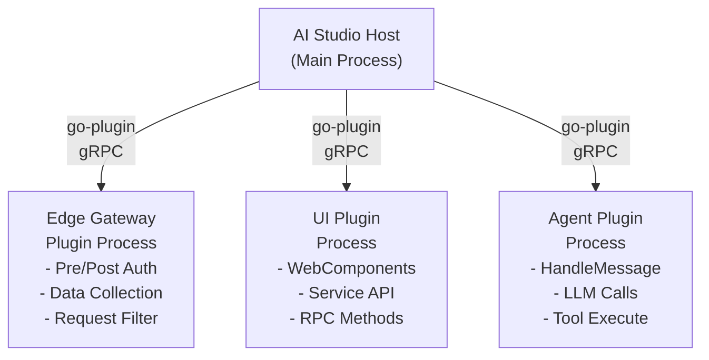
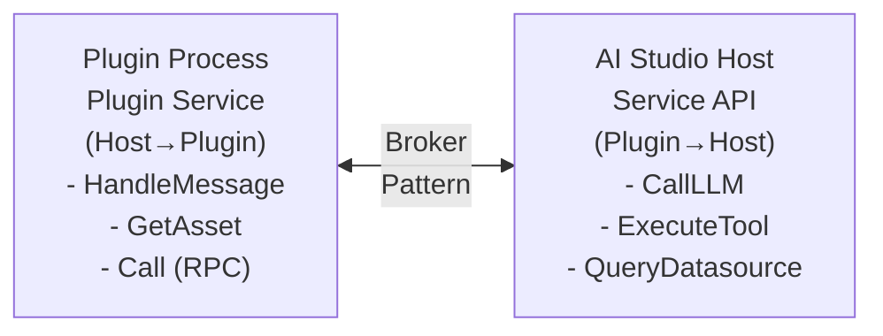

## Availability

| Edition   | Deployment Type |
| :------------- | :---------------------- |
| [Community](/ai-management/ai-studio/overview#community-edition) & [Enterprise](/ai-management/ai-studio/overview#enterprise-edition) | Self-Managed, Hybrid |

Tyk AI Studio's plugin system enables powerful extensibility across the entire platform through a **Unified Plugin SDK**. Built on [HashiCorp's go-plugin](https://github.com/hashicorp/go-plugin) framework, plugins run as isolated processes with gRPC communication, providing security and fault tolerance.

## Unified Plugin SDK

All plugins now use a single SDK (`pkg/plugin_sdk`) that works seamlessly in both AI Studio and Edge Gateway contexts. The SDK automatically detects the runtime environment and provides appropriate capabilities.

### Key Features

- **Single Import**: One SDK works everywhere
- **10 Plugin Capabilities**: Mix and match to build exactly what you need
- **Runtime Detection**: Automatic AI Studio vs Edge Gateway detection
- **Service API Access**: Built-in KV storage, logging, and management APIs
- **Type-Safe**: Clean Go interfaces, no manual proto handling

## Plugin Capabilities

Plugins implement one or more of these 12 capabilities:

| Capability | Where It Works | Purpose | Common Use Cases |
|------------|----------------|---------|------------------|
| **Pre-Auth** | Studio + Gateway | Process before authentication | IP filtering, request validation |
| **Auth** | Studio + Gateway | Custom authentication | OAuth, API keys, JWT validation |
| **Post-Auth** | Studio + Gateway | Process after authentication | Request enrichment, policy enforcement |
| **Response** | Studio + Gateway | Modify responses | Content filtering, header injection |
| **Data Collection** | Studio + Gateway | Collect telemetry | Export to Elasticsearch, ClickHouse |
| **Custom Endpoints** | Gateway | Serve custom HTTP endpoints | MCP proxy, OAuth provider, webhooks |
| **Object Hooks** | Studio only | Intercept CRUD operations | Validation, approval workflows |
| **Agent** | Studio only | Conversational AI | Chat-based agents, LLM wrapping |
| **UI Provider** | Studio only | Dashboard extensions | Custom dashboards, admin tools |
| **AI Portal UI** | Studio only | AI Portal extensions | User-facing forms, pages, dashboards |
| **Config Provider** | Studio + Gateway | Provide JSON Schema config | Dynamic configuration |
| **Manifest Provider** | Gateway only | Plugin manifest | Gateway-only plugins |

### Multi-Capability Plugins

A single plugin can implement multiple capabilities. For example, a rate limiter might:
- Implement **Post-Auth** to check limits before request
- Implement **Response** to update counters after response
- Implement **UI Provider** to show rate limit dashboard

## Plugin Types Overview

While all plugins use the unified SDK, they generally fall into three categories based on their primary use case:

### 1. Edge Gateway Plugins

Edge Gateway plugins provide middleware hooks in the LLM proxy request/response pipeline using the unified SDK.


[Learn more →](/ai-management/ai-studio/plugins/edge-gateway)

### 2. AI Studio UI Plugins

AI Studio UI plugins extend the dashboard with custom WebComponents, adding new pages, sidebars, and interactive features to the admin interface. These also use the unified SDK and can combine UI capabilities with middleware hooks.

[Learn more →](/ai-management/ai-studio/plugins/studio-ui)

### 3. AI Studio Agent Plugins

> **Experimental Feature**: Agent plugins are currently experimental. The API and behavior may change in future releases.

Agent plugins enable conversational AI experiences in the Chat Interface using the unified SDK. These plugins can wrap LLMs, add custom logic, integrate external services, and create sophisticated multi-turn conversations.

[Learn more →](/ai-management/ai-studio/plugins/studio-agent)

### 4. Object Hooks Plugins

**Object Hooks** are a powerful AI Studio-only capability that allows plugins to intercept and control CRUD operations on key objects before they reach the database. This is particularly useful for validation, approval workflows, and policy enforcement.

[Learn more →](/ai-management/ai-studio/plugins/object-hooks)

## Plugin Architecture

### Monolithic Plugin Architecture

A single plugin binary can run in **both** AI Studio and the Edge Gateway, so long as the requisite interfaces are implemented and the requirements are clear in the manifest file. This means one plugin can provide UI extensions in Studio, middleware hooks in the gateway, and even use the event bus to communicate between its Studio and gateway components in near-real-time.

### Scheduled Tasks

Studio plugins can register **scheduled tasks** — periodic calls from the host to the plugin on a configurable interval. This enables long-running background jobs such as analytics analysis, compliance checks, log scanning, or data synchronization.

### Process Isolation

Plugins run as separate processes, communicating with the main platform via gRPC. This provides:

- **Security**: Plugin crashes don't affect the main platform
- **Language Flexibility**: While the gRPC protocol theoretically supports any language, **only Go plugins have been tested** in production. If you plan to write plugins in another language, expect to do additional integration work.
- **Resource Management**: Plugins can be restarted independently
- **Version Independence**: Update plugins without platform restarts

Plugins can also run as standalone gRPC services in a sidecar or elsewhere on the network, rather than as local sub-processes. See [Plugin Deployment](/ai-management/ai-studio/plugins/deployment) for details.

### Communication Flow


```mermaid
graph TD
    Host["AI Studio Host<br/>(Main Process)"]
    
    Host -- "go-plugin<br/>gRPC" --> Edge["Edge Gateway<br/>Plugin Process<br/>- Pre/Post Auth<br/>- Data Collection<br/>- Request Filter"]
    Host -- "go-plugin<br/>gRPC" --> UI["UI Plugin<br/>Process<br/>- WebComponents<br/>- Service API<br/>- RPC Methods"]
    Host -- "go-plugin<br/>gRPC" --> Agent["Agent Plugin<br/>Process<br/>- HandleMessage<br/>- LLM Calls<br/>- Tool Execute"]
```

### Service API (AI Studio Plugins Only)

AI Studio UI and Agent plugins can access the Service API via a reverse gRPC broker connection:


```mermaid
graph LR
    Plugin["Plugin Process<br/>Plugin Service<br/>(Host→Plugin)<br/>- HandleMessage<br/>- GetAsset<br/>- Call (RPC)"]
    Host["AI Studio Host<br/>Service API<br/>(Plugin→Host)<br/>- CallLLM<br/>- ExecuteTool<br/>- QueryDatasource"]
    
    Plugin <-->|"Broker<br/>Pattern"| Host
```

The Service API provides 100+ gRPC operations for managing LLMs, apps, tools, datasources, analytics, and more. Access is controlled via permission scopes declared in the plugin manifest.

[Learn more about Service API →](/ai-management/ai-studio/plugins/service-api)

## Deployment Options

Plugins support three deployment methods:

### file://

Local filesystem plugins for development and testing:

```
file:///path/to/plugin-binary
```

### grpc://

Remote gRPC plugins running as network services:

```
grpc://plugin-host:50051
```

### oci://

Container registry plugins (OCI artifacts):

```
oci://registry.example.com/plugins/my-plugin:v1.0.0
```

[Learn more about deployment →](/ai-management/ai-studio/plugins/deployment)

## Upgrade Installed Plugins

To publish a plugin to a marketplace and release new versions, refer to [Publish Plugins](/ai-management/ai-studio/plugins/publishing).

From v2.2.0, AI Studio tracks the marketplace version of each plugin that you installed from the marketplace. After each marketplace sync, the **Plugins** page shows the installed version. It also shows an **Update** chip on each plugin that has a newer published version. AI Studio recognizes plugins that you installed before this version from their OCI reference, so you do not need to install them again.

To upgrade a plugin, select **Upgrade** on the chip, the row menu, the plugin detail page, or the marketplace card of the plugin. Before you apply the upgrade, AI Studio shows:

- The target version. You can also select a different published version, also an older one.
- The changelog of that version
- The new permissions that the version asks for. You must approve them to continue. AI Studio removes the permissions that the new version does not use.
- A warning if your current configuration does not match the settings of the new version. This warning does not block the upgrade.

An upgrade replaces only the plugin binary. The plugin keeps its configuration and data: KV data, agents, LLM associations, schedules, the Apps that use its resources, and the permissions granted on it. If the new version does not start, AI Studio restores the previous version and shows the reason.

If the plugin also runs on Edge Gateways, AI Studio marks them as pending after the upgrade. They load the new version with the next configuration push.

Upgrades need the `plugins:write` permission. AI Studio does not track plugins that you added from a local file or from a private registry that is not a marketplace source. To upgrade these plugins, edit their command.

### Known Issues

- **Reactivating a plugin does not restart its AI Studio part.** After you turn a plugin off and on again, click **Reload** on the plugin, or call `POST /api/v1/plugins/{id}/reload`.
- **Running Edge Gateways do not reload an in-place upgrade that uses a `file://` command.** Restart the Edge Gateways after the upgrade. Marketplace (OCI) upgrades change the checksum and reload as usual.
- **AI Studio does not enforce `min_studio_version`.** The marketplace shows the value, but you can install a plugin on an older AI Studio version. Check the minimum version before you install.

## Permissions and Scopes

AI Studio plugins declare required permissions in their manifest:

```json expandable
{
  "permissions": {
    "services": [
      "llms.proxy",      // Call LLMs via proxy
      "llms.read",       // List and read LLM configs
      "tools.execute",   // Execute tools
      "datasources.query", // Query datasources
      "kv.readwrite",    // Key-value storage
      "analytics.read"   // Read analytics data
    ]
  }
}
```

Permissions are validated when plugins call the Service API. The platform enforces least-privilege access based on declared scopes.

[Learn more about manifests →](/ai-management/ai-studio/plugins/manifests)

## Getting Started

### Choose Your Plugin Type

1. **Need to intercept/modify LLM requests?** → Edge Gateway Plugin
2. **Building dashboard UI features?** → AI Studio UI Plugin
3. **Creating conversational AI experiences?** → AI Studio Agent Plugin

### Development Workflow

1. Choose your plugin type
2. Read the specific plugin guide
3. Review example plugins in `examples/plugins/` and `community/plugins/`
4. Use the SDK to implement required interfaces
5. Build and test with `file://` deployment (see [Development Workflow Guide](/ai-management/ai-studio/plugins/development-workflow) for fast iteration)
6. Deploy with `grpc://` or `oci://` for production

**Pro tip**: Use the reload API (`POST /api/v1/plugins/{id}/reload`) to test changes instantly without reinstalling. See the [Development Workflow Guide](/ai-management/ai-studio/plugins/development-workflow) for the fastest iteration loop.

### SDK Installation

All plugins use the unified SDK:

```bash
go get github.com/TykTechnologies/midsommar/v2/pkg/plugin_sdk
```

```go
import "github.com/TykTechnologies/midsommar/v2/pkg/plugin_sdk"

type MyPlugin struct {
    plugin_sdk.BasePlugin
}

func main() {
    plugin_sdk.Serve(NewMyPlugin())
}
```

**Note**: If you have existing plugins using the old SDKs (`microgateway/plugins/sdk` or `pkg/ai_studio_sdk`), see the Migration Guide for upgrade instructions. From v2.2.1, the gateway plugin interfaces are in `pkg/gatewayplugin`, and the old `microgateway/plugins` paths forward to them.

