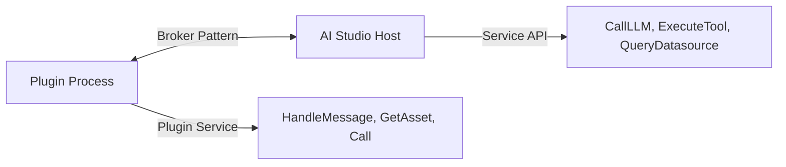

<Availability community />

# Plugin System Overview


```mermaid
graph TD
    A[AI Studio] -->|gRPC| B(Plugin System)
    B --> C{Plugin Types}
    C -->|Microgateway| D[Middleware Hooks]
    C -->|UI| E[Dashboard Extensions]
    C -->|Agent| F[Conversational AI]
```mermaid
graph LR
    A[Plugin Process] <-->|Broker Pattern| B[AI Studio Host]
    A -->|Plugin Service| C[HandleMessage, GetAsset, Call]
    B -->|Service API| D[CallLLM, ExecuteTool, QueryDatasource]
```

### Service API (AI Studio Plugins Only)

AI Studio UI and Agent plugins can access the Service API via a reverse gRPC broker connection:



The Service API provides 100+ gRPC operations for managing LLMs, apps, tools, datasources, analytics, and more. Access is controlled via permission scopes declared in the plugin manifest.

[Learn more about Service API →](plugins-service-api)

## Deployment Options

Plugins support three deployment methods:

### file://

Local filesystem plugins for development and testing:

```
file:///path/to/plugin-binary
```

### grpc://

Remote gRPC plugins running as network services:

```
grpc://plugin-host:50051
```

### oci://

Container registry plugins (OCI artifacts):

```
oci://registry.example.com/plugins/my-plugin:v1.0.0
```

[Learn more about deployment →](plugins-deployment)

## Permissions and Scopes

AI Studio plugins declare required permissions in their manifest:

```json
{
  "permissions": {
    "services": [
      "llms.proxy",      // Call LLMs via proxy
      "llms.read",       // List and read LLM configs
      "tools.execute",   // Execute tools
      "datasources.query", // Query datasources
      "kv.readwrite",    // Key-value storage
      "analytics.read"   // Read analytics data
    ]
  }
}
```

Permissions are validated when plugins call the Service API. The platform enforces least-privilege access based on declared scopes.

[Learn more about manifests →](plugins-manifests)

## Getting Started

### Choose Your Plugin Type

1. **Need to intercept/modify LLM requests?** → Microgateway Plugin
2. **Building dashboard UI features?** → AI Studio UI Plugin
3. **Creating conversational AI experiences?** → AI Studio Agent Plugin

### Development Workflow

1. Choose your plugin type
2. Read the specific plugin guide
3. Review example plugins in `examples/plugins/` and `community/plugins/`
4. Use the SDK to implement required interfaces
5. Build and test with `file://` deployment (see [Development Workflow Guide](plugins-development-workflow) for fast iteration)
6. Deploy with `grpc://` or `oci://` for production

**Pro tip**: Use the reload API (`POST /api/v1/plugins/{id}/reload`) to test changes instantly without reinstalling. See the [Development Workflow Guide](plugins-development-workflow) for the fastest iteration loop.

### SDK Installation

All plugins use the unified SDK:

```bash
go get github.com/TykTechnologies/midsommar/v2/pkg/plugin_sdk
```

```go
import "github.com/TykTechnologies/midsommar/v2/pkg/plugin_sdk"

type MyPlugin struct {
    plugin_sdk.BasePlugin
}

func main() {
    plugin_sdk.Serve(NewMyPlugin())
}
```

**Note**: If you have existing plugins using the old SDKs (`microgateway/plugins/sdk` or `pkg/ai_studio_sdk`), see the [Migration Guide](plugins-migration-guide) for upgrade instructions.

## Next Steps

- **[Development Workflow Guide](plugins-development-workflow)** - Fast iteration with file:// and reload API
- **[Plugin SDK Reference](plugins-sdk)** - Complete SDK documentation
- **[Plugin Examples](plugins-examples)** - Browse working examples (including production-ready community plugins)
- **[Object Hooks Guide](plugins-object-hooks)** - Intercept CRUD operations
- **[Custom Endpoints Guide](plugins-custom-endpoints)** - Serve custom HTTP endpoints (MCP, OAuth, webhooks)
- **[Microgateway Plugins Guide](plugins-microgateway)** - Gateway-specific patterns
- **[AI Studio UI Plugins Guide](plugins-studio-ui)** - Build admin plugin UIs
- **[AI Portal UI Plugins Guide](plugins-portal-ui)** - Build portal-facing plugin pages and forms
- **[AI Studio Agent Plugins Guide](plugins-studio-agent)** - Build conversational agents
- **[Service API Reference](plugins-service-api)** - Complete API documentation
- **[Plugin Deployment](plugins-deployment)** - Production deployment options
- **[Migration Guide](plugins-migration-guide)** - Upgrade from old SDKs
