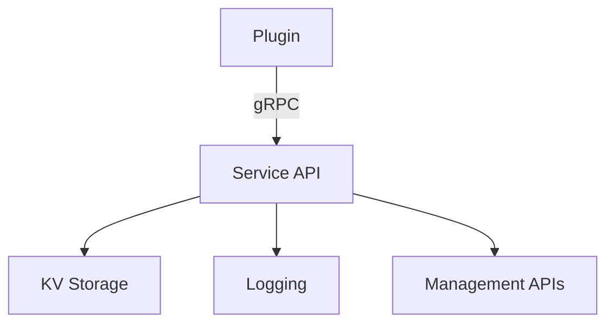

<Availability community />

# Service API Reference





The Service API provides rich management capabilities for plugins to interact with the platform. Access is available through the **Unified Plugin SDK** via the `Context.Services` interface.

## Overview

Service API access is available to all plugins using the unified SDK (`pkg/plugin_sdk`), with different capabilities depending on the runtime:

### Universal Services (Both Runtimes)
- **KV Storage**: Key-value storage (PostgreSQL in Studio, local DB in Gateway)
- **Logger**: Structured logging

### Runtime-Specific Services
- **Gateway Services**: App management, LLM info, budget status, credential validation
- **Studio Services**: Full management API (LLMs, tools, apps, filters, tags, CallLLM)

## Access Pattern

All services are accessed through the `Context.Services` interface provided to your plugin handlers:

```go
func (p *MyPlugin) HandlePostAuth(ctx plugin_sdk.Context, req *pb.EnrichedRequest) (*pb.PluginResponse, error) {
    // Universal services
    ctx.Services.Logger().Info("Processing request", "app_id", ctx.AppID)
    data, err := ctx.Services.KV().Read(ctx, "my-key")

    // Runtime-specific services
    if ctx.Runtime == plugin_sdk.RuntimeStudio {
        llms, err := ctx.Services.Studio().ListLLMs(ctx, 1, 10)
    } else if ctx.Runtime == plugin_sdk.RuntimeGateway {
        app, err := ctx.Services.Gateway().GetApp(ctx, ctx.AppID)
    }

    return &pb.PluginResponse{Modified: false}, nil
}
```

## Initialization and Connection Warmup

For Service API access in AI Studio, plugins use a **session-based broker pattern**. The SDK handles most of the setup automatically, but there's a critical pattern you must follow for reliable Service API access.

### The Connection Warmup Pattern

**Critical**: The go-plugin broker only accepts **ONE connection per broker ID**. If your plugin uses both the Event Service and the Management Service API, whichever service dials first will succeed, and the connection is shared between them.

To ensure reliable Service API access, implement `SessionAware` and **warm up the connection in `OnSessionReady`**:

```go
import (
    "context"
    "log"

    "github.com/TykTechnologies/midsommar/v2/pkg/ai_studio_sdk"
    "github.com/TykTechnologies/midsommar/v2/pkg/plugin_sdk"
)

type MyPlugin struct {
    plugin_sdk.BasePlugin
    services plugin_sdk.ServiceBroker
}

func (p *MyPlugin) Initialize(ctx plugin_sdk.Context, config map[string]string) error {
    p.services = ctx.Services
    return nil
}

// OnSessionReady implements plugin_sdk.SessionAware
// CRITICAL: Warm up the Service API connection here!
func (p *MyPlugin) OnSessionReady(ctx plugin_sdk.Context) {
    log.Printf("Session ready - warming up service API connection...")

    // Eagerly establish the broker connection by making a lightweight API call.
    // This ensures the connection is ready before any RPC calls come in.
    if ai_studio_sdk.IsInitialized() {
        _, err := ai_studio_sdk.GetPluginsCount(context.Background())
        if err != nil {
            log.Printf("Service API warmup failed: %v", err)
        } else {
            log.Printf("Service API connection established successfully")
        }
    }
}

func (p *MyPlugin) OnSessionClosing(ctx plugin_sdk.Context) {
    log.Printf("Session closing")
}
```

### Why Warmup Is Required

Without the warmup pattern, you may encounter **"timeout waiting for connection info"** errors when your plugin tries to use the Service API during an RPC call. This happens because:

1. The broker connection is time-sensitive and must be established early
2. Dialing late (during an RPC call from the UI) may fail if timing is off
3. Event subscriptions and Service API calls share the same underlying connection

### Legacy Pattern (Still Supported)

The older pattern of extracting the broker ID manually during `Initialize` still works but is not recommended:

```go
func (p *MyPlugin) Initialize(ctx plugin_sdk.Context, config map[string]string) error {
    // Extract broker ID for Service API access (automatic with SessionAware)
    brokerIDStr := ""
    if id, ok := config["_service_broker_id"]; ok {
        brokerIDStr = id
    } else if id, ok := config["service_broker_id"]; ok {
        brokerIDStr = id
    }

    if brokerIDStr != "" {
        var brokerID uint32
        fmt.Sscanf(brokerIDStr, "%d", &brokerID)
        ai_studio_sdk.SetServiceBrokerID(brokerID)
    }

    return nil
}
```

**Note**: The SDK now handles broker ID extraction automatically via `OpenSession`. You only need to implement `SessionAware` and warm up the connection.

## Universal Services

These services are available in both Studio and Gateway runtimes.

### KV Storage

Key-value storage for plugin data:
- **Studio**: PostgreSQL-backed, shared across hosts, durable
- **Gateway**: Local database, per-instance, ephemeral

#### Write Data

```go
err := ctx.Services.KV().Write(ctx, "my-key", []byte("value"))
```

Returns error if write fails.

Example:
```go
settings := map[string]interface{}{
    "enabled": true,
    "rate_limit": 100,
}

data, _ := json.Marshal(settings)
err := ctx.Services.KV().Write(ctx, "settings", data)
if err != nil {
    ctx.Services.Logger().Error("Failed to write settings", "error", err)
}
```

#### Read Data

```go
data, err := ctx.Services.KV().Read(ctx, "my-key")
```

Returns error if key doesn't exist.

Example:
```go
data, err := ctx.Services.KV().Read(ctx, "settings")
if err != nil {
    ctx.Services.Logger().Warn("Settings not found", "error", err)
    // Use defaults
}

var settings map[string]interface{}
json.Unmarshal(data, &settings)
```

#### Delete Data

```go
err := ctx.Services.KV().Delete(ctx, "my-key")
```

Example:
```go
err := ctx.Services.KV().Delete(ctx, "cache:user:123")
if err != nil {
    ctx.Services.Logger().Error("Failed to delete cache", "error", err)
}
```

#### List Keys

```go
keys, err := ctx.Services.KV().List(ctx, "prefix")
```

Example:
```go
keys, err := ctx.Services.KV().List(ctx, "cache:")
if err != nil {
    return err
}

for _, key := range keys {
    ctx.Services.Logger().Debug("Found key", "key", key)
}
```

### Logger

Structured logging with key-value pairs:

```go
ctx.Services.Logger().Info("Message", "key", "value")
ctx.Services.Logger().Warn("Warning", "error", err)
ctx.Services.Logger().Error("Error", "details", details)
ctx.Services.Logger().Debug("Debug info", "data", data)
```

Example:
```go
func (p *MyPlugin) HandlePostAuth(ctx plugin_sdk.Context, req *pb.EnrichedRequest) (*pb.PluginResponse, error) {
    ctx.Services.Logger().Info("Request received",
        "app_id", ctx.AppID,
        "user_id", ctx.UserID,
        "path", req.Path,
        "method", req.Method,
    )

    // Process request...

    ctx.Services.Logger().Info("Request processed",
        "app_id", ctx.AppID,
        "duration_ms", time.Since(startTime).Milliseconds(),
    )

    return &pb.PluginResponse{Modified: false}, nil
}
```

### Event Service

The Event Service enables plugins to publish and subscribe to events using the Event Bridge system. This allows plugins to communicate across the distributed architecture (edge ↔ control) using a pub/sub pattern.

**Key Features:**
- Publish events to the local event bus
- Subscribe to events by topic or all events
- Events can flow across the hub-spoke architecture based on direction
- Automatic cleanup of subscriptions when plugin disconnects

#### Event Directions

Events have a direction that controls routing:

| Direction | Constant | Description |
|-----------|----------|-------------|
| Local | `plugin_sdk.DirLocal` | Stays on local bus only, never forwarded |
| Up | `plugin_sdk.DirUp` | Flows from edge (Microgateway) to control (AI Studio) |
| Down | `plugin_sdk.DirDown` | Flows from control (AI Studio) to edge(s) |

#### Publish Event

Publish an event with a JSON-serializable payload:

```go
err := ctx.Services.Events().Publish(ctx, "my.topic", payload, plugin_sdk.DirUp)
```

Example:
```go
// Publish a cache hit event to the local bus only
cacheEvent := map[string]interface{}{
    "key":       "user:123",
    "hit":       true,
    "timestamp": time.Now().Unix(),
}
err := ctx.Services.Events().Publish(ctx, "cache.hit", cacheEvent, plugin_sdk.DirLocal)
if err != nil {
    ctx.Services.Logger().Error("Failed to publish cache event", "error", err)
}

// Publish metrics from edge to control
metrics := map[string]interface{}{
    "requests_per_second": 1500,
    "avg_latency_ms":      25,
    "error_rate":          0.02,
}
err = ctx.Services.Events().Publish(ctx, "metrics.report", metrics, plugin_sdk.DirUp)
```

#### Publish Raw Event

Publish an event with pre-serialized JSON payload (avoids double-serialization):

```go
err := ctx.Services.Events().PublishRaw(ctx, "my.topic", jsonBytes, plugin_sdk.DirUp)
```

Example:
```go
// When you already have JSON bytes
jsonPayload := []byte(`{"status": "ready", "version": "1.0.0"}`)
err := ctx.Services.Events().PublishRaw(ctx, "plugin.status", jsonPayload, plugin_sdk.DirLocal)
```

#### Subscribe to Events

Subscribe to events on a specific topic:

```go
subscriptionID, err := ctx.Services.Events().Subscribe("my.topic", func(ev plugin_sdk.Event) {
    // Handle event
    fmt.Printf("Received: %s from %s\n", ev.Topic, ev.Origin)
})
```

Example:
```go
// Subscribe to configuration updates
subID, err := ctx.Services.Events().Subscribe("config.updated", func(ev plugin_sdk.Event) {
    ctx.Services.Logger().Info("Configuration updated",
        "event_id", ev.ID,
        "origin", ev.Origin,
    )

    // Parse payload
    var config map[string]interface{}
    if err := json.Unmarshal(ev.Payload, &config); err != nil {
        ctx.Services.Logger().Error("Failed to parse config", "error", err)
        return
    }

    // Apply new configuration
    p.applyConfig(config)
})
if err != nil {
    ctx.Services.Logger().Error("Failed to subscribe", "error", err)
}

// Store subscription ID to unsubscribe later
p.configSubID = subID
```

#### Subscribe to All Events

Subscribe to all events regardless of topic:

```go
subscriptionID, err := ctx.Services.Events().SubscribeAll(func(ev plugin_sdk.Event) {
    // Handle all events
})
```

Example:
```go
// Monitor all events for debugging
subID, err := ctx.Services.Events().SubscribeAll(func(ev plugin_sdk.Event) {
    ctx.Services.Logger().Debug("Event observed",
        "id", ev.ID,
        "topic", ev.Topic,
        "origin", ev.Origin,
        "direction", ev.Dir,
    )
})
```

#### Unsubscribe

Remove a subscription:

```go
err := ctx.Services.Events().Unsubscribe(subscriptionID)
```

Example:
```go
// Clean up subscription in Shutdown
func (p *MyPlugin) Shutdown(ctx plugin_sdk.Context) error {
    if p.configSubID != "" {
        if err := ctx.Services.Events().Unsubscribe(p.configSubID); err != nil {
            ctx.Services.Logger().Warn("Failed to unsubscribe", "error", err)
        }
    }
    return nil
}
```

**Note:** Subscriptions are automatically cleaned up when the plugin process terminates, but it's good practice to explicitly unsubscribe in `Shutdown()`.

#### Event Structure

Events have the following fields:

```go
type Event struct {
    ID      string           // UUID for deduplication and tracing
    Topic   string           // Logical topic name (e.g., "config.update")
    Origin  string           // Node/plugin that created the event
    Dir     Direction        // Routing direction
    Payload json.RawMessage  // JSON payload
}
```

#### Complete Example: Event-Driven Cache Invalidation

```go
package main

import (
    "encoding/json"
    "github.com/TykTechnologies/midsommar/v2/pkg/plugin_sdk"
)

type CachePlugin struct {
    plugin_sdk.BasePlugin
    cache           map[string][]byte
    invalidationSub string
}

func (p *CachePlugin) Initialize(ctx plugin_sdk.Context, config map[string]string) error {
    p.cache = make(map[string][]byte)

    // Subscribe to cache invalidation events from control
    subID, err := ctx.Services.Events().Subscribe("cache.invalidate", func(ev plugin_sdk.Event) {
        var req struct {
            Keys []string `json:"keys"`
        }
        if err := json.Unmarshal(ev.Payload, &req); err != nil {
            return
        }

        for _, key := range req.Keys {
            delete(p.cache, key)
        }

        ctx.Services.Logger().Info("Cache invalidated",
            "keys", len(req.Keys),
            "origin", ev.Origin,
        )
    })
    if err != nil {
        return err
    }
    p.invalidationSub = subID

    return nil
}

func (p *CachePlugin) HandlePostAuth(ctx plugin_sdk.Context, req *pb.EnrichedRequest) (*pb.PluginResponse, error) {
    cacheKey := req.Path

    // Check cache
    if data, ok := p.cache[cacheKey]; ok {
        // Publish cache hit event (local only for metrics)
        ctx.Services.Events().Publish(ctx, "cache.hit", map[string]interface{}{
            "key": cacheKey,
        }, plugin_sdk.DirLocal)

        // Return cached response...
    }

    // Cache miss - continue to upstream
    return &pb.PluginResponse{Modified: false}, nil
}

func (p *CachePlugin) Shutdown(ctx plugin_sdk.Context) error {
    if p.invalidationSub != "" {
        ctx.Services.Events().Unsubscribe(p.invalidationSub)
    }
    return nil
}
```

#### Event Service Best Practices

1. **Use Appropriate Directions**:
   - `DirLocal` for metrics and debugging within a single node
   - `DirUp` for edge plugins sending data to control
   - `DirDown` for control pushing updates to edges

2. **Handle Payload Parsing Errors**: Always validate and handle JSON unmarshaling errors in event handlers.

3. **Avoid Blocking in Handlers**: Event handlers should be fast. For heavy processing, spawn a goroutine or queue work.

4. **Clean Up Subscriptions**: Unsubscribe in `Shutdown()` for explicit cleanup.

5. **Use Meaningful Topics**: Use dot-separated topic names for clarity (e.g., `cache.invalidate`, `config.updated`, `metrics.report`).

6. **Include Context in Payloads**: Add timestamps, correlation IDs, or source info to payloads for debugging.

### System CRUD Events

AI Studio emits built-in system events when core objects are created, updated, or deleted. These events are published to the local event bus (control-plane only) and can be subscribed to by any plugin.

#### Available System Events

| Topic | Object Type | Action | Description |
|-------|-------------|--------|-------------|
| `system.llm.created` | LLM | created | Emitted when an LLM is created |
| `system.llm.updated` | LLM | updated | Emitted when an LLM is updated |
| `system.llm.deleted` | LLM | deleted | Emitted when an LLM is deleted |
| `system.app.created` | App | created | Emitted when an App is created |
| `system.app.updated` | App | updated | Emitted when an App is updated |
| `system.app.deleted` | App | deleted | Emitted when an App is deleted |
| `system.app.approved` | App | approved | Emitted when an App's credential is activated |
| `system.datasource.created` | Datasource | created | Emitted when a Datasource is created |
| `system.datasource.updated` | Datasource | updated | Emitted when a Datasource is updated |
| `system.datasource.deleted` | Datasource | deleted | Emitted when a Datasource is deleted |
| `system.user.created` | User | created | Emitted when a User is created |
| `system.user.updated` | User | updated | Emitted when a User is updated |
| `system.user.deleted` | User | deleted | Emitted when a User is deleted |
| `system.group.created` | Group | created | Emitted when a Group is created |
| `system.group.updated` | Group | updated | Emitted when a Group is updated |
| `system.group.deleted` | Group | deleted | Emitted when a Group is deleted |
| `system.tool.created` | Tool | created | Emitted when a Tool is created |
| `system.tool.updated` | Tool | updated | Emitted when a Tool is updated |
| `system.tool.deleted` | Tool | deleted | Emitted when a Tool is deleted |

#### Event Payload Structure

All system CRUD events use a consistent payload structure:

```go
type ObjectEventPayload struct {
    ObjectType string      `json:"object_type"`  // "llm", "app", "datasource", "user", "group", "tool"
    Action     string      `json:"action"`       // "created", "updated", "deleted", "approved"
    ObjectID   uint        `json:"object_id"`    // ID of the affected object
    UserID     uint        `json:"user_id"`      // User who performed the action (0 if system/unknown)
    Timestamp  time.Time   `json:"timestamp"`    // When the event occurred
    Object     interface{} `json:"object"`       // The full object (for create/update, nil for delete)
}
```

#### Subscribing to System Events

```go
// Subscribe to all App events using wildcard
subID, err := ctx.Services.Events().Subscribe("system.app.*", func(ev plugin_sdk.Event) {
    var payload struct {
        ObjectType string      `json:"object_type"`
        Action     string      `json:"action"`
        ObjectID   uint        `json:"object_id"`
        UserID     uint        `json:"user_id"`
        Timestamp  time.Time   `json:"timestamp"`
        Object     interface{} `json:"object"`
    }

    if err := json.Unmarshal(ev.Payload, &payload); err != nil {
        ctx.Services.Logger().Error("Failed to parse event payload", "error", err)
        return
    }

    ctx.Services.Logger().Info("App event received",
        "action", payload.Action,
        "object_id", payload.ObjectID,
        "user_id", payload.UserID,
    )
})

// Or subscribe to a specific event
subID, err := ctx.Services.Events().Subscribe("system.user.created", func(ev plugin_sdk.Event) {
    // Handle new user creation
})
```

#### Example: Audit Log Plugin

```go
package main

import (
    "encoding/json"
    "time"

    "github.com/TykTechnologies/midsommar/v2/pkg/plugin_sdk"
)

type AuditLogPlugin struct {
    plugin_sdk.BasePlugin
    subscriptions []string
}

func (p *AuditLogPlugin) OnSessionReady(ctx plugin_sdk.Context) {
    // Subscribe to all system events
    topics := []string{
        "system.llm.created", "system.llm.updated", "system.llm.deleted",
        "system.app.created", "system.app.updated", "system.app.deleted", "system.app.approved",
        "system.datasource.created", "system.datasource.updated", "system.datasource.deleted",
        "system.user.created", "system.user.updated", "system.user.deleted",
        "system.group.created", "system.group.updated", "system.group.deleted",
        "system.tool.created", "system.tool.updated", "system.tool.deleted",
    }

    for _, topic := range topics {
        subID, err := ctx.Services.Events().Subscribe(topic, func(ev plugin_sdk.Event) {
            p.logAuditEvent(ctx, ev)
        })
        if err != nil {
            ctx.Services.Logger().Error("Failed to subscribe to event", "topic", topic, "error", err)
            continue
        }
        p.subscriptions = append(p.subscriptions, subID)
    }
}

func (p *AuditLogPlugin) logAuditEvent(ctx plugin_sdk.Context, ev plugin_sdk.Event) {
    var payload struct {
        ObjectType string    `json:"object_type"`
        Action     string    `json:"action"`
        ObjectID   uint      `json:"object_id"`
        UserID     uint      `json:"user_id"`
        Timestamp  time.Time `json:"timestamp"`
    }

    if err := json.Unmarshal(ev.Payload, &payload); err != nil {
        return
    }

    // Log to external audit system, KV storage, etc.
    ctx.Services.Logger().Info("AUDIT",
        "object_type", payload.ObjectType,
        "action", payload.Action,
        "object_id", payload.ObjectID,
        "user_id", payload.UserID,
        "timestamp", payload.Timestamp,
    )
}

func (p *AuditLogPlugin) OnSessionClosing(ctx plugin_sdk.Context) {
    for _, subID := range p.subscriptions {
        ctx.Services.Events().Unsubscribe(subID)
    }
}
```

**Note**: System events are published with `DirLocal` direction, meaning they stay on the control plane and are not forwarded to edge instances.

## Studio Services

Available when `ctx.Runtime == plugin_sdk.RuntimeStudio`.

### LLM Operations

Requires: `llms.read`, `llms.write`, or `llms.proxy` scope

#### List LLMs

```go
llms, err := ctx.Services.Studio().ListLLMs(ctx, page, limit)
```

**Alternative** (direct SDK call):
```go
llmsResp, err := ai_studio_sdk.ListLLMs(ctx, 1, 10)
```

Example:
```go
if ctx.Runtime == plugin_sdk.RuntimeStudio {
    llms, err := ctx.Services.Studio().ListLLMs(ctx, 1, 10)
    if err != nil {
        return err
    }

    // Type assert the response
    llmsResp := llms.(*studiomgmt.ListLLMsResponse)
    for _, llm := range llmsResp.Llms {
        ctx.Services.Logger().Info("LLM found",
            "name", llm.Name,
            "vendor", llm.Vendor,
            "model", llm.DefaultModel,
        )
    }
}
```

#### Get LLM

```go
llm, err := ctx.Services.Studio().GetLLM(ctx, llmID)
```

**Alternative** (direct SDK call):
```go
llm, err := ai_studio_sdk.GetLLM(ctx, 1)
```

### Call LLM (Streaming)

Requires: `llms.proxy` scope

```go
func CallLLM(
    ctx context.Context,
    llmID uint32,
    model string,
    messages []*mgmtpb.LLMMessage,
    temperature float64,
    maxTokens int32,
    tools []*mgmtpb.LLMTool,
    stream bool,
) (mgmtpb.AIStudioManagementService_CallLLMClient, error)
```

Example:
```go
messages := []*mgmtpb.LLMMessage{
    {Role: "user", Content: "What is the capital of France?"},
}

llmStream, err := ai_studio_sdk.CallLLM(ctx, 1, "gpt-4", messages, 0.7, 1000, nil, false)
if err != nil {
    return err
}

var response string
for {
    resp, err := llmStream.Recv()
    if err == io.EOF {
        break
    }
    if err != nil {
        return err
    }

    response += resp.Content

    if resp.Done {
        break
    }
}

log.Printf("LLM response: %s", response)
```

### Call LLM (Simple)

Convenience method for simple calls:

```go
func CallLLMSimple(ctx context.Context, llmID uint32, model string, userMessage string) (string, error)
```

Example:
```go
response, err := ai_studio_sdk.CallLLMSimple(ctx, 1, "gpt-4", "Hello, world!")
if err != nil {
    return err
}

log.Printf("Response: %s", response)
```

### Get LLMs Count

```go
func GetLLMsCount(ctx context.Context) (int64, error)
```

Example:
```go
count, err := ai_studio_sdk.GetLLMsCount(ctx)
if err != nil {
    return err
}

log.Printf("Total LLMs: %d", count)
```

**Note**: For complete Studio Services documentation including Tools, Apps, Plugins, Datasources, and Filters, see the examples in the working plugins at `examples/plugins/studio/service-api-test/`.

## Gateway Services

Available when `ctx.Runtime == plugin_sdk.RuntimeGateway`.

Gateway Services provide read-only access to essential gateway information.

### Get App

```go
app, err := ctx.Services.Gateway().GetApp(ctx, appID)
```

Returns app configuration. Type assert to `*gwmgmt.GetAppResponse`.

Example:
```go
if ctx.Runtime == plugin_sdk.RuntimeGateway {
    app, err := ctx.Services.Gateway().GetApp(ctx, ctx.AppID)
    if err != nil {
        ctx.Services.Logger().Error("Failed to get app", "error", err)
        return &pb.PluginResponse{Modified: false}, nil
    }

    appResp := app.(*gwmgmt.GetAppResponse)
    ctx.Services.Logger().Info("Processing request for app",
        "app_name", appResp.Name,
        "llm_count", len(appResp.Llms),
    )
}
```

### List Apps

```go
apps, err := ctx.Services.Gateway().ListApps(ctx)
```

Returns all apps accessible to the gateway. Type assert to `*gwmgmt.ListAppsResponse`.

### Get LLM

```go
llm, err := ctx.Services.Gateway().GetLLM(ctx, llmID)
```

Returns LLM configuration. Type assert to `*gwmgmt.GetLLMResponse`.

### List LLMs

```go
llms, err := ctx.Services.Gateway().ListLLMs(ctx)
```

Returns all LLMs configured for the gateway. Type assert to `*gwmgmt.ListLLMsResponse`.

### Get Budget Status

```go
status, err := ctx.Services.Gateway().GetBudgetStatus(ctx, appID)
```

Returns current budget status for an app. Type assert to `*gwmgmt.GetBudgetStatusResponse`.

Example:
```go
if ctx.Runtime == plugin_sdk.RuntimeGateway {
    status, err := ctx.Services.Gateway().GetBudgetStatus(ctx, ctx.AppID)
    if err != nil {
        ctx.Services.Logger().Error("Failed to get budget", "error", err)
        return &pb.PluginResponse{Modified: false}, nil
    }

    budgetResp := status.(*gwmgmt.GetBudgetStatusResponse)
    if budgetResp.RemainingBudget <= 0 {
        return &pb.PluginResponse{
            Block:        true,
            ErrorMessage: "Budget exceeded",
        }, nil
    }
}
```

### Get Model Price

```go
price, err := ctx.Services.Gateway().GetModelPrice(ctx, vendor, model)
```

Returns pricing information for a model. Type assert to `*gwmgmt.GetModelPriceResponse`.

### Validate Credential

```go
valid, err := ctx.Services.Gateway().ValidateCredential(ctx, token)
```

Validates a credential token. Type assert to `*gwmgmt.ValidateCredentialResponse`.

Example:
```go
if ctx.Runtime == plugin_sdk.RuntimeGateway {
    valid, err := ctx.Services.Gateway().ValidateCredential(ctx, req.Headers["Authorization"])
    if err != nil || !valid.(*gwmgmt.ValidateCredentialResponse).Valid {
        return &pb.PluginResponse{
            Block:        true,
            ErrorMessage: "Invalid credentials",
        }, nil
    }
}
```

## Tool Operations (Studio Only)

Requires: `tools.read`, `tools.write`, or `tools.execute` scope

### List Tools

```go
func ListTools(ctx context.Context, page, limit int32) (*mgmtpb.ListToolsResponse, error)
```

Example:
```go
toolsResp, err := ai_studio_sdk.ListTools(ctx, 1, 50)
if err != nil {
    return err
}

for _, tool := range toolsResp.Tools {
    log.Printf("Tool: %s (%s) - %s", tool.Name, tool.Slug, tool.Description)
    for _, op := range tool.Operations {
        log.Printf("  Operation: %s", op)
    }
}
```

### Get Tool by ID

```go
func GetTool(ctx context.Context, toolID uint32) (*mgmtpb.Tool, error)
```

Example:
```go
tool, err := ai_studio_sdk.GetTool(ctx, 1)
if err != nil {
    return err
}

log.Printf("Tool: %s - Type: %s", tool.Name, tool.ToolType)
```

### Execute Tool

Requires: `tools.execute` scope

```go
func ExecuteTool(
    ctx context.Context,
    toolID uint32,
    operationID string,
    parameters map[string]interface{},
) (*mgmtpb.ExecuteToolResponse, error)
```

Example:
```go
params := map[string]interface{}{
    "url": "https://api.example.com/users",
    "method": "GET",
}

result, err := ai_studio_sdk.ExecuteTool(ctx, 1, "http_request", params)
if err != nil {
    return err
}

log.Printf("Tool result: %s", result.Data)
```

## Plugin Operations

Requires: `plugins.read` or `plugins.write` scope

### List Plugins

```go
func ListPlugins(ctx context.Context, page, limit int32) (*mgmtpb.ListPluginsResponse, error)
```

Example:
```go
pluginsResp, err := ai_studio_sdk.ListPlugins(ctx, 1, 10)
if err != nil {
    return err
}

for _, plugin := range pluginsResp.Plugins {
    log.Printf("Plugin: %s - Type: %s, Active: %t",
        plugin.Name, plugin.PluginType, plugin.IsActive)
}
```

### Get Plugin by ID

```go
func GetPlugin(ctx context.Context, pluginID uint32) (*mgmtpb.Plugin, error)
```

Example:
```go
plugin, err := ai_studio_sdk.GetPlugin(ctx, 1)
if err != nil {
    return err
}

log.Printf("Plugin: %s - Hook: %s", plugin.Name, plugin.HookType)
```

### Get Plugins Count

```go
func GetPluginsCount(ctx context.Context) (int64, error)
```

Example:
```go
count, err := ai_studio_sdk.GetPluginsCount(ctx)
if err != nil {
    return err
}

log.Printf("Total plugins: %d", count)
```

## App Operations

Requires: `apps.read` or `apps.write` scope

### List Apps

```go
func ListApps(ctx context.Context, page, limit int32) (*mgmtpb.ListAppsResponse, error)
```

Example:
```go
appsResp, err := ai_studio_sdk.ListApps(ctx, 1, 10)
if err != nil {
    return err
}

for _, app := range appsResp.Apps {
    log.Printf("App: %s - LLMs: %d, Tools: %d",
        app.Name, len(app.Llms), len(app.Tools))
}
```

### List Apps with Filters

```go
func ListAppsWithFilters(ctx context.Context, page, limit int32, opts *ListAppsOptions) (*mgmtpb.ListAppsResponse, error)
```

`ListAppsOptions` supports filtering by:
- `IsActive *bool` — Filter by active/inactive status
- `Namespace string` — Filter by namespace (empty = all namespaces)
- `UserID *uint32` — Filter by owner user ID

Example — list only the current user's apps:
```go
userID := uint32(ctx.UserID)
appsResp, err := ai_studio_sdk.ListAppsWithFilters(ctx, 1, 10, &ai_studio_sdk.ListAppsOptions{
    UserID: &userID,
})
if err != nil {
    return err
}

for _, app := range appsResp.Apps {
    log.Printf("My app: %s (namespace: %s)", app.Name, app.Namespace)
}
```

Example — list active apps in a namespace:
```go
active := true
appsResp, err := ai_studio_sdk.ListAppsWithFilters(ctx, 1, 20, &ai_studio_sdk.ListAppsOptions{
    IsActive:  &active,
    Namespace: "production",
})
```

The original `ListApps(ctx, page, limit)` function is still available for backward compatibility and returns all apps without filtering.

### Get App by ID

```go
func GetApp(ctx context.Context, appID uint32) (*mgmtpb.App, error)
```

Example:
```go
app, err := ai_studio_sdk.GetApp(ctx, 1)
if err != nil {
    return err
}

log.Printf("App: %s - Description: %s", app.Name, app.Description)
```

### Patch App Metadata

```go
func PatchAppMetadata(ctx context.Context, appID uint32, key, value string, deleteKey bool) (*mgmtpb.PatchAppMetadataResponse, error)
```

Atomically updates a single metadata key on an app without requiring a full app update. This is safer than `UpdateAppWithMetadata` for concurrent modifications since it uses database-level transactions with row locking.

**Set a metadata key** (value must be JSON-encoded):
```go
resp, err := ai_studio_sdk.PatchAppMetadata(ctx, appID, "cache_enabled", `true`, false)
if err != nil {
    return err
}
log.Printf("Updated metadata: %s", resp.Metadata) // Full metadata JSON
```

**Set complex values:**
```go
// String value
ai_studio_sdk.PatchAppMetadata(ctx, appID, "tier", `"premium"`, false)

// Numeric value
ai_studio_sdk.PatchAppMetadata(ctx, appID, "max_requests", `1000`, false)

// Object value
ai_studio_sdk.PatchAppMetadata(ctx, appID, "settings", `{"timeout": 30, "retries": 3}`, false)
```

**Delete a metadata key:**
```go
resp, err := ai_studio_sdk.PatchAppMetadata(ctx, appID, "deprecated_field", "", true)
```

**Via the plugin_sdk interface:**
```go
// Returns the full metadata JSON string after the operation
metadataJSON, err := ctx.Services.Studio().PatchAppMetadata(ctx, appID, "tier", `"premium"`, false)
```

Requires: `apps.write` scope.

## KV Storage Operations

Requires: `kv.read` or `kv.readwrite` scope

### Write Data

```go
func WritePluginKV(ctx context.Context, key string, value []byte, expireAt *time.Time) (bool, error)
```

Returns `true` if created, `false` if updated. Pass `nil` for `expireAt` for no expiration.

Example:
```go
settings := map[string]interface{}{
    "enabled": true,
    "rate_limit": 100,
}

data, _ := json.Marshal(settings)
created, err := ai_studio_sdk.WritePluginKV(ctx, "settings", data, nil)
if err != nil {
    return err
}

if created {
    log.Println("Settings created")
} else {
    log.Println("Settings updated")
}
```

### Write Data with TTL

```go
func WritePluginKVWithTTL(ctx context.Context, key string, value []byte, ttl time.Duration) (bool, error)
```

Convenience function that writes data with a relative time-to-live. The entry is automatically expired and cleaned up after the TTL elapses.

Example:
```go
// Cache a response for 1 hour
data, _ := json.Marshal(cachedResponse)
created, err := ai_studio_sdk.WritePluginKVWithTTL(ctx, "cache:response:123", data, 1*time.Hour)
if err != nil {
    return err
}
```

Expired keys are automatically cleaned up by the platform. Reads on expired keys return a not-found error.

### Read Data

```go
func ReadPluginKV(ctx context.Context, key string) ([]byte, error)
```

Example:
```go
data, err := ai_studio_sdk.ReadPluginKV(ctx, "settings")
if err != nil {
    return err
}

var settings map[string]interface{}
json.Unmarshal(data, &settings)

log.Printf("Settings: %+v", settings)
```

### Delete Data

```go
func DeletePluginKV(ctx context.Context, key string) error
```

Example:
```go
err := ai_studio_sdk.DeletePluginKV(ctx, "settings")
if err != nil {
    log.Printf("Failed to delete: %v", err)
}
```

### List Keys

```go
func ListPluginKVKeys(ctx context.Context, prefix string) ([]string, error)
```

Example:
```go
keys, err := ai_studio_sdk.ListPluginKVKeys(ctx, "config:")
if err != nil {
    return err
}

for _, key := range keys {
    log.Printf("Key: %s", key)
}
```

## Data Types

### LLMMessage

```go
type LLMMessage struct {
    Role    string  // "user", "assistant", "system"
    Content string  // Message content
}
```

### LLMTool (for tool calling)

```go
type LLMTool struct {
    Type     string  // "function"
    Function *LLMToolFunction
}

type LLMToolFunction struct {
    Name        string
    Description string
    Parameters  map[string]interface{}  // JSON Schema
}
```

### Tool

```go
type Tool struct {
    Id              uint32
    Name            string
    Slug            string
    Description     string
    ToolType        string  // "rest", "graphql", "grpc", etc.
    Operations      []string
    IsActive        bool
    PrivacyScore    int32
}
```

### Plugin

```go
type Plugin struct {
    Id         uint32
    Name       string
    Slug       string
    PluginType string  // "gateway", "ai_studio", "agent"
    HookType   string  // Hook type
    IsActive   bool
    Command    string  // file://, grpc://, oci://
}
```

### App

```go
type App struct {
    Id          uint32
    Name        string
    Description string
    Llms        []*LLM
    Tools       []*Tool
    Datasources []*Datasource
}
```

## Error Handling

Service API calls return standard Go errors:

```go
llmsResp, err := ai_studio_sdk.ListLLMs(ctx, 1, 10)
if err != nil {
    log.Printf("Failed to list LLMs: %v", err)
    return err
}
```

Common error types:
- Permission denied: Missing required scope
- Not found: Resource doesn't exist
- Invalid argument: Bad request parameters
- Unavailable: Service not ready

## Rate Limiting

Service API calls are subject to rate limiting:

- Default: 1000 requests/minute per plugin
- Configurable via platform settings
- Implement exponential backoff for retries

Example retry logic:

```go
func callWithRetry(ctx context.Context, fn func() error) error {
    maxRetries := 3
    backoff := time.Second

    for i := 0; i < maxRetries; i++ {
        err := fn()
        if err == nil {
            return nil
        }

        if i < maxRetries-1 {
            time.Sleep(backoff)
            backoff *= 2
        }
    }

    return fmt.Errorf("max retries exceeded")
}
```

## Context and Timeouts

Always use contexts with timeouts:

```go
ctx, cancel := context.WithTimeout(context.Background(), 10*time.Second)
defer cancel()

llmsResp, err := ai_studio_sdk.ListLLMs(ctx, 1, 10)
```

## Best Practices

1. **Check SDK Initialization**:
   ```go
   if !ai_studio_sdk.IsInitialized() {
       return fmt.Errorf("SDK not initialized")
   }
   ```

2. **Handle Pagination**:
   ```go
   page := int32(1)
   limit := int32(100)

   for {
       resp, err := ai_studio_sdk.ListTools(ctx, page, limit)
       if err != nil {
           return err
       }

       // Process tools...

       if len(resp.Tools) < int(limit) {
           break  // Last page
       }

       page++
   }
   ```

3. **Cache Results**:
   ```go
   // Cache LLM list for 5 minutes
   var cachedLLMs []*mgmtpb.LLM
   var cacheTime time.Time

   if time.Since(cacheTime) > 5*time.Minute {
       resp, _ := ai_studio_sdk.ListLLMs(ctx, 1, 100)
       cachedLLMs = resp.Llms
       cacheTime = time.Now()
   }
   ```

4. **Error Logging**:
   ```go
   llmsResp, err := ai_studio_sdk.ListLLMs(ctx, 1, 10)
   if err != nil {
       log.Printf("[Plugin %d] Failed to list LLMs: %v", p.pluginID, err)
       return err
   }
   ```

## Scope Requirements Summary

| Operation | Required Scope |
|-----------|----------------|
| ListLLMs, GetLLM | `llms.read` |
| CallLLM | `llms.proxy` |
| CreateLLM, UpdateLLM | `llms.write` |
| ListTools, GetTool | `tools.read` |
| ExecuteTool | `tools.execute` |
| CreateTool, UpdateTool | `tools.write` |
| ListApps, ListAppsWithFilters, GetApp | `apps.read` |
| CreateApp, UpdateApp, PatchAppMetadata | `apps.write` |
| ListPlugins, GetPlugin | `plugins.read` |
| ReadPluginKV, ListPluginKVKeys | `kv.read` |
| WritePluginKV, DeletePluginKV | `kv.readwrite` |
| ListDatasources, GetDatasource | `datasources.read` |
| CreateDatasource, UpdateDatasource, DeleteDatasource | `datasources.write` |
| GenerateEmbedding, StoreDocuments, ProcessAndStoreDocuments | `datasources.embeddings` |
| QueryDatasource, QueryDatasourceByVector | `datasources.query` |
| CreateSchedule, GetSchedule, ListSchedules, UpdateSchedule, DeleteSchedule | `scheduler.manage` |

## RAG & Embedding Services

AI Studio provides comprehensive RAG (Retrieval-Augmented Generation) capabilities through the Service API, enabling plugins to build custom document ingestion and semantic search workflows.

### Overview

The RAG Service APIs allow plugins to:
- Generate embeddings using configured embedders (OpenAI, Ollama, Vertex, etc.)
- Store pre-computed embeddings with custom chunking strategies
- Query vector stores with semantic search
- Build complex ingestion plugins (GitHub, Confluence, custom document processors)

**Key Benefit**: Plugins have **full control** over chunking, embedding generation, and storage - no forced workflows.

### Core RAG APIs

#### GenerateEmbedding

Generate embeddings for text chunks without storing them.

```go
resp, err := ai_studio_sdk.GenerateEmbedding(ctx, datasourceID, []string{
    "First chunk of text",
    "Second chunk of text",
    "Third chunk of text",
})

if err != nil || !resp.Success {
    return err
}

// resp.Vectors contains the embedding vectors
for i, vector := range resp.Vectors {
    fmt.Printf("Chunk %d embedding dimensions: %d\n", i, len(vector.Values))
}
```

**Required Scope**: `datasources.embeddings`

**Use Case**: Custom chunking workflows where you generate embeddings first, then decide what to store.

#### StoreDocuments

Store pre-computed embeddings in the vector store without regenerating them.

```go
documents := make([]*mgmtpb.DocumentWithEmbedding, len(chunks))
for i, chunk := range chunks {
    documents[i] = &mgmtpb.DocumentWithEmbedding{
        Content:   chunk,
        Embedding: preComputedEmbeddings[i],
        Metadata: map[string]string{
            "source":      "github",
            "repo":        "my-repo",
            "file":        "README.md",
            "chunk_index": fmt.Sprintf("%d", i),
        },
    }
}

resp, err := ai_studio_sdk.StoreDocuments(ctx, datasourceID, documents)
if err != nil || !resp.Success {
    return err
}

fmt.Printf("Stored %d documents\n", resp.StoredCount)
```

**Required Scope**: `datasources.embeddings`

**Use Case**: Complete control over embeddings - use custom models, external services, or cached embeddings.

**Supported Vector Stores**:
- ✅ Pinecone
- ✅ PGVector
- ✅ Chroma (v0.2.5+)
- ✅ Weaviate
- ⚠️ Qdrant (requires SDK installation)
- ⚠️ Redis (requires RediSearch configuration)

#### ProcessAndStoreDocuments

Convenience method that generates embeddings and stores in one step.

```go
chunks := make([]*mgmtpb.DocumentChunk, len(texts))
for i, text := range texts {
    chunks[i] = &mgmtpb.DocumentChunk{
        Content: text,
        Metadata: map[string]string{
            "source": "api",
            "index":  fmt.Sprintf("%d", i),
        },
    }
}

resp, err := ai_studio_sdk.ProcessAndStoreDocuments(ctx, datasourceID, chunks)
if err != nil || !resp.Success {
    return err
}

fmt.Printf("Processed %d documents\n", resp.ProcessedCount)
```

**Required Scope**: `datasources.embeddings`

**Use Case**: Simplified workflow when you don't need to inspect or cache embeddings.

#### QueryDatasource

Semantic search using a text query (embedding generated automatically).

```go
resp, err := ai_studio_sdk.QueryDatasource(ctx, datasourceID,
    "How do I configure RAG in AI Studio?",
    10,   // maxResults
    0.75, // similarityThreshold
)

if err != nil || !resp.Success {
    return err
}

for _, result := range resp.Results {
    fmt.Printf("Score: %.2f | Content: %s\n",
        result.SimilarityScore,
        result.Content)
    // Access metadata
    for k, v := range result.Metadata {
        fmt.Printf("  %s: %s\n", k, v)
    }
}
```

**Required Scope**: `datasources.query`

**Use Case**: Standard semantic search - plugin provides text, system handles embedding.

#### QueryDatasourceByVector

Semantic search using a pre-computed embedding vector.

```go
// Generate query embedding
queryResp, _ := ai_studio_sdk.GenerateEmbedding(ctx, datasourceID, []string{"search query"})
queryVector := queryResp.Vectors[0].Values

// Search with the pre-computed vector
resp, err := ai_studio_sdk.QueryDatasourceByVector(ctx, datasourceID,
    queryVector,
    10,   // maxResults
    0.75, // similarityThreshold
)

for _, result := range resp.Results {
    fmt.Printf("Match: %s (score: %.2f)\n", result.Content, result.SimilarityScore)
}
```

**Required Scope**: `datasources.query`

**Use Case**: Advanced workflows with custom query embeddings or hybrid search strategies.

**Supported Vector Stores**:
- ✅ Pinecone
- ✅ PGVector
- ✅ Chroma
- ✅ Weaviate
- ⚠️ Qdrant (requires SDK)
- ⚠️ Redis (requires RediSearch)

### Complete Custom Ingestion Example

Building a GitHub repository documentation ingestion plugin:

```go
func (p *GitHubDocsPlugin) IngestRepository(ctx plugin_sdk.Context, repo string, datasourceID uint32) error {
    // Step 1: Fetch markdown files from GitHub
    files, err := p.fetchMarkdownFiles(repo)
    if err != nil {
        return err
    }

    // Step 2: Custom chunking strategy (semantic chunking by headers)
    var allChunks []string
    var allMetadata []map[string]string

    for _, file := range files {
        chunks := p.semanticChunker(file.Content) // Your custom logic
        for i, chunk := range chunks {
            allChunks = append(allChunks, chunk)
            allMetadata = append(allMetadata, map[string]string{
                "source":      "github",
                "repo":        repo,
                "file":        file.Path,
                "chunk_index": fmt.Sprintf("%d", i),
                "updated_at":  file.UpdatedAt,
            })
        }
    }

    // Step 3: Generate embeddings for all chunks
    embResp, err := ai_studio_sdk.GenerateEmbedding(ctx, datasourceID, allChunks)
    if err != nil || !embResp.Success {
        return fmt.Errorf("embedding generation failed: %v", err)
    }

    // Step 4: Store with pre-computed embeddings
    documents := make([]*mgmtpb.DocumentWithEmbedding, len(allChunks))
    for i := range allChunks {
        documents[i] = &mgmtpb.DocumentWithEmbedding{
            Content:   allChunks[i],
            Embedding: embResp.Vectors[i].Values,
            Metadata:  allMetadata[i],
        }
    }

    storeResp, err := ai_studio_sdk.StoreDocuments(ctx, datasourceID, documents)
    if err != nil || !storeResp.Success {
        return fmt.Errorf("storage failed: %v", err)
    }

    ctx.Services.Logger().Info("Successfully ingested repository",
        "repo", repo,
        "chunks", storeResp.StoredCount)

    return nil
}
```

### Datasource Configuration

For RAG APIs to work, datasources must be configured with:

**Embedder Configuration**:
- `EmbedVendor`: Embedder provider (`"openai"`, `"ollama"`, `"vertex"`, `"googleai"`)
- `EmbedModel`: Model name (e.g., `"text-embedding-3-small"` for OpenAI, `"nomic-embed-text"` for Ollama)
- `EmbedAPIKey`: API key if required by embedder
- `EmbedUrl`: Embedder endpoint URL

**Vector Store Configuration**:
- `DBSourceType`: Vector store type (`"pinecone"`, `"chroma"`, `"pgvector"`, `"qdrant"`, `"redis"`, `"weaviate"`)
- `DBConnString`: Connection URL for vector store
- `DBConnAPIKey`: API key if required
- `DBName`: Collection/namespace/table name

**Important**: `EmbedModel` must be the actual model name (e.g., `"text-embedding-3-small"`), NOT the vendor name!

### RAG Workflow Patterns

#### Pattern 1: Separate Generate & Store (Full Control)

```go
// Generate embeddings
embeddings, _ := ai_studio_sdk.GenerateEmbedding(ctx, dsID, customChunks)

// Store with pre-computed embeddings (no re-embedding!)
ai_studio_sdk.StoreDocuments(ctx, dsID, documentsWithEmbeddings)
```

**Best for**: Custom chunking algorithms, caching embeddings, using external embedding services.

#### Pattern 2: Process & Store (Convenience)

```go
// Generate and store in one step
ai_studio_sdk.ProcessAndStoreDocuments(ctx, dsID, chunks)
```

**Best for**: Simple ingestion when you don't need to inspect or cache embeddings.

#### Pattern 3: Hybrid Search

```go
// Generate embeddings for multiple query variants
variants := []string{"original query", "rephrased query", "expanded query"}
embeddings, _ := ai_studio_sdk.GenerateEmbedding(ctx, dsID, variants)

// Search with each variant and merge results
allResults := []Result{}
for _, emb := range embeddings.Vectors {
    results, _ := ai_studio_sdk.QueryDatasourceByVector(ctx, dsID, emb.Values, 5, 0.7)
    allResults = append(allResults, results.Results...)
}

// Deduplicate and rank
finalResults := deduplicateAndRank(allResults)
```

**Best for**: Advanced search strategies, query expansion, multi-vector search.

### Datasource Management APIs

For managing datasources programmatically:

```go
// List all datasources
datasources, err := ai_studio_sdk.ListDatasources(ctx, 1, 100, nil, "")

// Get specific datasource
ds, err := ai_studio_sdk.GetDatasource(ctx, datasourceID)

// Create datasource with full configuration
ds, err := ai_studio_sdk.CreateDatasourceWithEmbedder(ctx,
    "My RAG Datasource",
    "Short description",
    "Long description",
    "",                      // URL
    "http://localhost:8000", // Chroma connection
    "chroma",                // Vector store type
    "",                      // DB API key
    "my-collection",         // Collection name
    "openai",                // Embedder vendor
    "https://api.openai.com/v1/embeddings", // Embedder URL
    "sk-...",                // Embed API key
    "text-embedding-3-small", // Embed model
    5, 1, true,
)

// Update datasource
ds, err := ai_studio_sdk.UpdateDatasource(ctx, datasourceID, name, ...)

// Delete datasource
err := ai_studio_sdk.DeleteDatasource(ctx, datasourceID)

// Search datasources
results, err := ai_studio_sdk.SearchDatasources(ctx, "query")
```

**Required Scopes**: `datasources.read` (list/get/search), `datasources.write` (create/update/delete)

### Error Handling

```go
resp, err := ai_studio_sdk.GenerateEmbedding(ctx, dsID, chunks)
if err != nil {
    // gRPC communication error
    return fmt.Errorf("gRPC error: %w", err)
}

if !resp.Success {
    // Server-side validation or processing error
    ctx.Services.Logger().Error("Embedding generation failed",
        "error", resp.ErrorMessage,
        "datasource_id", dsID)
    return fmt.Errorf("embedding failed: %s", resp.ErrorMessage)
}

// Success - use resp.Vectors
```

**Common Errors**:
- `"datasource does not have embedder configured"` - Set EmbedVendor/EmbedModel/EmbedAPIKey
- `"datasource does not have vector store configured"` - Set DBSourceType/DBConnString/DBName
- `"failed to generate embeddings with openai/openai"` - EmbedModel should be model name, not vendor!
- `"vector store connection failed"` - Ensure vector store is running and accessible

### Advanced Datasource Operations

These operations provide fine-grained control over vector store data through metadata filtering and namespace management.

#### Delete Documents by Metadata

Delete specific documents from vector stores using metadata filters:

```go
// Delete all chunks for a specific file
count, err := ai_studio_sdk.DeleteDocumentsByMetadata(
    ctx,
    datasourceID,
    map[string]string{"file_path": "old-file.md"},
    "AND",  // filter mode: "AND" or "OR"
    false,  // dry_run: set true to preview without deleting
)

// Example with OR mode (delete documents matching any condition)
count, err := ai_studio_sdk.DeleteDocumentsByMetadata(
    ctx,
    datasourceID,
    map[string]string{
        "status": "archived",
        "expired": "true",
    },
    "OR",   // Matches documents with status=archived OR expired=true
    false,
)
```

**Parameters:**
- `metadataFilter`: map of metadata key-value pairs to match
- `filterMode`: `"AND"` (all conditions must match) or `"OR"` (any condition matches)
- `dryRun`: if `true`, returns count without deleting

**Returns:** Number of documents deleted (or would be deleted if dry-run)

**Scope Required**: `datasources.write`

#### Query by Metadata Only

Query documents using only metadata filters (no vector similarity):

```go
results, totalCount, err := ai_studio_sdk.QueryByMetadataOnly(
    ctx,
    datasourceID,
    map[string]string{"source": "internal-docs"},
    "AND",
    10,  // limit
    0,   // offset
)

// Process results
for _, result := range results {
    fmt.Printf("Content: %s\nMetadata: %v\n", result.Content, result.Metadata)
}
fmt.Printf("Total matching documents: %d\n", totalCount)
```

**Parameters:**
- `metadataFilter`: metadata key-value pairs to match
- `filterMode`: `"AND"` or `"OR"`
- `limit`: max results per page (1-100, default: 10)
- `offset`: pagination offset

**Returns:** Array of results and total count (for pagination)

**Scope Required**: `datasources.query`

#### List Namespaces

List all namespaces/collections in a vector store:

```go
namespaces, err := ai_studio_sdk.ListNamespaces(ctx, datasourceID)
for _, ns := range namespaces {
    fmt.Printf("Namespace: %s, Documents: %d\n", ns.Name, ns.DocumentCount)
}
```

**Returns:** Array of namespace info with document counts

**Scope Required**: `datasources.read`

**Note:** Document count may be `-1` if not supported by the vector store.

#### Delete Namespace

Delete an entire namespace/collection (bulk operation):

```go
// Requires confirm=true for safety
err := ai_studio_sdk.DeleteNamespace(ctx, datasourceID, "old-namespace", true)
```

**Parameters:**
- `namespace`: namespace/collection name to delete
- `confirm`: must be `true` to proceed (safety check)

**Scope Required**: `datasources.write`

**Warning:** This is a destructive operation that deletes all documents in the namespace. Use with caution.

**Supported Vector Stores:**
- ✅ Full support: Chroma, PGVector, Pinecone, Weaviate
- ⚠️ Limited: Redis (delete/query by metadata not fully supported)
- ⚠️ Partial: Qdrant (namespace management only)

## Schedule Management

**Scope Required**: `scheduler.manage`
**Available in**: AI Studio only

Plugins can programmatically manage their scheduled tasks using the Schedule Management API. This complements manifest-based schedule declarations.

### Overview

Schedules can be created in two ways:
1. **Manifest Schedules**: Declared in `plugin.manifest.json`, auto-registered when plugin loads
2. **API Schedules**: Created programmatically via SDK during `Initialize()` or at runtime

Both types execute via the `ExecuteScheduledTask()` capability method.

### CreateSchedule

Create a new schedule for your plugin:

```go
schedule, err := ai_studio_sdk.CreateSchedule(
    ctx,
    "hourly-sync",              // Schedule ID (unique per plugin)
    "Hourly Data Sync",         // Human-readable name
    "0 * * * *",                // Cron expression (5-field format)
    "UTC",                      // Timezone
    120,                        // Timeout in seconds
    map[string]interface{}{     // Config passed to ExecuteScheduledTask
        "batch_size": 100,
    },
    true,                       // Enabled
)
```

**Returns**: `*mgmtpb.ScheduleInfo` with schedule details
**Errors**: `AlreadyExists` if schedule_id already exists for this plugin

### GetSchedule

Retrieve schedule details by manifest schedule ID:

```go
schedule, err := ai_studio_sdk.GetSchedule(ctx, "hourly-sync")
```

**Returns**: `*mgmtpb.ScheduleInfo`
**Errors**: `NotFound` if schedule doesn't exist

### ListSchedules

Get all schedules for your plugin:

```go
schedules, err := ai_studio_sdk.ListSchedules(ctx)
```

**Returns**: `[]*mgmtpb.ScheduleInfo` array

### UpdateSchedule

Update schedule fields (all fields optional):

```go
enabled := false
timeout := int32(180)

schedule, err := ai_studio_sdk.UpdateSchedule(ctx, "hourly-sync", ai_studio_sdk.UpdateScheduleOptions{
    Name:           stringPtr("Updated Sync Task"),
    CronExpr:       stringPtr("30 * * * *"),  // Every hour at :30
    Timezone:       stringPtr("America/New_York"),
    TimeoutSeconds: &timeout,
    Enabled:        &enabled,
    Config: map[string]interface{}{
        "batch_size": 200,
    },
})
```

**Returns**: `*mgmtpb.ScheduleInfo` with updated schedule
**Errors**: `NotFound` if schedule doesn't exist

### DeleteSchedule

Remove a schedule:

```go
err := ai_studio_sdk.DeleteSchedule(ctx, "hourly-sync")
```

**Errors**: `NotFound` if schedule doesn't exist

### Complete Example

```go
package main

import (
    "context"
    "github.com/TykTechnologies/midsommar/v2/pkg/ai_studio_sdk"
    "github.com/TykTechnologies/midsommar/v2/pkg/plugin_sdk"
)

type MyPlugin struct {
    plugin_sdk.BasePlugin
}

// Initialize creates API-managed schedules
func (p *MyPlugin) Initialize(ctx plugin_sdk.Context, config map[string]string) error {
    if ctx.Runtime != plugin_sdk.RuntimeStudio {
        return nil
    }

    apiCtx := context.Background()

    // Check if schedule exists (idempotent)
    if _, err := ai_studio_sdk.GetSchedule(apiCtx, "data-refresh"); err != nil {
        // Create new schedule
        _, err := ai_studio_sdk.CreateSchedule(
            apiCtx,
            "data-refresh",
            "Refresh External Data",
            "*/15 * * * *",  // Every 15 minutes
            "UTC",
            300,  // 5 minute timeout
            map[string]interface{}{
                "api_endpoint": "https://api.example.com/data",
            },
            true,
        )
        if err != nil {
            return fmt.Errorf("failed to create schedule: %w", err)
        }
    }

    return nil
}

// ExecuteScheduledTask handles all scheduled executions
func (p *MyPlugin) ExecuteScheduledTask(ctx plugin_sdk.Context, schedule *plugin_sdk.Schedule) error {
    switch schedule.ID {
    case "data-refresh":
        return p.refreshData(ctx, schedule)
    default:
        return fmt.Errorf("unknown schedule: %s", schedule.ID)
    }
}

func (p *MyPlugin) refreshData(ctx plugin_sdk.Context, schedule *plugin_sdk.Schedule) error {
    // Access config from schedule
    endpoint := schedule.Config["api_endpoint"].(string)

    // Perform sync logic...
    ctx.Services.Logger().Info("Refreshing data", "endpoint", endpoint)

    return nil
}
```

### Manifest vs API Schedules

**Use Manifest When**:
- Schedule is core to plugin functionality
- Configuration is static
- Want schedules registered automatically

**Use API When**:
- Schedules are dynamic (based on external data)
- Need runtime modification
- Want conditional schedule creation
- Building schedule management UI

**Example**: Plugin manifest declares one immutable daily report, creates hourly syncs via API based on configured data sources.

## Best Practices Summary

1. **Connection Warmup**: Implement `SessionAware` and warm up Service API in `OnSessionReady` - this is critical for reliable API access
2. **Runtime Detection**: Always check `ctx.Runtime` before calling runtime-specific services
3. **Type Assertions**: Gateway and Studio services return `interface{}`, type assert to correct response types
4. **Error Handling**: Always check errors from Service API calls
5. **Logging**: Use `ctx.Services.Logger()` for consistent structured logging
6. **KV Storage**: Understand storage differences between Studio (durable) and Gateway (ephemeral)
7. **Shared Connections**: Event Service and Management Service API share the same broker connection - one warmup establishes both
8. **Context Timeouts**: Use context timeouts for external calls
9. **Caching**: Cache frequently accessed data in KV storage to reduce API calls

## Complete Examples

For complete working examples of Service API usage:
- **Studio**: `examples/plugins/studio/service-api-test/` - Comprehensive Studio Services testing
- **Gateway**: `examples/plugins/gateway/gateway-service-test/` - Gateway Services examples
- **Rate Limiter**: `examples/plugins/studio/llm-rate-limiter-multiphase/` - Multi-capability plugin with KV storage
- **Scheduler**: `examples/plugins/studio/scheduler-demo/` - Scheduled tasks with manifest and API patterns

## Next Steps

- **[Plugin SDK Reference](plugins-sdk)** - Core SDK documentation
- **[Plugin Manifests & Permissions](plugins-manifests)** - Declare service permissions
- **[AI Studio UI Plugins Guide](plugins-studio-ui)** - Build plugin UIs
- **[AI Studio Agent Plugins Guide](plugins-studio-agent)** - Build conversational agents
- **[Microgateway Plugins Guide](plugins-microgateway)** - Gateway-specific patterns
- **[Plugin Examples](plugins-examples)** - Browse all working examples
