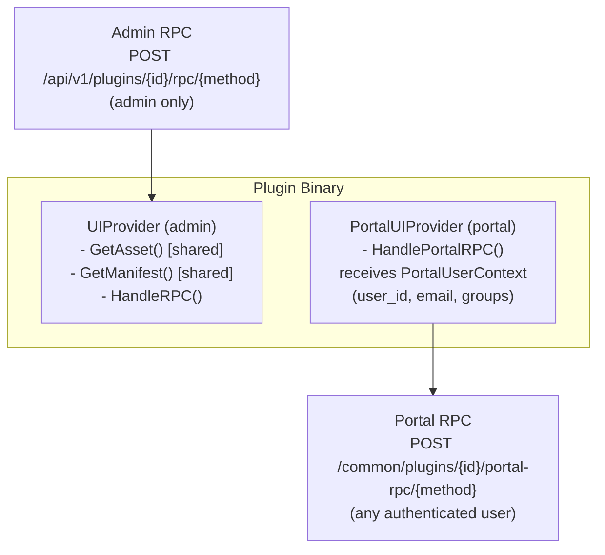

## Availability

| Edition   | Deployment Type |
| :------------- | :---------------------- |
| [Community](ai-management/ai-studio/overview#community-edition) & [Enterprise](ai-management/ai-studio/overview#enterprise-edition) | Self-Managed, Hybrid |

Portal UI plugins extend the **AI Portal** (end-user facing) with custom pages, forms, and interactive features. Unlike [Admin UI plugins](/ai-management/ai-studio/plugins/studio-ui) which are only visible to administrators, Portal UI plugins are accessible to all authenticated portal users and support group-based visibility filtering.

## Overview

Portal UI plugins enable you to:

- **Add Portal Pages**: Register new routes in the portal navigation
- **Extend Portal Sidebar**: Add sections and links to the portal drawer
- **Serve WebComponents**: Use any frontend framework (same asset serving as admin UI)
- **Handle Portal RPC**: Define backend endpoints that receive authenticated user context
- **Control Visibility**: Restrict portal pages to specific user groups
- **Combine with Admin UI**: A single plugin can have both admin and portal interfaces

### Use Cases

- Support ticket systems for end users
- Custom resource browsers or dashboards
- User feedback and survey forms
- Forum or community features
- Self-service configuration pages
- Data submission and approval workflows

## Architecture

Portal UI plugins use a **separate security scope** from admin UI plugins. This is enforced at every level:



**Key security boundaries:**

| Aspect | Admin UI | Portal UI |
|--------|----------|-----------|
| **API prefix** | `/api/v1/plugins/` | `/common/plugins/` |
| **Auth required** | Admin only | Any authenticated user |
| **RPC handler** | `HandleRPC()` | `HandlePortalRPC()` |
| **User context** | None (admin implied) | `PortalUserContext` with user ID, email, groups |
| **gRPC method** | `Call` | `PortalCall` |
| **Hook type** | `studio_ui` | `portal_ui` |
| **Visibility** | All admins | Filterable by user group |


## Quick Start

### 1. Project Structure

```
my-portal-plugin/
├── main.go              # Plugin entry point
├── manifest.json        # Plugin manifest (embedded)
├── ui/
│   ├── portal-page.js   # Portal-facing WebComponent
│   └── admin-page.js    # Admin-facing WebComponent (optional)
└── go.mod
```

### 2. Create Manifest

The manifest declares both admin (`ui`) and portal (`portal`) UI sections. The `portal` section uses `PortalUISlot` which includes a `groups` field for visibility filtering.

```json Expandable
{
  "id": "com.example.my-portal-plugin",
  "version": "1.0.0",
  "name": "My Portal Plugin",
  "capabilities": {
    "hooks": ["studio_ui", "portal_ui"]
  },
  "permissions": {
    "ui": ["sidebar.register", "route.register"],
    "portal_ui": ["sidebar.register", "route.register"],
    "kv": ["read", "write"],
    "rpc": ["call"]
  },
  "ui": {
    "slots": [
      {
        "slot": "sidebar.section",
        "label": "Plugin Admin",
        "icon": "settings",
        "items": [
          {
            "type": "route",
            "path": "/admin/my-plugin",
            "title": "Manage",
            "mount": {
              "kind": "webc",
              "tag": "my-plugin-admin",
              "entry": "/ui/admin-page.js"
            }
          }
        ]
      }
    ]
  },
  "portal": {
    "slots": [
      {
        "slot": "portal_sidebar.section",
        "label": "My Feature",
        "icon": "star",
        "groups": [],
        "items": [
          {
            "type": "route",
            "path": "/portal/plugins/my-feature",
            "title": "My Feature",
            "mount": {
              "kind": "webc",
              "tag": "my-plugin-portal",
              "entry": "/ui/portal-page.js"
            }
          }
        ]
      }
    ]
  }
}
```

### Group-Based Visibility

The `groups` field on portal slots controls which users can see the page:

| `groups` value | Visibility |
|---|---|
| `[]` (empty array) | All portal users |
| `["engineering", "support"]` | Users in at least one of these groups |
| `["admin-team"]` | Only users in the "admin-team" group |

The filtering happens server-side — the portal UI registry and sidebar menu endpoints only return entries the authenticated user is allowed to see.

### 3. Implement the Plugin

A portal UI plugin must implement **both** `UIProvider` (for assets and manifest) and `PortalUIProvider` (for portal RPC):

```go Expandable
package main

import (
    "embed"
    "encoding/json"
    "fmt"
    "strings"

    "github.com/TykTechnologies/midsommar/v2/pkg/plugin_sdk"
    pb "github.com/TykTechnologies/midsommar/v2/proto"
)

//go:embed manifest.json
var manifestFile []byte

//go:embed ui/*
var uiAssets embed.FS

type MyPortalPlugin struct {
    plugin_sdk.BasePlugin
}

func NewMyPortalPlugin() *MyPortalPlugin {
    return &MyPortalPlugin{
        BasePlugin: plugin_sdk.NewBasePlugin(
            "my-portal-plugin",
            "1.0.0",
            "Plugin with portal UI",
        ),
    }
}

func (p *MyPortalPlugin) Initialize(ctx plugin_sdk.Context, config map[string]string) error {
    ctx.Services.Logger().Info("Portal plugin initialized")
    return nil
}

// --- UIProvider (required for asset serving and manifest) ---

func (p *MyPortalPlugin) GetAsset(assetPath string) ([]byte, string, error) {
    path := strings.TrimPrefix(assetPath, "/")
    content, err := uiAssets.ReadFile(path)
    if err != nil {
        return nil, "", fmt.Errorf("asset not found: %s", path)
    }

    mimeType := "application/octet-stream"
    if strings.HasSuffix(path, ".js") {
        mimeType = "application/javascript"
    } else if strings.HasSuffix(path, ".css") {
        mimeType = "text/css"
    }

    return content, mimeType, nil
}

func (p *MyPortalPlugin) ListAssets(pathPrefix string) ([]*pb.AssetInfo, error) {
    return nil, nil
}

func (p *MyPortalPlugin) GetManifest() ([]byte, error) {
    return manifestFile, nil
}

// HandleRPC processes admin RPC calls (admin-only)
func (p *MyPortalPlugin) HandleRPC(method string, payload []byte) ([]byte, error) {
    switch method {
    case "admin_get_data":
        // Admin-only operations
        return json.Marshal(map[string]interface{}{"status": "ok"})
    default:
        return nil, fmt.Errorf("unknown admin method: %s", method)
    }
}

// --- PortalUIProvider (required for portal RPC) ---

// HandlePortalRPC processes portal RPC calls (any authenticated user)
func (p *MyPortalPlugin) HandlePortalRPC(
    method string,
    payload []byte,
    userCtx *plugin_sdk.PortalUserContext,
) ([]byte, error) {
    switch method {
    case "get_user_data":
        // userCtx provides authenticated user info
        return json.Marshal(map[string]interface{}{
            "user_id": userCtx.UserID,
            "email":   userCtx.Email,
            "groups":  userCtx.Groups,
        })
    case "submit_form":
        // Process user form submission
        return p.handleFormSubmission(payload, userCtx)
    default:
        return nil, fmt.Errorf("unknown portal method: %s", method)
    }
}

func main() {
    plugin_sdk.Serve(NewMyPortalPlugin())
}
```

### 4. Create Portal WebComponent

Portal WebComponents receive a `portalPluginAPI` object (injected by the portal plugin loader) for making RPC calls:

```javascript Expandable
class MyPortalPage extends HTMLElement {
  constructor() {
    super();
    this.attachShadow({ mode: 'open' });
  }

  connectedCallback() {
    this.render();
    this.waitForAPIAndLoad();
  }

  // Wait for portalPluginAPI injection by the React wrapper
  waitForAPIAndLoad(attempts = 0) {
    if (this.portalPluginAPI) {
      this.loadData();
      return;
    }
    if (attempts < 20) {
      setTimeout(() => this.waitForAPIAndLoad(attempts + 1), 100);
    }
  }

  render() {
    this.shadowRoot.innerHTML = `
      <style>
        :host { display: block; padding: 24px; }
      </style>
      <h2>My Portal Page</h2>
      <div id="content">Loading...</div>
      <button id="submit">Submit</button>
    `;

    this.shadowRoot.getElementById('submit')
      .addEventListener('click', () => this.handleSubmit());
  }

  async loadData() {
    try {
      const result = await this.portalPluginAPI.call('get_user_data', {});
      this.shadowRoot.getElementById('content').textContent =
        `Hello ${result.email}!`;
    } catch (err) {
      console.error('Failed to load data:', err);
    }
  }

  async handleSubmit() {
    try {
      const result = await this.portalPluginAPI.call('submit_form', {
        title: 'My submission',
        data: { key: 'value' }
      });
      console.log('Submitted:', result);
    } catch (err) {
      console.error('Submit failed:', err);
    }
  }
}

customElements.define('my-plugin-portal', MyPortalPage);
```

**Key difference from admin WebComponents:**
- Admin components receive `this.pluginAPI` (routes to `HandleRPC`)
- Portal components receive `this.portalPluginAPI` (routes to `HandlePortalRPC`)

### 5. Create Admin WebComponent (Optional)

If your plugin also has an admin interface, create a separate WebComponent that uses `this.pluginAPI`:

```javascript Expandable
class MyPluginAdmin extends HTMLElement {
  connectedCallback() {
    this.render();
    this.waitForAPIAndLoad();
  }

  waitForAPIAndLoad(attempts = 0) {
    if (this.pluginAPI) {
      this.loadData();
      return;
    }
    if (attempts < 20) {
      setTimeout(() => this.waitForAPIAndLoad(attempts + 1), 100);
    }
  }

  async loadData() {
    // Uses admin RPC (HandleRPC) - only accessible to admins
    const result = await this.pluginAPI.call('admin_get_data', {});
  }
}

customElements.define('my-plugin-admin', MyPluginAdmin);
```

## PortalUserContext

Every portal RPC call includes a `PortalUserContext` with the authenticated user's information:

```go
type PortalUserContext struct {
    UserID   uint32            // Database user ID
    Email    string            // User email address
    Name     string            // Display name
    IsAdmin  bool              // Whether user has admin role
    Groups   []string          // Group names the user belongs to
    Metadata map[string]string // Additional user metadata
}
```

Use this context for:
- **Authorization**: Check if the user has permission for the requested operation
- **Data scoping**: Return only data belonging to the calling user
- **Audit logging**: Record who performed each action
- **Group-based features**: Enable features based on group membership

```go Expandable
func (p *MyPlugin) HandlePortalRPC(
    method string,
    payload []byte,
    userCtx *plugin_sdk.PortalUserContext,
) ([]byte, error) {
    // Only allow members of "premium" group
    isPremium := false
    for _, g := range userCtx.Groups {
        if g == "premium" {
            isPremium = true
            break
        }
    }
    if !isPremium {
        return json.Marshal(map[string]interface{}{
            "error": "This feature requires premium access",
        })
    }

    // ... handle request
}
```

## Manifest Reference

### Portal Slots

The `portal` section in the manifest is parallel to the `ui` section:

```json Expandable
{
  "portal": {
    "slots": [
      {
        "slot": "portal_sidebar.section",
        "label": "Section Label",
        "icon": "icon-name",
        "groups": ["group1", "group2"],
        "items": [
          {
            "type": "route",
            "path": "/portal/plugins/my-feature/page1",
            "title": "Page Title",
            "mount": {
              "kind": "webc",
              "tag": "my-component-tag",
              "entry": "/ui/my-component.js"
            }
          }
        ]
      }
    ]
  }
}
```

| Field | Type | Required | Description |
|-------|------|----------|-------------|
| `slot` | string | Yes | Slot identifier. Currently supports `portal_sidebar.section` |
| `label` | string | Yes | Display label in the sidebar |
| `icon` | string | No | Icon name for the sidebar entry |
| `groups` | string[] | No | Allowed user groups. Empty = all portal users |
| `items` | array | Yes | Routes/components to register |
| `items[].type` | string | Yes | Must be `"route"` |
| `items[].path` | string | Yes | Route path (should start with `/portal/plugins/`) |
| `items[].title` | string | Yes | Page title |
| `items[].mount.kind` | string | Yes | Mount type: `"webc"` or `"iframe"` |
| `items[].mount.tag` | string | Yes | Custom element tag name |
| `items[].mount.entry` | string | Yes | JavaScript entry point path |

### Capabilities and Permissions

Portal UI plugins must declare both hook types and permissions:

```json
{
  "capabilities": {
    "hooks": ["studio_ui", "portal_ui"]
  },
  "permissions": {
    "ui": ["sidebar.register", "route.register"],
    "portal_ui": ["sidebar.register", "route.register"]
  }
}
```

- `studio_ui` in hooks enables admin UI + asset serving
- `portal_ui` in hooks enables portal RPC handling
- Both are required for a plugin with portal UI (assets are served via `UIProvider`)

### Route Path Convention

Portal plugin routes should follow the pattern `/portal/plugins/{plugin-name}/{page}` to avoid conflicts with built-in portal routes:

```
/portal/plugins/feedback              # Single-page plugin
/portal/plugins/support/tickets       # Multi-page plugin
/portal/plugins/support/new-ticket    # Multi-page plugin
```

## API Endpoints

Portal plugin API endpoints are under `/common/` (authenticated, no admin required):

| Endpoint | Method | Description |
|----------|--------|-------------|
| `/common/plugins/portal-ui-registry` | GET | Get portal UI components (filtered by user groups) |
| `/common/plugins/portal-sidebar-menu` | GET | Get portal sidebar items (filtered by user groups) |
| `/common/plugins/:id/portal-rpc/:method` | POST | Call portal RPC method on plugin |
| `/common/plugins/assets/:id/*filepath` | GET | Serve plugin static assets |

### Portal RPC Call Flow

```
Portal UI (WebComponent)
    │  this.portalPluginAPI.call('method', payload)
    ▼
pubClient.post('/common/plugins/{id}/portal-rpc/{method}', payload)
    │  (AuthMiddleware - any authenticated user)
    ▼
callPortalPluginRPC handler
    │  1. Validate plugin active + loaded + supports portal_ui
    │  2. Build PortalUserContext from authenticated user
    ▼
AIStudioPluginManager.CallPluginPortalRPC()
    │  gRPC PortalCall with user context
    ▼
Plugin's HandlePortalRPC(method, payload, userCtx)
    │  Plugin processes request with user info
    ▼
JSON response → WebComponent
```

## Example: Portal Feedback Plugin

A complete working example is available at [`examples/plugins/studio/portal-feedback/`](https://github.com/TykTechnologies/ai-studio/tree/main/examples/plugins/studio/portal-feedback).

This plugin demonstrates:
- Portal form for users to submit feedback (`HandlePortalRPC`)
- Admin dashboard to view all submissions (`HandleRPC`)
- Shared asset serving between admin and portal UIs
- Group-based visibility (set to `[]` for all users)
- `waitForAPIAndLoad()` pattern for WebComponent API injection timing

## Best Practices

### Security

1. **Never trust portal input** - Always validate and sanitize data in `HandlePortalRPC`
2. **Scope data to users** - Use `userCtx.UserID` to ensure users only see their own data
3. **Keep admin operations in HandleRPC** - Destructive operations (delete, admin overrides) should stay in the admin-only `HandleRPC` method
4. **Check groups in RPC handlers** - Even though sidebar visibility is filtered, users could call the RPC endpoint directly. Validate group membership in `HandlePortalRPC` for sensitive operations

### Performance

1. **Use KV storage for persistence** - In-memory data is lost on plugin restart
2. **Cache frequently accessed data** - Use `sync.Map` or similar for hot data
3. **Keep portal pages lightweight** - Portal users expect fast page loads

### WebComponent Patterns

1. **Wait for API injection** - Use the `waitForAPIAndLoad()` pattern instead of calling the API in `connectedCallback()` directly
2. **Handle errors gracefully** - Show user-friendly messages, not stack traces
3. **Use Shadow DOM** - Prevents style conflicts with the host application
4. **Escape user content** - Always escape HTML in dynamic content to prevent XSS

