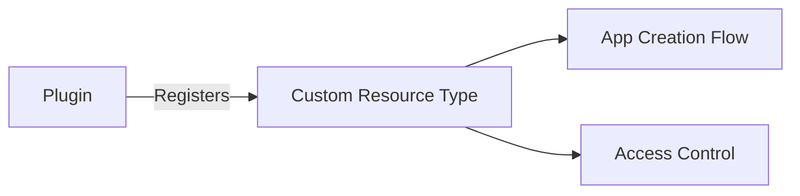

Resource Provider plugins allow you to **register custom resource types** that integrate into the App creation flow, participate in privacy scoring, and work with the group-based access control model. This enables plugins to extend the platform's governance model with new kinds of resources beyond the built-in LLMs, Datasources, and Tools.

## Overview

By default, Apps in AI Studio bundle three built-in resource types: LLMs, Datasources, and Tools. The Resource Provider capability lets plugins register additional resource types that:

- **Appear in the Create App form** as selectable resources (via a plugin-provided Web Component or a platform-rendered multi-select)
- **Participate in privacy scoring** with the generalized rule: no resource privacy score may exceed the maximum LLM privacy score in the app
- **Integrate with group-based access control** so admins can assign resource instances to groups, and users only see resources available to their groups
- **Support the community submission workflow** so end-users can submit new resource instances for admin review
- **Propagate to gateways** via the config snapshot, so gateway plugins can access resource associations at runtime

### Use Cases

- **MCP Server Registry**: Register MCP servers as a resource type, let users bundle them into Apps
- **Vector Store Catalog**: Expose vector databases with privacy scores for RAG pipelines
- **API Connectors**: Custom API integrations that need governance and access control
- **Knowledge Bases**: Document collections with sensitivity classifications

### How It Works

```
Plugin declares resource types via manifest or GetResourceTypeRegistrations()
    |
Platform registers types in DB, shows them in the App Form
    |
Admin assigns instances to Groups (direct mapping, no catalogues)
    |
User creates App -> selects resources from their accessible instances
    |
Platform validates privacy scores + calls plugin's ValidateResourceSelection()
    |
Associations stored in app_plugin_resources join table
    |
Config snapshot includes associations for gateway access
```

## Implementing a Resource Provider

### 1. Implement the ResourceProvider Interface

```go
import "github.com/TykTechnologies/midsommar/v2/pkg/plugin_sdk"

type MyPlugin struct {
    plugin_sdk.BasePlugin
}

// GetResourceTypeRegistrations declares the resource types this plugin provides.
// Called once after Initialize() and again on plugin reload.
func (p *MyPlugin) GetResourceTypeRegistrations() ([]*plugin_sdk.ResourceTypeRegistration, error) {
    return []*plugin_sdk.ResourceTypeRegistration{
        {
            Slug:            "mcp_servers",
            Name:            "MCP Servers",
            Description:     "Model Context Protocol servers for tool access",
            Icon:            "Hub",
            HasPrivacyScore: true,
            SupportsSubmissions: true,
            // FormComponent: nil means the platform renders a standard multi-select
        },
    }, nil
}

// ListResourceInstances returns all instances for the App form selector.
func (p *MyPlugin) ListResourceInstances(ctx plugin_sdk.Context, slug string) ([]*plugin_sdk.ResourceInstance, error) {
    // Load from plugin KV, external API, or any storage
    servers, err := p.loadServers(ctx)
    if err != nil {
        return nil, err
    }

    var instances []*plugin_sdk.ResourceInstance
    for _, s := range servers {
        instances = append(instances, &plugin_sdk.ResourceInstance{
            ID:           s.ID,
            Name:         s.Name,
            Description:  s.Description,
            PrivacyScore: s.PrivacyScore,
            IsActive:     s.IsActive,
        })
    }
    return instances, nil
}

// GetResourceInstance retrieves a single instance by ID.
func (p *MyPlugin) GetResourceInstance(ctx plugin_sdk.Context, slug, instanceID string) (*plugin_sdk.ResourceInstance, error) {
    server, err := p.loadServer(ctx, instanceID)
    if err != nil {
        return nil, err
    }
    return &plugin_sdk.ResourceInstance{
        ID:           server.ID,
        Name:         server.Name,
        PrivacyScore: server.PrivacyScore,
        IsActive:     server.IsActive,
    }, nil
}

// ValidateResourceSelection is called during app create/update.
// Use this for cross-instance validation (e.g., "max 3 servers per app").
func (p *MyPlugin) ValidateResourceSelection(ctx plugin_sdk.Context, slug string, instanceIDs []string, appID uint32) error {
    if len(instanceIDs) > 5 {
        return fmt.Errorf("maximum 5 MCP servers per app")
    }
    return nil
}

// CreateResourceInstance is called when a community submission is approved.
func (p *MyPlugin) CreateResourceInstance(ctx plugin_sdk.Context, slug string, payload []byte) (*plugin_sdk.ResourceInstance, error) {
    var req CreateServerRequest
    if err := json.Unmarshal(payload, &req); err != nil {
        return nil, err
    }

    server := p.createServer(ctx, req)
    return &plugin_sdk.ResourceInstance{
        ID:   server.ID,
        Name: server.Name,
    }, nil
}
```

### 2. Declare in the Manifest

Add the `resource_types` section to your plugin manifest:

```json
{
  "id": "com.example.mcp-registry",
  "name": "MCP Registry",
  "version": "1.0.0",
  "capabilities": {
    "hooks": ["resource_provider", "studio_ui"]
  },
  "resource_types": [
    {
      "slug": "mcp_servers",
      "name": "MCP Servers",
      "description": "Model Context Protocol servers for tool access",
      "icon": "Hub",
      "has_privacy_score": true,
      "supports_submissions": true
    }
  ]
}
```

Resource types declared in the manifest are automatically registered when the plugin loads. The `GetResourceTypeRegistrations()` method provides a runtime fallback and can return additional types not in the manifest.

### 3. Serve the Plugin

```go
func main() {
    plugin_sdk.Serve(NewMyPlugin())
}
```

## ResourceProvider Interface Reference

| Method | When Called | Purpose |
|--------|-----------|---------|
| `GetResourceTypeRegistrations()` | Plugin load/reload | Declare resource types |
| `ListResourceInstances(ctx, slug)` | App form load, Group form load | List available instances |
| `GetResourceInstance(ctx, slug, id)` | Config snapshot build | Get instance details for gateway |
| `ValidateResourceSelection(ctx, slug, ids, appID)` | App create/update | Custom validation logic |
| `CreateResourceInstance(ctx, slug, payload)` | Submission approval | Create instance from approved submission |

## SDK Types

### ResourceTypeRegistration

```go
type ResourceTypeRegistration struct {
    Slug                string                 // Machine-readable ID (unique per plugin)
    Name                string                 // Display name in the UI
    Description         string                 // Help text
    Icon                string                 // Material icon name or asset path
    HasPrivacyScore     bool                   // Whether instances carry privacy scores
    SupportsSubmissions bool                   // Whether community submissions are supported
    FormComponent       *ResourceFormComponent // Custom Web Component (nil = standard multi-select)
}
```

### ResourceInstance

```go
type ResourceInstance struct {
    ID           string // Plugin-assigned unique identifier
    Name         string // Display name
    Description  string // Optional description
    PrivacyScore int    // 0-100 (only meaningful if type has HasPrivacyScore)
    Metadata     []byte // Opaque JSON included in config snapshots
    IsActive     bool   // Whether instance is currently usable
}
```

> **Security**: Do not store secrets, credentials, or PII in the `Metadata` field. Metadata is propagated to all gateways via config snapshots, cached in database join tables, and may appear in logs or be accessible to other plugins with access to the app configuration.

### ResourceFormComponent

```go
type ResourceFormComponent struct {
    Tag        string // Web Component custom element tag (e.g., "mcp-server-selector")
    EntryPoint string // JS asset path relative to plugin root (e.g., "ui/webc/selector.js")
}
```

## Privacy Scoring

When `HasPrivacyScore` is `true`, each resource instance carries a privacy score (0-100). The platform enforces a generalized rule during app creation and updates:

> **No resource privacy score may exceed the maximum LLM privacy score in the app.**

This applies to both built-in datasources and plugin resources. For example:

| Resource | Privacy Score | Result |
|----------|:---:|--------|
| LLM "GPT-4 Enterprise" | 80 | Max LLM score = 80 |
| Datasource "Internal DB" | 60 | OK `(60 <= 80)` |
| Plugin resource "MCP Server A" | 70 | OK `(70 <= 80)` |
| Plugin resource "MCP Server B" | 90 | **Rejected** (90 > 80) |

The plugin sets privacy scores on instances via the `PrivacyScore` field in `ResourceInstance`. Admins review and approve these scores through the submission workflow.

## Access Control

Plugin resource instances use **direct group mapping** instead of the catalogue pattern used by built-in types. This is simpler and sufficient since plugins organize their own resources.

### Access Chain

```
User -> Group -> Plugin Resource Instance (direct)
```

Compare with built-in types:
```
User -> Group -> Catalogue -> LLM/Datasource/Tool
```

### Admin Workflow

1. Admin navigates to **Teams** (Groups) in the admin UI
2. Opens a group and scrolls to the **Plugin Resources** section
3. For each registered resource type, selects which instances this group can access
4. Saves the group

### User Experience

When a user creates an App, they only see resource instances accessible via their group memberships. Admins bypass this filter and see all instances.

## Custom Form Components

For richer selection UX, plugins can provide a **Web Component** instead of the platform's standard multi-select. Declare it in the `FormComponent` field:

```go
FormComponent: &plugin_sdk.ResourceFormComponent{
    Tag:        "mcp-server-selector",
    EntryPoint: "ui/webc/mcp-selector.js",
},
```

The platform loads your Web Component JS from plugin assets and renders it in the App form. The contract:

### Injected Properties

| Property | Type | Description |
|----------|------|-------------|
| `data-selected-ids` | JSON `string[]` | Currently selected instance IDs |
| `data-app-id` | `string` | App ID (empty on create) |
| `data-mode` | `"create"` or `"edit"` | Form mode |
| `pluginAPI.call(method, payload)` | function | Make RPC calls to your plugin backend |
| `pluginAPI.listInstances()` | function | List available instances |

### Events to Dispatch

| Event | Detail | Description |
|-------|--------|-------------|
| `selection-change` | `{ selectedIds: string[] }` | Dispatch when user changes selection |

### Example Web Component

```javascript
class MCPServerSelector extends HTMLElement {
  connectedCallback() {
    this.render();

    // Listen for attribute changes from the platform
    const observer = new MutationObserver(() => this.render());
    observer.observe(this, { attributes: true });
  }

  async render() {
    const selectedIds = JSON.parse(this.getAttribute('data-selected-ids') || '[]');
    const instances = await this.pluginAPI.listInstances();

    this.innerHTML = `
      <div class="mcp-selector">
        ${instances.data.map(inst => `
          <label>
            <input type="checkbox" value="${inst.id}"
              ${selectedIds.includes(inst.id) ? 'checked' : ''}>
            ${inst.name} (Privacy: ${inst.privacy_score})
          </label>
        `).join('')}
      </div>
    `;

    this.querySelectorAll('input').forEach(input => {
      input.addEventListener('change', () => {
        const selected = [...this.querySelectorAll('input:checked')]
          .map(el => el.value);
        this.dispatchEvent(new CustomEvent('selection-change', {
          detail: { selectedIds: selected }
        }));
      });
    });
  }
}

customElements.define('mcp-server-selector', MCPServerSelector);
```

## Gateway Integration

Plugin resource associations are included in the config snapshot sent to gateways. Each `AppConfig` includes a `plugin_resources` field:

```protobuf
message PluginResourceAssociation {
    uint32 plugin_id = 1;
    string resource_type_slug = 2;
    repeated string instance_ids = 3;
    repeated ResourceInstanceSnapshot instances = 4;
}
```

Gateway plugins can access these associations from the app's config to make routing or authorization decisions. For example, an MCP proxy plugin could check if the requesting app has access to a specific MCP server by examining the `plugin_resources` field.

## Community Submissions

When `SupportsSubmissions` is `true`, community users can submit new resource instances through the existing submission workflow:

1. User fills out a submission form with `resource_type: "plugin"` and a `plugin_resource_type_id`
2. The `resource_payload` contains plugin-defined JSON describing the new instance
3. Admin reviews the submission (including a suggested privacy score)
4. On approval, the platform calls the plugin's `CreateResourceInstance()` with the payload
5. The plugin creates the instance and returns its ID
6. The instance becomes available for selection in the App form

## Manifest Reference

```json
{
  "resource_types": [
    {
      "slug": "string (required)",
      "name": "string (required)",
      "description": "string",
      "icon": "string",
      "has_privacy_score": false,
      "supports_submissions": false,
      "form_component": {
        "tag": "string (custom element tag)",
        "entry_point": "string (JS asset path)"
      }
    }
  ]
}
```

| Field | Required | Default | Description |
|-------|:---:|:---:|-------------|
| `slug` | Yes | - | Machine-readable identifier, unique per plugin |
| `name` | Yes | - | Human-readable display name |
| `description` | No | `""` | Description shown in the App form |
| `icon` | No | `""` | Material icon name or plugin asset path |
| `has_privacy_score` | No | `false` | Whether instances carry privacy scores |
| `supports_submissions` | No | `false` | Whether community submissions are enabled |
| `form_component` | No | `null` | Custom Web Component for the App form (null = standard multi-select) |

## API Endpoints

These endpoints are available for frontend integration:

| Method | Path | Description |
|--------|------|-------------|
| `GET` | `/api/v1/plugin-resource-types` | List all active registered resource types |
| `GET` | `/api/v1/apps/:id/plugin-resources` | Get plugin resources for an app |
| `GET` | `/api/v1/groups/:id/plugin-resources` | Get plugin resource access for a group |
| `PUT` | `/api/v1/groups/:id/plugin-resources` | Set plugin resource access for a group (admin) |

### Set Group Plugin Resources

```bash
curl -X PUT /api/v1/groups/5/plugin-resources \
  -H "Authorization: Bearer $TOKEN" \
  -d '{
    "resources": [
      {
        "plugin_id": 1,
        "resource_type_slug": "mcp_servers",
        "instance_ids": ["server-1", "server-2"]
      }
    ]
  }'
```

## Combining with Other Capabilities

Resource Provider plugins often combine with other capabilities for a complete solution:

| Combination | Purpose |
|------------|---------|
| ResourceProvider + UIProvider | Admin UI for managing resource instances |
| ResourceProvider + PortalUIProvider | Portal self-service for resource browsing |
| ResourceProvider + CustomEndpointHandler | Gateway proxy for resource access (e.g., MCP proxy) |
| ResourceProvider + EdgePayloadReceiver | Aggregate analytics from gateway resource usage |
| ResourceProvider + ConfigProvider | Admin-configurable plugin settings |

### Example: Complete MCP Registry Plugin

```go
type MCPRegistryPlugin struct {
    plugin_sdk.BasePlugin
}

// ResourceProvider - register MCP servers as a resource type
func (p *MCPRegistryPlugin) GetResourceTypeRegistrations() ([]*plugin_sdk.ResourceTypeRegistration, error) { ... }
func (p *MCPRegistryPlugin) ListResourceInstances(ctx plugin_sdk.Context, slug string) ([]*plugin_sdk.ResourceInstance, error) { ... }
func (p *MCPRegistryPlugin) GetResourceInstance(ctx plugin_sdk.Context, slug, id string) (*plugin_sdk.ResourceInstance, error) { ... }
func (p *MCPRegistryPlugin) ValidateResourceSelection(ctx plugin_sdk.Context, slug string, ids []string, appID uint32) error { ... }
func (p *MCPRegistryPlugin) CreateResourceInstance(ctx plugin_sdk.Context, slug string, payload []byte) (*plugin_sdk.ResourceInstance, error) { ... }

// UIProvider - admin UI for server management
func (p *MCPRegistryPlugin) GetAsset(path string) ([]byte, string, error) { ... }
func (p *MCPRegistryPlugin) GetManifest() ([]byte, error) { ... }
func (p *MCPRegistryPlugin) HandleRPC(method string, payload []byte) ([]byte, error) { ... }

// CustomEndpointHandler - gateway proxy for MCP requests
func (p *MCPRegistryPlugin) GetEndpointRegistrations() ([]*pb.EndpointRegistration, error) { ... }
func (p *MCPRegistryPlugin) HandleEndpointRequest(ctx plugin_sdk.Context, req *pb.EndpointRequest) (*pb.EndpointResponse, error) { ... }
```
