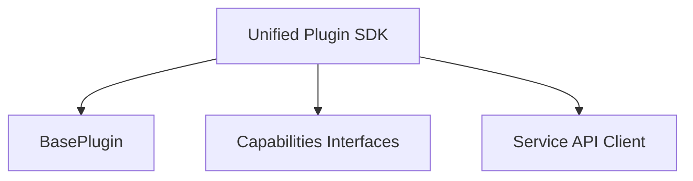

## Availability

| Edition   | Deployment Type |
| :------------- | :---------------------- |
| [Community](ai-management/ai-studio/overview#community-edition) & [Enterprise](ai-management/ai-studio/overview#enterprise-edition) | Self-Managed, Hybrid |



Tyk AI Studio provides a **Unified Plugin SDK** that works seamlessly in both AI Studio and Edge Gateway contexts with a single API. This guide covers the core SDK concepts, capabilities, and patterns.

## Unified SDK Overview

The Unified SDK (`pkg/plugin_sdk`) is the modern, recommended approach for all plugin development. It provides:

- **Single Import**: One SDK works in both AI Studio and Edge Gateway
- **Automatic Runtime Detection**: SDK detects the execution environment
- **Capability-Based Design**: Implement only what you need
- **Type-Safe**: Clean Go types, no manual proto handling
- **Service Access**: Built-in KV storage, logging, events, and management APIs
- **Context-Rich**: Access to app, user, LLM metadata in every call

### Installation

```bash
go get github.com/TykTechnologies/midsommar/v2/pkg/plugin_sdk
```

### Basic Plugin Structure

```go Expandable
import "github.com/TykTechnologies/midsommar/v2/pkg/plugin_sdk"

type MyPlugin struct {
    plugin_sdk.BasePlugin
    // Plugin-specific fields
}

func NewMyPlugin() *MyPlugin {
    return &MyPlugin{
        BasePlugin: plugin_sdk.NewBasePlugin(
            "my-plugin",
            "1.0.0",
            "My plugin description",
        ),
    }
}

func (p *MyPlugin) Initialize(ctx plugin_sdk.Context, config map[string]string) error {
    // Initialize plugin
    return nil
}

func main() {
    plugin_sdk.Serve(NewMyPlugin())
}
```

## Plugin Capabilities

Plugins implement one or more capability interfaces. The SDK supports 15 distinct capabilities:

| Capability | Interface | Where It Works | Purpose |
|------------|-----------|----------------|---------|
| **Pre-Auth** | `PreAuthHandler` | Studio + Gateway | Process requests before authentication |
| **Auth** | `AuthHandler` | Studio + Gateway | Custom authentication with credential lookup |
| **Post-Auth** | `PostAuthHandler` | Studio + Gateway | Process requests after authentication (most common) |
| **Response** | `ResponseHandler` | Studio + Gateway | Modify response headers and body |
| **Data Collection** | `DataCollector` | Studio + Gateway | Collect telemetry (analytics, budgets, proxy logs) |
| **[Custom Endpoints](/ai-management/ai-studio/plugins/custom-endpoints)** | `CustomEndpointHandler` | Gateway | Serve custom HTTP endpoints under `/plugins/{slug}/` |
| **UI Provider** | `UIProvider` | Studio only | Serve admin web UI assets |
| **[Portal UI](/ai-management/ai-studio/plugins/portal-ui)** | `PortalUIProvider` | Studio only | Portal-facing pages and forms with user context |
| **Config Provider** | `ConfigProvider` | Studio + Gateway | Provide JSON Schema configuration |
| **Manifest Provider** | `ManifestProvider` | Gateway only | Provide plugin manifest (gateway-only plugins) |
| **Agent** | `AgentPlugin` | Studio only | Conversational AI agent with streaming |
| **Object Hooks** | `ObjectHookHandler` | Studio only | Intercept CRUD operations on objects |
| **Scheduler** | `SchedulerPlugin` | Studio only | Execute tasks on cron-based schedules |
| **Edge Payload** | `EdgePayloadReceiver` | Studio only | Receive data from edge (gateway) plugins |
| **[Resource Provider](/ai-management/ai-studio/plugins/resource-types)** | `ResourceProvider` | Studio only | Register custom resource types for Apps with privacy scoring |

### Multi-Capability Plugins

A single plugin can implement multiple capabilities. For example, a rate limiter might implement:
- `PostAuthHandler` - Check limits before request
- `ResponseHandler` - Update counters after response
- `UIProvider` - Provide management UI

```go Expandable
type RateLimiter struct {
    plugin_sdk.BasePlugin
}

// Implement PostAuthHandler
func (p *RateLimiter) HandlePostAuth(ctx plugin_sdk.Context, req *pb.EnrichedRequest) (*pb.PluginResponse, error) {
    // Check rate limits
}

// Implement ResponseHandler
func (p *RateLimiter) OnBeforeWriteHeaders(ctx plugin_sdk.Context, req *pb.ResponseWriteRequest) (*pb.ResponseWriteResponse, error) {
    // Update counters
}

// Implement UIProvider
func (p *RateLimiter) GetAsset(path string) ([]byte, string, error) {
    // Serve UI assets
}
```

## Core Interfaces

### 1. PreAuthHandler

Process requests **before** authentication. Useful for IP filtering, request validation, etc.

```go
type PreAuthHandler interface {
    HandlePreAuth(ctx Context, req *pb.EnrichedRequest) (*pb.PluginResponse, error)
}
```

**Example:**
```go
func (p *MyPlugin) HandlePreAuth(ctx plugin_sdk.Context, req *pb.EnrichedRequest) (*pb.PluginResponse, error) {
    // Block requests from specific IPs
    if isBlockedIP(req.ClientIp) {
        return &pb.PluginResponse{
            Block:        true,
            ErrorMessage: "IP blocked",
        }, nil
    }
    return &pb.PluginResponse{Modified: false}, nil
}
```

### 2. AuthHandler

Custom authentication with credential lookup. This interface requires **three methods** to fully integrate with the access control system.

```go
type AuthHandler interface {
    Plugin
    HandleAuth(ctx Context, req *pb.AuthRequest) (*pb.AuthResponse, error)
    GetAppByCredential(ctx Context, credential string) (*pb.App, error)
    GetUserByCredential(ctx Context, credential string) (*pb.User, error)
}
```

#### Why App Linking Is Critical

**A valid credential alone is not enough.** The system requires an associated App object because Apps provide the access control context:

- **Policy enforcement** - Rate limits, usage quotas, and restrictions
- **Tool/Datasource permissions** - Which tools and datasources the credential can access
- **LLM restrictions** - Which LLMs the credential is allowed to use
- **Budget controls** - Cost tracking and spending limits

Without a valid App association, authenticated requests will fail even if the credential itself is valid.

#### Authentication Flow

1. **`HandleAuth()`** - Validates the credential and returns an App ID and User ID
2. **`GetAppByCredential()`** - System calls this to fetch the full App object for access control
3. **`GetUserByCredential()`** - System calls this to fetch the User object for identity context

#### Example Implementation

```go Expandable
type MyAuthPlugin struct {
    plugin_sdk.BasePlugin
    tokenStore map[string]*TokenConfig // Maps tokens to app/user IDs
}

// HandleAuth validates the credential and returns App/User IDs
func (p *MyAuthPlugin) HandleAuth(ctx plugin_sdk.Context, req *pb.AuthRequest) (*pb.AuthResponse, error) {
    // Extract token from request
    token := req.Credential
    if token == "" {
        return &pb.AuthResponse{
            Authenticated: false,
            ErrorMessage:  "No credential provided",
        }, nil
    }

    // Validate token and look up associated IDs
    tokenConfig, valid := p.tokenStore[token]
    if !valid {
        return &pb.AuthResponse{
            Authenticated: false,
            ErrorMessage:  "Invalid token",
        }, nil
    }

    // CRITICAL: Return the App ID - this links the credential to access control
    return &pb.AuthResponse{
        Authenticated: true,
        AppId:         tokenConfig.AppID,   // Must be a valid App in the database
        UserId:        tokenConfig.UserID,
    }, nil
}

// GetAppByCredential fetches the App object for access control enforcement
func (p *MyAuthPlugin) GetAppByCredential(ctx plugin_sdk.Context, credential string) (*pb.App, error) {
    tokenConfig, ok := p.tokenStore[credential]
    if !ok {
        return nil, fmt.Errorf("unknown credential")
    }

    // Fetch the App from the Service API
    if ctx.Runtime == plugin_sdk.RuntimeGateway {
        return ctx.Services.Gateway().GetApp(ctx, tokenConfig.AppID)
    }
    return ctx.Services.Studio().GetApp(ctx, tokenConfig.AppID)
}

// GetUserByCredential fetches the User object for identity context
func (p *MyAuthPlugin) GetUserByCredential(ctx plugin_sdk.Context, credential string) (*pb.User, error) {
    tokenConfig, ok := p.tokenStore[credential]
    if !ok {
        return nil, fmt.Errorf("unknown credential")
    }

    // Fetch the User from the Service API
    if ctx.Runtime == plugin_sdk.RuntimeGateway {
        return ctx.Services.Gateway().GetUser(ctx, tokenConfig.UserID)
    }
    return ctx.Services.Studio().GetUser(ctx, tokenConfig.UserID)
}
```

#### Common Pitfalls

| Pitfall | Symptom | Solution |
|---------|---------|----------|
| Not returning App ID | Requests fail with "no app context" | Always return a valid `AppId` in `AuthResponse` |
| App doesn't exist | 500 errors after auth success | Verify App exists in database before returning its ID |
| Not implementing `GetAppByCredential` | Compile error or runtime panic | Implement all three interface methods |
| Using wrong App ID | Permission denied for tools/LLMs | Ensure the App has the required permissions configured |

See the working example at `examples/plugins/studio/custom-auth-ui/` for a complete implementation.

### 3. PostAuthHandler

Process requests **after** authentication. Most common capability for request enrichment, policy enforcement, etc.

```go
type PostAuthHandler interface {
    HandlePostAuth(ctx Context, req *pb.EnrichedRequest) (*pb.PluginResponse, error)
}
```

**Example:**
```go Expandable
func (p *MyPlugin) HandlePostAuth(ctx plugin_sdk.Context, req *pb.EnrichedRequest) (*pb.PluginResponse, error) {
    ctx.Services.Logger().Info("Processing request",
        "app_id", ctx.AppID,
        "user_id", ctx.UserID,
    )

    // Add custom header
    req.Headers["X-Custom-Header"] = "value"

    return &pb.PluginResponse{
        Modified: true,
        Request:  req,
    }, nil
}
```

### 4. ResponseHandler

Modify response headers and body. Two methods allow phased processing:

```go
type ResponseHandler interface {
    OnBeforeWriteHeaders(ctx Context, req *pb.ResponseWriteRequest) (*pb.ResponseWriteResponse, error)
    OnBeforeWrite(ctx Context, req *pb.ResponseWriteRequest) (*pb.ResponseWriteResponse, error)
}
```

**Example:**
```go Expandable
func (p *MyPlugin) OnBeforeWriteHeaders(ctx plugin_sdk.Context, req *pb.ResponseWriteRequest) (*pb.ResponseWriteResponse, error) {
    // Add tracking header
    if req.Headers == nil {
        req.Headers = make(map[string]string)
    }
    req.Headers["X-Request-Id"] = generateRequestID()

    return &pb.ResponseWriteResponse{
        Modified: true,
        Headers:  req.Headers,
    }, nil
}

func (p *MyPlugin) OnBeforeWrite(ctx plugin_sdk.Context, req *pb.ResponseWriteRequest) (*pb.ResponseWriteResponse, error) {
    // Modify response body
    modifiedBody := transformResponse(req.Body)

    return &pb.ResponseWriteResponse{
        Modified: true,
        Body:     modifiedBody,
    }, nil
}
```

### 5. DataCollector

Collect telemetry data (analytics, budgets, proxy logs).

```go
type DataCollector interface {
    HandleProxyLog(ctx Context, log *pb.ProxyLogData) error
    HandleAnalytics(ctx Context, analytics *pb.AnalyticsData) error
    HandleBudgetUsage(ctx Context, usage *pb.BudgetUsageData) error
}
```

**Example:**
```go Expandable
func (p *MyPlugin) HandleAnalytics(ctx plugin_sdk.Context, analytics *pb.AnalyticsData) error {
    // Export analytics to external system
    return exportToElasticsearch(analytics)
}

func (p *MyPlugin) HandleBudgetUsage(ctx plugin_sdk.Context, usage *pb.BudgetUsageData) error {
    // Track budget usage
    return trackBudget(usage)
}

func (p *MyPlugin) HandleProxyLog(ctx plugin_sdk.Context, log *pb.ProxyLogData) error {
    // Log proxy requests
    return logToFile(log)
}
```

### 6. AgentPlugin

Conversational AI agent with streaming support. See [Agent Plugins Guide](/ai-management/ai-studio/plugins/studio-agent) for details.

```go
type AgentPlugin interface {
    HandleAgentMessage(req *pb.AgentMessageRequest, stream pb.PluginService_HandleAgentMessageServer) error
}
```

### 7. ObjectHookHandler

Intercept CRUD operations on AI Studio objects (LLMs, Datasources, Tools, Users). See [Object Hooks Guide](/ai-management/ai-studio/plugins/object-hooks) for complete details.

```go
type ObjectHookHandler interface {
    GetObjectHookRegistrations() ([]*pb.ObjectHookRegistration, error)
    HandleObjectHook(ctx Context, req *pb.ObjectHookRequest) (*pb.ObjectHookResponse, error)
}
```

### 8. UIProvider

Serve web UI assets for AI Studio plugins. See [UI Plugins Guide](/ai-management/ai-studio/plugins/studio-ui) for details.

```go
type UIProvider interface {
    GetAsset(path string) ([]byte, string, error)
    ListAssets() ([]string, error)
    GetManifest() ([]byte, error)
    HandleRPC(method string, payload []byte) ([]byte, error)
}
```

### 9. ConfigProvider

Provide JSON Schema for plugin configuration.

```go
type ConfigProvider interface {
    GetConfigSchema() ([]byte, error)
}
```

**Example:**
```go Expandable
func (p *MyPlugin) GetConfigSchema() ([]byte, error) {
    schema := map[string]interface{}{
        "type": "object",
        "properties": map[string]interface{}{
            "api_key": map[string]interface{}{
                "type":        "string",
                "description": "API key for external service",
            },
            "rate_limit": map[string]interface{}{
                "type":        "integer",
                "description": "Requests per minute",
                "default":     100,
            },
        },
        "required": []string{"api_key"},
    }
    return json.Marshal(schema)
}
```

### 10. ManifestProvider

Provide plugin manifest for gateway-only plugins (no UI).

```go
type ManifestProvider interface {
    GetManifest() ([]byte, error)
}
```

### 11. SchedulerPlugin

Execute tasks on cron-based schedules.

```go
type SchedulerPlugin interface {
    ExecuteScheduledTask(ctx Context, schedule *Schedule) error
}

type Schedule struct {
    ID             string                 // Unique identifier from manifest
    Name           string                 // Human-readable name
    Cron           string                 // Cron expression (e.g., "0 * * * *")
    Timezone       string                 // Timezone for cron evaluation
    Enabled        bool                   // Whether schedule is currently enabled
    TimeoutSeconds int                    // Maximum execution time
    Config         map[string]interface{} // Schedule-specific configuration
}
```

**Example:**
```go
func (p *MyPlugin) ExecuteScheduledTask(ctx plugin_sdk.Context, schedule *plugin_sdk.Schedule) error {
    ctx.Services.Logger().Info("Running scheduled task",
        "schedule_id", schedule.ID,
        "schedule_name", schedule.Name,
    )

    // Perform scheduled work
    return p.runCleanup(ctx)
}
```

### 12. EdgePayloadReceiver

Receive data from edge (Edge Gateway) plugins. This enables the hub-and-spoke communication pattern where edge plugins can send data back to the control plane. See [Edge-to-Control Communication](/ai-management/ai-studio/plugins/edge-to-control) for complete details.

```go
type EdgePayloadReceiver interface {
    AcceptEdgePayload(ctx Context, payload *EdgePayload) (handled bool, err error)
}

type EdgePayload struct {
    Payload           []byte            // Raw payload data from edge plugin
    EdgeID            string            // Edge instance identifier
    EdgeNamespace     string            // Namespace of the edge instance
    CorrelationID     string            // Correlation ID for tracking
    Metadata          map[string]string // Key-value metadata
    EdgeTimestamp     int64             // Unix timestamp when generated at edge
    ReceivedTimestamp int64             // Unix timestamp when received at control
}
```

**Example:**
```go Expandable
func (p *MyPlugin) AcceptEdgePayload(ctx plugin_sdk.Context, payload *plugin_sdk.EdgePayload) (bool, error) {
    // Check if this payload is for us
    if payload.Metadata["type"] != "my-plugin-data" {
        return false, nil // Not our payload
    }

    ctx.Services.Logger().Info("Received edge payload",
        "edge_id", payload.EdgeID,
        "correlation_id", payload.CorrelationID,
    )

    // Process the payload
    if err := p.processEdgeData(payload.Payload); err != nil {
        return true, err
    }

    return true, nil
}
```

## Context and Services

Every handler receives a `Context` that provides access to runtime information and services.

### Context Fields

```go
type Context struct {
    Runtime    Runtime                    // RuntimeStudio or RuntimeGateway
    AppID      uint32                     // Current application ID
    UserID     uint32                     // Current user ID (if authenticated)
    SessionID  string                     // Chat session ID (if applicable)
    LLM        *pb.LLM                    // LLM configuration (if applicable)
    Services   Services                   // Service broker
}
```

### Runtime Detection

Plugins can adapt behavior based on runtime:

```go
func (p *MyPlugin) HandlePostAuth(ctx plugin_sdk.Context, req *pb.EnrichedRequest) (*pb.PluginResponse, error) {
    if ctx.Runtime == plugin_sdk.RuntimeStudio {
        // Studio-specific logic
        ctx.Services.Logger().Info("Running in AI Studio")
    } else {
        // Gateway-specific logic
        ctx.Services.Logger().Info("Running in Microgateway")
    }

    return &pb.PluginResponse{Modified: false}, nil
}
```

### Service Broker

The context provides access to services through `ctx.Services`:

#### Universal Services (Both Runtimes)

**KV Storage:**
```go
// Write data
err := ctx.Services.KV().Write(ctx, "key", []byte("value"))

// Read data
data, err := ctx.Services.KV().Read(ctx, "key")

// Delete data
err := ctx.Services.KV().Delete(ctx, "key")

// List keys
keys, err := ctx.Services.KV().List(ctx, "prefix")
```

**Note on KV Storage:**
- **Studio**: PostgreSQL-backed, shared across hosts, durable
- **Gateway**: Local database, per-instance, ephemeral

**Logging:**
```go
ctx.Services.Logger().Info("Message", "key", "value")
ctx.Services.Logger().Warn("Warning", "error", err)
ctx.Services.Logger().Error("Error", "details", details)
ctx.Services.Logger().Debug("Debug info", "data", data)
```

**Events:**
```go Expandable
// Publish an event (flows up from edge to control)
err := ctx.Services.Events().Publish(ctx, "cache.invalidate", payload, plugin_sdk.DirUp)

// Subscribe to events on a specific topic
subscriptionID, err := ctx.Services.Events().Subscribe("cache.invalidate", func(ev plugin_sdk.Event) {
    // Handle event
})

// Subscribe to all events
subscriptionID, err := ctx.Services.Events().SubscribeAll(func(ev plugin_sdk.Event) {
    // Handle any event
})

// Unsubscribe when done
err := ctx.Services.Events().Unsubscribe(subscriptionID)
```

**Note on Events:**
- Events enable real-time communication between plugins and across the hub-spoke architecture
- Direction controls routing: `DirLocal` (stays local), `DirUp` (edge→control), `DirDown` (control→edge)
- See [Service API Reference](/ai-management/ai-studio/plugins/service-api#event-service) for complete documentation

#### Runtime-Specific Services

**Gateway Services** (`ctx.Services.Gateway()`):
```go Expandable
if ctx.Runtime == plugin_sdk.RuntimeGateway {
    // Get app
    app, err := ctx.Services.Gateway().GetApp(ctx, appID)

    // List apps
    apps, err := ctx.Services.Gateway().ListApps(ctx)

    // Get LLM
    llm, err := ctx.Services.Gateway().GetLLM(ctx, llmID)

    // Get budget status
    status, err := ctx.Services.Gateway().GetBudgetStatus(ctx, appID)

    // Validate credential
    valid, err := ctx.Services.Gateway().ValidateCredential(ctx, token)
}
```

**Studio Services** (`ctx.Services.Studio()`):
```go Expandable
if ctx.Runtime == plugin_sdk.RuntimeStudio {
    // Get app
    app, err := ctx.Services.Studio().GetApp(ctx, appID)

    // List apps (basic)
    apps, err := ctx.Services.Studio().ListApps(ctx, page, limit)

    // List apps with filtering (by owner, namespace, active status)
    apps, err := ctx.Services.Studio().ListAppsWithFilters(ctx, page, limit, &plugin_sdk.ListAppsOptions{
        UserID: &ownerID,
        Namespace: "production",
    })

    // Update app with metadata (full replacement)
    err := ctx.Services.Studio().UpdateAppWithMetadata(ctx, appID, metadata)

    // Patch a single metadata key (atomic, safe for concurrent use)
    metadataJSON, err := ctx.Services.Studio().PatchAppMetadata(ctx, appID, "tier", `"premium"`, false)

    // List LLMs
    llms, err := ctx.Services.Studio().ListLLMs(ctx, page, limit)

    // List tools
    tools, err := ctx.Services.Studio().ListTools(ctx, page, limit)

    // Call LLM
    stream, err := ctx.Services.Studio().CallLLM(ctx, llmID, model, messages, temp, maxTokens, tools, stream)
}
```

## Initialization Pattern

Plugins should extract the service broker ID during initialization for Service API access:

```go Expandable
func (p *MyPlugin) Initialize(ctx plugin_sdk.Context, config map[string]string) error {
    // Extract broker ID for Service API access
    brokerIDStr := ""
    if id, ok := config["_service_broker_id"]; ok {
        brokerIDStr = id
    } else if id, ok := config["service_broker_id"]; ok {
        brokerIDStr = id
    }

    if brokerIDStr != "" {
        var brokerID uint32
        fmt.Sscanf(brokerIDStr, "%d", &brokerID)
        ai_studio_sdk.SetServiceBrokerID(brokerID)
    }

    // Parse plugin-specific config
    p.apiKey = config["api_key"]

    return nil
}
```

## BasePlugin Convenience Struct

The SDK provides `BasePlugin` to reduce boilerplate:

```go Expandable
type MyPlugin struct {
    plugin_sdk.BasePlugin
    apiKey string
}

func NewMyPlugin() *MyPlugin {
    return &MyPlugin{
        BasePlugin: plugin_sdk.NewBasePlugin(
            "my-plugin",
            "1.0.0",
            "My plugin description",
        ),
    }
}
```

`BasePlugin` provides default implementations for common methods, which you can override as needed.

## Error Handling

### Blocking Requests

Return a response with `Block: true`:

```go
return &pb.PluginResponse{
    Block:        true,
    ErrorMessage: "Request blocked: invalid input",
}, nil
```

### Non-Blocking Errors

Log the error and continue:

```go
if err != nil {
    ctx.Services.Logger().Error("Failed to process", "error", err)
    return &pb.PluginResponse{Modified: false}, nil
}
```

### Agent Errors

Send ERROR chunks for streaming agents:

```go
return stream.Send(&pb.AgentMessageChunk{
    Type:    pb.AgentMessageChunk_ERROR,
    Content: "Failed to process request",
    IsFinal: true,
})
```

## Complete Example: Multi-Capability Plugin

```go Expandable
package main

import (
    "encoding/json"
    "github.com/TykTechnologies/midsommar/v2/pkg/plugin_sdk"
    "github.com/TykTechnologies/midsommar/v2/pkg/plugin_sdk/pb"
)

type RequestLogger struct {
    plugin_sdk.BasePlugin
}

func NewRequestLogger() *RequestLogger {
    return &RequestLogger{
        BasePlugin: plugin_sdk.NewBasePlugin(
            "request-logger",
            "1.0.0",
            "Logs requests and responses",
        ),
    }
}

// PostAuthHandler: Log incoming requests
func (p *RequestLogger) HandlePostAuth(ctx plugin_sdk.Context, req *pb.EnrichedRequest) (*pb.PluginResponse, error) {
    ctx.Services.Logger().Info("Incoming request",
        "app_id", ctx.AppID,
        "user_id", ctx.UserID,
        "path", req.Path,
        "method", req.Method,
    )

    // Store request metadata in KV
    metadata := map[string]interface{}{
        "timestamp": time.Now().Unix(),
        "path":      req.Path,
        "method":    req.Method,
    }
    data, _ := json.Marshal(metadata)
    ctx.Services.KV().Write(ctx, fmt.Sprintf("req:%s", req.RequestId), data)

    return &pb.PluginResponse{Modified: false}, nil
}

// ResponseHandler: Log responses
func (p *RequestLogger) OnBeforeWriteHeaders(ctx plugin_sdk.Context, req *pb.ResponseWriteRequest) (*pb.ResponseWriteResponse, error) {
    ctx.Services.Logger().Info("Outgoing response",
        "app_id", ctx.AppID,
        "status_code", req.StatusCode,
        "request_id", req.RequestId,
    )

    return &pb.ResponseWriteResponse{Modified: false}, nil
}

// ConfigProvider: Provide config schema
func (p *RequestLogger) GetConfigSchema() ([]byte, error) {
    schema := map[string]interface{}{
        "type": "object",
        "properties": map[string]interface{}{
            "log_level": map[string]interface{}{
                "type":    "string",
                "enum":    []string{"debug", "info", "warn", "error"},
                "default": "info",
            },
        },
    }
    return json.Marshal(schema)
}

func main() {
    plugin_sdk.Serve(NewRequestLogger())
}
```

## Testing Plugins

### Unit Testing

```go Expandable
func TestPluginLogic(t *testing.T) {
    plugin := NewRequestLogger()

    ctx := plugin_sdk.Context{
        Runtime: plugin_sdk.RuntimeStudio,
        AppID:   1,
    }

    req := &pb.EnrichedRequest{
        Path:   "/api/v1/chat",
        Method: "POST",
    }

    resp, err := plugin.HandlePostAuth(ctx, req)
    if err != nil {
        t.Fatalf("HandlePostAuth failed: %v", err)
    }

    if resp.Block {
        t.Error("Expected request to not be blocked")
    }
}
```

### Integration Testing

See working examples in [`examples/plugins/`](https://github.com/TykTechnologies/ai-studio/tree/main/examples/plugins) for integration test patterns.

## Best Practices

### Configuration
- Validate configuration in `Initialize()`
- Extract broker ID for Service API access
- Set sensible defaults
- Return errors for invalid config

### Service API Usage
- Always check runtime before calling runtime-specific services
- Use context timeouts for external calls
- Cache frequently accessed data in KV storage
- Handle service errors gracefully
- Use Events for cross-plugin and edge-to-control communication
- Unsubscribe from events in `Shutdown()` to prevent leaks

### Performance
- Minimize Service API calls in request path
- Use KV storage for caching
- Avoid blocking operations in handlers
- Use goroutines for async work (clean up in Shutdown)

### Resource Management
- Clean up resources in `Shutdown()` method
- Close connections and file handles
- Cancel background goroutines
- Clear caches

### Security
- Validate all inputs
- Sanitize log output (no secrets)
- Use secure defaults
- Follow least privilege principle

## Session-Based Broker Pattern

Plugins running in AI Studio use a **session-based broker pattern** for Service API access. Understanding this pattern is critical for plugins that need to call host APIs (like `ai_studio_sdk.CreateLLM()`, `ai_studio_sdk.ListApps()`, etc.).

### How It Works

1. **Plugin loads**: The host creates a long-lived gRPC broker connection
2. **Session opens**: The host calls `OpenSession` on the plugin, providing the broker ID
3. **OnSessionReady callback**: For plugins implementing `SessionAware`, this signals the broker is ready
4. **Service API available**: The plugin can now dial the broker and call host APIs

### The SessionAware Interface

Plugins that need early access to Service APIs should implement `SessionAware`:

```go
type SessionAware interface {
    OnSessionReady(ctx Context)    // Called when broker connection is established
    OnSessionClosing(ctx Context)  // Called before session closes
}
```

### Connection Warmup Pattern (Critical!)

**Important**: The go-plugin broker only accepts **ONE connection per broker ID**. If your plugin uses both the Event Service and the Management Service API, whichever dials first will succeed, and the connection must be shared.

The SDK handles this automatically, but you should **warm up the connection early** in `OnSessionReady` to ensure it's established before any RPC calls come in:

```go Expandable
type MyPlugin struct {
    plugin_sdk.BasePlugin
    services plugin_sdk.ServiceBroker
}

func (p *MyPlugin) Initialize(ctx plugin_sdk.Context, config map[string]string) error {
    p.services = ctx.Services
    return nil
}

// OnSessionReady implements plugin_sdk.SessionAware
// This is called when the session-based broker connection is established.
func (p *MyPlugin) OnSessionReady(ctx plugin_sdk.Context) {
    log.Printf("Session ready - warming up service API connection...")

    // Eagerly establish the broker connection by making a simple API call.
    // This "warms up" the connection so subsequent RPC calls don't need to dial.
    if ai_studio_sdk.IsInitialized() {
        // Make a lightweight API call to establish the connection
        _, err := ai_studio_sdk.GetPluginsCount(context.Background())
        if err != nil {
            log.Printf("Service API warmup failed: %v", err)
        } else {
            log.Printf("Service API connection established successfully")
        }
    }
}

// OnSessionClosing implements plugin_sdk.SessionAware
func (p *MyPlugin) OnSessionClosing(ctx plugin_sdk.Context) {
    log.Printf("Session closing - cleaning up resources")
}
```

### Why Warmup Is Important

Without warmup, you may encounter "timeout waiting for connection info" errors when your plugin tries to use the Service API during an RPC call. This happens because:

1. The broker connection is time-sensitive
2. Dialing late (during RPC) may fail if the broker has timed out
3. Event subscriptions and Service API calls share the same connection

### Complete Example: Plugin with Service API and Events

```go Expandable
package main

import (
    "context"
    "log"

    "github.com/TykTechnologies/midsommar/v2/pkg/ai_studio_sdk"
    "github.com/TykTechnologies/midsommar/v2/pkg/plugin_sdk"
)

type MyServicePlugin struct {
    plugin_sdk.BasePlugin
    services      plugin_sdk.ServiceBroker
    eventSubID    string
}

func NewMyServicePlugin() *MyServicePlugin {
    return &MyServicePlugin{
        BasePlugin: plugin_sdk.NewBasePlugin("my-service-plugin", "1.0.0", "Plugin using Service API"),
    }
}

func (p *MyServicePlugin) Initialize(ctx plugin_sdk.Context, config map[string]string) error {
    p.services = ctx.Services
    log.Printf("Initialized in %s runtime", ctx.Runtime)
    return nil
}

// OnSessionReady - warm up connections and set up subscriptions
func (p *MyServicePlugin) OnSessionReady(ctx plugin_sdk.Context) {
    log.Printf("Session ready")

    // 1. Warm up Service API connection
    if ai_studio_sdk.IsInitialized() {
        _, err := ai_studio_sdk.GetPluginsCount(context.Background())
        if err != nil {
            log.Printf("Service API warmup failed: %v", err)
        } else {
            log.Printf("Service API connection ready")
        }
    }

    // 2. Set up event subscriptions (uses same connection)
    if p.services != nil {
        events := p.services.Events()
        if events != nil {
            subID, err := events.Subscribe("config.updated", p.handleConfigUpdate)
            if err != nil {
                log.Printf("Failed to subscribe to events: %v", err)
            } else {
                p.eventSubID = subID
                log.Printf("Subscribed to config.updated events")
            }
        }
    }
}

func (p *MyServicePlugin) handleConfigUpdate(ev plugin_sdk.Event) {
    log.Printf("Received config update: %s", ev.Topic)
    // Handle the event...
}

func (p *MyServicePlugin) OnSessionClosing(ctx plugin_sdk.Context) {
    // Clean up event subscription
    if p.eventSubID != "" && p.services != nil {
        p.services.Events().Unsubscribe(p.eventSubID)
    }
}

// HandleRPC - called from UI, Service API is already warmed up
func (p *MyServicePlugin) HandleRPC(method string, payload []byte) ([]byte, error) {
    // Service API calls will work because connection was warmed up in OnSessionReady
    llms, err := ai_studio_sdk.ListLLMs(context.Background(), 1, 10)
    if err != nil {
        return nil, err
    }
    // Process llms...
    return []byte(`{"success": true}`), nil
}

func main() {
    plugin_sdk.Serve(NewMyServicePlugin())
}
```

### Troubleshooting Connection Issues

**Error: "timeout waiting for connection info"**
- Plugin is trying to dial the broker too late
- Solution: Implement `SessionAware` and warm up the connection in `OnSessionReady`

**Error: "service broker ID not set"**
- The broker ID wasn't extracted from config
- Solution: The SDK handles this automatically via `OpenSession`, but verify your plugin isn't overriding the broker setup

**Error: "SDK not initialized"**
- `ai_studio_sdk.Initialize()` wasn't called or failed
- Solution: Check logs for initialization errors during plugin startup
