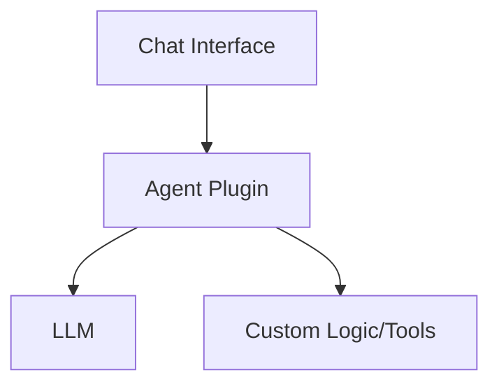
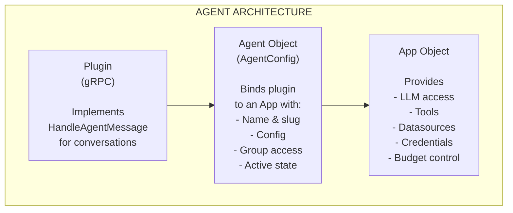

## Availability

| Edition   | Deployment Type |
| :------------- | :---------------------- |
| [Community](ai-management/ai-studio/overview#community-edition) & [Enterprise](ai-management/ai-studio/overview#enterprise-edition) | Self-Managed, Hybrid |

> **Experimental Feature**: Agent plugins are currently experimental. The API and behavior may change in future releases.



AI Studio Agent plugins enable conversational AI experiences in the Chat Interface using the **Unified Plugin SDK**. Build custom agents that wrap LLMs, add specialized logic, integrate external services, and create sophisticated multi-turn conversations with streaming responses.

Agent plugins use the same `pkg/plugin_sdk` as other plugin types, automatically detecting the Studio runtime and providing access to Studio Services (LLM calls, tool execution, datasource queries).

## Architecture Overview

Agent plugins follow a **three-tier binding model**:



### Key Concepts

| Component | Purpose |
|-----------|---------|
| **Plugin** | Long-running gRPC plugin implementing `AgentPlugin` interface |
| **Agent Object** | Configuration binding a plugin to an App, with access controls |
| **App Object** | Resource container providing LLMs, tools, datasources, and credentials |

**Important points:**

1. **Plugins are reusable**: A single plugin can power multiple Agent Objects
2. **Apps provide resources**: The App determines which LLMs the agent can call
3. **Access via Groups**: Users access agents based on group membership
4. **Budget enforcement**: LLM calls are routed through the proxy, enforcing budgets
5. **Portal integration**: Active agents appear in the **Chat** section of the AI Portal alongside managed chats

## Overview

Agent plugins enable you to:

- **Stream Responses**: Real-time server-streaming for interactive conversations
- **Call LLMs**: Access managed LLMs via Context Services or direct SDK calls
- **Execute Tools**: Run registered tools and integrate external services
- **Query Datasources**: Access configured datasources for RAG and context
- **Maintain Context**: Access full conversation history
- **Custom Configuration**: Per-agent config with JSON schema validation
- **Universal Services**: KV storage and logging via Context.Services

## Unified SDK Integration

Agent plugins use the **Unified Plugin SDK** (`pkg/plugin_sdk`), just like all other plugin types. Key patterns:

### Import and Structure

```go
import "github.com/TykTechnologies/midsommar/v2/pkg/plugin_sdk"

type MyAgentPlugin struct {
    plugin_sdk.BasePlugin
}

func NewMyAgentPlugin() *MyAgentPlugin {
    return &MyAgentPlugin{
        BasePlugin: plugin_sdk.NewBasePlugin(
            "my-agent", "1.0.0", "Description",
        ),
    }
}
```

### Lifecycle Methods

```go Expandable
// Initialize - called when plugin starts
func (p *MyAgentPlugin) Initialize(ctx plugin_sdk.Context, config map[string]string) error {
    // Extract broker ID for Service API calls
    if brokerIDStr, ok := config["_service_broker_id"]; ok {
        var brokerID uint32
        fmt.Sscanf(brokerIDStr, "%d", &brokerID)
        ai_studio_sdk.SetServiceBrokerID(brokerID)
    }
    return nil
}

// Shutdown - called when plugin stops
func (p *MyAgentPlugin) Shutdown(ctx plugin_sdk.Context) error {
    return nil
}
```

### Agent Capability

Implement the `AgentPlugin` capability:

```go Expandable
// HandleAgentMessage processes incoming messages and streams responses
func (p *MyAgentPlugin) HandleAgentMessage(
    req *pb.AgentMessageRequest,
    stream pb.PluginService_HandleAgentMessageServer) error {

    // Stream chunks to user
    stream.Send(&pb.AgentMessageChunk{
        Type:    pb.AgentMessageChunk_CONTENT,
        Content: "Hello!",
        IsFinal: false,
    })

    stream.Send(&pb.AgentMessageChunk{
        Type:    pb.AgentMessageChunk_DONE,
        IsFinal: true,
    })

    return nil
}
```

### Serving the Plugin

```go
func main() {
    plugin_sdk.Serve(NewMyAgentPlugin())
}
```

### Service API Access

Agent plugins can call LLMs, execute tools, and query datasources via the `ai_studio_sdk` helper functions (requires broker ID):

```go
// Call LLM
llmStream, err := ai_studio_sdk.CallLLM(
    ctx, llmID, model, messages, temperature, maxTokens, tools, stream,
)

// Execute tool
result, err := ai_studio_sdk.ExecuteTool(ctx, toolID, operation, params)

// Query datasource
result, err := ai_studio_sdk.QueryDatasource(ctx, dsID, query)
```

## Quick Start

### 1. Project Structure

```
my-agent-plugin/
├── server/
│   ├── main.go                # Plugin server
│   ├── plugin.manifest.json   # Plugin manifest
│   └── config.schema.json     # Configuration schema
└── go.mod
```

### 2. Create Manifest

[server/plugin.manifest.json](https://github.com/TykTechnologies/ai-studio/blob/main/examples/plugins/studio/echo-agent/server/plugin.manifest.json):

```json Expandable
{
  "id": "com.example.my-agent",
  "name": "My Agent",
  "version": "1.0.0",
  "plugin_type": "agent",
  "description": "Custom conversational agent",
  "permissions": {
    "services": [
      "llms.proxy",
      "tools.execute",
      "datasources.query"
    ]
  },
  "ui": {
    "slots": []
  }
}
```

### 3. Implement Agent Plugin

[server/main.go](https://github.com/TykTechnologies/ai-studio/blob/main/examples/plugins/studio/echo-agent/server/main.go):

```go Expandable
package main

import (
    _ "embed"
    "fmt"
    "io"
    "log"

    "github.com/TykTechnologies/midsommar/v2/pkg/ai_studio_sdk"
    "github.com/TykTechnologies/midsommar/v2/pkg/plugin_sdk"
    pb "github.com/TykTechnologies/midsommar/v2/proto"
    mgmt "github.com/TykTechnologies/midsommar/v2/proto/ai_studio_management"
)

//go:embed plugin.manifest.json
var manifestFile []byte

//go:embed config.schema.json
var configSchemaFile []byte

type MyAgent struct {
    plugin_sdk.BasePlugin
}

func NewMyAgent() *MyAgent {
    return &MyAgent{
        BasePlugin: plugin_sdk.NewBasePlugin(
            "my-agent",
            "1.0.0",
            "Custom conversational agent",
        ),
    }
}

// Initialize is called when plugin starts
func (p *MyAgent) Initialize(ctx plugin_sdk.Context, config map[string]string) error {
    log.Printf("My Agent initializing")

    // Extract broker ID for Service API access
    brokerIDStr := ""
    if id, ok := config["_service_broker_id"]; ok {
        brokerIDStr = id
    } else if id, ok := config["service_broker_id"]; ok {
        brokerIDStr = id
    }

    if brokerIDStr != "" {
        var brokerID uint32
        fmt.Sscanf(brokerIDStr, "%d", &brokerID)
        ai_studio_sdk.SetServiceBrokerID(brokerID)
        log.Printf("My Agent: Set broker ID %d for Service API", brokerID)
    }

    return nil
}

// Shutdown is called when plugin stops
func (p *MyAgent) Shutdown(ctx plugin_sdk.Context) error {
    log.Printf("My Agent shutting down")
    return nil
}

// GetManifest returns the plugin manifest
func (p *MyAgent) GetManifest() ([]byte, error) {
    return manifestFile, nil
}

// GetConfigSchema returns the configuration schema
func (p *MyAgent) GetConfigSchema() ([]byte, error) {
    return configSchemaFile, nil
}

// HandleAgentMessage processes incoming messages and streams responses
func (p *MyAgent) HandleAgentMessage(
    req *pb.AgentMessageRequest,
    stream pb.PluginService_HandleAgentMessageServer) error {

    log.Printf("Received message: %s", req.UserMessage)

    // Select LLM (use first available or configured default)
    var selectedLLM *pb.AgentLLMInfo
    if len(req.AvailableLlms) > 0 {
        selectedLLM = req.AvailableLlms[0]
    }

    if selectedLLM == nil {
        return stream.Send(&pb.AgentMessageChunk{
            Type:    pb.AgentMessageChunk_ERROR,
            Content: "No LLM available",
            IsFinal: true,
        })
    }

    // Build messages from history + current message
    messages := buildMessages(req.History, req.UserMessage)

    // Call LLM via SDK
    llmStream, err := ai_studio_sdk.CallLLM(
        stream.Context(),
        selectedLLM.Id,
        selectedLLM.DefaultModel,
        messages,
        0.7,  // temperature
        1000, // max tokens
        nil,  // tools
        false, // non-streaming
    )
    if err != nil {
        return stream.Send(&pb.AgentMessageChunk{
            Type:    pb.AgentMessageChunk_ERROR,
            Content: fmt.Sprintf("Failed to call LLM: %v", err),
            IsFinal: true,
        })
    }

    // Receive and forward response
    var llmContent string
    for {
        resp, err := llmStream.Recv()
        if err == io.EOF {
            break
        }
        if err != nil {
            return stream.Send(&pb.AgentMessageChunk{
                Type:    pb.AgentMessageChunk_ERROR,
                Content: fmt.Sprintf("Error receiving response: %v", err),
                IsFinal: true,
            })
        }

        if !resp.Success {
            return stream.Send(&pb.AgentMessageChunk{
                Type:    pb.AgentMessageChunk_ERROR,
                Content: fmt.Sprintf("LLM error: %s", resp.ErrorMessage),
                IsFinal: true,
            })
        }

        llmContent += resp.Content

        if resp.Done {
            break
        }
    }

    // Send content chunk
    if err := stream.Send(&pb.AgentMessageChunk{
        Type:    pb.AgentMessageChunk_CONTENT,
        Content: llmContent,
        IsFinal: false,
    }); err != nil {
        return err
    }

    // Send done chunk
    return stream.Send(&pb.AgentMessageChunk{
        Type:    pb.AgentMessageChunk_DONE,
        Content: "completed",
        IsFinal: true,
    })
}

func buildMessages(history []*pb.AgentConversationMessage, userMessage string) []*mgmt.LLMMessage {
    messages := make([]*mgmt.LLMMessage, 0, len(history)+1)

    // Add history
    for _, msg := range history {
        messages = append(messages, &mgmt.LLMMessage{
            Role:    msg.Role,
            Content: msg.Content,
        })
    }

    // Add current message
    messages = append(messages, &mgmt.LLMMessage{
        Role:    "user",
        Content: userMessage,
    })

    return messages
}

func main() {
    log.Printf("Starting My Agent")
    plugin_sdk.Serve(NewMyAgent())
}
```

### 4. Build and Deploy

```bash Expandable
# Build plugin
go build -o my-agent main.go

# Create plugin in AI Studio
curl -X POST http://localhost:3000/api/v1/plugins \
  -H "Authorization: Bearer $TOKEN" \
  -d '{
    "name": "My Agent",
    "slug": "my-agent",
    "command": "file:///path/to/my-agent",
    "hook_type": "agent",
    "plugin_type": "agent",
    "is_active": true
  }'
```

### 5. Create Agent Object

Create an Agent Object that binds the plugin to an App:

**Prerequisites:**
- An active plugin with `hook_type: agent`
- An App with at least one LLM assigned, active credential, and optionally tools and datasources

```bash Expandable
curl -X POST http://localhost:3000/api/v1/agents \
  -H "Authorization: Bearer $TOKEN" \
  -H "Content-Type: application/json" \
  -d '{
    "name": "My Custom Agent",
    "description": "An agent that helps with specific tasks",
    "plugin_id": 1,
    "app_id": 1,
    "config": {
      "system_prompt": "You are a helpful assistant",
      "temperature": 0.7
    },
    "group_ids": [1, 2],
    "is_active": true
  }'
```

**Agent Object Fields:**

| Field | Type | Description |
|-------|------|-------------|
| `name` | `string` | Display name for the agent |
| `description` | `string` | Description shown to users |
| `plugin_id` | `uint` | ID of the agent plugin to use |
| `app_id` | `uint` | ID of the App providing resources |
| `config` | `object` | Plugin-specific configuration (passed as `ConfigJson`) |
| `group_ids` | `[]uint` | Groups that can access this agent (empty = public) |
| `is_active` | `bool` | Whether the agent is available to users |
| `namespace` | `string` | Optional namespace for multi-tenant deployments |

### 6. Use in Chat Interface

Active agents appear in the **Chat** section of the AI Portal alongside managed chats. Users see agents they have access to based on group membership.

**SSE Communication Flow:**

1. **Establish SSE connection**:
   ```
   GET /api/agents/{id}/stream?token=...
   ```

2. **Receive session info** (first message):
   ```json
   {
     "session_id": "agent-1-123",
     "agent_id": 1,
     "agent_name": "My Agent",
     "available_llms": 3,
     "available_tools": 2,
     "available_datasources": 1
   }
   ```

3. **Send messages** via POST:
   ```bash
   curl -X POST "http://localhost:3000/api/agents/1/message?session_id=agent-1-123" \
     -H "Authorization: Bearer $TOKEN" \
     -H "Content-Type: application/json" \
     -d '{
       "message": "Hello, can you help me?",
       "history": []
     }'
   ```

4. **Receive streaming response** via SSE:
   ```
   event: content
   data: {"type":"CONTENT","content":"Hello! How can I help?","is_final":false}

   event: done
   data: {"type":"DONE","content":"completed","is_final":true}
   ```

## Agent Message Request

The `AgentMessageRequest` provides rich context for your agent:

```go
type AgentMessageRequest struct {
    SessionId            string                       // Unique session ID
    UserMessage          string                       // Current user message
    AvailableTools       []*AgentToolInfo             // Tools agent can use
    AvailableDatasources []*AgentDatasourceInfo       // Datasources available
    AvailableLlms        []*AgentLLMInfo              // LLMs available
    ConfigJson           string                       // Agent configuration (JSON)
    History              []*AgentConversationMessage  // Conversation history
    Context              *PluginContext               // Request context
}
```

### Available Tools

```go
for _, tool := range req.AvailableTools {
    log.Printf("Tool: %s (%s) - %s", tool.Name, tool.Slug, tool.Description)
}
```

### Available Datasources

```go
for _, ds := range req.AvailableDatasources {
    log.Printf("Datasource: %s (%s) - %s", ds.Name, ds.DbSourceType, ds.Description)
}
```

### Available LLMs

```go
for _, llm := range req.AvailableLlms {
    log.Printf("LLM: %s - %s %s", llm.Name, llm.Vendor, llm.DefaultModel)
}
```

### Configuration

Parse custom configuration from JSON:

```go
type Config struct {
    SystemPrompt string  `json:"system_prompt"`
    Temperature  float64 `json:"temperature"`
    MaxTokens    int     `json:"max_tokens"`
}

var config Config
if req.ConfigJson != "" {
    if err := json.Unmarshal([]byte(req.ConfigJson), &config); err == nil {
        log.Printf("Using config: system_prompt=%s, temp=%.2f",
            config.SystemPrompt, config.Temperature)
    }
}
```

### Conversation History

```go
log.Printf("Conversation has %d messages", len(req.History))
for i, msg := range req.History {
    log.Printf("  [%d] %s: %s", i, msg.Role, msg.Content)
}
```

## Streaming Responses

Agent plugins use server-streaming gRPC to send real-time responses:

### Chunk Types

```go
const (
    CONTENT     = "CONTENT"      // Response content
    TOOL_CALL   = "TOOL_CALL"    // Tool is being called
    TOOL_RESULT = "TOOL_RESULT"  // Tool result
    THINKING    = "THINKING"     // Agent reasoning
    ERROR       = "ERROR"        // Error occurred
    DONE        = "DONE"         // Response complete
)
```

### Send Content

```go
stream.Send(&pb.AgentMessageChunk{
    Type:    pb.AgentMessageChunk_CONTENT,
    Content: "Here is my response...",
    IsFinal: false,
})
```

### Send Thinking

```go
stream.Send(&pb.AgentMessageChunk{
    Type:    pb.AgentMessageChunk_THINKING,
    Content: "Analyzing the question...",
    IsFinal: false,
})
```

### Send Tool Call

```go
metadata := map[string]interface{}{
    "tool_name":  "weather_api",
    "operation":  "get_forecast",
    "parameters": map[string]string{"city": "San Francisco"},
}
metadataJSON, _ := json.Marshal(metadata)

stream.Send(&pb.AgentMessageChunk{
    Type:         pb.AgentMessageChunk_TOOL_CALL,
    Content:      "Calling weather API...",
    MetadataJson: string(metadataJSON),
    IsFinal:      false,
})
```

### Send Error

```go
stream.Send(&pb.AgentMessageChunk{
    Type:    pb.AgentMessageChunk_ERROR,
    Content: "Failed to process request: invalid input",
    IsFinal: true,
})
```

### Send Done

```go
stream.Send(&pb.AgentMessageChunk{
    Type:    pb.AgentMessageChunk_DONE,
    Content: "completed",
    IsFinal: true, // Always set IsFinal=true for DONE
})
```

## Complete Example: Echo Agent

A simple agent that wraps LLM responses with custom formatting:

```go Expandable
package main

import (
    _ "embed"
    "encoding/json"
    "fmt"
    "io"
    "log"

    "github.com/TykTechnologies/midsommar/v2/pkg/ai_studio_sdk"
    "github.com/TykTechnologies/midsommar/v2/pkg/plugin_sdk"
    pb "github.com/TykTechnologies/midsommar/v2/proto"
    mgmt "github.com/TykTechnologies/midsommar/v2/proto/ai_studio_management"
)

//go:embed plugin.manifest.json
var manifestFile []byte

//go:embed config.schema.json
var configSchemaFile []byte

type EchoAgentPlugin struct {
    plugin_sdk.BasePlugin
    prefix          string
    suffix          string
    includeMetadata bool
}

type Config struct {
    Prefix          string `json:"prefix"`
    Suffix          string `json:"suffix"`
    IncludeMetadata bool   `json:"include_metadata"`
}

func NewEchoAgentPlugin() *EchoAgentPlugin {
    return &EchoAgentPlugin{
        BasePlugin: plugin_sdk.NewBasePlugin(
            "echo-agent",
            "1.0.0",
            "Wraps LLM responses with prefix/suffix",
        ),
        prefix:          "<<",
        suffix:          ">>",
        includeMetadata: false,
    }
}

func (p *EchoAgentPlugin) Initialize(ctx plugin_sdk.Context, config map[string]string) error {
    log.Printf("EchoAgent: Initialize called")

    // Extract broker ID for Service API access
    brokerIDStr := ""
    if id, ok := config["_service_broker_id"]; ok {
        brokerIDStr = id
    } else if id, ok := config["service_broker_id"]; ok {
        brokerIDStr = id
    }

    if brokerIDStr != "" {
        var brokerID uint32
        fmt.Sscanf(brokerIDStr, "%d", &brokerID)
        ai_studio_sdk.SetServiceBrokerID(brokerID)
        log.Printf("EchoAgent: Set broker ID %d for Service API", brokerID)
    }

    log.Println("✅ EchoAgent: Initialized successfully")
    return nil
}

func (p *EchoAgentPlugin) Shutdown(ctx plugin_sdk.Context) error {
    log.Println("EchoAgent: Shutdown called")
    return nil
}

func (p *EchoAgentPlugin) GetManifest() ([]byte, error) {
    return manifestFile, nil
}

func (p *EchoAgentPlugin) GetConfigSchema() ([]byte, error) {
    return configSchemaFile, nil
}

func (p *EchoAgentPlugin) HandleAgentMessage(
    req *pb.AgentMessageRequest,
    stream pb.PluginService_HandleAgentMessageServer) error {

    log.Printf("EchoAgent: Received message: %s", req.UserMessage)

    // Parse config from request if present
    if req.ConfigJson != "" {
        var config Config
        if err := json.Unmarshal([]byte(req.ConfigJson), &config); err == nil {
            if config.Prefix != "" {
                p.prefix = config.Prefix
            }
            if config.Suffix != "" {
                p.suffix = config.Suffix
            }
            p.includeMetadata = config.IncludeMetadata
            log.Printf("EchoAgent: Using custom config - prefix: %s, suffix: %s",
                p.prefix, p.suffix)
        }
    }

    // Select LLM to use
    var selectedLLM *pb.AgentLLMInfo
    if len(req.AvailableLlms) > 0 {
        selectedLLM = req.AvailableLlms[0]
    }

    // Fall back to echo mode if no LLM available
    if selectedLLM == nil {
        log.Println("EchoAgent: No LLM available, using echo mode")
        return p.echoMode(req.UserMessage, stream)
    }

    log.Printf("EchoAgent: Using LLM: %s (ID: %d, Vendor: %s, Model: %s)",
        selectedLLM.Name, selectedLLM.Id, selectedLLM.Vendor, selectedLLM.DefaultModel)

    // Call LLM via SDK
    return p.callLLM(req, selectedLLM, stream)
}

// echoMode is the fallback mode that just echoes the message
func (p *EchoAgentPlugin) echoMode(userMessage string, stream pb.PluginService_HandleAgentMessageServer) error {
    wrappedContent := fmt.Sprintf("%s %s %s", p.prefix, userMessage, p.suffix)
    log.Printf("EchoAgent: Sending wrapped echo response: %s", wrappedContent)

    // Send content chunk
    if err := stream.Send(&pb.AgentMessageChunk{
        Type:    pb.AgentMessageChunk_CONTENT,
        Content: wrappedContent,
        IsFinal: false,
    }); err != nil {
        return err
    }

    // Send done chunk
    return stream.Send(&pb.AgentMessageChunk{
        Type:    pb.AgentMessageChunk_DONE,
        Content: "completed",
        IsFinal: true,
    })
}

// callLLM calls the LLM via SDK and streams back the wrapped response
func (p *EchoAgentPlugin) callLLM(
    req *pb.AgentMessageRequest,
    llm *pb.AgentLLMInfo,
    stream pb.PluginService_HandleAgentMessageServer) error {

    ctx := stream.Context()

    // Build LLM messages from history + current message
    messages := []*mgmt.LLMMessage{}

    // Add history
    for _, histMsg := range req.History {
        messages = append(messages, &mgmt.LLMMessage{
            Role:    histMsg.Role,
            Content: histMsg.Content,
        })
    }

    // Add current user message
    messages = append(messages, &mgmt.LLMMessage{
        Role:    "user",
        Content: req.UserMessage,
    })

    log.Printf("EchoAgent: Calling LLM %d with %d messages via SDK", llm.Id, len(messages))

    // Use SDK's CallLLM helper
    llmStream, err := ai_studio_sdk.CallLLM(
        ctx,
        llm.Id,
        llm.DefaultModel,
        messages,
        0.7,  // temperature
        1000, // max tokens
        nil,  // no tools
        false, // non-streaming
    )
    if err != nil {
        log.Printf("EchoAgent: Failed to call LLM via SDK: %v", err)
        return stream.Send(&pb.AgentMessageChunk{
            Type:    pb.AgentMessageChunk_ERROR,
            Content: fmt.Sprintf("Failed to call LLM: %v", err),
            IsFinal: true,
        })
    }

    // Receive response from LLM
    var llmContent string
    for {
        resp, err := llmStream.Recv()
        if err == io.EOF {
            break
        }
        if err != nil {
            log.Printf("EchoAgent: Error receiving from LLM: %v", err)
            return stream.Send(&pb.AgentMessageChunk{
                Type:    pb.AgentMessageChunk_ERROR,
                Content: fmt.Sprintf("Error receiving LLM response: %v", err),
                IsFinal: true,
            })
        }

        if !resp.Success {
            log.Printf("EchoAgent: LLM returned error: %s", resp.ErrorMessage)
            return stream.Send(&pb.AgentMessageChunk{
                Type:    pb.AgentMessageChunk_ERROR,
                Content: fmt.Sprintf("LLM error: %s", resp.ErrorMessage),
                IsFinal: true,
            })
        }

        llmContent += resp.Content

        if resp.Done {
            break
        }
    }

    log.Printf("EchoAgent: Received LLM response (%d chars)", len(llmContent))

    // Wrap LLM response with prefix/suffix
    wrappedContent := fmt.Sprintf("%s %s %s", p.prefix, llmContent, p.suffix)

    // Send wrapped content
    if err := stream.Send(&pb.AgentMessageChunk{
        Type:    pb.AgentMessageChunk_CONTENT,
        Content: wrappedContent,
        IsFinal: false,
    }); err != nil {
        return err
    }

    // Optionally include metadata
    if p.includeMetadata {
        metadata := map[string]interface{}{
            "llm_id":    llm.Id,
            "llm_name":  llm.Name,
            "llm_model": llm.DefaultModel,
            "tokens":    len(llmContent),
        }
        metadataJSON, _ := json.Marshal(metadata)

        stream.Send(&pb.AgentMessageChunk{
            Type:         pb.AgentMessageChunk_CONTENT,
            Content:      fmt.Sprintf("\n\n---\nMetadata: %s", string(metadataJSON)),
            MetadataJson: string(metadataJSON),
            IsFinal:      false,
        })
    }

    // Send done chunk
    return stream.Send(&pb.AgentMessageChunk{
        Type:    pb.AgentMessageChunk_DONE,
        Content: "completed",
        IsFinal: true,
    })
}

func main() {
    log.Printf("🤖 Starting Echo Agent Plugin")
    plugin_sdk.Serve(NewEchoAgentPlugin())
}
```

### Configuration Schema

[config.schema.json](https://github.com/TykTechnologies/ai-studio/blob/main/examples/plugins/studio/echo-agent/server/config.schema.json):

```json Expandable
{
  "$schema": "http://json-schema.org/draft-07/schema#",
  "type": "object",
  "title": "Echo Agent Configuration",
  "properties": {
    "prefix": {
      "type": "string",
      "description": "Prefix to add before LLM response",
      "default": "<<"
    },
    "suffix": {
      "type": "string",
      "description": "Suffix to add after LLM response",
      "default": ">>"
    },
    "include_metadata": {
      "type": "boolean",
      "description": "Include metadata in response",
      "default": false
    }
  }
}
```

## Advanced Patterns

### Multi-Step Reasoning

```go Expandable
func (p *MyAgent) HandleAgentMessage(
    req *pb.AgentMessageRequest,
    stream pb.PluginService_HandleAgentMessageServer) error {

    // Step 1: Think
    stream.Send(&pb.AgentMessageChunk{
        Type:    pb.AgentMessageChunk_THINKING,
        Content: "Analyzing the question...",
        IsFinal: false,
    })

    // Step 2: Search datasource
    stream.Send(&pb.AgentMessageChunk{
        Type:    pb.AgentMessageChunk_TOOL_CALL,
        Content: "Searching knowledge base...",
        IsFinal: false,
    })

    searchResults := p.searchKnowledgeBase(req.UserMessage)

    stream.Send(&pb.AgentMessageChunk{
        Type:    pb.AgentMessageChunk_TOOL_RESULT,
        Content: fmt.Sprintf("Found %d results", len(searchResults)),
        IsFinal: false,
    })

    // Step 3: Generate response with context
    stream.Send(&pb.AgentMessageChunk{
        Type:    pb.AgentMessageChunk_THINKING,
        Content: "Generating response with retrieved context...",
        IsFinal: false,
    })

    // Build prompt with context
    contextualPrompt := buildPromptWithContext(req.UserMessage, searchResults)

    // Call LLM
    response := p.callLLMWithContext(contextualPrompt)

    // Step 4: Send final response
    stream.Send(&pb.AgentMessageChunk{
        Type:    pb.AgentMessageChunk_CONTENT,
        Content: response,
        IsFinal: false,
    })

    return stream.Send(&pb.AgentMessageChunk{
        Type:    pb.AgentMessageChunk_DONE,
        Content: "completed",
        IsFinal: true,
    })
}
```

### Tool Integration

```go Expandable
func (p *MyAgent) executeTool(ctx context.Context, toolID uint32, operation string, params map[string]interface{}) (string, error) {
    // Execute tool via SDK
    result, err := ai_studio_sdk.ExecuteTool(ctx, toolID, operation, params)
    if err != nil {
        return "", err
    }

    return result.Data, nil
}

func (p *MyAgent) HandleAgentMessage(
    req *pb.AgentMessageRequest,
    stream pb.PluginService_HandleAgentMessageServer) error {

    // Check if user wants to search
    if strings.Contains(strings.ToLower(req.UserMessage), "search") {
        // Find search tool
        var searchTool *pb.AgentToolInfo
        for _, tool := range req.AvailableTools {
            if tool.Slug == "web-search" {
                searchTool = tool
                break
            }
        }

        if searchTool != nil {
            stream.Send(&pb.AgentMessageChunk{
                Type:    pb.AgentMessageChunk_TOOL_CALL,
                Content: "Searching the web...",
                IsFinal: false,
            })

            result, err := p.executeTool(stream.Context(), searchTool.Id, "search", map[string]interface{}{
                "query": extractSearchQuery(req.UserMessage),
            })

            if err == nil {
                stream.Send(&pb.AgentMessageChunk{
                    Type:    pb.AgentMessageChunk_TOOL_RESULT,
                    Content: fmt.Sprintf("Search results: %s", result),
                    IsFinal: false,
                })
            }
        }
    }

    // Continue with LLM call...
    return p.callLLM(req, stream)
}
```

## Best Practices

### Performance

- Use non-blocking I/O for external calls
- Stream responses as they arrive
- Set appropriate timeouts
- Cache frequently accessed data
- Minimize LLM calls where possible

### Error Handling

- Always send ERROR chunk on failures
- Set `IsFinal=true` for ERROR chunks
- Provide descriptive error messages
- Log errors with context (session ID, plugin ID)
- Implement graceful fallbacks

### User Experience

- Send THINKING chunks for long operations
- Stream content as it's generated
- Provide progress updates
- Use metadata for rich responses
- Always send DONE chunk

### Security

- Validate all inputs
- Sanitize user messages
- Don't expose sensitive data in responses
- Use permission scopes appropriately
- Log security-relevant events

## API Reference

### Agent Management (Admin Only)

| Endpoint | Method | Description |
|----------|--------|-------------|
| `/api/v1/agents` | GET | List all accessible agents |
| `/api/v1/agents` | POST | Create new agent config |
| `/api/v1/agents/{id}` | GET | Get agent details |
| `/api/v1/agents/{id}` | PUT | Update agent config |
| `/api/v1/agents/{id}` | DELETE | Delete agent config |
| `/api/v1/agents/{id}/activate` | POST | Activate agent |
| `/api/v1/agents/{id}/deactivate` | POST | Deactivate agent |

### Agent Communication (Users)

| Endpoint | Method | Description |
|----------|--------|-------------|
| `/api/agents/{id}/stream` | GET | Establish SSE connection |
| `/api/agents/{id}/message` | POST | Send message to active session |

### SessionAware Pattern (Recommended)

Agent plugins should implement the `SessionAware` interface to warm up the Service API connection:

```go
// OnSessionReady is called when the session broker is ready
func (p *MyAgentPlugin) OnSessionReady(ctx plugin_sdk.Context) {
    // Warm up Service API connection
    if ai_studio_sdk.IsInitialized() {
        _, _ = ai_studio_sdk.GetPluginsCount(context.Background())
    }
}

// OnSessionClosing is called when the session is closing
func (p *MyAgentPlugin) OnSessionClosing(ctx plugin_sdk.Context) {
    // Clean up session resources
}
```

### Service Broker ID

For LLM calls via the Service API, always set the service broker ID from the request:

```go
func (p *MyAgentPlugin) HandleAgentMessage(req *pb.AgentMessageRequest, stream pb.PluginService_HandleAgentMessageServer) error {
    // Critical: Set service broker ID for LLM calls
    if req.ServiceBrokerId != 0 {
        ai_studio_sdk.SetServiceBrokerID(req.ServiceBrokerId)
    }
    // ... rest of handler
}
```

## Troubleshooting

<AccordionGroup>

<Accordion title="Agent Not Appearing in Chat">

- Check `plugin_type` is `"agent"`
- Verify agent configuration is created for an app
- Ensure plugin is active (`is_active: true`)
- Check logs for initialization errors

</Accordion>

<Accordion title="LLM Calls Failing">

- Verify `llms.proxy` permission in manifest
- Check SDK is initialized
- Ensure LLMs are available in app configuration
- Review LLM provider credentials

</Accordion>

<Accordion title="Streaming Not Working">

- Ensure you're sending chunks sequentially
- Always set `IsFinal=true` for final chunk
- Send DONE chunk at the end
- Check for errors in `stream.Send()`

</Accordion>

<Accordion title="Context Not Available">

- Verify plugin context is passed correctly
- Check broker ID is set for service API calls
- Ensure session ID is provided
- Review plugin initialization

</Accordion>

</AccordionGroup>

## Working Example

See the **Echo Agent** example in the repository:

**Path**: [`examples/plugins/studio/echo-agent/`](https://github.com/TykTechnologies/ai-studio/tree/main/examples/plugins/studio/echo-agent)

The Echo Agent demonstrates:
- Basic `HandleAgentMessage` implementation
- LLM selection from available LLMs
- Calling LLMs via `ai_studio_sdk.CallLLM()`
- Streaming responses back to users
- Configuration handling via JSON schema
- Session warmup with `OnSessionReady`

## Limitations (Experimental)

- No built-in conversation persistence (agents must manage their own state if needed)
- Tool execution must be implemented by the agent
- No automatic retry on LLM failures
- Single concurrent conversation per session
