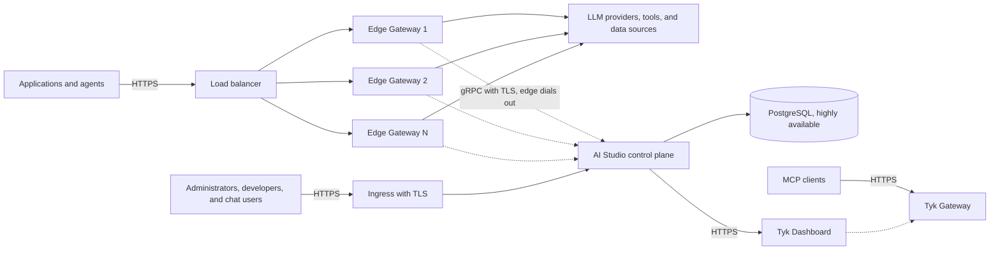

## Availability

| Edition | Deployment Type |
| :------------- | :---------------------- |
| [Community](/ai-management/ai-studio/overview#community-edition) and [Enterprise](/ai-management/ai-studio/overview#enterprise-edition) | Self-Managed, Hybrid |

Edge Gateway management and namespaces are available in the Enterprise Edition only.

## Overview

This page describes the recommended production deployment of Tyk AI Studio 2.2. One AI Studio instance is the control plane. It manages one or more pools of Edge Gateways, which are the data plane. A highly available PostgreSQL database stores the configuration and the analytics.

For the components and the hub-and-spoke design, refer to [Architecture](/ai-management/ai-studio/architecture). For the deployment modes, refer to [Installation](/ai-management/ai-studio/installation/overview).

This page does not cover two deployment shapes:

- An Edge Gateway without a control plane.
- The embedded gateway of AI Studio as the gateway for your applications. The embedded gateway is for tests and for the Chat interface. Refer to [Edge Gateway Variants](/ai-management/ai-studio/proxy#edge-gateway-variants).

## Architecture Diagram

Each Edge Gateway keeps its own SQLite database. Each pool of Edge Gateways serves one namespace. A single-region deployment has one pool in the `default` namespace.

The Tyk Dashboard and the Tyk Gateway are necessary only for the [Tyk MCP integration](#tyk-dashboard-and-mcp-integration).

## Components

| Component | Role | State |
| :--- | :--- | :--- |
| AI Studio (`GATEWAY_MODE=control`) | The control plane. It keeps the configuration, users, SSO, roles, the AI Portal, the Chat interface, and the analytics. It serves the gRPC control server that Edge Gateways connect to. | PostgreSQL, and a small data directory for branding files, exports, and the OCI plugin cache |
| PostgreSQL | The system of record for the configuration, the credentials, and the analytics from all Edge Gateways | All the data that you must keep |
| Edge Gateway (`GATEWAY_MODE=edge`) | The data plane. It authenticates requests, applies access control, filters, guardrails, plugins, and budgets, and proxies requests to the LLM. | A local SQLite database on each node. The edge gets its configuration again from AI Studio at each start. |
| Load balancer | Sends application traffic to the Edge Gateways of one pool | None |
| OCI registry (optional) | The source of plugins that you distribute as OCI artifacts. Refer to [Plugin Deployment](/ai-management/ai-studio/plugins/deployment). | Plugin images |
| Observability stack (optional) | Collects Prometheus metrics and OpenTelemetry traces | Your existing tools |

Edge Gateways do not use Redis, NATS, or a shared database. Everything that an edge needs to serve a request is in its own process and its own SQLite file.

AI Studio uses a message queue for the Chat interface. The default is an in-memory queue. For a queue that keeps messages after a restart, refer to [NATS Configuration](/ai-management/ai-studio/installation/nats).

## Network Paths

| From | To | Port | Purpose |
| :--- | :--- | :--- | :--- |
| Applications | Edge Gateway load balancer | 443 to the edge port (`PORT`, default 8080) | All LLM, tool, and data source traffic |
| Edge Gateway | AI Studio | 50051 (`GRPC_PORT`), gRPC over HTTP/2 with TLS | Configuration, heartbeats, token validation, analytics, and budget sync. The edge opens the connection. |
| Edge Gateway | LLM providers, tools, and data sources | 443 | Proxied requests |
| Edge Gateway | OCI registry | 443 | Plugins from `oci://` references only |
| Browsers and API clients | AI Studio | 443 to the AI Studio port (`SERVER_PORT`, default 8080) | Admin console, AI Portal, Chat, and the management API |
| AI Studio | PostgreSQL | 5432 | Always |
| AI Studio | LLM providers, tools, data sources, and embedders | 443 | Chat, data source ingestion, and tool calls from Chat |
| AI Studio | Tyk Dashboard | The Dashboard API port | Tyk MCP integration only |

Edge Gateways only open outbound connections to AI Studio. Thus, an edge can run in a private network, another cloud, or a data center with no inbound firewall rules.

Do not publish the embedded gateway port of AI Studio (`PROXY_PORT`, default 9090) in this architecture. Make port 50051 available only from the networks where your Edge Gateways run.

A load balancer in front of port 50051 must support HTTP/2 and long-lived streams. Each edge keeps one stream open and sends a keepalive ping every 30 seconds. For TLS, keepalive, and message size settings, refer to [Connection Settings](/ai-management/ai-studio/manage-edge-gateway#connection-settings).

## The Control Connection

Each Edge Gateway uses one gRPC connection to AI Studio for these flows:

- **Configuration snapshot**: AI Studio sends it when the edge starts, and when an administrator pushes the configuration. Refer to [Pushing Configuration](/ai-management/ai-studio/manage-edge-gateway#pushing-configuration).
- **Heartbeat**: Every 30 seconds (`EDGE_HEARTBEAT_INTERVAL`). It reports the checksum of the loaded configuration, so that AI Studio can show the sync status of each edge.
- **Token validation**: AI Studio does not send credentials to edges in bulk. The first time an edge sees a token, it asks AI Studio. The edge keeps the result in memory for 5 minutes (`EDGE_TOKEN_CACHE_TTL`).
- **Analytics pulse**: The edge sends usage, cost, and proxy logs to AI Studio. The edge loads the pulse from the file at `PLUGINS_CONFIG_PATH`. Without this file, the edge serves traffic but AI Studio shows no analytics and no spend for it.
- **Budget sync**: Every 30 seconds, AI Studio sends the total spend of each App. Thus, each edge enforces budgets on the total for all edges. Set the interval with `BUDGET_SYNC_INTERVAL` on AI Studio.

Leave `GRPC_MAX_CONNECTION_AGE` off in 2.2. It closes edge streams after a time, so that edges move between AI Studio replicas, but 2.2 supports only one AI Studio instance. If you set it, also set `GRPC_MAX_CONNECTION_AGE_GRACE`, or streams never close. Each age cycle disconnects an edge for about 5 seconds.

## Run AI Studio as a Hot and Cold Pair

<Warning>
Version 2.2 supports exactly one running AI Studio instance. Do not run two AI Studio instances on the same database at the same time. This includes two instances behind a load balancer and a "warm" standby.
</Warning>

AI Studio keeps the edge connections and other run-time state in the memory of its process. With two running instances, a configuration push that one instance handles does not get to the edges that are connected to the other instance.

You do not need more than one instance. AI Studio is not on the request path of your applications. When it restarts, edges connect again and continue to serve traffic. To get high availability, use a highly available database and a fast restart or failover:

- **Hot instance**: The only running instance. On Kubernetes, use a Deployment with one replica and the `Recreate` strategy. Then two instances never run together during an upgrade. The Helm chart uses these settings by default. Use `/ready` for the readiness probe and `/health` for the liveness probe. On a virtual machine, run one instance under systemd with automatic restart.
- **Cold standby (optional)**: A second instance that is installed and configured, but stopped. It must have the same version, configuration, secrets, TLS certificates, and license as the hot instance. It must also have the same data directory contents, from a shared or replicated volume, or from a backup. Upgrade it each time that you upgrade the hot instance.

To fail over to the standby:

1. Make sure that the hot instance is stopped. For example, stop its host.
2. Start the standby.
3. Point the admin console address and the gRPC address of the edges (`CONTROL_ENDPOINT`) to the standby. Use a DNS record or a load balancer target that you can change. Then you do not have to change the edge configuration.

To fail back, use the same procedure. Always stop one instance before you start the other.

Set `CSRF_KEY` on both instances. Without it, each process uses a random key, and the CSRF tokens of the console stop working after a restart or a failover.

## Database

Use PostgreSQL for AI Studio in production (`DATABASE_TYPE=postgres` and `DATABASE_URL`). SQLite is the default, for development. Use a managed service or a replicated cluster with automatic failover, backups, and point-in-time recovery.

When the database is not available, the readiness probe of AI Studio (`/ready`) fails. After a database failover, AI Studio continues without a restart.

| Setting | Default | Purpose |
| :--- | :--- | :--- |
| `DATABASE_SCHEMA` | Not set | PostgreSQL only. AI Studio keeps all its tables in this schema, and creates the schema if it does not exist. The name must be a lower-case identifier: letters, digits, and underscores. Use 41 characters or fewer. From v2.2.1. |
| `MIGRATION_LOCK_TIMEOUT` | `15m` | How long an instance that starts waits for the database migrations of another instance. From v2.2.1. |

Plan for analytics growth. Each request that an Edge Gateway handles adds rows to the analytics tables of AI Studio, such as `llm_chat_records` and `proxy_logs`. AI Studio does not delete these rows. Size the storage for your retention period, and delete old rows with a scheduled job, or partition the tables by time.

Edge Gateways store request and response bodies only when you set `ANALYTICS_STORE_REQUESTS` or `ANALYTICS_STORE_RESPONSES`. Keep them off unless you need them. They make the database much larger, and they copy prompts to the region of the control plane.

Each Edge Gateway uses a local SQLite file. Never share one SQLite file between two edges. A node-local volume is correct, because the edge gets its configuration again from AI Studio at each start. If you lose the volume, you lose only the local analytics copy of that edge. The edge sends analytics to AI Studio from a buffer in memory, not from the SQLite file. When an edge stops normally, it sends the buffer first. When an edge crashes, the records in its buffer are lost. For the retention of edge analytics, refer to [Edge Gateway Resilience](/ai-management/ai-studio/manage-edge-gateway#edge-gateway-resilience).

## Production Settings

These settings are necessary for a production deployment, in addition to the secrets that must match between AI Studio and the edges. For the secrets, refer to [Shared Secrets Reference](/ai-management/ai-studio/quickstart#shared-secrets-reference).

| Setting | Recommended Value | Why |
| :--- | :--- | :--- |
| `TYK_AI_SECRET_KEY` | A strong random value, set before the first start | AI Studio uses it to encrypt secrets in its database. If it is not set, AI Studio stores secrets as plain text, and the Secrets page is not available. Back up the key. Without it, you cannot read the stored secrets. |
| `CSRF_KEY` | A fixed secret | CSRF tokens stay valid after a restart and after a failover to the standby. From v2.2.1. |
| `CORS_ALLOWED_ORIGINS` | The origins that must call AI Studio from a browser, separated by commas | It controls the OAuth, proxy metadata, and plugin asset endpoints. When it is not set, these endpoints accept requests from any origin. |
| `GRPC_TLS_INSECURE` | Not set | AI Studio serves the control connection with TLS by default. The Helm chart sets `grpcTlsInsecure: "true"` for evaluation. Change it for production. |
| `PLUGIN_BLOCK_INTERNAL_URLS` | `true` | AI Studio refuses plugin commands that contain a loopback or private network address. When it is not set, AI Studio only logs a warning. Do not set it if your gRPC plugins run on a loopback or private address. |
| `ALLOW_INTERNAL_NETWORK_ACCESS` | Not set (`false`) | When `true`, AI Studio and the edges skip the checks that block internal network addresses for plugin hosts and for submitted URLs. Use it for development only. |
| `METRICS_AUTH_TOKEN` | A secret | The `/metrics` endpoint is on the same port as the other traffic. It needs this token, unless `METRICS_ALLOW_UNAUTHENTICATED=true`. |
| `BASE_PATH` | Your path prefix, if you serve AI Studio under one | AI Studio serves the API, OAuth, and the console under this prefix. `SITE_URL` must end with the same path, because AI Studio builds email links from `SITE_URL`. From v2.2.1. |

On the edges, never set `EDGE_SKIP_TLS_VERIFY` or `EDGE_ALLOW_INSECURE` in production. To limit the LLM endpoints that an edge can call, use the `LLM_UPSTREAM_*` settings in addition to network policy.

## Failure Behavior

| Situation | What Happens | What to Plan For |
| :--- | :--- | :--- |
| AI Studio is not available, and the edges run | Edges continue to serve traffic with the configuration that they have. They connect again with exponential backoff, from `EDGE_RECONNECT_INTERVAL` (5 seconds) to a maximum of 30 seconds. Tokens that an edge validated in the last 5 minutes continue to work. | Short outages, such as restarts, upgrades, and database failovers, have no effect on callers with cached tokens. |
| A token that the edge did not see, while AI Studio is not available | The edge refuses the request with `503`, a `Retry-After` header, and the error code `credential_check_unavailable`. SDKs retry this response. The edge returns `401` only when AI Studio rejects a token. | If availability is more important than fast revocation, set `EDGE_TOKEN_CACHE_STALE_GRACE`. Refer to [Edge Gateway Resilience](/ai-management/ai-studio/manage-edge-gateway#edge-gateway-resilience). |
| An edge starts while AI Studio is not available | The edge stops. It does not start without a configuration from AI Studio, and it does not use the snapshot in its local database. On Kubernetes, the pod restarts until AI Studio is available. | Run enough edges for peak load without autoscaling. Then an AI Studio outage during a scale-up does not remove capacity. |
| The database fails over | The readiness probe of AI Studio fails until the database is available. Edges are not affected, except for the token and analytics behavior above. | Use a database with automatic failover. |
| An edge gets more load than it can handle | Latency increases as the CPU fills. Near the memory limit, the edge refuses new requests with `503` and `Retry-After`. | Size the pool for peak load. Refer to [Edge Gateway Resilience](/ai-management/ai-studio/manage-edge-gateway#edge-gateway-resilience). |
| An edge stops | The other edges of the pool handle the traffic. | Run at least 2 edges in each pool. |

## Size the Edge Pool

These results come from the 2.2 benchmark of the Enterprise Edge Gateway on one 4 vCPU node (AWS c7i.xlarge). The edge was connected to AI Studio, with analytics, a budget on the App, and a priced model.

| Measure | One 4 vCPU Edge Gateway |
| :--- | :--- |
| Latency that the gateway adds, native endpoints | About 0.55 ms at p50, including one network hop |
| Short non-streaming requests | About 8,550 requests per second |
| Streaming requests | About 690 new streams per second, with about 3,000 open streams |

In both cases, the CPU is the limit. Latency is not the constraint: a model takes hundreds of milliseconds or more to send its first token. Size the pool by throughput for each node, and add nodes to get more capacity.

To size the pool for one namespace:

1. Estimate the peak request rate. Separate streaming and non-streaming requests. Chat and agent traffic is mostly streaming.
2. Use a planning figure for each 4 vCPU node. For streaming requests, use about 400 requests per second. For non-streaming requests, use about 6,000 requests per second. These figures leave space for bursts.
3. Calculate the number of nodes: the peak rate divided by the planning figure, rounded up, plus 1. Use at least 2 nodes for each pool, in different availability zones.

Change the figures for your traffic. Long streams, large prompts, guardrails that call a model, and plugins that do real work use more CPU for each request.

The default resources of the Edge Gateway Helm chart (500m CPU and a 512 MiB memory limit) are for evaluation. Set requests and limits for production. When you use autoscaling, set the minimum number of replicas to cover normal peak load, because new edges need AI Studio to start.

For the load balancer in front of the edges:

- Use round robin or least connections. Edges keep no session state.
- Use `/ready` for health checks and `/health` for liveness.
- Set the idle timeout above your longest stream. The edge read and write timeouts are 300 seconds (`READ_TIMEOUT` and `WRITE_TIMEOUT`).
- Do not buffer SSE responses.

## Topologies

### Single Region

Use one AI Studio instance and one pool of Edge Gateways in the `default` namespace. Put at least 2 edges in different availability zones, and use a PostgreSQL database in more than one zone.

On Kubernetes, AI Studio and the edges can share a cluster. To keep gateway capacity separate from Chat and data source ingestion, put them in different node pools.

### Multiple Regions

One AI Studio instance manages a pool of edges in each region. Each pool uses its own namespace (`EDGE_NAMESPACE`). Each edge receives the global objects and the objects of its namespace only. For example, an EU pool can get only the LLMs that use EU endpoints. You push configuration to each namespace separately, so you can deploy a change to one region first.

The control connection is not on the request path. The distance to the control region has an effect only on token cache misses, analytics delay, and configuration pushes.

Prompts and responses go through the regional edge to the regional provider. They do not go to the control region, unless you store request or response bodies. The analytics record of each request goes to AI Studio. It includes the App, the model, the token counts, the cost, the latency, and the status.

### Hybrid and On-Premises Edges

Edges connect out to AI Studio, so an edge can run in a customer data center, a partner network, or a different cloud. The site needs outbound access to the gRPC endpoint of AI Studio and to its model providers or self-hosted models.

## Tyk Dashboard and MCP Integration

To publish MCP servers from a Tyk Dashboard in the AI Portal, AI Studio connects to the Dashboard API. Requests from MCP clients go to the Tyk Gateway, not to the Edge Gateways of AI Studio. The Tyk Gateway checks the keys that AI Studio creates for each App. For the Tyk side of this setup, refer to the [MCP Gateway overview](/ai-management/mcp-gateway/overview).

## Deployment Checklist

**Control plane**

- AI Studio runs as one hot instance, with `GATEWAY_MODE=control`, the `Recreate` strategy for upgrades, and a persistent volume for its data directory.
- A cold standby, if you use one, is stopped. It has the same version, configuration, secrets, and data directory contents as the hot instance.
- You have a failover procedure that stops the hot instance first.
- PostgreSQL is managed or replicated, with automatic failover and backups.
- `TYK_AI_SECRET_KEY`, `CSRF_KEY`, `MICROGATEWAY_ENCRYPTION_KEY`, `GRPC_AUTH_TOKEN`, and `TYK_AI_LICENSE` are in a secret manager and backed up.
- Port 50051 uses TLS and is available only from the edge networks.
- The ingress for the admin console uses TLS.
- You have a retention plan for the analytics tables.

**Each pool of Edge Gateways**

- The edges have `GATEWAY_MODE=edge`, `CONTROL_ENDPOINT`, `EDGE_NAMESPACE`, `EDGE_AUTH_TOKEN`, `ENCRYPTION_KEY`, and `TYK_AI_LICENSE`. Each node has a unique `EDGE_ID`. The Helm chart uses the pod name.
- `EDGE_AUTH_TOKEN` has the same value as `GRPC_AUTH_TOKEN` on AI Studio. `ENCRYPTION_KEY` has the same value as `MICROGATEWAY_ENCRYPTION_KEY`. Refer to [Shared Secrets Reference](/ai-management/ai-studio/quickstart#shared-secrets-reference).
- `PLUGINS_CONFIG_PATH` points to an analytics pulse file that exists.
- The pool has at least 2 nodes in different zones, with resources for your peak load.
- Each node has a local volume for its SQLite file, with monitoring.
- The load balancer uses `/ready` for health checks, has an idle timeout above your longest stream, and does not buffer SSE.
- `/metrics` is protected.
- Request and response bodies are not stored, unless you need them.
