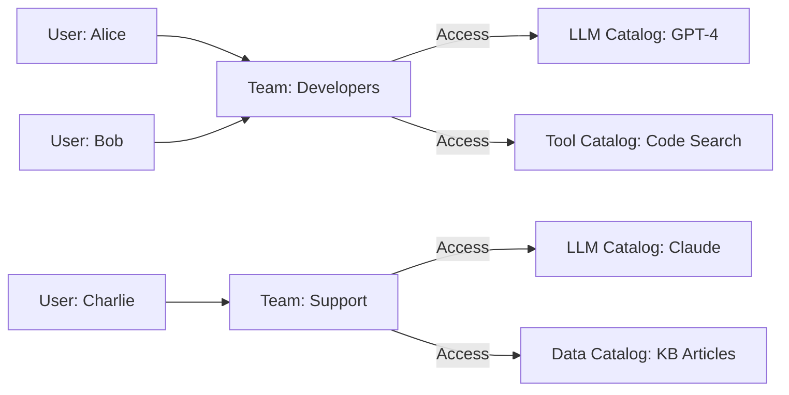

---
<<<<<<< HEAD
title: "Manage Teams in Tyk AI Studio"
description: "Understand how to use Teams in Tyk AI Studio to organize users and manage role-based access control (RBAC) for LLM providers, data sources, and tools."
keywords: "AI Studio, AI Management, Teams"
sidebarTitle: "Teams"
---

## Availability

| Edition | Deployment Type |
| :------------- | :---------------------- |
| [Enterprise](/ai-management/ai-studio/overview#enterprise-edition) | Self-Managed, Hybrid |
Teams in Tyk AI Studio help you organize [Users](/ai-management/ai-studio/users) and easily manage their access to [LLM providers](/ai-management/ai-studio/llms), [data sources](/ai-management/ai-studio/datasources-rag), and [tools](/ai-management/ai-studio/tools). By linking Teams to specific [Catalogs](/ai-management/ai-studio/catalogs), you ensure users access only the AI resources relevant to their role.

### Use cases
- **Role-Based Access Control**: Group developers into an "Engineering" Team and grant them access to advanced LLM models and coding tools, while grouping support staff into a "Support" Team with access to customer knowledge bases.
- **Resource Isolation**: Ensure that sensitive data sources (like HR documents) are only accessible to the "HR" Team by linking the specific data [Catalog](/ai-management/ai-studio/catalogs) only to that Team.
- **Simplified Onboarding**: When a new employee joins, simply add them to the relevant Team to automatically grant them access to all the necessary AI tools and models for their department.

### Community vs Enterprise Edition
In the **Community Edition**, the Teams feature is not available for custom configuration. Instead, there is a single, built-in **"Default" Team**. All users are automatically assigned to this Default Team, and it is permanently linked to the default catalogs.

In the **Enterprise Edition**, you have full access to create, manage, and delete custom Teams, allowing for granular Role-Based Access Control (RBAC) across your organization. Note that even in the Enterprise Edition, the "Default" Team cannot be deleted.

## What is a Team?

A Team acts as the central access control mechanism in Tyk AI Studio. Instead of assigning permissions to individual [Users](/ai-management/ai-studio/users), administrators assign [Catalogs](/ai-management/ai-studio/catalogs) (LLM providers, Data sources, and Tools) to a Team. Users are then added as members of the Team.

This architecture simplifies permission management, as a user's access rights are dynamically inherited from their Team memberships. A user can belong to multiple Teams, and a Team can have multiple Catalogs of different types.

## Configuration
When configuring a Team, the following options are available:
- **Team Name**: A descriptive name for the Team (e.g., "Solutions Architects", "Marketing").
- **Manage Team Members**: An interface to search and add existing users to the Team, or remove current members.
- **Add Catalogs**: Sections to link the Team to specific catalogs:
  - **LLM providers catalogs**: Grants access to specific AI models.
  - **Data sources catalogs**: Grants access to specific datasets or knowledge bases.
  - **Tools catalogs**: Grants access to specific tools (e.g., web search, calculators).

## How to Create a Team
To create a new Team in Tyk AI Studio:
1. Navigate to the **Teams** section in the AI Studio dashboard.
2. Click on the **Create team** button.
3. Enter a descriptive **Team name**.
4. In the **Manage team members** section, search for existing [Users](/ai-management/ai-studio/users) and add them to the Team.
5. In the **Add catalogs** section, select one or more [Catalogs](/ai-management/ai-studio/catalogs) (LLM providers, Data sources, or Tools) to make them available to this Team.
6. Click **Save** to create the Team and apply the access rules.

  
=======
title: "Teams View for Tyk AI Studio"
description: "Overview of teams in AI Studio?"
sidebarTitle: "Teams View for Tyk AI Studio"
tags: ['AI Studio', 'AI Management', 'Teams']
---

# Teams View for Tyk AI Studio

The Teams View allows administrators to manage role-based access control by organizing users into teams. Teams define permissions and access levels across the portal, enabling streamlined user management.

---

#### **Table Overview**
The teams are displayed in a tabular format with the following columns:

1. **ID**:
   A unique identifier assigned to each team for easy reference.

2. **Name**:
   The name of the team, describing its role or purpose (e.g., "Solutions Architects," "Customer Support").

3. **Actions**:
   A menu (represented by three dots) allowing administrators to perform additional actions on a team, such as editing its details, managing permissions, or deleting it.

---

#### **Features**
1. **Add Team Button**:
   Located in the top-right corner of the view, this green button allows administrators to create a new team. Clicking the button opens a form to configure the team's name, permissions, and members.

2. **Pagination Dropdown**:
   Found at the bottom-left corner of the table, this dropdown allows administrators to select how many teams are displayed per page (e.g., 10, 20, or more teams).

---

#### **Role-Based Access Control**
Each team represents a set of users with shared permissions. Teams help to:
- Grant or restrict access to specific features or sections of the portal.
- Streamline permission management by assigning roles at the team level instead of individually for each user.
- Enhance security by ensuring users only have access to the resources they need.

---

The Teams View is a critical tool for managing access control efficiently, ensuring that users have the appropriate permissions based on their roles within the organization.

### Teams Quick Actions in Tyk AI Studio

The Teams View includes a set of quick actions accessible via the **Actions** menu (three-dot icon) for each team. These actions allow administrators to make modifications on the fly without navigating to separate pages.

---

#### **Quick Actions Overview**

1. **Add Catalogue to Team**:
   Associates a general catalogue of resources with the team. Catalogues are bundles of LLMs, tools, and data sources that the team can access.

2. **Add Data Catalogue to Team**:
   Specifically links a data catalogue to the team. This grants access to specific datasets and data resources.

3. **Add Tool Catalogue to Team**:
   Assigns a tool catalogue to the team, enabling access to specific tools and utilities defined for the team.

4. **Add User to Team**:
   Opens an interface to add a new user to the selected team. This action facilitates user-role assignment directly from the Teams View.

5. **Edit Team**:
   Redirects to an editing interface where the team's name, description, and permissions can be modified.

6. **Delete Team**:
   Permanently removes the team from the portal. This action may require confirmation to prevent accidental deletions.

---

#### **Efficiency in Team Management**
These quick actions streamline team management by allowing administrators to update access, assign resources, or modify user roles without navigating away from the Teams View. This improves workflow efficiency, especially in environments with frequent updates or large user bases.

### Team Details View for Tyk AI Studio

The **Team Details View** allows administrators to review and modify the access credentials and object ownership of a specific team. This includes managing users and assigning catalogues for various resources. Below is an explanation of the elements and actions available:

---

#### **Team Information**
- **Name**:
  Displays the name of the selected team (e.g., "Solutions Architects"). This provides context for the resources and users associated with the team.

---

#### **Users in Team**
- **List of Users**:
  Displays the names of all users currently assigned to the team (e.g., Martin, Leonid, Ahmet).
  - Each user entry includes a **delete icon** (trash bin) for removing the user from the team.

- **Add User Button**:
  A green button labeled **+ ADD USER** that allows administrators to add a new user to the team. Clicking this opens a user selection interface.

---

#### **Catalogues in Team**
Catalogues grant access to resources, tools, or data collections that are assigned to the team.

1. **Catalogues in Team**:
   - Displays a list of general catalogues assigned to the team.
   - Includes a **+ ADD CATALOGUE** button to add new catalogues.

2. **Data Catalogues in Team**:
   - Lists all data catalogues assigned to the team.
   - Includes a **+ ADD DATA CATALOGUE** button for adding new data catalogues.

3. **Tool Catalogues in Team**:
   - Lists all tool catalogues associated with the team (e.g., "Solution Architects").
   - Includes a **+ ADD TOOL CATALOGUE** button to add additional tool catalogues.

- **Delete Icons**:
  Each catalogue entry includes a delete icon (trash bin) for removing the catalogue from the team.

---

#### **Navigation**
- **Back to Teams**:
  A link in the top-right corner that returns the administrator to the Teams List View without saving any changes made in the current view.

---

This Team Details View provides a centralized interface for managing team resources and user roles. It ensures that administrators can efficiently update permissions and access rights, maintaining the organization's security and productivity standards.
>>>>>>> 94d4aceb (push initial code)
