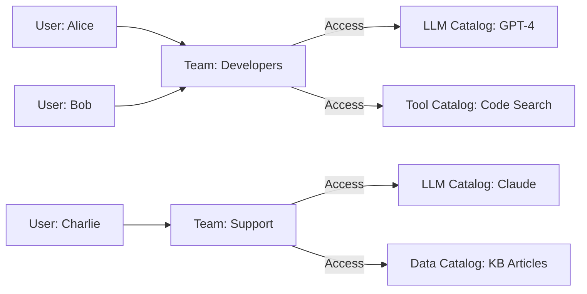

## Availability

| Edition | Deployment Type |
| :------------- | :---------------------- |
| [Enterprise](ai-management/ai-studio/overview#enterprise-edition) | Self-Managed, Hybrid |
Teams in Tyk AI Studio help you organize [Users](/ai-management/ai-studio/users) and easily manage their access to [LLM providers](/ai-management/ai-studio/llms), [data sources](/ai-management/ai-studio/datasources-rag), and [tools](/ai-management/ai-studio/tools). By linking Teams to specific [Catalogs](/ai-management/ai-studio/catalogs), you ensure users access only the AI resources relevant to their role.

### Use cases
- **Role-Based Access Control**: Group developers into an "Engineering" Team and grant them access to advanced LLM models and coding tools, while grouping support staff into a "Support" Team with access to customer knowledge bases.
- **Resource Isolation**: Ensure that sensitive data sources (like HR documents) are only accessible to the "HR" Team by linking the specific data [Catalog](/ai-management/ai-studio/catalogs) only to that Team.
- **Simplified Onboarding**: When a new employee joins, simply add them to the relevant Team to automatically grant them access to all the necessary AI tools and models for their department.

### Community vs Enterprise Edition
In the **Community Edition**, the Teams feature is not available for custom configuration. Instead, there is a single, built-in **"Default" Team**. All users are automatically assigned to this Default Team, and it is permanently linked to the default catalogs.

In the **Enterprise Edition**, you have full access to create, manage, and delete custom Teams, allowing for granular Role-Based Access Control (RBAC) across your organization. Note that even in the Enterprise Edition, the "Default" Team cannot be deleted.

## What is a Team?

A Team acts as the central access control mechanism in Tyk AI Studio. Instead of assigning permissions to individual [Users](/ai-management/ai-studio/users), administrators assign [Catalogs](/ai-management/ai-studio/catalogs) (LLM providers, Data sources, and Tools) to a Team. Users are then added as members of the Team.

This architecture simplifies permission management, as a user's access rights are dynamically inherited from their Team memberships. A user can belong to multiple Teams, and a Team can have multiple Catalogs of different types.

## Configuration
When configuring a Team, the following options are available:
- **Team Name**: A descriptive name for the Team (e.g., "Solutions Architects", "Marketing").
- **Manage Team Members**: An interface to search and add existing users to the Team, or remove current members.
- **Add Catalogs**: Sections to link the Team to specific catalogs:
  - **LLM providers catalogs**: Grants access to specific AI models.
  - **Data sources catalogs**: Grants access to specific datasets or knowledge bases.
  - **Tools catalogs**: Grants access to specific tools (e.g., web search, calculators).

## How to Create a Team
To create a new Team in Tyk AI Studio:
1. Navigate to the **Teams** section in the AI Studio dashboard.
2. Click on the **Create team** button.
3. Enter a descriptive **Team name**.
4. In the **Manage team members** section, search for existing [Users](/ai-management/ai-studio/users) and add them to the Team.
5. In the **Add catalogs** section, select one or more [Catalogs](/ai-management/ai-studio/catalogs) (LLM providers, Data sources, or Tools) to make them available to this Team.
6. Click **Save** to create the Team and apply the access rules.

  