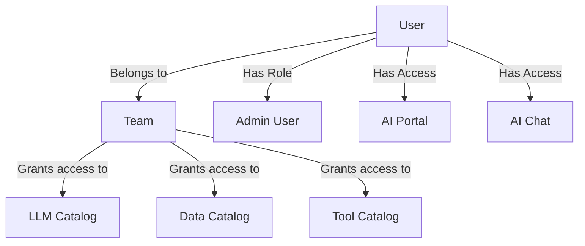

## Availability

| Edition | Deployment Type |
| :------------- | :---------------------- |
| [Community](ai-management/ai-studio/overview#community-edition) & [Enterprise](ai-management/ai-studio/overview#enterprise-edition) | Self-Managed, Hybrid |

Users in Tyk AI Studio represent individuals who interact with the platform. They can be administrators managing the system or consumers accessing the AI portal and chat interfaces.

### Use cases
- **Administrative Management**: Super admins can create user accounts for other administrators to help manage AI Studio configurations, [Teams](/ai-management/ai-studio/teams), and [Catalogs](/ai-management/ai-studio/catalogs).
- **Developer Access**: Developers can be granted access to the [AI Portal](/ai-management/ai-studio/ai-portal) to consume LLM APIs using their generated API keys.
- **End-User Chat**: Non-technical users can be given access to the [AI Chat](/ai-management/ai-studio/chat-interface) interface to interact with approved LLMs and data sources safely.

### Community vs Enterprise Edition
In the **Community Edition**, basic user management is available, and all users are automatically assigned to a single, built-in "Default" [Team](/ai-management/ai-studio/teams). 
In the **Enterprise Edition**, you can create multiple Teams, assign users to specific Teams for granular access control, and configure Single Sign-On (SSO) provisioning.

## What is a User?

A User in Tyk AI Studio is the fundamental identity for authentication and authorization. Each user has basic information (Name, Email, Password) and specific access flags. 

Users do not directly get assigned to AI resources (like LLMs or Data Sources). Instead, their access is governed by the [Teams](/ai-management/ai-studio/teams) they belong to. When a user is added to a Team, they inherit access to all the [Catalogs](/ai-management/ai-studio/catalogs) associated with that Team.

### Default Roles and the Initial User
When setting up Tyk AI Studio, the very first user created is automatically granted the **Super Admin** role. This initial user is critical because they bypass standard authorization checks and are the only one who can configure SSO, set up the initial LLM providers, and create other administrative users.

The available roles and access flags for users include:
- **Super Admin**: Full access to all system configurations, including SSO and initial setup.
- **Admin User**: Can manage AI Studio configurations, Teams, and Catalogs.
- **Developer**: Typically granted access to the AI Portal to generate API keys and integrate with LLMs.
- **End User**: Typically granted access only to the AI Chat interface.

### API Key Generation
Every user in Tyk AI Studio can generate an **API Key**. 

**What is this API Key used for?**
This API key is specifically used for programmatic access to the Tyk [AI Studio management APIs](/ai-management/ai-studio/ai-studio-swagger) (the Admin API) and the AI Portal.

## Configuration
When configuring a User, the following options are available:
- **Name**: The full name of the user.
- **Email**: The user's email address, used for login.
- **Password**: The user's password for authentication.
- **Admin User**: Grants the user administrative privileges to manage AI Studio.
- **Show Portal**: Grants the user access to the AI Portal interface.
- **Show Chat**: Grants the user access to the AI Chat interface.
- **Email Verified**: Indicates if the user's email has been verified.

## How to Create a User
To create a new User in Tyk AI Studio:
1. Navigate to the **Users** section in the AI Studio dashboard.
2. Click on the **Add User** button.
3. Fill in the required basic information: **Name**, **Email**, and **Password**.
4. Configure the user's permissions by toggling the appropriate switches (e.g., **Admin User**, **Show Portal**, **Show Chat**).
5. Click **Add User** to create the user.
6. (Optional) After creation, you can view the user's details to generate or copy their API Key, or assign them to specific [Teams](/ai-management/ai-studio/teams).

    