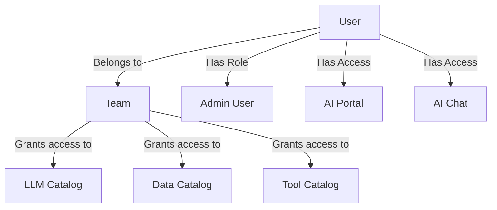

## Availability

| Edition | Deployment Type |
| :------------- | :---------------------- |
| [Community](ai-management/ai-studio/overview#community-edition) & [Enterprise](ai-management/ai-studio/overview#enterprise-edition) | Self-Managed, Hybrid |

Users in Tyk AI Studio represent individuals who interact with the platform. They can be administrators managing the system or consumers accessing the AI portal and chat interfaces.

### Use cases
- **Administrative Management**: Super admins can create user accounts for other administrators to help manage AI Studio configurations, teams, and catalogs.
- **Developer Access**: Developers can be granted access to the AI Portal to consume LLM APIs using their generated API keys.
- **End-User Chat**: Non-technical users can be given access to the AI Chat interface to interact with approved LLMs and data sources safely.

## Details About Entity
A User in Tyk AI Studio is the fundamental identity for authentication and authorization. Each user has basic information (Name, Email, Password) and specific access flags. Users do not directly get assigned to AI resources (like LLMs or Data Sources). Instead, their access is governed by the Teams they belong to. When a user is added to a Team, they inherit access to all the catalogs associated with that Team.

## Configuration
When configuring a User, the following options are available:
- **Name**: The full name of the user.
- **Email**: The user's email address, used for login.
- **Password**: The user's password for authentication.
- **Admin User**: Grants the user administrative privileges to manage AI Studio.
- **Show Portal**: Grants the user access to the AI Portal interface.
- **Show Chat**: Grants the user access to the AI Chat interface.
- **Email Verified**: Indicates if the user's email has been verified.
- **Enable Notifications**: Allows the user to receive system notifications.
- **Enable access to IdP configuration**: Grants the user permission to configure Identity Providers (SSO).

## How to Create the Entity
To create a new User in Tyk AI Studio:
1. Navigate to the **Users** section in the AI Studio dashboard.
2. Click on the **Add User** button.
3. Fill in the required basic information: **Name**, **Email**, and **Password**.
4. Configure the user's permissions by toggling the appropriate switches (e.g., **Admin User**, **Show Portal**, **Show Chat**).
5. Click **Add User** to create the user.
6. (Optional) After creation, you can view the user's details to generate or copy their API Key, or assign them to specific Teams.

<!-- TODO: Add screenshot of the Users list view -->
<!-- TODO: Add screenshot of the Add User form -->
