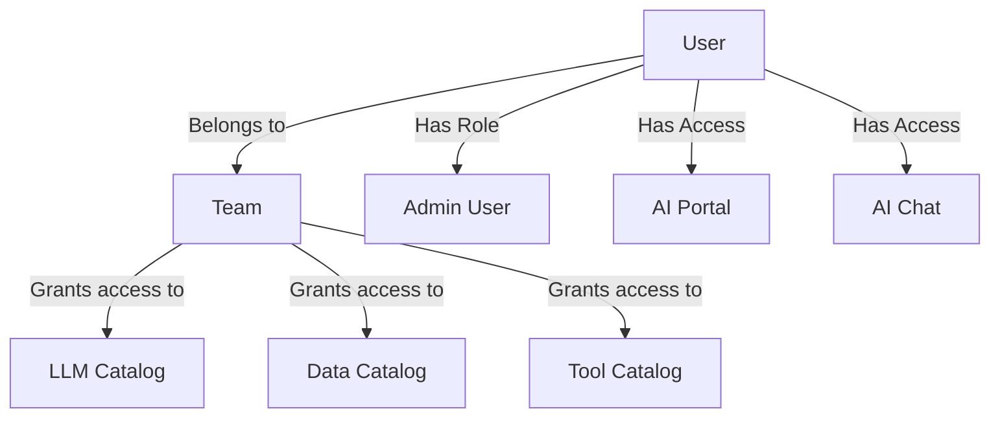

## Availability

| Edition | Deployment Type |
| :------------- | :---------------------- |
| [Community](/ai-management/ai-studio/overview#community-edition) & [Enterprise](/ai-management/ai-studio/overview#enterprise-edition) | Self-Managed, Hybrid |

Users in Tyk AI Studio represent individuals who interact with the platform. They can be administrators managing the system or consumers accessing the AI portal and chat interfaces.

```mermaid
graph TD
    User[User] -->|Belongs to| Team[Team]
    Team -->|Grants access to| LLMCatalog[LLM Catalog]
    Team -->|Grants access to| DataCatalog[Data Catalog]
    Team -->|Grants access to| ToolCatalog[Tool Catalog]
    User -->|Has Role| Admin[Admin User]
    User -->|Has Access| Portal[AI Portal]
    User -->|Has Access| Chat[AI Chat]
```

### Use cases
- **Administrative Management**: Super admins can create user accounts for other administrators to help manage AI Studio configurations, [Teams](/ai-management/ai-studio/teams), and [Catalogs](/ai-management/ai-studio/catalogs).
- **Developer Access**: Developers can be granted access to the [AI Portal](/ai-management/ai-studio/ai-portal) to consume LLM APIs using their generated API keys.
- **End-User Chat**: Non-technical users can be given access to the [AI Chat](/ai-management/ai-studio/chat-interface) interface to interact with approved LLMs and data sources safely.

### Community vs Enterprise Edition
In the **Community Edition**, basic user management is available, and all users are automatically assigned to a single, built-in "Default" [Team](/ai-management/ai-studio/teams). 
In the **Enterprise Edition**, you can create multiple Teams, assign users to specific Teams for granular access control, and configure Single Sign-On (SSO) provisioning. Administrative access in the Enterprise Edition comes from roles. There are five system roles: Owner, Administrator, Editor, Viewer, and Auditor. You assign roles to users directly, or to the Teams that they belong to.

## What is a User?

A User in Tyk AI Studio is the fundamental identity for authentication and authorization. Each user has basic information (Name, Email, Password) and specific access flags. 

Users do not directly get assigned to AI resources (like LLMs or Data Sources). Instead, their access is governed by the [Teams](/ai-management/ai-studio/teams) they belong to. When a user is added to a Team, they inherit access to all the [Catalogs](/ai-management/ai-studio/catalogs) associated with that Team.

### Default Roles and the Initial User
When setting up Tyk AI Studio, the very first user created is automatically granted the **Super Admin** role. This initial user is critical because they bypass standard authorization checks and are the only one who can configure SSO, set up the initial LLM providers, and create other administrative users.

The available roles and access flags for users include:
- **Super Admin**: Full access to all system configurations, including SSO and initial setup.
- **Admin User**: Can manage AI Studio configurations, Teams, and Catalogs.
- **Developer**: Typically granted access to the AI Portal to generate API keys and integrate with LLMs.
- **End User**: Typically granted access only to the AI Chat interface.

### API Keys
A user can have one **API Key**. The key gives programmatic access to the [AI Studio management APIs](/ai-management/ai-studio/ai-studio-swagger) (the Admin API) and the AI Portal, with the full permissions of the user.

- Only self-registered users get a key automatically. Users that an administrator creates, and users that SSO provisions, have no key until someone issues one.
- An administrator issues, regenerates, or revokes a key on the user's detail page. The detail page also shows when the key was last used.
- A user can issue or revoke their own key from the account menu (**My API key**).
- AI Studio does not issue keys to SSO-provisioned users unless `ALLOW_SSO_USER_API_KEYS=true`. Refer to [SSO Users and API Keys](/ai-management/ai-studio/sso#provisioned-users-api-keys-and-offboarding).
- Users without the `users:write` permission cannot see the API keys of other users. The API returns `api_key_hint` and `has_api_key` instead of the key.

## Configuration
When configuring a User, the following options are available:
- **Name**: The full name of the user.
- **Email**: The user's email address, used for login.
- **Password**: The user's password for authentication.
- **Admin User** (Community Edition): Grants the user administrative privileges to manage AI Studio. In the Enterprise Edition, this switch is not shown, because roles control administrative access.
- **Show Portal**: Grants the user access to the AI Portal interface.
- **Show Chat**: Grants the user access to the AI Chat interface.
- **Email Verified**: Indicates if the user's email has been verified. A user cannot log in until their email is verified.
- **Roles** (Enterprise Edition): The roles that control what the user can see and do in the admin UI and API. Team roles apply in addition to these roles.
- **Teams**: The Teams that the user belongs to. New users also join the Default Team automatically.
- **Budget team** (Enterprise Edition): The Team that the spend of the user's new Apps counts against. The form shows this field when the user belongs to more than one Team. The default is **Automatic (first team other than Default)**. For users in more than one Team, select the budget team explicitly, so that the spend goes to the correct Team. Refer to [Team Budgets](/ai-management/ai-studio/budgeting#team-budgets).

## How to Create a User
To create a new User in Tyk AI Studio:
1. Navigate to **Access > Users** in the admin UI sidebar.
2. Click on the **Add User** button.
3. Fill in the required basic information: **Name**, **Email**, and **Password**.
4. Set the switches for the user, such as **Show Portal** and **Show Chat**. In the Community Edition, you can also set **Admin User**.
5. Click **Add User** to create the user.
6. (Optional) After creation, open the user's details to issue an API Key, or assign the user to [Teams](/ai-management/ai-studio/teams).

    

## Users List

The **Users** list shows these columns for each user:

- **Name**, **Email**, and **Email Verified**
- **Origin**: How the account was created. The values are **Self-registered**, **Admin-created**, and **SSO** (created on the first login through an identity provider). The origin does not change. A user who registered before you turned on SSO stays **Self-registered**, also when they log in through the identity provider.
- **API key**: **Issued** when the user has an API key, or **None**.
- **Status**: **Active** or **Disabled**.
- **Is Admin** (Community Edition) or **Roles** (Enterprise Edition): In the Enterprise Edition, the list shows direct roles and the roles that the user gets from Teams. A role from a Team has a "via team" badge.
- **Actions**: A menu to add the user to a Team, edit the user, disable or enable the user, or delete the user.

Next to the search box, you can filter the list by **Origin**, **API key**, and **Status**. For example, use the filters to find SSO users that still have an API key, or to list all disabled users.

## Disable a User

To stop all access for a user immediately, disable the user. Click the **Actions** menu of the user, then click **Disable user**. You can also click **Disable user** on the user's detail page.

A disabled user is refused everywhere: browser sessions, API key, password login, SSO login, OAuth tokens, and password reset. When you disable a user, AI Studio also does these steps:

- It ends the user's current session.
- It cancels any pending password reset.
- It deactivates the credentials of the Apps that the user owns.

To restore access, click **Enable user**. Enabling a user does not activate the App credentials again. Activate them for each App.

You cannot disable your own account. In the Community Edition, you also cannot disable the **Super Admin**, which is the first user created. Refer to [Default Roles and the Initial User](#default-roles-and-the-initial-user). In the Enterprise Edition, you cannot disable the last user with the Owner role.
