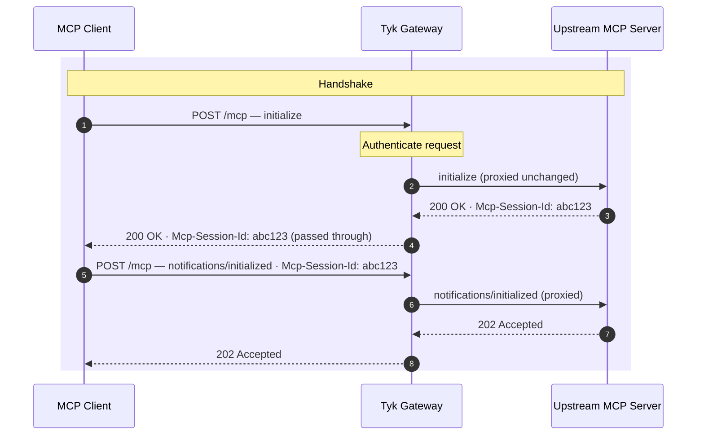
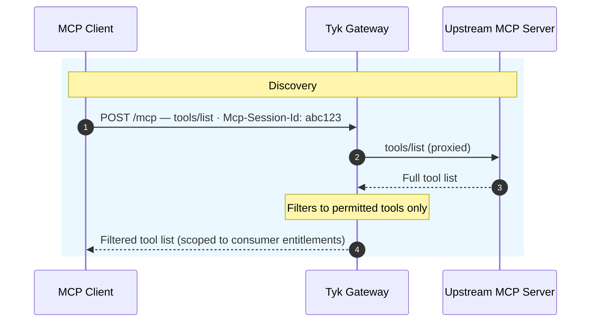
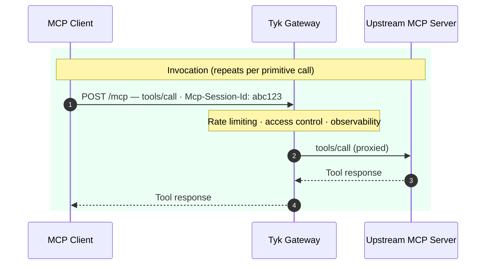
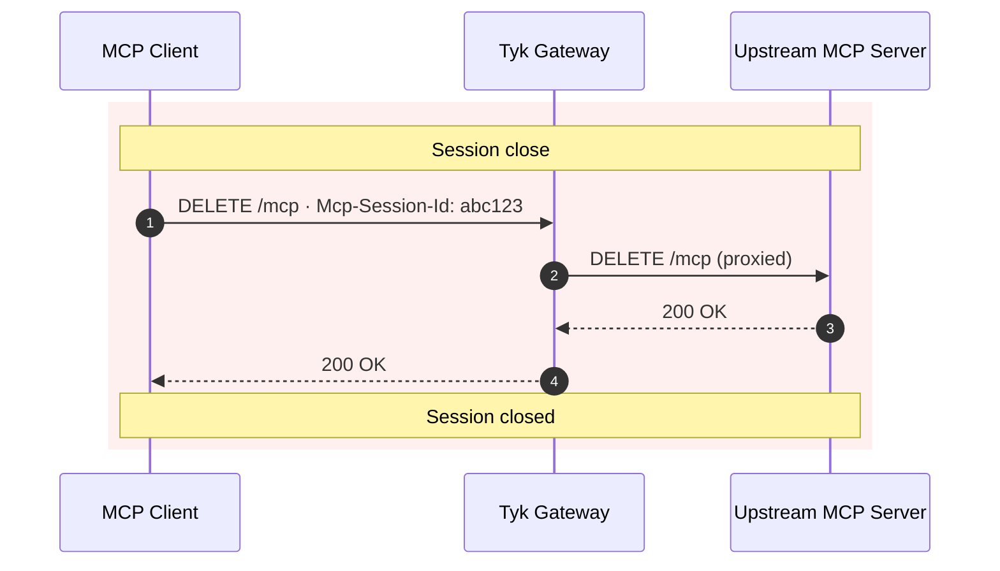

Understanding how Tyk's MCP Gateway works requires understanding three things: the MCP protocol itself, how Tyk maps that protocol to its gateway model, and how the proxy definition, middleware, and policies compose into a control layer over every tool call. This page covers all three. If you're new to MCP or want the product-level picture first, start with the [MCP Gateway overview](/ai-management/mcp-gateway/overview).

| Section | What it covers |
|---|---|
| [What is MCP?](#what-is-mcp) | The client-server model, primitive types, the JSON-RPC request format, and the full method reference |
| [The gateway's role](#the-gateway-role) | How Tyk sits in the protocol flow, what body inspection enables, and how both transports are handled |
| [Session lifecycle](#session-lifecycle) | The four phases of an MCP session from handshake to close, with sequence diagrams |
| [The proxy definition](#the-proxy-definition) | The OAS definition structure: listen path, upstream URL, authentication, and middleware sections |
| [Middleware](#middleware) | Three middleware levels: global, operation, and primitive — with configuration examples |
| [Policies](#policies) | Per-consumer access control and rate limits, and how they layer on top of middleware |

---

## What is MCP?

The Model Context Protocol (MCP) is an open standard that defines how AI applications connect to external tools, data sources, and services. It uses a client-server model: an **MCP client** — an AI agent, LLM orchestration framework, or application — connects to an **MCP server** that exposes capabilities, and the two communicate using JSON-RPC 2.0 messages carried over HTTP.

**Tyk supports the `2025-11-25` revision of the MCP specification.**

### Primitives

MCP servers expose three types of capability, collectively called **primitives**.

| Primitive | Description | Discovery method | Invocation method |
|---|---|---|---|
| **Tool** | A callable function that takes structured arguments and returns a result. Used for actions and computed queries. | `tools/list` | `tools/call` |
| **Resource** | A readable data source identified by a URI. Used for documents, files, and live data feeds. | `resources/list` | `resources/read` |
| **Prompt** | A reusable prompt template the server exposes for common tasks. | `prompts/list` | `prompts/get` |

Each primitive has a name (or URI for resources) that uniquely identifies it within the server:

- A `tools/call` request names the tool in `params.name`
- A `resources/read` request names the resource URI in `params.uri`
- A `prompts/get` request names the prompt in `params.name`

This name is what Tyk uses to apply primitive-level middleware and policy controls.

### Client-side primitives

MCP also defines primitives that run in the opposite direction — capabilities that servers can request from clients rather than expose themselves.

| Primitive | Description | Method |
|---|---|---|
| **Sampling** | Server requests the client to perform LLM inference on its behalf and return the result. | `sampling/createMessage` |
| **Roots** | Server requests the list of filesystem roots (directories or URIs) the client is willing to share. | `roots/list` |
| **Elicitation** | Server requests structured input from the user, mediated through the client. | `elicitation/create` |

<Note>
Tyk passes client-side primitive messages through to the upstream and back. Primitive-level middleware configuration — rate limits, access control, timeouts — applies to server-side primitives only.
</Note>

### The request format

Every MCP operation is a JSON-RPC 2.0 message sent to `POST /mcp`. Each message carries a `method` field that identifies the operation and, for invocation requests, a `params` object that names the specific primitive being accessed.

A typical tool call looks like this:

```json
{
  "jsonrpc": "2.0",
  "id": 1,
  "method": "tools/call",
  "params": {
    "name": "get_current_weather",
    "arguments": { "location": "London" }
  }
}
```

The `method` field identifies the category of operation — `tools/call` here. The `params.name` field identifies the specific tool. Tyk reads both fields on every incoming `POST /mcp` request to determine which middleware to execute before forwarding to the upstream.

### JSON-RPC methods

The MCP specification defines a fixed set of JSON-RPC method names, grouped into four categories.

| Method | Category | Description |
|---|---|---|
| `initialize` | Session | Opens the session and negotiates capabilities. |
| `notifications/initialized` | Session | Client confirms session is ready. |
| `tools/list` | Tools | Returns the list of tools the server exposes. |
| `tools/call` | Tools | Invokes a named tool with the supplied arguments. |
| `resources/list` | Resources | Returns the list of resources the server exposes. |
| `resources/read` | Resources | Reads the content of a named resource URI. |
| `prompts/list` | Prompts | Returns the list of prompt templates the server exposes. |
| `prompts/get` | Prompts | Retrieves a named prompt template, optionally with arguments. |
| `sampling/createMessage` | Sampling | Requests the client to perform LLM sampling on behalf of the server. |
| `notifications/tools/list_changed` | Notifications | Server-initiated notification that the tool list has changed. |

Tyk can apply rate limits, access control, and middleware at the method level (for example, capping all `tools/call` requests) and at the primitive level (for example, rate limiting a specific named tool). The distinction matters: method-level controls apply to every invocation of that method regardless of which primitive is named; primitive-level controls apply only when that specific tool, resource, or prompt is requested.

---

## The gateway role

Without a gateway, AI agents connect directly to MCP servers over HTTP. Each server is responsible for its own authentication, access control, and rate limiting — or has none at all. There is no central point to see which agents are calling which tools, no consistent way to revoke access, and no protection against a slow or unavailable server. For the full picture of why this creates operational risk at scale, see [MCP Gateway overview](/ai-management/mcp-gateway/overview).

Tyk sits between MCP clients and your upstream MCP servers. Unlike a generic reverse proxy that treats all traffic as an opaque HTTP stream, Tyk understands the MCP protocol. It parses the JSON-RPC request body on every `POST /mcp` to identify the method being called and the specific primitive being accessed. This is what makes primitive-level control possible.

Because Tyk knows that a particular request is a `tools/call` for `get_current_weather` — not just a `POST` to `/mcp` — it can:

- Rate limit that tool independently, without affecting other tools on the same server
- Block access to a specific resource URI without restricting the entire resources category
- Enforce a timeout on a slow tool without affecting fast tools
- Strip that tool from `tools/list` responses for consumers whose policy does not permit it
- Record the exact tool name in analytics so you can see precisely which primitives agents are calling

The fundamental difference from a REST proxy is how operations are identified. REST APIs use URL paths and HTTP methods — Tyk routes `GET /weather` differently from `GET /weather/forecast`. MCP routes all traffic through a single endpoint and identifies the operation from the request body:

```text
REST API (Tyk OAS):
  GET  /weather             → weather current conditions
  GET  /weather/forecast    → weather forecast

MCP proxy (Tyk MCP):
  POST /mcp  { "method": "tools/call", "params": { "name": "get-weather" } }
  POST /mcp  { "method": "tools/call", "params": { "name": "get-forecast" } }
```

MCP proxies share the same authentication mechanisms, policy engine, and analytics infrastructure as your REST and GraphQL APIs. The body inspection is the only difference in how operations are identified and matched.

<Note>
MCP definitions are supported in Tyk OAS format only. They are not available as Tyk Classic API definitions.
</Note>

### Transport

MCP uses **Streamable HTTP** as its transport. The MCP specification defines a single endpoint path (`/mcp`) that supports two HTTP methods with distinct roles. Tyk proxies both.

**`POST /mcp` — JSON-RPC messages.** Clients send JSON-RPC 2.0 messages to `POST /mcp`. The upstream MCP server can respond with:

- **`200 application/json`** — A single JSON-RPC response, for operations that complete immediately.
- **`200 text/event-stream`** — A Server-Sent Events stream carrying multiple JSON-RPC messages, used when the server streams results or sends progress notifications.
- **`202 Accepted`** — An acknowledgement for JSON-RPC notifications that do not expect a response body.

Tyk executes the middleware chain against the incoming `POST` request — authenticating, applying rate limits, checking allowlists — and then proxies it to the upstream. Tyk preserves the response content type and streams SSE responses through to the client without buffering or transforming the body.

**`GET /mcp` — Server-Sent Events.** Clients open a persistent `GET /mcp` connection to receive server-initiated messages. The upstream MCP server uses this channel to push progress notifications, resource update notifications, and server-to-client requests such as `sampling/createMessage`. Tyk proxies the SSE stream transparently, maintaining the long-lived connection for the duration of the session.

### Protocol headers

MCP defines several protocol-specific headers that Tyk passes through unchanged in both directions:

| Header | Direction | Purpose |
|---|---|---|
| `MCP-Protocol-Version` | Client → Server | Required. Specifies the MCP protocol revision (for example, `2025-11-25`). |
| `Mcp-Session-Id` | Server → Client, then Client → Server | Session identifier. Returned by the server after initialisation; clients echo it on subsequent requests. |
| `Last-Event-ID` | Client → Server | SSE resume token sent when reconnecting to a `GET /mcp` stream. |
| `Origin` | Client → Server | Used by servers for origin-based security validation. |

The client and upstream MCP server handle version negotiation and session management. Tyk does not modify any MCP protocol headers.

---

## Session lifecycle

MCP is a stateful protocol. When a client sends an `initialize` request, the upstream server responds with an `Mcp-Session-Id` header. The client includes this identifier on all subsequent requests, allowing the server to associate them with the established session context. Tyk passes the header through unmodified and does not maintain session state itself.

A typical session proceeds through four phases.

1. **Handshake** — the client and server negotiate capabilities and establish a session identifier.
2. **Discovery** — the client queries the server's available tools, resources, and prompts.
3. **Invocation** — the client calls primitives; Tyk applies rate limiting, access control, and observability on each request.
4. **Session close** — the client terminates the session; the session identifier is invalidated.

### Handshake

Tyk authenticates the `initialize` request before proxying it to the upstream. The upstream responds with an `Mcp-Session-Id` header that Tyk passes through to the client unchanged. The client confirms readiness with a `notifications/initialized` message, and the session is established.



### Discovery

Once the session is open, the client calls `tools/list` (and optionally `resources/list` and `prompts/list`) to learn what the server exposes. Tyk intercepts the upstream's response and strips any primitives the consumer is not permitted to see, based on the policy attached to their key. The client receives a filtered view of the server's capabilities.



### Invocation

Each primitive call passes through Tyk's full middleware chain. Rate limiting, access control, and observability all fire on every `tools/call` request. If the consumer's policy permits the named tool and rate limits allow the request, Tyk proxies it to the upstream and returns the response. This phase repeats for every tool, resource, or prompt the client invokes.



### Session close

When the client has finished, it sends `DELETE /mcp` with the `Mcp-Session-Id` header. Tyk proxies the request to the upstream, which terminates the session. After session close, the `Mcp-Session-Id` is invalid — a new `initialize` request is required to open a new session.



If the `GET /mcp` SSE connection drops, the client can reconnect by opening a new `GET /mcp` request with the `Last-Event-ID` header set to the ID of the last event received. Tyk passes this through to the upstream, which resumes the stream from that point.

---

## The proxy definition

The **MCP proxy definition** is the configuration object that describes the proxy. It is a Tyk OAS definition — an OpenAPI 3.0 document extended with `x-tyk-api-gateway` — and it is both the single source of truth for everything about the proxy and its registry entry: the listen path, the upstream URL, authentication, middleware, and versioning.

The `x-tyk-api-gateway` extension has four top-level sections:

| Section | What it configures |
|---|---|
| `info` | API name, active state, and internal identifier |
| `server` | Client-facing settings: listen path, authentication, IP access control, custom domain |
| `upstream` | Upstream MCP server: target URL, load balancing, upstream rate limits, mTLS |
| `middleware` | Request processing: global, per-method, and per-primitive middleware |

A minimal MCP proxy definition looks like this:

```json
{
  "openapi": "3.0.3",
  "info": { "title": "Weather MCP proxy", "version": "2025-11-25" },
  "paths": {
    "/mcp": {
      "post": { "operationId": "mcpTransportPost", "responses": { "200": { "description": "JSON-RPC response" } } },
      "get":  { "operationId": "mcpSSEGet",         "responses": { "200": { "description": "SSE stream" } } }
    }
  },
  "x-tyk-api-gateway": {
    "info": {
      "name": "Weather MCP proxy",
      "state": { "active": true }
    },
    "server": {
      "listenPath": { "value": "/weather/", "strip": true },
      "authentication": { "enabled": true }
    },
    "upstream": {
      "url": "https://weather-mcp.example.com"
    }
  }
}
```

Clients connect to Tyk at `https://my-gateway.example.com/weather/mcp`. Tyk authenticates the request, applies any configured middleware, and proxies it to `https://weather-mcp.example.com/mcp`. Tyk serves both the `POST` and `GET` transport endpoints under the same listen path.

You manage MCP proxy definitions through the [Tyk Gateway API](/ai-management/mcp-gateway/mcp_api_extensions) (at `/tyk/mcps`) or the [Tyk Dashboard](/ai-management/mcp-gateway/managing-mcp-proxies). For the full definition structure and field reference, see [MCP OAS definitions](/ai-management/mcp-gateway/mcp_proxy_definitions).

---

## Middleware

Tyk applies middleware to MCP traffic at three levels, all configured in the `x-tyk-api-gateway.middleware` section of the proxy definition. The levels are evaluated in order from broadest to most specific.

### Global middleware

Global middleware applies to every request that reaches the proxy, before any method-level or primitive-level processing. Use it for server-wide concerns: CORS configuration, traffic logging, header injection into upstream requests, or custom plugins that should run on all traffic.

### Operation middleware

Operation middleware applies to all requests for a specific JSON-RPC method, regardless of which primitive is called. Configure it in `middleware.operations`, keyed by the JSON-RPC method name with its HTTP method suffix (for example, `tools/callPOST`). Use it for method-wide policies — a rate limit that applies to all `tools/call` requests without distinguishing between individual tools.

```json
{
  "middleware": {
    "operations": {
      "tools/callPOST": {
        "rateLimit": { "enabled": true, "rate": 500, "per": 60 }
      }
    }
  }
}
```

This rate limit applies to every `tools/call` request, regardless of which tool is named in `params`.

### Primitive middleware

Primitive middleware applies to a specific tool, resource, or prompt. Configure it in one of three maps — `middleware.mcpTools`, `middleware.mcpResources`, or `middleware.mcpPrompts` — keyed by the primitive's identifier: the tool name, resource URI (or URI pattern), or prompt name.

```json
{
  "middleware": {
    "mcpTools": {
      "execute-query": {
        "allow": { "enabled": true },
        "rateLimit": { "enabled": true, "rate": 10, "per": 60 }
      }
    }
  }
}
```

This configuration allowlists the `execute-query` tool and applies a rate limit of 10 requests per minute — independently of any other tools on the same proxy.

When both operation-level and primitive-level middleware are configured, both apply. A `tools/call` request to `execute-query` must pass the operation-level limit (500/min for all tool calls) and the primitive-level limit (10/min for this tool). Access control follows the same pattern: allowlisting specific tools in `mcpTools` puts the entire tools category into allowlist mode, blocking any tool not explicitly listed.

Tyk evaluates the three primitive categories — tools, resources, and prompts — independently. Allowlisting a tool has no effect on whether resources or prompts are accessible.

See [MCP middleware](/ai-management/mcp-gateway/mcp-middleware) for the full list of available capabilities: access control, request and response transformation, traffic management (rate limiting, timeouts, circuit breakers), virtual endpoints, and observability controls.

---

## Policies

A **Tyk security policy** is a reusable template of access rights and usage limits that you apply to one or more API keys. You define a policy once and issue keys that inherit its rules automatically, rather than configuring each key individually. When you update the policy, every key bound to it picks up the change.

Policies give you per-consumer control at every level of the MCP protocol:

- **Proxy access** — control which MCP proxies a consumer key can reach
- **JSON-RPC method access** — restrict which protocol operations a consumer can use (for example, allow `tools/call` but block `sampling/createMessage`)
- **Primitive access** — define per-consumer allowlists and blocklists for individual tools, resources, and prompts, using regular expressions to match by name
- **Per-primitive rate limits** — set independent rate limits on specific primitives, so a consumer exhausting their quota on one tool does not affect their access to others
- **Quotas** — cap total call volume over a renewal period

Primitive access control is enforced at two points in the MCP protocol.

**At invocation time** — Tyk checks `tools/call`, `resources/read`, and `prompts/get` requests against the consumer's permitted primitives. Blocked calls return a JSON-RPC error before the request reaches the upstream.

**At discovery time** — Tyk intercepts `tools/list`, `resources/list`, and `prompts/list` responses from the upstream and strips out any primitives the consumer cannot see. Each consumer receives a filtered view of the server's capabilities from the moment they connect.

### Policies versus middleware

Both middleware and policies can enforce limits on MCP primitives, but they operate on different subjects.

**Middleware** applies to all traffic through the proxy — a primitive rate limit in `mcpTools` caps the call rate for a tool across every caller combined. It protects the upstream from overload.

**Policies** apply per consumer. A primitive rate limit in a policy caps the call rate for one specific key, with each consumer's counters tracked independently. This is how you enforce different entitlements for different consumers — a standard tier with read-only access and lower limits, a premium tier with access to sensitive tools and higher quotas.

The two work together: middleware sets the ceiling for all traffic, policies determine what each consumer is entitled to within that ceiling.

See [MCP proxy policies](/ai-management/mcp-gateway/policies) for the full configuration reference, Dashboard UI walkthrough, and API examples.

---

## See also

- [MCP Gateway overview](/ai-management/mcp-gateway/overview) — What Tyk MCP Gateway does, the problems it solves, and what it provides.
- [MCP OAS definitions](/ai-management/mcp-gateway/mcp_proxy_definitions) — The full structure of the proxy definition, including all middleware maps and field reference.
- [MCP middleware](/ai-management/mcp-gateway/mcp-middleware) — Every middleware capability available for MCP primitives: access control, rate limiting, timeouts, circuit breakers, and more.
- [MCP proxy policies](/ai-management/mcp-gateway/policies) — Per-consumer primitive rate limits, primitive access control lists, and the five-level rate limit hierarchy.
- [Managing MCP proxies](/ai-management/mcp-gateway/managing-mcp-proxies) — Create, update, and delete MCP proxies in the Dashboard.
