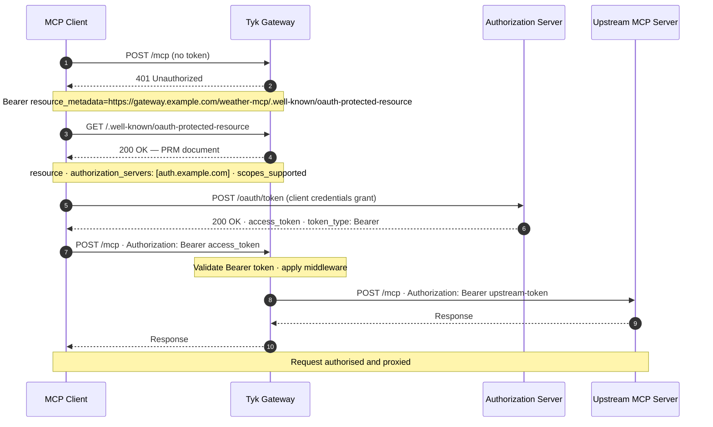
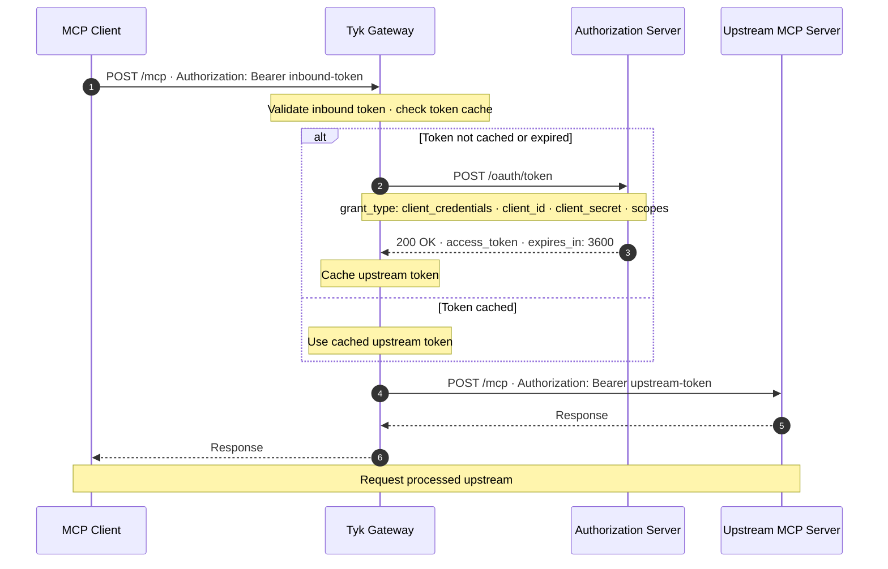
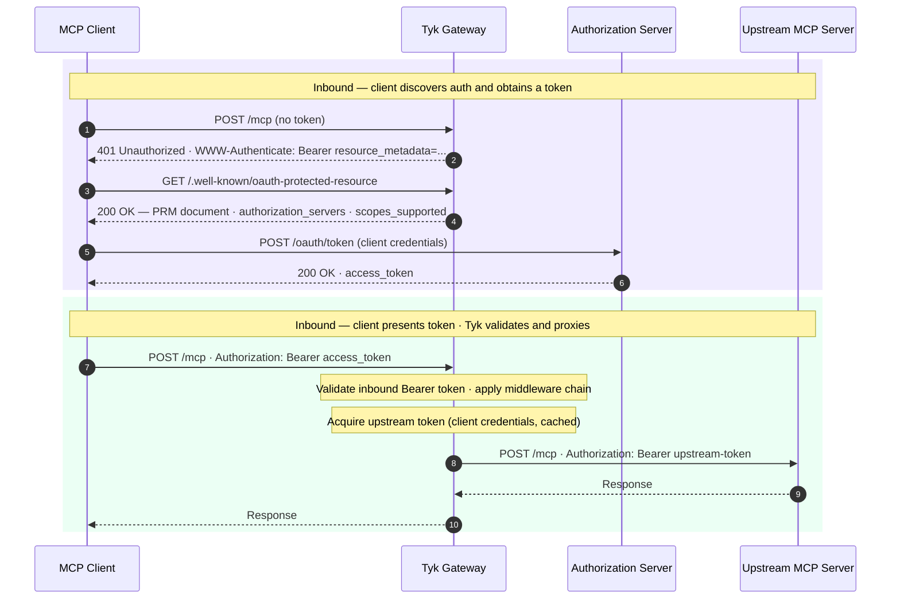

This page explains how Tyk Gateway implements the OAuth 2.1 authorization model defined by the MCP specification. It covers inbound Bearer token authentication, Protected Resource Metadata (PRM) discovery, and upstream OAuth — the mechanism by which Tyk acquires and forwards credentials to an OAuth-protected upstream MCP server. After reading this page you'll be able to configure end-to-end OAuth 2.1 for any MCP proxy.

---

## The MCP authorization model

MCP authorization operates on two distinct planes.

**Inbound authorization** governs how MCP clients — AI agents, LLM frameworks, and applications — authenticate to Tyk Gateway. Tyk validates the credential on every request before it reaches your upstream MCP server. All [authentication methods](/api-management/authentication) supported by Tyk apply here: Bearer tokens, API keys, JWT, and mutual TLS.

<Note>
For OAuth 2.1 compliance, access tokens are presented as Bearer tokens in the `Authorization` header — use Tyk's JWT authentication method if your authorization server issues JWTs, or Bearer token authentication for opaque tokens.
</Note>

**Upstream authorization** governs how Tyk authenticates to your upstream MCP server when that server requires an OAuth token. Tyk obtains the token from the authorization server using the client credentials flow and injects it into every proxied request. Your upstream receives a properly authorized request without any involvement from the original caller.

The two planes are configured independently. Bearer tokens on the inbound side (validating AI agent credentials) can be combined with client credentials on the upstream side (authenticating to an OAuth-protected MCP server behind the gateway).

---

## Protected Resource Metadata

**Protected Resource Metadata (PRM)** is the standardized discovery mechanism defined in [RFC 9728](https://www.rfc-editor.org/rfc/rfc9728). It gives OAuth clients a machine-readable document describing a protected resource: which authorization servers can issue tokens for it, and which OAuth scopes it supports.

The MCP specification recommends that every MCP server expose a PRM document so that clients can discover the correct authorization server before attempting to call the API. Without this discovery step, clients must be pre-configured with authorization server URLs — an approach that becomes fragile as deployments grow and authorization infrastructure changes.

Tyk serves the PRM document natively. When PRM is enabled on an MCP API definition, Tyk intercepts GET requests to the well-known path and responds with the metadata document. The endpoint is accessible without authentication, because its purpose is to help unauthenticated clients discover where to obtain credentials.

### The discovery flow

The full OAuth 2.1 discovery flow through Tyk follows these steps:



The `WWW-Authenticate` header Tyk sends on authentication failure is a standard Bearer challenge extended with the `resource_metadata` parameter defined in RFC 9728. Any OAuth 2.1-compliant client library handles this automatically.

### Configuring PRM

PRM is configured in the `protectedResourceMetadata` field of the MCP server authentication section:

```json
{
  "x-tyk-api-gateway": {
    "server": {
      "authentication": {
        "enabled": true,
        "protectedResourceMetadata": {
          "enabled": true,
          "resource": "https://gateway.example.com/weather-mcp/",
          "authorizationServers": ["https://auth.example.com"],
          "scopesSupported": ["tools:read", "tools:write"]
        }
      }
    }
  }
}
```

The fields are:

| Field | Required | Description |
|---|---|---|
| `enabled` | Yes | Activates the PRM endpoint. When `true`, Tyk serves the metadata document and includes the `WWW-Authenticate: Bearer resource_metadata=...` header on authentication failures. |
| `resource` | Yes | The resource identifier for this API — typically the URL at which Tyk exposes the MCP proxy. Accepts `$tyk_context.*` variables for dynamic values. |
| `authorizationServers` | Required for MCP proxies | One or more authorization server URLs that can issue tokens for this resource. Tyk validates that at least one entry is present for MCP OAS definitions. |
| `scopesSupported` | No | The OAuth 2.0 scopes this resource recognises. Including scopes here helps clients request the minimum permissions needed. |
| `wellKnownPath` | No | Overrides the default well-known path. Defaults to `.well-known/oauth-protected-resource`. Relative to the API's listen path. |

The PRM endpoint is served at `{listen-path}/{wellKnownPath}`. With the default path and a listen path of `/weather-mcp/`, the endpoint is available at `/weather-mcp/.well-known/oauth-protected-resource`.

<Note>
For MCP OAS definitions, Tyk validates that `authorizationServers` contains at least one entry. This validation is enforced when creating or updating an MCP proxy through the Dashboard or the Gateway API.
</Note>

---

## Upstream OAuth

When the upstream MCP server is itself protected by OAuth, Tyk handles token acquisition and injection transparently. Rather than requiring the original caller to pass upstream credentials, Tyk acts as an OAuth client: it obtains a token from the upstream's authorization server using the client credentials flow and attaches it to every proxied request.

Tyk caches acquired tokens and refreshes them before they expire, so the upstream sees a consistent stream of valid credentials without a token request on every MCP call.

<Note>
Upstream OAuth is available in Tyk Enterprise Edition only.
</Note>

### Client credentials flow

The client credentials grant is the appropriate flow for machine-to-machine communication — where Tyk, not a user, is the entity making requests to the upstream. OAuth 2.1 retains this flow specifically for server-to-server scenarios.



### Configuring upstream OAuth

Upstream OAuth is configured in the `upstream.authentication` section of the API definition:

```json
{
  "x-tyk-api-gateway": {
    "upstream": {
      "url": "https://weather-mcp.example.com",
      "authentication": {
        "enabled": true,
        "oauth": {
          "enabled": true,
          "allowedAuthorizeTypes": ["clientCredentials"],
          "clientCredentials": {
            "clientId": "tyk-gateway-client",
            "clientSecret": "your-client-secret",
            "tokenUrl": "https://auth.example.com/oauth/token",
            "scopes": ["mcp:read", "mcp:write"]
          }
        }
      }
    }
  }
}
```

The `clientCredentials` fields are:

| Field | Required | Description |
|---|---|---|
| `clientId` | Yes | The OAuth client ID issued by the authorization server for this gateway instance. |
| `clientSecret` | Yes | The client secret associated with the client ID. |
| `tokenUrl` | Yes | The token endpoint of the upstream's authorization server. |
| `scopes` | No | The scopes to request when obtaining the token. The authorization server grants only the scopes it recognises and the client is permitted. |
| `extraMetadata` | No | Keys to extract from the token response and pass to the upstream as additional context. |

---

## The complete OAuth 2.1 flow

Combining inbound PRM discovery, inbound Bearer validation, and upstream client credentials, the full architecture looks like this:



The MCP client and the upstream MCP server each receive properly authorized requests at their respective trust boundaries. Tyk sits between them, mediating both flows independently.

---

## A complete configuration example

The following configuration for a weather MCP proxy enables PRM discovery, Bearer token authentication for inbound clients, and client credentials for the upstream:

```json
{
  "openapi": "3.0.3",
  "info": { "title": "Weather MCP proxy", "version": "2025-11-25" },
  "paths": {
    "/mcp": {
      "post": { "operationId": "mcpTransportPost", "responses": { "200": { "description": "JSON-RPC response" } } },
      "get":  { "operationId": "mcpSSEGet",         "responses": { "200": { "description": "SSE stream" } } }
    }
  },
  "x-tyk-api-gateway": {
    "info": {
      "name": "Weather MCP proxy",
      "state": { "active": true }
    },
    "server": {
      "listenPath": { "value": "/weather-mcp/", "strip": true },
      "authentication": {
        "enabled": true,
        "securitySchemes": {
          "authToken": { "enabled": true }
        },
        "protectedResourceMetadata": {
          "enabled": true,
          "resource": "https://gateway.example.com/weather-mcp/",
          "authorizationServers": ["https://auth.example.com"],
          "scopesSupported": ["tools:read", "tools:write"]
        }
      }
    },
    "upstream": {
      "url": "https://weather-mcp.example.com",
      "authentication": {
        "enabled": true,
        "oauth": {
          "enabled": true,
          "allowedAuthorizeTypes": ["clientCredentials"],
          "clientCredentials": {
            "clientId": "tyk-gateway-client",
            "clientSecret": "your-client-secret",
            "tokenUrl": "https://auth.example.com/oauth/token",
            "scopes": ["mcp:read", "mcp:write"]
          }
        }
      }
    }
  }
}
```

In this configuration:
- MCP clients that arrive without a token receive a `401` with a `WWW-Authenticate` header pointing to the PRM document.
- Clients that follow the discovery flow obtain a token from `https://auth.example.com` and present it as a Bearer token.
- Tyk validates that token against the configured authentication scheme.
- Tyk then acquires its own token from `https://auth.example.com` using client credentials and forwards the proxied request to the upstream with that token.

The two tokens are distinct — the inbound token belongs to the AI agent, the upstream token belongs to the gateway — and their respective authorization servers may impose different scopes and policies on each.

---

## See also

- [MCP OAS definition](/ai-management/mcp-gateway/mcp_proxy_definitions) — Full structure of the MCP OAS API definition, including the `server` and `upstream` sections where authentication is configured.
- [Authentication](/api-management/authentication) — The complete range of inbound authentication methods supported by Tyk, all of which apply to MCP proxies.
- [MCP middleware — access control](/ai-management/mcp-gateway/mcp-middleware#access-control) — Per-primitive allow and block rules that apply after authentication, controlling which tools, resources, and prompts a client can access.
- [Security policies](/api-management/security-policies) — How to define reusable access and rate-limit rules and attach them to API keys or OAuth clients for MCP proxies.
- [RFC 9728 — OAuth 2.0 Protected Resource Metadata](https://www.rfc-editor.org/rfc/rfc9728) — The specification that defines the PRM discovery mechanism.
