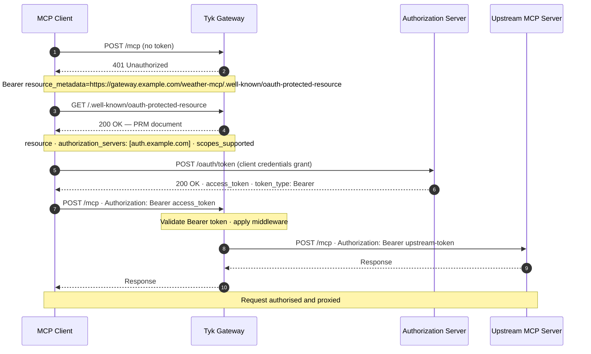
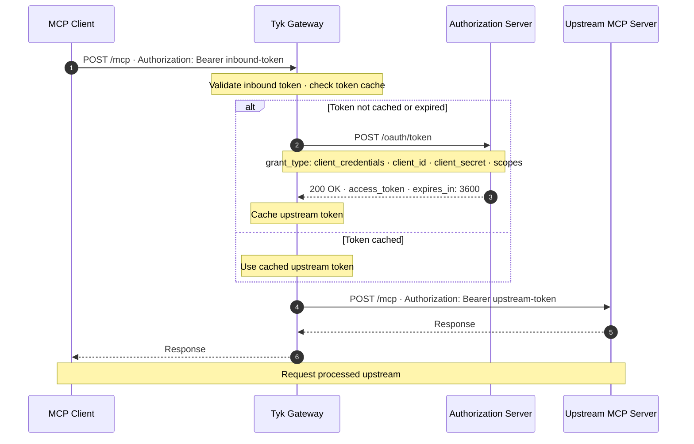
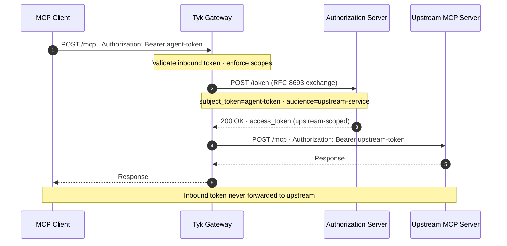

This page explains how Tyk Gateway implements the OAuth 2.1 authorization model defined by the MCP specification. It covers inbound Bearer token authentication via the `oauth2` security scheme, Protected Resource Metadata (PRM) discovery, RFC 8693 token exchange, and upstream OAuth. After reading this page you'll be able to configure end-to-end OAuth 2.1 for any MCP proxy.

---

## MCP Auth Model

MCP authorization operates on two distinct planes.

**Inbound authorization** governs how MCP clients (AI agents, LLM frameworks, and applications) authenticate to Tyk Gateway. Tyk validates the credential on every request before it reaches your upstream MCP server. All [authentication methods](/api-management/client-authentication) supported by Tyk apply here: Bearer tokens, API keys, JWT, and mutual TLS.

<Note>
For OAuth 2.1 compliance, configure the `oauth2` security scheme. It publishes the Protected Resource Metadata discovery document, enforces per-operation scopes, and enables RFC 8693 token exchange — all from a single scheme declaration. See [OAuth 2.0 (External IdP)](/api-management/authentication/oauth2-authentication).
</Note>

**Upstream authorization** governs how Tyk authenticates to your upstream MCP server when that server requires an OAuth token. Tyk obtains the token from the authorization server using the client credentials flow and injects it into every proxied request. Your upstream receives a properly authorized request without any involvement from the original caller.

The two planes are configured independently — Bearer tokens on the inbound side can be combined with client credentials on the upstream side.

---

## Protected Resource Metadata

**Protected Resource Metadata (PRM)** is the standardized discovery mechanism defined in [RFC 9728](https://www.rfc-editor.org/rfc/rfc9728). It gives OAuth clients a machine-readable document describing a protected resource: which authorization servers can issue tokens for it, and which OAuth scopes it supports.

The MCP specification recommends that every MCP server expose a PRM document so that clients can discover the correct authorization server before making their first request. Without it, clients must be pre-configured with authorization server URLs — an approach that becomes fragile as deployments grow and authorization infrastructure changes.

Tyk serves the PRM document natively. When PRM is enabled on an [MCP OAS definition](/ai-management/mcp-gateway/mcp-proxy-definitions), Tyk intercepts GET requests to the well-known path and serves the metadata document. The endpoint is unauthenticated by design — clients need it before they have a token.

### The discovery flow



The `WWW-Authenticate` header Tyk sends on authentication failure is a standard Bearer challenge extended with the `resource_metadata` parameter defined in RFC 9728. Any OAuth 2.1-compliant client library handles this automatically.

### Configuring PRM

PRM is configured within the `oauth2` security scheme block in the Tyk Vendor Extension. The scheme name (`idpAuth` in the example below) must match the scheme declared with `type: oauth2` in the OAS `components.securitySchemes` section — see [OAuth 2.0 (External IdP)](/api-management/authentication/oauth2-authentication) for the full scheme setup.

```json
{
  "x-tyk-api-gateway": {
    "server": {
      "authentication": {
        "enabled": true,
        "securitySchemes": {
          "idpAuth": {
            "enabled": true,
            "protectedResourceMetadata": {
              "enabled": true,
              "resource": "https://gateway.example.com/weather-mcp/",
              "authorizationServers": ["https://auth.example.com"],
              "autoDeriveScopes": true
            }
          }
        }
      }
    }
  }
}
```

| Field | Required | Description |
|---|---|---|
| `enabled` | Yes | Activates the PRM endpoint. When `true`, Tyk serves the metadata document and includes the `WWW-Authenticate: Bearer resource_metadata=...` header on authentication failures. |
| `resource` | Yes | The resource identifier for this API, typically the URL at which Tyk exposes the MCP proxy. Accepts `$tyk_context.*` variables for dynamic values. |
| `authorizationServers` | Yes | One or more authorization server URLs that can issue tokens for this resource. Tyk validates that at least one entry is present for Tyk OAS API definitions. |
| `wellKnownPath` | No | Overrides the default well-known path. Defaults to `.well-known/oauth-protected-resource`. Relative to the API's listen path. |
| `autoDeriveScopes` | No | When `true` (default), the `scopes_supported` field in the PRM document is populated from the `flows.scopes` catalog in your OAS `components.securitySchemes` declaration and every `security:` array on the API. When `false`, only the `flows.scopes` catalog is used. |

The PRM endpoint is served at `{listen-path}/{wellKnownPath}`. With the default path and a listen path of `/weather-mcp/`, the endpoint is available at `/weather-mcp/.well-known/oauth-protected-resource`.

<Note>
If you have an existing PRM configuration at `authentication.protectedResourceMetadata`, Tyk Dashboard migrates it automatically to `authentication.securitySchemes[name].protectedResourceMetadata` on startup. No manual action is required. APIs that already have a scheme-level PRM block are not modified.
</Note>

---

## Scope enforcement

Scope enforcement checks that the bearer token carries the scopes required by the matched operation or MCP primitive — translating what the authorization server granted into access decisions at the gateway.

Configure it under `scopeCheck` in the `oauth2` scheme block:

```json
{
  "x-tyk-api-gateway": {
    "server": {
      "authentication": {
        "securitySchemes": {
          "idpAuth": {
            "enabled": true,
            "scopeCheck": {
              "enabled": true,
              "claimNames": ["scope", "scp"],
              "separator": " ",
              "scopeSource": "union"
            }
          }
        }
      }
    }
  }
}
```

The required scopes for each operation come from the `security:` array in your OAS definition. For MCP primitives, which have no OAS path entry, declare scopes in the Tyk Vendor Extension under `middleware.mcpTools`, `middleware.mcpResources`, or `middleware.mcpPrompts`:

```json
{
  "x-tyk-api-gateway": {
    "middleware": {
      "mcpTools": {
        "create-report": {
          "security": [{ "idpAuth": ["tools:write"] }]
        }
      }
    }
  }
}
```

| Field | Required | Description |
|---|---|---|
| `enabled` | Yes | Activates scope enforcement for this scheme. |
| `claimNames` | No | JWT claim names to read scopes from. Defaults to `["scope", "scp"]`. All listed claims present on the token are merged into a single scope set. |
| `separator` | No | Character used to split string-valued scope claims. Defaults to `" "` (space). Set to `","` for comma-separated IdPs. |
| `scopeSource` | No | Which `security:` declarations drive enforcement: `"union"` (default) merges root and per-operation alternatives; `"operation"` applies only the matched operation's declaration; `"global"` applies only the root-level declaration. |

When a request fails scope enforcement, Tyk returns `403 Forbidden` with `WWW-Authenticate: Bearer error="insufficient_scope"`. Scope enforcement runs after JWT signature validation — if the token is invalid, the request is rejected at the JWT auth step before scope check is reached.

For per-operation and per-primitive exemptions (`scopeCheck.enabled: false` on individual operations or MCP primitives) and the full field reference, see [OAuth 2.0 (External IdP)](/api-management/authentication/oauth2-authentication#scope-enforcement).

---

## Upstream OAuth

When the upstream MCP server requires OAuth, Tyk handles token acquisition transparently. It acts as an OAuth client — obtaining a token from the upstream's authorization server using the client credentials flow and attaching it to every proxied request. The original MCP client never needs to supply upstream credentials.

Tyk caches acquired tokens and refreshes them before they expire, so the upstream sees a consistent stream of valid credentials without a token request on every MCP call.

<Note>
Upstream OAuth is available in Tyk Enterprise Edition only.
</Note>

### Client credentials flow

Client credentials is the OAuth flow for machine-to-machine communication — no user is involved, Tyk acts as the client. OAuth 2.1 retains this flow specifically for server-to-server scenarios.



### Configuring upstream OAuth

Upstream OAuth is configured in the `upstream.authentication` section of the API definition:

```json
{
  "x-tyk-api-gateway": {
    "upstream": {
      "url": "https://weather-mcp.example.com",
      "authentication": {
        "enabled": true,
        "oauth": {
          "enabled": true,
          "allowedAuthorizeTypes": ["clientCredentials"],
          "clientCredentials": {
            "clientId": "tyk-gateway-client",
            "clientSecret": "your-client-secret",
            "tokenUrl": "https://auth.example.com/oauth/token",
            "scopes": ["mcp:read", "mcp:write"]
          }
        }
      }
    }
  }
}
```

| Field | Required | Description |
|---|---|---|
| `clientId` | Yes | The OAuth client ID issued by the authorization server for this gateway instance. |
| `clientSecret` | Yes | The client secret associated with the client ID. |
| `tokenUrl` | Yes | The token endpoint of the upstream's authorization server. |
| `scopes` | No | The scopes to request when obtaining the token. The authorization server grants only the scopes it recognises and the client is permitted. |
| `extraMetadata` | No | Keys to extract from the token response and pass to the upstream as additional context. |

---

## Token exchange

The [MCP authorization specification](https://modelcontextprotocol.io/specification/2025-06-18/basic/authorization#access-token-privilege-restriction) requires that an MCP server **MUST NOT** pass through the token it received from the MCP client when making requests to upstream APIs. The upstream token must be a separate token issued by the upstream authorization server.

**Token exchange** ([RFC 8693](https://www.rfc-editor.org/rfc/rfc8693)) is how Tyk satisfies this requirement while preserving the caller's identity. Tyk presents the validated inbound token to an authorization server and receives a backend-scoped token in return. The inbound agent token never reaches the upstream.

This matters for MCP because:

- **Spec compliance** — The MCP spec explicitly forbids passing through the inbound token. Token exchange satisfies this requirement while maintaining a traceable delegation chain.
- **Audience compliance** — MCP servers must validate that tokens were issued specifically for them as the intended audience ([RFC 8707](https://www.rfc-editor.org/rfc/rfc8707.html)). Token exchange produces a token audienced to the upstream service without requiring clients to request multiple tokens.
- **Separation of trust** — The AI agent's credential stays scoped to the gateway trust domain; the upstream receives a narrowly-scoped credential appropriate to its own.



Token exchange is Enterprise Edition only and is configured within the `oauth2` security scheme. For full configuration details — including provider setup, caching, and per-primitive overrides — see [Token exchange](/api-management/authentication/token-exchange).

<Note>
Do not configure `upstream.authentication.oauth` alongside token exchange. They serve the same purpose — authenticating Tyk to the upstream — and configuring both produces a conflict. Use token exchange when you want to propagate a delegated credential derived from the inbound token. Use `upstream.authentication.oauth` when Tyk should authenticate with its own static client credentials independent of who the original caller was.
</Note>

---

## Composing features

Each feature on this page is independent. The example below uses all of them, but you can enable any subset depending on your requirements.

**JWT authentication** validates the inbound token's signature. In Tyk 5.14.0 this is required alongside the `oauth2` scheme because the `oauth2` scheme reads token claims but does not verify the signature itself. It is the baseline for everything else.

**PRM** enables dynamic discovery — clients that arrive without a token learn where to obtain one. Enable it if your MCP clients are OAuth 2.1-compliant and should discover the authorization server automatically. Omit it if your clients are pre-configured with the authorization server URL.

**Scope enforcement** (`scopeCheck`) checks that the token carries the scopes required by the matched operation or MCP primitive. Use it when the IdP owns access decisions — the authorization server grants specific scopes and Tyk enforces them at the gateway. If you prefer Tyk's policy engine to control primitive access (a platform-owned model where keys are issued with policy-level permissions), omit `scopeCheck` and rely on policies instead. The two approaches are mutually exclusive per primitive: using both creates conflicting ownership of access decisions.

**Token exchange** replaces the inbound agent token with an upstream-scoped token before forwarding. The MCP specification requires that the upstream never receives the original token — token exchange is how you satisfy that requirement while preserving the delegation chain. If you are using [Upstream OAuth](#upstream-oauth) with static client credentials instead, token exchange can be omitted.

**PRM and scope enforcement are particularly complementary.** PRM advertises which scopes clients need to request; `scopeCheck` enforces at runtime that the presented token actually carries them. When `autoDeriveScopes` is enabled, both are driven by the same `security:` declarations in your OAS definition — so the scopes a client is told to request and the scopes Tyk enforces are derived from the same source and can't drift out of sync. Enabling PRM without `scopeCheck` means scopes are advertised but not enforced at the gateway. Enabling `scopeCheck` without PRM means enforcement works, but clients need to know the required scopes upfront rather than discovering them dynamically.

Common configurations:

| Goal | Features to enable |
|---|---|
| Validate tokens; use Tyk policies for primitive access | JWT auth |
| Add client-side discovery | JWT auth + PRM |
| Add IdP-owned scope enforcement | JWT auth + PRM + scopeCheck |
| Full MCP spec compliance with delegated upstream identity | JWT auth + PRM + scopeCheck + token exchange |

---

## The complete OAuth 2.1 flow

The end-to-end flow has two phases. The authorization server appears in both — first when the MCP client obtains its agent token, then when Tyk exchanges it for an upstream-scoped token.

**Phase 1 — Discovery**

1. The MCP client makes a request to the MCP endpoint without a token.
2. Tyk returns `401 Unauthorized` with a `WWW-Authenticate` header pointing to the PRM well-known URL.
3. The client fetches the PRM document and learns which authorization server to use and which scopes are supported.
4. The client authenticates to the authorization server (authorization code flow, device flow, etc.) and receives an agent-scoped access token.

**Phase 2 — Authenticated request**

5. The client sends the request with `Authorization: Bearer <agent-token>`.
6. Tyk validates the token signature (JWT auth) and enforces scopes (`oauth2` scheme).
7. Tyk POSTs an RFC 8693 token exchange to the authorization server, presenting the agent token as `subject_token` and requesting a token audienced to the upstream MCP server.
8. The authorization server returns an upstream-scoped access token.
9. Tyk replaces the `Authorization` header with the exchanged token and forwards the request to the upstream MCP server.
10. The upstream responds; Tyk returns the response to the client.

The agent's original token never reaches the upstream MCP server. The MCP client and the upstream each receive a token issued specifically for their trust boundary.

---

## A complete configuration example

The following configuration for a weather MCP proxy enables all four features — PRM discovery, JWT signature validation, scope enforcement, and RFC 8693 token exchange:

```json expandable
{
  "openapi": "3.0.3",
  "info": { "title": "Weather MCP proxy", "version": "2025-11-25" },
  "components": {
    "securitySchemes": {
      "jwtAuth": {
        "type": "http",
        "scheme": "bearer",
        "bearerFormat": "JWT"
      },
      "idpAuth": {
        "type": "oauth2",
        "flows": {
          "authorizationCode": {
            "authorizationUrl": "https://auth.example.com/authorize",
            "tokenUrl": "https://auth.example.com/token",
            "scopes": {
              "tools:read": "Read access to MCP tools",
              "tools:write": "Write access to MCP tools"
            }
          }
        }
      }
    }
  },
  "security": [
    { "jwtAuth": [], "idpAuth": ["tools:read"] }
  ],
  "paths": {
    "/mcp": {
      "post": { "operationId": "mcpTransportPost", "responses": { "200": { "description": "JSON-RPC response" } } },
      "get":  { "operationId": "mcpSSEGet",         "responses": { "200": { "description": "SSE stream" } } }
    }
  },
  "x-tyk-api-gateway": {
    "info": {
      "name": "Weather MCP proxy",
      "state": { "active": true }
    },
    "server": {
      "listenPath": { "value": "/weather-mcp/", "strip": true },
      "authentication": {
        "enabled": true,
        "securitySchemes": {
          "jwtAuth": {
            "enabled": true,
            "signingMethod": "rsa",
            "jwksURIs": [{ "url": "https://auth.example.com/.well-known/jwks.json" }],
            "identityBaseField": "sub"
          },
          "idpAuth": {
            "enabled": true,
            "scopeCheck": {
              "enabled": true,
              "claimNames": ["scope", "scp"],
              "separator": " ",
              "scopeSource": "union"
            },
            "protectedResourceMetadata": {
              "enabled": true,
              "resource": "https://gateway.example.com/weather-mcp/",
              "authorizationServers": ["https://auth.example.com"],
              "autoDeriveScopes": true
            },
            "tokenExchange": {
              "enabled": true,
              "providers": [
                {
                  "name": "idp-prod",
                  "issuers": ["https://auth.example.com"],
                  "tokenEndpoint": "https://auth.example.com/token",
                  "clientAuth": {
                    "method": "client_secret_basic",
                    "clientId": "tyk-gateway",
                    "clientSecret": "env://EXCHANGE_CLIENT_SECRET"
                  },
                  "defaultTarget": {
                    "audience": "https://weather-mcp.example.com",
                    "scopes": ["mcp:read", "mcp:write"]
                  }
                }
              ]
            }
          }
        }
      }
    },
    "upstream": {
      "url": "https://weather-mcp.example.com"
    }
  }
}
```

In this configuration:
- MCP clients that arrive without a token receive a `401` with a `WWW-Authenticate` header pointing to the PRM document.
- Clients that follow the discovery flow obtain a token from `https://auth.example.com` using the `authorizationCode` flow and present it as a Bearer token.
- Tyk validates the token signature via the `jwtAuth` scheme (JWKS endpoint), then `scopeCheck` enforces that the token carries `tools:read` before the request proceeds.
- Tyk exchanges the validated agent token for an upstream-scoped token audienced to `https://weather-mcp.example.com`. The original agent token never reaches the upstream MCP server.

<Note>
In Tyk 5.14.0, the `oauth2` scheme does not validate JWT signatures itself. The `jwtAuth` scheme in this example handles signature validation — configure JWT authentication on the API alongside the `oauth2` scheme so that inbound tokens are verified before scope enforcement runs.
</Note>

For the static client credentials variant — where Tyk authenticates to the upstream with its own credentials independent of the inbound token — see [Upstream OAuth](#upstream-oauth).

---

## Per-primitive configuration

The complete example above configures each feature at the API level, applying uniformly to all primitives. Both scope enforcement and token exchange support per-primitive overrides when individual tools need different access requirements or different upstream credentials.

### Multiple exchange providers

The `providers` array accepts multiple entries. Tyk selects the matching provider at request time by comparing the inbound token's `iss` claim against each provider's `issuers` list. This lets you handle tokens from different authorization servers — for example, your own IdP and a partner's — routing each to the appropriate token endpoint and default target:

```json
"tokenExchange": {
  "enabled": true,
  "providers": [
    {
      "name": "idp-prod",
      "issuers": ["https://auth.example.com"],
      "tokenEndpoint": "https://auth.example.com/token",
      "clientAuth": {
        "method": "client_secret_basic",
        "clientId": "tyk-gateway",
        "clientSecret": "env://EXCHANGE_CLIENT_SECRET"
      },
      "defaultTarget": {
        "audience": "https://weather-mcp.example.com",
        "scopes": ["mcp:read", "mcp:write"]
      }
    },
    {
      "name": "partner-idp",
      "issuers": ["https://auth.partner.example"],
      "tokenEndpoint": "https://auth.partner.example/token",
      "clientAuth": {
        "method": "client_secret_post",
        "clientId": "tyk-gateway-partner",
        "clientSecret": "env://PARTNER_EXCHANGE_SECRET"
      },
      "defaultTarget": {
        "audience": "https://weather-mcp.example.com",
        "scopes": ["mcp:read"]
      }
    }
  ]
}
```

If no provider matches the inbound token's issuer, the exchange step fails and Tyk returns an error before the request reaches the upstream.

### Per-primitive scope and exchange overrides

The `defaultTarget` in each provider applies uniformly to every primitive. When individual tools need a different audience, a narrower set of scopes, or stricter scope enforcement than the API-level default, configure overrides directly on the primitive in the `middleware.mcpTools` map:

```json
"middleware": {
  "mcpTools": {
    "get-forecast": {
      "security": [{ "idpAuth": ["tools:read"] }],
      "scopeCheck": { "enabled": true }
    },
    "delete-station": {
      "security": [{ "idpAuth": ["tools:write", "admin:stations"] }],
      "scopeCheck": { "enabled": true },
      "exchange": {
        "enabled": true,
        "audience": "https://station-admin.example.com",
        "scopes": ["admin:stations"]
      }
    }
  }
}
```

- `get-forecast` requires `tools:read`. Scope enforcement rejects tokens that don't carry that claim. The exchange uses the provider's `defaultTarget` audience and scopes unchanged.
- `delete-station` requires both `tools:write` and `admin:stations`. The `exchange` override requests a token audienced specifically to `https://station-admin.example.com` — a narrower credential than the standard weather MCP token — carrying only the `admin:stations` scope.

For the full `scopeCheck` and `exchange` field reference, see [MCP middleware](/ai-management/mcp-gateway/mcp-middleware).
