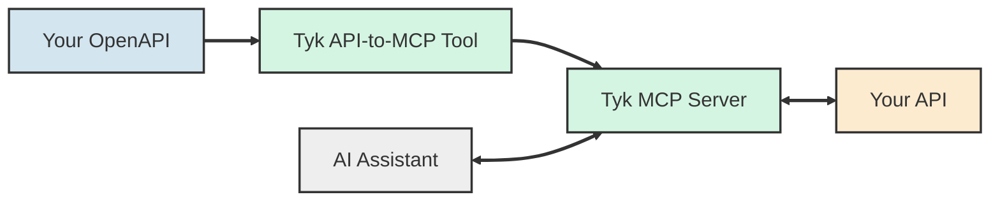
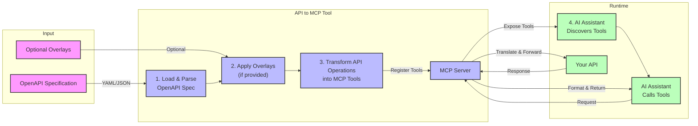
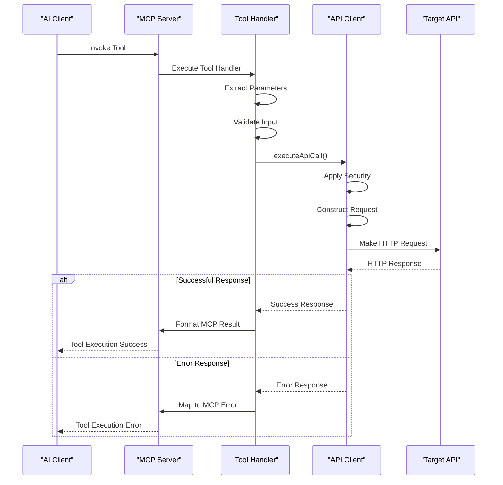

## Overview

**API to MCP** enables AI assistants to safely and dynamically interact with your existing APIs. It allows non-technical users to access API functionality through natural language, while developers retain full control over what endpoints are exposed and how they are accessed.

This allows AI tools to interpret, invoke, and structure API operations without requiring any backend modifications.

**Use this tool to:**
- Expose your APIs for AI interaction
- Allow AI assistants to understand and call API operations
- Configure basic access controls (e.g., filtering operations and setting headers) to manage how AI tools interact with your APIs

If you're looking for quick setup, [jump to Quick Start](/#quick-start). For deeper understanding, see [How It Works](/#how-it-works) and [Use Cases](/#use-cases).



## Key Features
- **Dynamic OpenAPI Loading:** Load specifications from local files or HTTP/HTTPS URLs
- **OpenAPI Overlay Support:** Apply overlays to customize specifications
- **Flexible Operation Filtering:** Include/exclude specific operations using glob patterns
- **Comprehensive Parameter Handling:** Preserves formats and includes metadata
- **Built-in Access Control & Security:** Control which endpoints are exposed, enforce authentication (API keys, OAuth, etc.), and add custom headers to all API requests, for secure AI access
- **Authentication Support:** Handles API keys, OAuth tokens, and other security schemes
- **MCP Extensions:** Support for custom x-mcp extensions to override tool names and descriptions
- **Multiple Integration Options:** Works with Claude Desktop, Cursor, Vercel AI SDK, and other MCP-compatible environments

Check the [complete technical list](https://github.com/TykTechnologies/api-to-mcp#features) is available in our GitHub repository.

<h2 id="quick-start">Quick Start</h2>
To get started quickly, the primary way to use it is by configuring your AI assistant to run it directly as an MCP tool.

### Requirements
- [Node.js v18+](https://nodejs.org/en/download) installed
- An accessible OpenAPI specification, e.g. `https://petstore3.swagger.io/api/v3/openapi.json` (could be a local file as well)
- Claude Desktop (which we show in this example) or other MCP-compatible AI assistant that supports connecting to external MCP-compatible tool servers (e.g. Cursor, Vercel AI SDK, Cline extension in VS Code etc.)

### Configure your AI Assistant

To connect the tool with Claude Desktop or other MCP-compatible assistants, you need to register it as an MCP server. Most AI assistance share similar MCP server definition. This is the definition for *api-to-mcp* with petstore as the OpenAPI:

```json
{
  "mcpServers": {
    "api-tools": {
      "command": "npx",
      "args": [
        "-y",
        "@tyk-technologies/api-to-mcp@latest",
        "--spec",
        "https://petstore3.swagger.io/api/v3/openapi.json"
      ],
      "enabled": true
    }
  }
}
```

**Step 1.**
To enable the tool, paste the above configuration into your AI assistant’s MCP config file

- **Claude Desktop**: For MacOS, you need to update `~/Library/Application Support/Claude/claude_desktop_config.json`. See the [Claude Desktop setup instructions](https://github.com/TykTechnologies/api-to-mcp?tab=readme-ov-file#setting-up-in-claude-desktop) for Windows OS and more customization options.
- **Cursor**: See the [Cursor setup guide](https://github.com/TykTechnologies/api-to-mcp#cursor) for instruction on setting it with Cursor.

**Step 2.**
Once connected, ask the AI to perform an operation (e.g., "List all pets" or "Create a new user").

<h2 id="how-it-works">How It Works</h2>
### User flow in *API to MCP** user flow

1.  **Input**: Your OpenAPI specification (required) and optional overlays
2.  **Processing**: The API to MCP tool loads the spec, applies any overlays, and transforms API operations into MCP tools
3.  **Runtime**: The MCP server exposes these tools to AI assistants, which are now discoverable to the AI assistant
4.  **Execution Flow**: When you ask the AI assistant a question, it calls the tool (via the MCP server), which translates the request, forwards it to your API, and returns a formatted response.




### Request lifecycle: how an AI assistant invokes an API tool”

The following diagram illustrates the flow of a request through the system at runtime:



API to MCP  can be found in [api-to-mcp GitHub repository](https://github.com/TykTechnologies/api-to-mcp)

<h2 id="use-cases">Use cases</h2>
Use **API to MCP** when you need to:

- **Connect AI Assistants to Existing APIs** - Let AI tools understand and call your existing API operations using natural language — no code changes needed, just [configuration](https://github.com/TykTechnologies/api-to-mcp/#configuration).

- **Create a Unified Interface for AI Systems** - Standardize how APIs are accessed by AI across your organization with a consistent protocol (MCP).

- **Control API Access for AI** - Filter which operations are available to AI, apply authentication, and monitor usage securely.

- **Improve API Discoverability** - Enable AI systems to automatically list available endpoints, input parameters, and expected responses.

- **Test APIs Using AI** - Use AI assistants to generate test inputs, invoke endpoints, and validate responses in a conversational way. Natural-language test generation and feedback.

- **Auto-docs & validation** - Use AI to test, describe, or troubleshoot APIs in a conversational way. Natural-language test generation and feedback.

- **Workflow Automation** - Connect APIs and AI logic in real time to automate workflows and streamline processes.

---

## Best Practices

- **Start small**: Only expose safe, limited endpoints
- **Use filters**: allow list or block list endpoints as needed
- **Secure your APIs**: Pass tokens, headers, or keys securely
- **Track usage**: Monitor tool access and patterns
- **Version specs**: Maintain OpenAPI version control
- **Use env vars**: Don't hardcode secrets in CLI or config
- **Validate safely**: Test in staging before going live

---

## Customize your own version of the api-to-mcp tool

If you'd like to share your MCP with a predefined OpenAPI spec and configuration, you can customize this tool to fit your needs. Useful for sharing pre-configured setups with others.

By creating a customized version, others can use the tool with minimal configuration --- no need to manually specify specs or overlays.

Refer to the [customization and publishing guide](https://github.com/TykTechnologies/api-to-mcp?tab=readme-ov-file#customizing-and-publishing-your-own-version) in the *api-to-mcp* repository for step-by-step instructions.

---

## FAQs

**Does this work with GraphQL?**
Not currently — OpenAPI REST APIs only.

**How do I secure my API requests?**
Use `--headers`, environment variables. Check the [configuration section](https://github.com/TykTechnologies/api-to-mcp/tree/main#configuration) for more details.

**Can I hide or rename tools?**
Yes — use `x-mcp` extensions and filters.

**What AI tools are supported?**
Any tool that supports MCP: Claude, Cursor, VS Code, and more.


## Summary

API to MCP transforms OpenAPI specs into AI-compatible tools using the MCP standard. It enables your AI stack to dynamically understand, test, and invoke your existing APIs securely — without modifying your existing backend.
