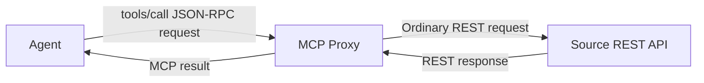

## Availability

| Component   | Version              | Editions                |
| :------------- | :---------------------- | :------------------------- |
| Gateway | Available since [v5.15.0](/developer-support/release-notes/gateway) | Enterprise |

## What Is REST API to MCP

Tyk Gateway can generate an MCP proxy directly from a Tyk-managed REST API's OpenAPI specification, turning its operations into MCP tools without a separate MCP server to build or host.

Every MCP proxy in Tyk Gateway does one of two things: it fronts a **remote MCP server** you've built and hosted elsewhere, or it's generated this way, directly from a Tyk-managed REST API. This page covers the second case.

To generate a proxy this way, you reference an existing [Tyk OAS API](/ai-management/mcp-gateway/mcp-proxy-definitions), and Tyk derives an MCP tool for each REST operation you choose to expose. No changes to the source REST API are required: you don't touch its OpenAPI spec, its code, or its existing consumers.

<Note>
Only a Tyk OAS REST API already onboarded to Tyk can be the source. GraphQL APIs and Tyk Classic API definitions aren't supported. See [Current Limitations](#current-limitations) below.
</Note>

This provides:

- **A tool catalog**: derived automatically from the source API and kept in sync on every gateway reload. See [Tool Catalog](#tool-catalog) below.
- **Multiple proxies from a single API**: each with its own tool selection, enrichment, and policies, such as a read-only proxy for a reporting agent and a separate write-enabled proxy for an operations agent. See [How to slice one API into multiple MCP proxies](/ai-management/mcp-gateway/how-to-slice-one-api-into-multiple-mcp-proxies).
- **A distinct security identity for the proxy**: independent of the keys and policies your existing REST consumers use. See [Proxy Identity and Security](#proxy-identity-and-security) below.

### How a Tool Call Is Handled

Calling a tool sends a JSON-RPC `tools/call` request to the MCP proxy, which Tyk translates into an ordinary REST request against the paired API and wraps the response back into the format the agent expects.

```mermaid
graph LR
    A[Agent] -->|"tools/call" JSON-RPC request| B[MCP Proxy]
    B -->|Ordinary REST request| C[Source REST API]
    C -->|REST response| B
    B -->|MCP result| A
```

## Proxy Identity and Security

The MCP proxy is itself a distinct consumer of the source REST API, with its own credential and security policy, independent of the keys and policies your existing REST consumers use.

This matters because agents call APIs differently from humans and services: an agent decides autonomously which operations to invoke, can be manipulated into calling tools it shouldn't through prompt injection, and produces less predictable traffic. Govern that traffic with its own tool allowlists, rate limits, and RBAC, without touching your source API.

## Tool Catalog

Tyk builds the tool catalog by reading the source API's OpenAPI operations.

### Naming

Each operation's `operationId` becomes the tool name; operations without one get a deterministic name derived from their HTTP method and path instead. See [Tool naming and discovery](/ai-management/mcp-gateway/core-concepts#tool-naming-and-discovery) for how names are derived and collisions resolved.

### Filtering With an Allow List

All operations become tools by default. To narrow that down, create an explicit allow list in the `x-tyk-mcp-server` extension, listing only the operations you want exposed as `allow: true` entries, through whichever interface you use to manage the proxy (see [Creating and Managing a Proxy](#creating-and-managing-a-proxy) below).

### Overriding Names and Descriptions for Agents

OpenAPI specs are usually written for human developers or system-to-system integration, not for an agent deciding which tool to call. A cryptic `operationId` or an undocumented parameter can leave a perfectly functional operation hard for an agent to use well.

You can override a tool's and each parameter's name and description directly at the proxy layer, independently of the source API's OpenAPI document, making an existing API agent-ready without editing its spec.

This configuration lives in the `x-tyk-mcp-server` vendor extension on the MCP proxy's own OAS definition, alongside the `x-tyk-api-gateway` extension every MCP proxy has. See [REST API to MCP x-tyk-mcp-server extension](/ai-management/mcp-gateway/api-to-mcp-definitions) for the full schema.

### Staying in Sync

The catalog is derived from the source API's OpenAPI specification at gateway load time rather than stored as a fixed snapshot, so changes to the source operations are picked up on the next gateway reload. Without an allow list, new operations become tools automatically; with one, you need to add them yourself, since only what's explicitly allowed is exposed.

## Creating and Managing a Proxy

An MCP proxy generated this way is still just a [Tyk OAS API definition](/ai-management/mcp-gateway/mcp-proxy-definitions) with the `x-tyk-mcp-server` extension added, so any interface that manages a Tyk OAS API definition can create and manage one:

- **Tyk Dashboard**: a guided wizard walks you through selecting the source API, choosing which operations to expose, and overriding tool and parameter names and descriptions, with a preview before you save. See [Managing MCP proxies](/ai-management/mcp-gateway/managing-proxies).
- **Tyk Operator**: declare the OAS document, including the `x-tyk-mcp-server` extension, in a `ConfigMap` referenced by a `TykMcpProxyDefinition` custom resource, managed the same way as any other Tyk API in a GitOps workflow. See [Tyk Operator: MCP proxies](/product-stack/tyk-operator/mcp-proxy#managing-a-proxy-generated-from-a-tyk-managed-rest-api).
- **Tyk Gateway API and Dashboard API**: create, update, and delete the OAS definition directly, including a dry-run mode that previews the expanded tool catalog without persisting it. See [MCP Gateway API extensions](/ai-management/mcp-gateway/mcp-api-extensions).

The interface you use doesn't change how the proxy behaves at runtime. The tool catalog and enrichment overrides apply the same way regardless of how the definition was authored.

## Current Limitations

The following limitations apply in this release:

| Limitation | Detail |
|---|---|
| Source API format | The source must be a Tyk OAS API already onboarded to Tyk. GraphQL APIs and Tyk Classic API definitions aren't supported as a source. |
| One proxy, one source | An MCP proxy pairs with exactly one source REST API. You can't combine operations from multiple REST APIs behind a single proxy. The reverse, slicing one REST API's operations across several MCP proxies, is supported: see [How to slice one API into multiple MCP proxies](/ai-management/mcp-gateway/how-to-slice-one-api-into-multiple-mcp-proxies). |
| Request body types | Only JSON and form-urlencoded request bodies are currently supported. An operation with a multipart, XML, or binary request body is still exposed as a tool, but its body isn't included in the tool's schema, so calling it can't carry the original request body. |
| Response size | Upstream responses are capped at 1 MiB and truncated beyond that. The cap isn't configurable. |
| Transport | Only `POST /mcp` is supported. `GET /mcp`, SSE streaming, and server-initiated notifications aren't available. |
| Primitives | A proxy generated this way only ever produces tools. Resources and prompts aren't applicable, since a REST operation has no equivalent primitive. |
| Behavioral hints | `readOnlyHint`, `destructiveHint`, `idempotentHint`, and `openWorldHint` can be set directly in the `x-tyk-mcp-server` extension, for example via Tyk Operator or the API, but the Tyk Dashboard's wizard and designer don't yet expose a UI control for them. |
