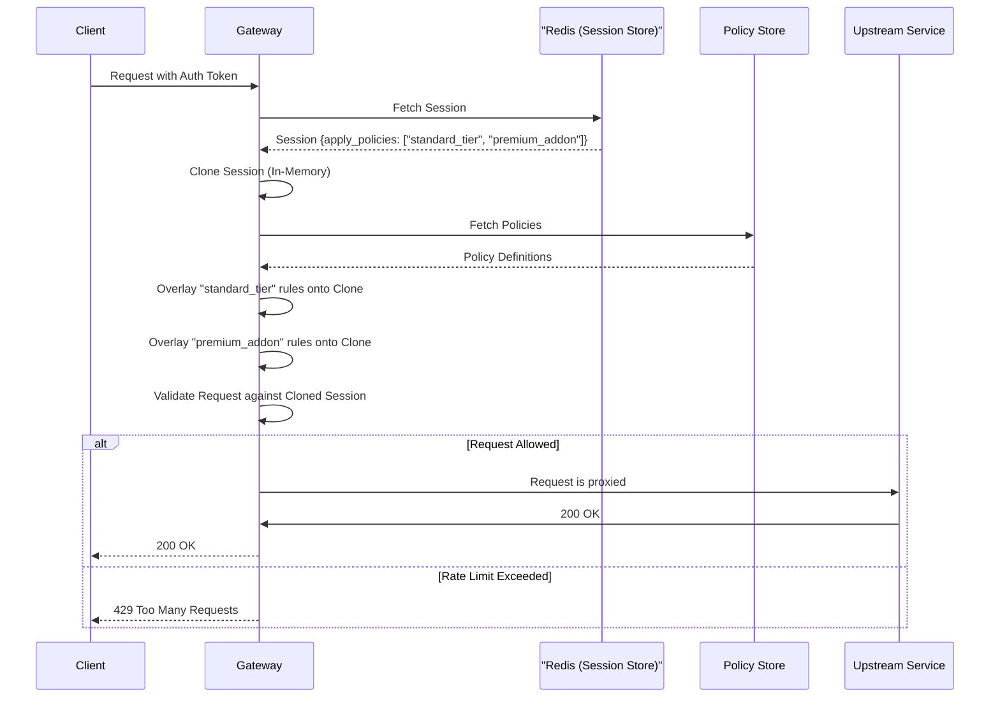

## Introduction

Once you have created a Policy, the next step is to apply it to your clients' Sessions. This page explains exactly how Policies are linked to Sessions under the hood, how the Tyk Gateway dynamically applies them during a request, and the rules for combining different types of policies.

## Policy IDs

Policy objects have two separate identifiers:

- **Policy ID (`id`)**: this is the identifier that should be used in all operations via the Gateway API, Dashboard API, in the Session's `apply_policies` array, and in the API definition's scope-to-policy mapping. This can be set by the user (though is not currently manually configurable in the Dashboard UI).
- **Database ID (`_id`)**: this is the internal reference for the Policy within Tyk Dashboard's database and cannot be modified by the user.

Prior to Tyk Developer Portal v1.17.1 the Portal would incorrectly use `_id`, so the Dashboard API expected this in its Policy management endpoints. From Tyk 5.12.0 onwards there is full support for the `id` across the Tyk Dashboard API and users are recommended to use this exclusively.

To mitigate against the risk of unexpected side effects, from Tyk 5.13.0 onwards the Policy ID can only contain the following characters: `a-z`, `A-Z`, `0-9`, `.`, `_`, `-`, `~`. If you need to bypass this restriction due to existing non-compliant Policy IDs, you can set the `allow_unsafe_policy_ids` configuration flag in your [Gateway](/tyk-oss-gateway/configuration#allow_unsafe_policy_ids) and [Dashboard](/tyk-dashboard/configuration#allow_unsafe_policy_ids) configuration.

## Linking Policies to Sessions

At the data level, a Policy is linked to a Session via the Session object's configuration. 

When you inspect a [Session object](/api-management/access-control/sessions-and-keys/understanding-sessions), you will see two fields related to policies:
- `apply_policies`: An array of strings containing the IDs of the Policies linked to this Session. This is the recommended way to link one or more policies.
- `apply_policy_id` *(deprecated)*: A single string that can contain a Policy ID. This is a legacy field from older versions of Tyk that only supported a single Policy per session and is now only provided as a fallback that is checked if the `apply_policies` array is empty.

You can manage the association of Policies with Sessions from various touchpoints depending on your Tyk deployment:

- **Developer Portal:** When [managing access requests](/tyk-stack/tyk-developer-portal/enterprise-developer-portal/api-access/approve-requests), Tyk will automatically manage the linking of Policies relating to API Products and Plans to the client's Session. 
- **Dashboard UI:** When creating or editing a "Key" (Session) in the Dashboard, you can select one or more Policies from the **Apply Policies** dropdown.
- **Tyk Operator:** Use the `pol_id` from the `SecurityPolicy` CRD's status when creating the Session.
- **Dashboard API:** When creating or updating a Session via the API, you append the Policy IDs to the `apply_policies` array in the Session object.
- **Gateway API (Open Source):** When creating or updating a Session via the API, you append the Policy IDs to the `apply_policies` array in the Session object.
- **OAuth Clients:** When creating an OAuth Client (via the Dashboard or API), you must associate it with a Policy. Whenever Tyk issues an OAuth access token for that client, it dynamically generates a Session based on that Policy and links the token to it.

## Dynamic Application During a Request

A common misconception is that when you link a Policy to a Session, Tyk permanently copies the Policy's rules into the Session object in the database. **This is not the case.**

Instead, Tyk applies Policies **dynamically in memory** during the lifecycle of a request. Here is exactly what happens when a client makes a request:

1. **Session Retrieval:** The Gateway extracts the client's [Key](/api-management/access-control/overview#identifying-the-client-keys-and-authentication) from the request and uses this to retrieve their Session object from the local cache or the Redis database.
2. **Session Cloning:** The Gateway creates a temporary, in-memory clone of the Session object.
3. **Policy Lookup:** The Gateway reads the `apply_policies` array from the cloned Session and retrieves the corresponding Policy definitions from its internal store.
4. **Dynamic Overlay:** The Gateway iterates through the linked Policies and overlays their rules (rate limits, quotas, access rights, etc.) onto the cloned Session object. 
5. **Request Processing:** The Gateway uses this fully populated, temporary Session object to authorize and rate-limit the current request.
6. **Session Persistence:** After the request completes, if the client consumes quota, the Gateway updates the quota counters in the temporary Session before it is saved back to Redis to persist the values. See the [Request Quotas](/api-management/request-quotas#how-tyk-implements-quotas) section for more details. (Note: Rate limit counters are tracked in separate Redis keys and do not modify the Session object).

Because this process happens dynamically on every request, any changes you make to a Policy are immediately reflected across all linked Sessions without requiring you to update the Sessions themselves.

### Worked Example: Dynamic Application Flow

Consider a scenario where a user has a base "Standard Tier" Policy and has just purchased a "Premium Reporting Add-on" Policy. Both Policy IDs are stored in their Session's apply_policies array.



## Applying a Single Policy

When a single Policy is linked to a Session, the Gateway dynamically overlays the Policy's configuration onto the Session during a request. 

**Which fields are updated?**
A Policy can update or replace the following sections of a Session:
- **Global Limits:** Rate limits (`rate`, `per`), quotas (`quota_max`, `quota_renewal_rate`), and GraphQL complexity (`max_query_depth`).
- **Access Rights:** The APIs the client can access, including allowed endpoints, restricted GraphQL types, and granular API-level rate limits and quotas.
- **Metadata and Tags:** Custom key-value pairs and tags used for analytics.
- **Security Settings:** HMAC and HTTP Signature validation flags.
- **Session Lifecycle:** Expiry settings and post-expiry actions.

**What happens to existing Session values?**
If the Session object already has values configured in fields that are contained in the Policy, the Gateway handles them in three different ways:
1. **Overwritten:** Global limits (rate, quota, complexity), Access Rights, and Session Lifecycle settings are completely overwritten by the Policy. The Gateway explicitly clears these values from the Session before applying the Policy.
2. **Merged:** Metadata and Tags are merged. The Policy's tags are appended to the Session's existing tags, and metadata keys are combined.
3. **Preserved:** If the Policy does not define a specific section (for example, it declares no Access Rights), the Session's original values for that section are preserved.

## Applying Multiple Policies

Tyk allows you to link multiple Policies to a single Session, applying each Policy in turn to result in a final Session state that will be used for the request. This is where the concept of **Partitioned Policies** becomes powerful.

### Partitioned Policies

Instead of creating *monolithic* policies that define everything, you can create partial or *partitioned* policies that only update specific sections of a Session. 

To declare a Policy as partitioned, you configure the `partitions` object within the Policy definition. This object contains boolean flags that explicitly enable specific segments of the Policy:

```json
{
    "partitions": {
        "acl": false,
        "rate_limit": true,
        "quota": true,
        "complexity": false,
        "per_api": false
    }
}
```

- **ACL (`acl`):** Only applies Access Rights (allowed APIs and endpoints).
- **Rate Limit (`rate_limit`):** Only applies rate limits and throttling settings.
- **Quota (`quota`):** Only applies quota maximums and renewal rates.
- **Complexity (`complexity`):** Only applies GraphQL query depth limits.
- **Per-API (`per_api`):** A special type of Policy where limits are tracked individually for each API rather than globally.

#### Multiple Partitions on a Single Policy

It is entirely possible (and common) for a single Policy to have **multiple partitions enabled simultaneously**. For example, you could create a Policy with both `rate_limit: true` and `quota: true` to handle all limits, while leaving `acl` disabled so access rights are inherited from elsewhere.

### How Multiple Policies are Merged

When multiple policies update the same section of a Session, Tyk merges them to be the **most permissive**:
- **Rate Limits:** Tyk calculates the duration between requests (`per / rate`). The Policy that allows the highest request rate (shortest duration between requests) wins.
- **Quotas and Complexity:** Tyk takes the largest `quota_max`, `quota_renewal_rate`, and `max_query_depth` across all applied policies.
- **Access Rights (ACLs):** Tyk takes the **union** of all allowed URLs and methods. If Policy A allows `GET /users` and Policy B allows `POST /reports`, the Session can access both.
- **GraphQL Restrictions:** Tyk takes the **union** of restricted types. A field is restricted if any applied policy restricts it.

<Note>
    Because `quota_renewal_rate` is the duration in seconds before the quota resets, taking the maximum value results in the most infrequent renewal period so be careful when combining Policies that set different quota limits. The resultant quota parameters may be taken from different policies so the effective quota may not match any of the applied policies.
</Note>


{/* TODO: Diagram — Layered "stack" diagram showing how multiple policies merge into an effective session. Bottom layer: Base Session object. Middle layer: Monolithic Policy ("Standard Tier") applying global rate limits and access rights. Top layers: Multiple Partitioned Policies ("Reporting Add-on", "Premium Support") side-by-side. Arrows show Gateway merging downward to produce "Effective Session". Callouts: "Access Rights: Union (Combined)" and "Rate Limits: Most Permissive (Maximum)". */}


### Permitted Combinations

While you can mix and match most policies, the Tyk Gateway enforces strict validation rules to prevent unpredictable behavior. The following table outlines the permitted combinations when applying multiple policies to a single Session:

| Policy Combination | Status | Description |
| :--- | :--- | :--- |
| **Multiple Monolithic** | ✅ Allowed | You can apply as many monolithic policies as you need. |
| **Multiple Partitioned** | ✅ Allowed | You can combine multiple partitioned policies to build modular access tiers. |
| **Monolithic + Partitioned** | ✅ Allowed | You can apply a base monolithic policy and overlay specific partitioned policies. |
| **Monolithic + Per-API** | ✅ Allowed | You can apply a base monolithic policy and overlay per-API limits. |
| **Partitioned + Per-API** | ❌ **Not Allowed** | The Gateway will reject this combination and log an error. You cannot mix standard partitioned policies with `per_api` policies on the same Session. |

**Why is Partitioned + Per-API restricted?**

A `per_api` Policy is intended for the declared limits to be scoped strictly to individual APIs. A standard partitioned Policy (such as a `rate_limit` partition) applies its limits across all APIs that the Session is permitted access to. 

If you were able to mix them, the merging logic would become ambiguous: should the global rate limit partition override the per-API limit, or vice versa? To prevent unpredictable access control and limit enforcement, the Gateway explicitly rejects this combination and will log an error (ErrMixedPartitionAndPerAPIPolicies). Furthermore, a single Policy cannot have both the per_api flag and any other partition flag enabled simultaneously.


## Managing Session Lifecycle with Policies

Policies are often used to manage the lifecycle of a Session, including its expiration and active state. These settings are handled **globally**, completely independent of the partition logic. This means that any Policy (monolithic or partitioned) can set session lifecycle rules.

**Validity period (`key_expires_in`)**
The length of time that the session is considered *valid* (before it "expires") is evaluated **when a session is first created** (for example, via the Gateway API or when dynamically generating a session for a JWT). It is not dynamically overlaid during a request. If multiple policies define a validity period, the Gateway uses the value from the **last Policy** in the `apply_policies` array that has `key_expires_in > 0`. The validity period is added to the current time when the session is created and set as the `expires` timestamp in the Session object in Redis.

**Post-Expiry Actions**

Unlike the expiry time, post-expiry settings (`post_expiry_action` and `post_expiry_grace_period`) are evaluated **dynamically in memory** on every request. If multiple policies define these fields, the **last Policy** in the `apply_policies` array will be used. This allows you to change the retention Policy for expired sessions after creation.

**Temporarily Disabling a Session (is_inactive)**

You can easily [disable a session](/api-management/access-control/sessions-and-keys/session-lifecycle#temporarily-revoking-access-to-a-key) temporarily by linking it to a Policy that has `is_inactive: true`. 

When multiple policies are applied, the Gateway evaluates the `is_inactive` flag dynamically on every request using a **logical OR** operation. If **any** of the linked policies has `is_inactive: true`, the session is immediately treated as inactive and the request will be rejected.

This makes it incredibly easy to implement a "kill switch" Policy. You can create a single monolithic Policy with `is_inactive: true` and simply append its ID to the `apply_policies` array of any session you want to be able to suspend, without modifying other Policies.

<Note>
If a Session has **any** policies linked to it, the Gateway ignores the Session's own `is_inactive` flag. You cannot disable a session by setting `is_inactive: true` directly on the Session object if it has policies applied; you **must** use a policy to disable it.
</Note>