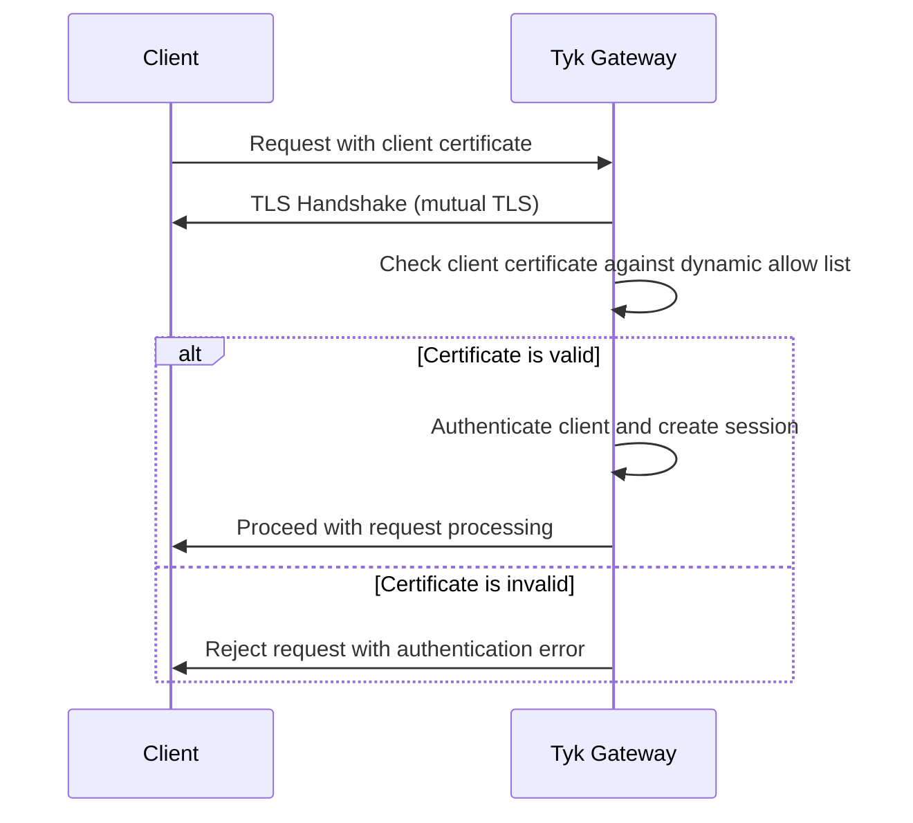

## Availability

| Component | Version | Edition |
| :-------- | :------ | :------- |
| Tyk Gateway | Available since [v5.12.0](/developer-support/release-notes/gateway#5-12-0-release-notes) | Community |

## What is Certificate Authentication?

TODO: Add a mermaid digram illustrating the authentication flow with Certificate Authentication.



Certificate Authentication is a client authentication method introduced in Tyk 5.12.0 that replaces the legacy [Dynamic mTLS](/api-management/implement-tls#configuring-mtls-with-a-dynamic-allow-list) feature. This method provides enhanced security and flexibility for API authentication using client certificates.

### Evolution from Dynamic mTLS

Certificate Authentication has evolved from Dynamic mTLS through the enforcement of the mutual TLS handshake and the disallowing of authentication using a token. Only the registered client certificate can now be used to authenticate with the Gateway.

This change was introduced because Dynamic mTLS treated the certificate as optional and did not enforce the mTLS handshake. Mutual TLS was not enforced if only the token was presented in the request, reducing the security of the Dynamic mTLS authentication method. For more details see [the problem with Dynamic mTLS](/api-management/implement-tls#the-problem-with-legacy-dynamic-mtls-mode).

If you are currently using Dynamic mTLS, no change is required to your API definition to use Certificate Authentication.

When using Tyk OAS APIs, the legacy configuration (`x-tyk-api-gateway.server.authentication.securitySchemes.authToken.enableClientCertificate`) is still supported (though marked as deprecated in favor of a new, cleaner configuration).

When using Tyk Classic APIs, there is no change to the configuration in the API definition (`auth_configs.authToken.useCertificate`).

<Note>
    The legacy mode (where the token can be used to authenticate with Tyk) is available via the Gateway configuration option `allow_unsafe_dynamic_mtls_token`.
</Note>

## How does Certificate Authentication work?

Certificate Authentication uses X.509 [client certificates](/api-management/certificates#digital-certificates) to authenticate API requests. It relies upon a one-to-one mapping between API clients and client certificates.

When a client makes a request:

1. The client presents their certificate during the mTLS handshake
3. If the client is successfully authenticated, Tyk checks the client cetificate against a list of authorized certificates (the "dynamic allow list")
4. If a match is found, authorization proceeds as usual, based on the content of the linked session and any policies applied to it

Each client certificate must be [pre-registered](/api-management/authentication/certificate-auth#registering-the-client-certificate) with the [Tyk Certificate Store](/api-management/certificates#tyk-certificate-store) and a [session state object](/api-management/policies#what-is-a-session-object) created for each in the temporal storage (Redis) to create the dynamic allow list. This list is dynamic because certificate-linked session objects (and hence clients) can be added to or removed from the list without making any change to the API definition. This is in contrast to the [static allow list](/api-management/implement-tls#configuring-mtls-with-a-static-allow-list) approach where the list of authorized certificates is stored in the API definition.


## Configuring your API to use Certificate Authentication

<Note>
    The Gateway must be configured to use TLS for the [hosted API interface](/api-management/implement-tls#using-tls-with-tyk-gateway).
</Note>

Certificate Auth is configured within the Tyk Vendor Extension by adding the `certificateAuth` object within the `server.authentication` section and enabling authentication.

```yaml
x-tyk-api-gateway:
  server:
    authentication:
      enabled: true
      certificateAuth:
        enabled: true
```

There are no additional configuration options for this authentication method. The client must present their certificate in the usual manner for the mTLS handshake, for example:

```bash
    curl --cert client_cert.pem --key client_key.pem https://my-gateway/my-api/
```

Note that the `HTTPS` protocol must be used.

### Using Tyk Classic

As noted in the Tyk Classic API [documentation](/api-management/gateway-config-tyk-classic#configuring-authentication-for-tyk-classic-apis), you can select Certificate Authentication using the `auth_configs.authToken.useCertificate` option. 

