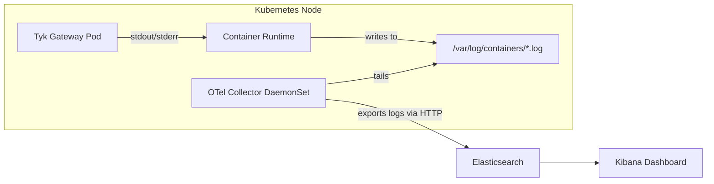

## Introduction

Tyk Gateway produces logs that capture internal events, errors, warnings, and details of request processing. In Kubernetes environments, these logs are written to `stdout`/`stderr` and captured by the container runtime, but they are ephemeral by default. Without a log collection strategy, critical operational data is lost when pods are restarted or evicted.

The [OpenTelemetry Collector](https://opentelemetry.io/docs/collector/) provides a vendor-neutral way to collect, process, and export logs from your Tyk Gateway pods to any supported backend. By using the [Filelog Receiver](https://github.com/open-telemetry/opentelemetry-collector-contrib/tree/main/receiver/filelogreceiver), the Collector can tail container log files on each Kubernetes node and forward them to a log analytics backend such as Elasticsearch.

This guide walks you through deploying the OpenTelemetry Collector alongside Tyk on Kubernetes, configuring it to collect Gateway logs, and shipping those logs to Elasticsearch.

### Architecture Overview

The following diagram illustrates how logs flow from Tyk Gateway containers through the OpenTelemetry Collector to Elasticsearch:



## Prerequisites

Before getting started, ensure you have the following:

- [Kubernetes](https://kubernetes.io/docs/setup/) with `kubectl` configured
- [Helm 3+](https://helm.sh/docs/intro/install/)
- [Elasticsearch Cluster](https://www.elastic.co/guide/en/elasticsearch/reference/current/install-elasticsearch.html)
- [Enterprise Edition License](/apim#licensing)
- Basic familiarity with [Otel Collector](https://opentelemetry.io/docs/collector/configuration/) concepts

## Instructions Overview

### 1. Install Tyk Stack on Kubernetes

For installing Tyk on Kubernetes, follow the [Tyk Helm Charts installation guide](/tyk-self-managed/install/kubernetes#tyk-stack-postgresql).

<Note>
When installing Tyk stack, add this flag `--set tyk-gateway.gateway.log.format=json` to configure the Gateway to output logs in JSON format.
</Note>

You should see Tyk Gateway, Dashboard, and Pump pods running.

```
dashboard-tyk-tyk-dashboard-85bf686b86-xhhm9         1/1     Running   0               4h25m
gateway-tyk-tyk-gateway-6957669779-5tknn             1/1     Running   1 (4h24m ago)   4h25m
otel-collector-opentelemetry-collector-agent-tr8zf   1/1     Running   0               93m
pump-tyk-tyk-pump-5c9d94787f-vxdxs                   1/1     Running   0               4h25m
tyk-postgres-postgresql-0                            1/1     Running   0               4h28m
tyk-redis-master-0                                   1/1     Running   0               4h29m
tyk-redis-replicas-0                                 1/1     Running   0               4h29m
tyk-redis-replicas-1                                 1/1     Running   0               4h28m
tyk-redis-replicas-2                                 1/1     Running   0               4h28m
```

### 2. Deploy OpenTelemetry Collector

Add the OpenTelemetry Helm repository and install the Collector as a DaemonSet:

```bash
helm repo add open-telemetry https://open-telemetry.github.io/opentelemetry-helm-charts
helm repo update
```

Create an `otel-collector-values.yaml` file. This configures the Collector in DaemonSet mode with the Filelog Receiver, and exports logs to Elasticsearch.

<Note>
In the configuration below, replace the Elasticsearch host and password with your actual values.
</Note>

```yaml Expandable
mode: daemonset

image:
  repository: otel/opentelemetry-collector-contrib
  tag: latest

presets:
  logsCollection:
    enabled: false

extraVolumes:
  - name: varlog
    hostPath:
      path: /var/log
  - name: dockercontainers
    hostPath:
      # This is where the actual .log files usually reside
      path: /var/lib/docker/containers 

extraVolumeMounts:
  - name: varlog
    mountPath: /var/log
    readOnly: true
  - name: dockercontainers
    mountPath: /var/lib/docker/containers
    readOnly: true

config:
  receivers:
    filelog:
      # To target all tyk components, you use the following pattern "/var/log/pods/*/*/*.log"
      include:
        - /var/log/pods/*tyk-gateway*/*/*.log
      start_at: end
      include_file_path: true  
      operators:
        - type: container      
          id: container-parser

        - type: json_parser       
          parse_from: body
          parse_to: attributes
          if: 'body matches "^\\{"'

  processors:
    batch: {}
    k8sattributes:
      auth_type: "serviceAccount"
      passthrough: false
      extract:
        metadata:
          - k8s.pod.name
          - k8s.pod.uid
          - k8s.namespace.name
          - k8s.node.name
          - k8s.container.name
        labels:
          - tag_name: $$1
            key_regex: (.*)

  exporters:
    elasticsearch:
      endpoints: ["http://<replace_host>:9200"]
      logs_index: k8s-logs
      mapping:
        mode: none 
      user: elastic
      password: <replace_password>
      tls:
        insecure_skip_verify: true

  service:
    pipelines:
      logs:
        receivers: [filelog]
        processors: [k8sattributes, batch]
        exporters: [elasticsearch]
```

#### Pipeline Overview

This **logs pipeline** reads container logs directly from the node filesystem using the `filelog` receiver, targeting Gateway pod log files. 

The `json_parser` operator parses JSON-formatted log entries, extracting structured fields from the log body into attributes for richer filtering and analysis. 

Each log entry is then enriched by the `k8sattributes` processor, which adds pod, namespace, node, container metadata, and all Kubernetes labels for better filtering and correlation. 

The `batch` processor groups logs efficiently to reduce export overhead. Finally, the processed logs are sent to Elasticsearch, where they are indexed under `k8s-logs` for centralized search and analysis.


<Note>

The above configuration sends logs to the `k8s-logs` index in Elasticsearch. Before installing the collector, ensure the `k8s-logs` index is created in your Elasticsearch cluster.

`curl -u elastic:<replace_password> -X PUT "<replace_host>:9200/k8s-logs" -H 'Content-Type: application/json' -d'{"settings": {"index": {}}}'`
</Note>

Install the Collector:

```bash
helm install otel-collector open-telemetry/opentelemetry-collector \
  -n tyk \
  -f otel-collector-values.yaml
```

Verify the Collector DaemonSet is running:

```bash
kubectl get pods -n tyk -l app.kubernetes.io/name=opentelemetry-collector
```

You should see a pod running on each node.

```
NAME                                                 READY   STATUS    RESTARTS   AGE
otel-collector-opentelemetry-collector-agent-tr8zf   1/1     Running   0          125m
```

### 3. Verify Logs in Elasticsearch

To view logs in Elasticsearch, you can use Kibana to create a [data view](https://www.elastic.co/docs/explore-analyze/find-and-organize/data-views) for the `k8s-logs` index to visualize the logs.

Make some test requests to your Tyk Gateway to generate logs, then check Kibana for incoming log entries.


