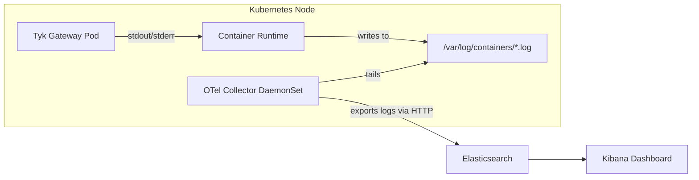
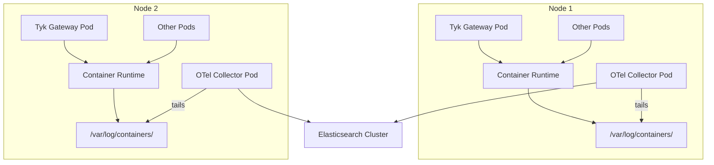

## Introduction

Tyk Gateway produces system logs that capture internal events, errors, warnings, and request processing details. In Kubernetes environments, these logs are written to `stdout`/`stderr` and captured by the container runtime, but they are ephemeral by default. Without a log collection strategy, critical operational data is lost when pods are restarted or evicted.

The [OpenTelemetry Collector](https://opentelemetry.io/docs/collector/) provides a vendor-neutral way to collect, process, and export logs from your Tyk Gateway pods to any supported backend. By using the [Filelog Receiver](https://github.com/open-telemetry/opentelemetry-collector-contrib/tree/main/receiver/filelogreceiver), the Collector can tail container log files on each Kubernetes node and forward them to a log analytics backend such as Elasticsearch.

This guide walks you through deploying the OpenTelemetry Collector alongside Tyk Gateway on Kubernetes, configuring it to collect Gateway logs, and shipping those logs to Elasticsearch.

### Architecture Overview

The following diagram illustrates how logs flow from Tyk Gateway containers through the OpenTelemetry Collector to Elasticsearch:



### Log Collection Patterns

When collecting logs in Kubernetes, there are three common patterns:

| Pattern | Description | Pros | Cons |
| :------ | :---------- | :--- | :--- |
| **DaemonSet** | One Collector pod per node reads logs from the node filesystem | Low resource overhead, simple to manage | Shared configuration for all workloads on the node |
| **Sidecar** | A Collector container runs alongside each application pod | Fine-grained per-pod configuration | Higher resource usage, more containers to manage |
| **Log Forwarder** | Application pushes logs directly to a Collector endpoint | No filesystem access needed | Requires application-level changes |

This guide uses the **DaemonSet pattern**, which is the recommended approach for Kubernetes log collection. It deploys one OpenTelemetry Collector pod per node that tails log files from all containers, including Tyk Gateway.



## Prerequisites

Before getting started, ensure you have the following:

- A **Kubernetes cluster** (v1.23 or later) with `kubectl` configured
- **Helm** v3 installed
- An **Elasticsearch cluster** accessible from the Kubernetes cluster (v7.x or v8.x)
- A Tyk Dashboard license key (for Tyk Stack deployment) or a Tyk Gateway license for OSS

<Note>
If you don't have an Elasticsearch cluster, you can deploy one on Kubernetes using the [Elastic Cloud on Kubernetes (ECK)](https://www.elastic.co/guide/en/cloud-on-kubernetes/current/k8s-quickstart.html) operator or use Elastic Cloud.
</Note>

## Instructions Overview

1. **Install Tyk Stack on Kubernetes** using the official Tyk Helm charts
2. **Deploy OpenTelemetry Collector** as a DaemonSet using the OpenTelemetry Helm chart
3. **Configure the Filelog Receiver** to tail Tyk Gateway container logs
4. **Set up the Elasticsearch Exporter** to ship logs to your Elasticsearch cluster
5. **Validate log collection** and apply troubleshooting tips

### 1. Install Tyk Stack on Kubernetes

Deploy the Tyk Stack using the official [Tyk Helm charts](/product-stack/tyk-charts/overview). Create a namespace and install the chart:

```bash
kubectl create namespace tyk

helm repo add tyk https://helm.tyk.io/public/helm/charts/
helm repo update
```

Create a `values-tyk.yaml` file with your configuration:

```yaml
global:
  license:
    dashboard: "YOUR-DASHBOARD-LICENSE"
  storageType: postgres
  postgres:
    host: your-postgres-host
    port: 5432
    database: tyk
    username: tyk
    password: "YOUR-POSTGRES-PASSWORD"
  redis:
    addrs:
      - "your-redis-host:6379"
    pass: "YOUR-REDIS-PASSWORD"

tyk-gateway:
  gateway:
    extraEnvs:
      - name: TYK_GW_LOGFORMAT
        value: "json"
```

<Note>
Setting `TYK_GW_LOGFORMAT` to `json` ensures Gateway logs are emitted as structured JSON, making them easier to parse and query in Elasticsearch.
</Note>

Install the Tyk Stack:

```bash
helm install tyk tyk/tyk-stack -n tyk -f values-tyk.yaml
```

Verify the deployment:

```bash
kubectl get pods -n tyk
```

You should see Tyk Gateway, Dashboard, and Pump pods running.

### 2. Deploy OpenTelemetry Collector with Filelog Receiver

Add the OpenTelemetry Helm repository and install the Collector as a DaemonSet:

```bash
helm repo add open-telemetry https://open-telemetry.github.io/opentelemetry-helm-charts
helm repo update
```

Create an `otel-collector-values.yaml` file. This configures the Collector in DaemonSet mode with the Filelog Receiver, which requires access to the node's log directory:

```yaml
mode: daemonset

presets:
  logsCollection:
    enabled: true

extraVolumes:
  - name: varlogcontainers
    hostPath:
      path: /var/log/containers
  - name: varlogpods
    hostPath:
      path: /var/log/pods

extraVolumeMounts:
  - name: varlogcontainers
    mountPath: /var/log/containers
    readOnly: true
  - name: varlogpods
    mountPath: /var/log/pods
    readOnly: true

config:
  receivers:
    filelog:
      include:
        - /var/log/containers/gateway-tyk-*_tyk_*.log
      exclude:
        - /var/log/containers/otel-*.log
      start_at: beginning
      include_file_path: true
      include_file_name: false
      operators:
        # Parse the container runtime log format
        - type: router
          id: container_format_router
          routes:
            - output: cri_parser
              expr: 'body matches "^[^ Z]+ "'
            - output: docker_json_parser
              expr: 'body matches "^\\{"'
        # CRI log format parser
        - type: regex_parser
          id: cri_parser
          regex: '^(?P<time>[^ Z]+) (?P<stream>stdout|stderr) (?P<logtag>[^ ]*) ?(?P<log>.*)$'
          output: extract_metadata_from_filepath
          timestamp:
            parse_from: attributes.time
            layout_type: gotime
            layout: '2006-01-02T15:04:05.000000000Z07:00'
        # Docker JSON log format parser
        - type: json_parser
          id: docker_json_parser
          output: extract_metadata_from_filepath
          timestamp:
            parse_from: attributes.time
            layout: '%Y-%m-%dT%H:%M:%S.%LZ'
        # Extract Kubernetes metadata from file path
        - type: regex_parser
          id: extract_metadata_from_filepath
          regex: '^.*\/(?P<namespace>[^_]+)_(?P<pod_name>[^_]+)_(?P<uid>[a-f0-9-]+)\/(?P<container_name>[^\/]+)\/.*$'
          parse_from: attributes["log.file.path"]
          cache:
            size: 128
        # Parse JSON body from Tyk Gateway structured logs
        - type: json_parser
          id: tyk_json_parser
          parse_from: attributes.log
          if: 'attributes.log != nil and attributes.log matches "^\\{"'
          severity:
            parse_from: attributes.level
            mapping:
              info: info
              warn: warning
              error: error
              debug: debug

  processors:
    batch:
      send_batch_size: 256
      send_batch_max_size: 512
      timeout: 5s
    resource:
      attributes:
        - key: service.name
          value: tyk-gateway
          action: upsert
        - key: k8s.namespace.name
          from_attribute: namespace
          action: upsert
        - key: k8s.pod.name
          from_attribute: pod_name
          action: upsert
        - key: k8s.container.name
          from_attribute: container_name
          action: upsert

  exporters:
    elasticsearch:
      endpoints:
        - "https://your-elasticsearch-host:9200"
      logs_index: tyk-gateway-logs
      user: "elastic"
      password: "YOUR-ELASTICSEARCH-PASSWORD"
      tls:
        insecure_skip_verify: false

  service:
    pipelines:
      logs:
        receivers: [filelog]
        processors: [batch, resource]
        exporters: [elasticsearch]
```

Install the Collector:

```bash
helm install otel-collector open-telemetry/opentelemetry-collector \
  -n tyk \
  -f otel-collector-values.yaml
```

### 3. Configure Filelog Receiver to Tail Tyk Gateway Logs

The key configuration in the Filelog Receiver above targets only Tyk Gateway logs using the `include` pattern:

```yaml
include:
  - /var/log/containers/gateway-tyk-*_tyk_*.log
```

This glob pattern matches container log files from the Tyk Gateway pods in the `tyk` namespace. The pattern follows the Kubernetes container log naming convention: `<pod-name>_<namespace>_<container-name>-<container-id>.log`.

<Warning>
Adjust the `include` pattern to match your actual pod naming convention. If you used a different Helm release name or namespace, update accordingly. You can verify the log file names on a node by checking `/var/log/containers/`.
</Warning>

The **operators** pipeline processes each log line through these stages:

1. **Container format router** — Detects whether logs use CRI or Docker JSON format
2. **CRI/Docker parser** — Extracts the timestamp, stream (stdout/stderr), and log body
3. **Filepath metadata extractor** — Derives Kubernetes metadata (namespace, pod, container) from the log file path
4. **Tyk JSON parser** — Parses the structured JSON body emitted by Tyk Gateway and maps the `level` field to OpenTelemetry severity levels

### 4. Set Up Exporter to Send Logs to Elasticsearch

The Elasticsearch exporter in the configuration above sends logs to your cluster. Here are the key settings:

```yaml
exporters:
  elasticsearch:
    endpoints:
      - "https://your-elasticsearch-host:9200"
    logs_index: tyk-gateway-logs
    user: "elastic"
    password: "YOUR-ELASTICSEARCH-PASSWORD"
    tls:
      insecure_skip_verify: false
```

<Note>
For production deployments, use Kubernetes Secrets to manage Elasticsearch credentials instead of plain-text values in the Helm chart. You can reference secrets via environment variables in the `extraEnvs` section of the Collector Helm chart.
</Note>

**Using Kubernetes Secrets for credentials:**

```bash
kubectl create secret generic elasticsearch-credentials \
  -n tyk \
  --from-literal=ES_USERNAME=elastic \
  --from-literal=ES_PASSWORD=YOUR-ELASTICSEARCH-PASSWORD
```

Then reference the secret in your `otel-collector-values.yaml`:

```yaml
extraEnvs:
  - name: ES_USERNAME
    valueFrom:
      secretKeyRef:
        name: elasticsearch-credentials
        key: ES_USERNAME
  - name: ES_PASSWORD
    valueFrom:
      secretKeyRef:
        name: elasticsearch-credentials
        key: ES_PASSWORD

config:
  exporters:
    elasticsearch:
      endpoints:
        - "https://your-elasticsearch-host:9200"
      logs_index: tyk-gateway-logs
      user: "${env:ES_USERNAME}"
      password: "${env:ES_PASSWORD}"
```

### 5. Validate Log Collection and Troubleshooting Tips

#### Verify the Collector is Running

```bash
kubectl get pods -n tyk -l app.kubernetes.io/name=opentelemetry-collector
```

Check the Collector logs for errors:

```bash
kubectl logs -n tyk -l app.kubernetes.io/name=opentelemetry-collector --tail=50
```

#### Verify Logs in Elasticsearch

Query the `tyk-gateway-logs` index to confirm logs are being ingested:

```bash
curl -u elastic:YOUR-ELASTICSEARCH-PASSWORD \
  "https://your-elasticsearch-host:9200/tyk-gateway-logs/_search?pretty&size=5"
```

You should see log entries with Tyk Gateway fields such as `level`, `msg`, and Kubernetes metadata like `k8s.namespace.name` and `k8s.pod.name`.

#### Generate Test Traffic

If you don't see logs, generate some API traffic to produce Gateway log output:

```bash
# Port-forward to the Tyk Gateway service
kubectl port-forward svc/gateway-svc-tyk-gateway -n tyk 8080:8080 &

# Make a test request
curl http://localhost:8080/hello
```

#### Troubleshooting

<AccordionGroup>

<Accordion title="No logs appearing in Elasticsearch">

1. **Check the include pattern** — Verify the glob pattern matches your Gateway pod log files:
   ```bash
   kubectl get pods -n tyk -o name | grep gateway
   ```
   Then check that the corresponding log file exists on the node under `/var/log/containers/`.

2. **Verify volume mounts** — Ensure the Collector DaemonSet has the `/var/log/containers` and `/var/log/pods` volumes mounted.

3. **Check Collector logs** — Look for errors in the Collector output:
   ```bash
   kubectl logs -n tyk daemonset/otel-collector-opentelemetry-collector --tail=100
   ```

4. **Test Elasticsearch connectivity** — Confirm the Collector can reach Elasticsearch from within the cluster.

</Accordion>

<Accordion title="Logs are not parsed as JSON">

Ensure `TYK_GW_LOGFORMAT` is set to `json` in your Tyk Gateway configuration. By default, Tyk outputs logs in a text format that is harder to parse. After changing this setting, restart the Gateway pods:

```bash
kubectl rollout restart deployment gateway-tyk-gateway -n tyk
```

</Accordion>

<Accordion title="High memory usage on the Collector">

The Filelog Receiver tracks file offsets in memory. If you are collecting logs from many containers, consider:

- Narrowing the `include` pattern to only target Tyk pods
- Increasing `batch.timeout` to reduce export frequency
- Setting resource limits on the Collector DaemonSet pods

</Accordion>

</AccordionGroup>

## Reference Configurations

You can find the complete Helm values files and OTel Collector configuration used in this guide in the [Tyk OpenTelemetry examples repository](https://github.com/TykTechnologies/tyk-k8s-demo).

For further details on Tyk's observability capabilities, see:

- [API Observability - Configuring Logs and Metrics](/api-management/logs-metrics)
- [OpenTelemetry distributed tracing](/api-management/logs-metrics#opentelemetry)
- [Tyk Helm Charts](/product-stack/tyk-charts/overview)
