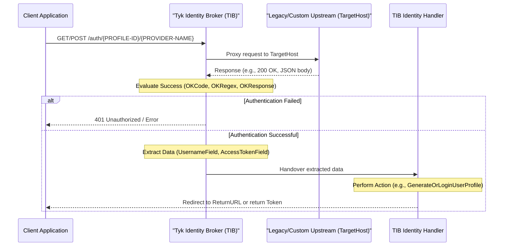

## Introduction

The Proxy Identity Provider is a generic solution built into [Tyk Identity Broker](/api-management/external-service-integration) (TIB) designed to handle custom or legacy authentication flows. It is particularly useful for scenarios such as basic auth access with third-party providers or OAuth password grants, where the authentication request can simply be passed through to a providing endpoint to return a direct response.

Unlike standard Single Sign-On (SSO) protocols (like SAML or OIDC), the Proxy Provider operates on a straightforward "proxy and evaluate" model.

### How it works

The following diagram illustrates the user authentication flow when using the Proxy Identity Provider:



1. **Triggering the Flow:** The client application initiates the process by calling the TIB authentication endpoint: `/auth/{PROFILE-ID}/{PROVIDER-NAME}` (e.g., `/auth/7/ProxyProvider`). Any credentials (such as Basic Auth headers or form data) should be included in this request.
2. **Proxying:** TIB receives the request and proxies it directly to the configured upstream host (`TargetHost`).
3. **Evaluation:** TIB captures the response from the upstream host and evaluates it to determine if the authentication was successful based on your configured triggers.
4. **Data Extraction & Handover:** If successful, TIB extracts the required user data and hands it over to the Identity Handler to perform the configured action (e.g., logging the user into the Tyk Dashboard or issuing an API token).

## Evaluating Success

When TIB proxies the request to the upstream host, it evaluates the response to determine if authentication was successful. It does this in a specific order:

1. **Hard Failure:** If the upstream returns an HTTP status code of `400` or greater, authentication fails immediately, regardless of any other settings.
2. **Response Code (`OKCode`):** If configured (not `0`), the response status code must exactly match this value (e.g., a simple `200` response).
3. **Exact Match (`OKResponse`):** If configured, TIB reads the raw response body, **base64 encodes it**, and compares it to the `OKResponse` string. This means the `OKResponse` value in your configuration **must** be a base64 encoded string.
4. **Regex (`OKRegex`):** If the response is dynamic (e.g., returning a changing timestamp), you can configure a regular expression. TIB will compile the regex and check if it matches the raw response body string.

These triggers can be used in conjunction as gates. For example, a response must be `200 OK` and match the regex in order to be marked as successful.

## Extracting Data and Fallback Behavior

If the response is deemed successful, the Proxy Provider attempts to extract user data to pass to the Identity Handler:

- **JSON Parsing (`ResponseIsJson`):** If set to `true`, TIB parses the response body as JSON. It then uses the `AccessTokenField` and `UsernameField` values as JSON paths to extract the respective data.
- **Basic Auth Header:** It can extract the username from the original request's Basic Auth header. (See the critical warning below regarding a known typo). 
- **Fallback Behavior:** If no username can be extracted from the response or headers, TIB generates a random 12-character string. Finally, if the resulting username does not contain an `@` symbol, TIB automatically appends `@soSession.com` to create a dummy email address for the user profile.


## Example: Log into the Dashboard with the Proxy Provider

The configuration below will proxy a request made to `/auth/7/ProxyProvider` to `http://{TARGET-HOSTNAME}:{PORT}/` and evaluate the response status code. If the status code returned is `200`, TIB will assume the response is JSON (`"ResponseIsJson": true`) and will attempt to extract an access token and find an identity to bind the Dashboard user to in the `user_name` JSON field of the response object (`"UsernameField": "user_name"`).

<Warning>
Due to a known typo in the TIB codebase, the configuration key for extracting the username from the Basic Auth header must be misspelled as `ExrtactUserNameFromBasicAuthHeader` (with the 'r' and 't' swapped). Ensure that you use this misspelling, otherwise TIB will silently ignore the setting.
</Warning>

```json
{
  "ActionType": "GenerateOrLoginUserProfile",
  "ID": "7",
  "OrgID": "{YOUR-ORG-ID}",
  "ProviderConfig": {
    "AccessTokenField": "access_token",
    "ExrtactUserNameFromBasicAuthHeader": false,
    "OKCode": 200,
    "OKRegex": "",
    "OKResponse": "",
    "ResponseIsJson": true,
    "TargetHost": "http://{TARGET-HOSTNAME}:{PORT}/",
    "UsernameField": "user_name"
  },
  "ProviderName": "ProxyProvider",
  "ReturnURL": "http://{DASH-DOMAIN}:{DASH-PORT}/tap",
  "Type": "redirect"
}
```
