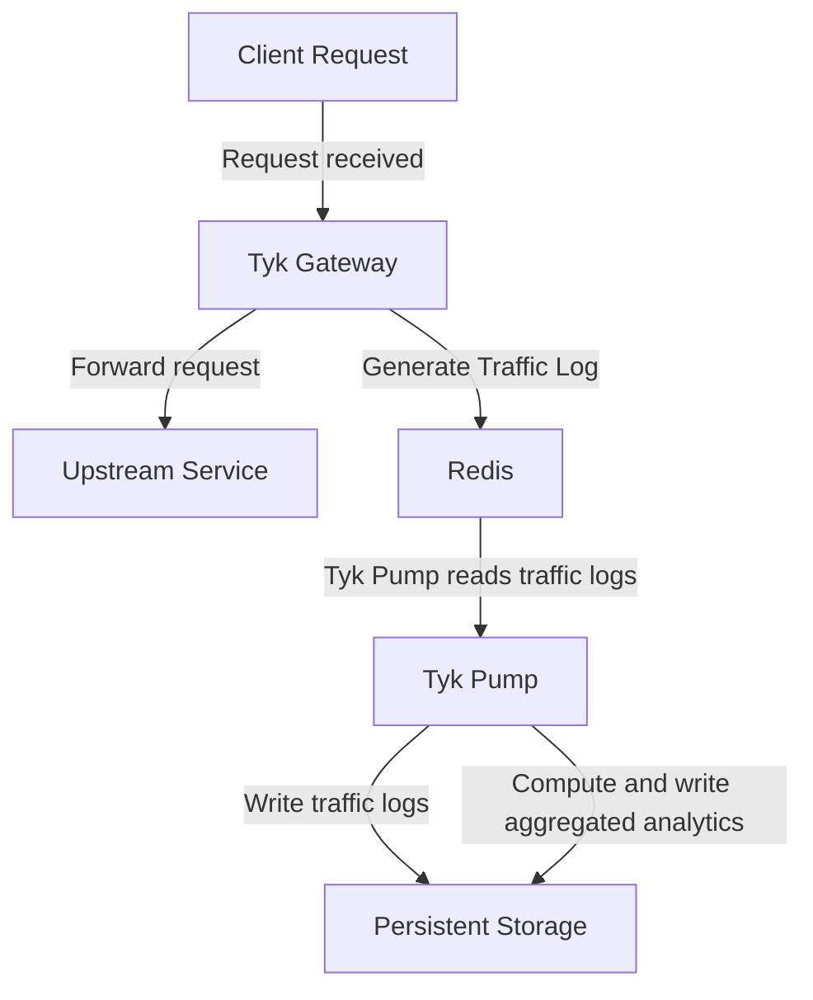
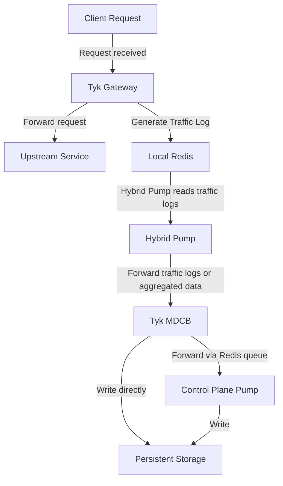

## What Is Dashboard Analytics

Tyk Dashboard presents [built-in analytics](/api-management/dashboard-configuration#traffic-analytics) giving visibility of the traffic passing through your APIs. It covers two levels of visibility, each gated by its own [Dashboard permission](/api-management/user-management#user-permissions-in-the-tyk-dashboard-api):

- **Traffic Analytics** (`analytics:read`): graphs and breakdowns of request volume, error rates, and latency, sliced by dimensions such as API, access key, or OAuth client.
- **Log Browser** (`log:read`): inspect individual requests and responses.

This data comes from traffic logs generated by Tyk Gateway for every request, delivered to Tyk Dashboard's persistent storage by [Tyk Pump](/api-management/tyk-pump), not by OpenTelemetry (OTel). This is true regardless of how far you've adopted OTel elsewhere: OTel traces and metrics export to external observability backends, but they don't feed Tyk Dashboard's own UI.

### Two Kinds of Data

Traffic Analytics and the Log Browser need different data, and can be enabled independently of each other:

| Dashboard Feature | Needs |
| :-- | :-- |
| Traffic Analytics | Aggregated analytics: hourly summaries computed from traffic logs |
| Log Browser | Traffic logs: the full detail of each request |

Aggregated analytics is cheaper to store and query, since it's summarized, while traffic logs preserve full request detail at the cost of storage volume. Many deployments enable both.

### How Aggregation Works

Aggregation calculates hourly analytics from traffic logs, grouped into a fixed set of dimensions, offloading this processing from Tyk Dashboard and reducing storage compared to keeping every traffic log:

| Dashboard Screen | Aggregated By | Field |
| :-- | :-- | :-- |
| [Activity by API](/api-management/dashboard-configuration#activity-by-api) | API proxy | [`api_id`](/api-management/logs/traffic-logs#param-api-id) |
| [Activity by Endpoint](/api-management/dashboard-configuration#activity-by-endpoint) | API endpoint | [`track_path`](/api-management/logs/traffic-logs#param-track-path) |
| [Activity by Errors](/api-management/dashboard-configuration#activity-by-error) | HTTP status code | [`response_code`](/api-management/logs/traffic-logs#param-response-code) |
| [Activity by Key](/api-management/dashboard-configuration#activity-by-key) | Client access key or token | [`api_key`](/api-management/logs/traffic-logs#param-api-key) |
| [Traffic per OAuth Client](/api-management/dashboard-configuration#activity-by-oauth-client) | OAuth client | [`oauth_id`](/api-management/logs/traffic-logs#param-oauth-id) |
| [Activity by Location](/api-management/dashboard-configuration#activity-by-location) | Client geographic location | [`geo`](/api-management/logs/traffic-logs#param-geo) |
| n/a | API version | [`api_version`](/api-management/logs/traffic-logs#param-api-version) |

`track_path` decides whether an endpoint is broken out individually in the Activity by Endpoint breakdown above; see [Controlling Which Endpoints Are Tracked](#controlling-which-endpoints-are-tracked) below for what sets it.

Additional [custom aggregation](#custom-aggregation-tags) is also supported for users requiring data aggregated by different dimensions.

### Pre-Computed vs Live Aggregation

An Aggregate Pump is not the only way to get this aggregated data. Tyk Dashboard can also compute it itself: on every request to a Traffic Analytics screen, live, it runs the equivalent aggregation directly against the traffic log collection or table (a MongoDB aggregation pipeline, or a SQL query), and discards the result once the screen has rendered.

Which of the two Tyk Dashboard uses is controlled by a single setting, [`enable_aggregate_lookups`](/tyk-dashboard/configuration#enable_aggregate_lookups):

- `true`: Tyk Dashboard reads pre-computed aggregated analytics, written by an [Aggregate Pump](/api-management/dashboard-analytics/control-plane-pumps#choosing-a-pump-type).
- `false` (the default): Tyk Dashboard computes the aggregation live instead, regardless of whether an Aggregate Pump is deployed and running; any aggregated analytics it computes and stores go unread.

Live computation is a legitimate way to run Tyk Dashboard, and needs no extra pump configuration. But it has a cost:

- It runs inside Tyk Dashboard itself, competing for the same CPU and database resources, rather than on a dedicated process built for this job (Tyk Pump). This can make Traffic Analytics screens feel slower to load, especially at higher traffic volumes or with several users viewing the Dashboard UI at once.
- It repeats the same aggregation on every screen load, rather than once per hour, so the cost grows with the volume of traffic logs it has to scan.

Deploying an Aggregate Pump and setting `enable_aggregate_lookups: true` is the recommended approach. It also means you can [cap or evict old traffic logs](/api-management/dashboard-analytics/analytics-storage-management) without losing the historical data behind these screens, since the aggregated summaries are preserved separately.

<Note>
For MCP proxy traffic, there's no working live fallback: live computation has no MCP-specific aggregation logic. If you're using [MCP Analytics](/ai-management/mcp-gateway/mcp-analytics), running an MCP Aggregate Pump with `enable_aggregate_lookups: true` is required, not just recommended.
</Note>

<Note>
`enable_aggregate_lookups` doesn't apply to the **Activity by Graph** screen. That screen is fed by a dedicated `tyk_graph_aggregated` table, written by the [SQL GraphQL Aggregate Pump](/api-management/dashboard-analytics/control-plane-pumps#sql-graphql-aggregate-pump), which Tyk Dashboard's Postgres driver always queries directly. There's no live-computation fallback and no config flag for this screen, and it's PostgreSQL-only.
</Note>

## Where the Data Comes From

Tyk Gateway generates a traffic log for every request and writes it to Redis. See [Traffic Logs](/api-management/logs/traffic-logs) for how and when these are generated, and the full field reference.

## What Data Is Captured

The [Traffic Log Field Reference](/api-management/logs/traffic-logs#traffic-log-field-reference) documents every field. The rest of this section covers what specifically affects Dashboard Analytics: per-endpoint tracking, detailed recording, and custom tags.

### Controlling Which Endpoints Are Tracked

By default, only some endpoints are broken out individually in the per-endpoint aggregates: Activity by Endpoint, and the per-endpoint breakdowns nested within Activity by Key and Traffic per OAuth Client. Which ones depends on the `track_path` field; see [Controlling Which Endpoints Are Tracked](/api-management/logs/traffic-logs#controlling-which-endpoints-are-tracked) on the Traffic Logs page for what sets it.

- Endpoints with Track Endpoint enabled get `track_path: true`, and appear individually in these breakdowns.
- Endpoints without it get `track_path: false`. Their traffic is excluded from these per-endpoint breakdowns specifically, but still counted in every other aggregate dimension: API totals, error codes, API versions, key/OAuth-client counts, geo, and tags.

Set `track_all_paths: true` on an Aggregate Pump to override this and include every endpoint in these breakdowns, regardless of whether Track Endpoint is enabled on it.

<Note>
Track Endpoint only affects this aggregated per-endpoint breakdown. It has no effect on traffic logs or the Log Browser.
</Note>

### Detailed Recording

Detailed recording, [configured at the Gateway](/api-management/logs/traffic-logs#detailed-recording), includes the full request and response, in wire format and base64-encoded, in the traffic log's `raw_request` and `raw_response` fields. Enabling it significantly increases record size and storage requirements; Tyk Cloud users are subject to the subscription's storage quota.

### Custom Aggregation Tags

Aggregation groups traffic logs by a fixed set of [standard fields](#how-aggregation-works). When those don't capture the dimension you care about, for example when several sub-accounts or environments share a single API key so the standard `api_key` aggregation can't separate them, Tyk Gateway can [tag traffic logs](/api-management/logs/traffic-logs#custom-tags) with the value of any HTTP request header, such as `X-Account-ID`. Tyk Pump's aggregate pumps then compute an hourly aggregate for each distinct tag value observed, the same way they do for the standard fields.

Because every distinct tag value gets its own aggregate bucket, tagging a header whose value is unique per request, such as a timestamp or request ID, creates one bucket per request: no aggregation benefit, just storage growth. Tyk Pump logs a warning if it detects this happening.

You might also tag a header you never intended to aggregate at all, for example a request ID useful for finding one specific transaction in the Log Browser, but meaningless as an aggregate dimension.

In both cases, you can add the tag, or its prefix, to the aggregate pump type's `ignore_tag_prefix_list` setting. This only affects aggregation: the tag itself is still recorded on the traffic log and remains visible in the Log Browser either way.

**Viewing the Aggregated Data**

In the Tyk Dashboard UI, use the **filter by tag** option on the [API Activity Dashboard](/api-management/dashboard-configuration#api-activity-dashboard) to see the aggregate graphs for a specific tag value. Programmatically, pass the tag as a `tags` parameter to the [Dashboard API](/tyk-dashboard-api)'s analytics endpoints.

### GraphQL-Specific Detail

Traffic logs for GraphQL APIs carry additional fields; see [GraphQL Fields](/api-management/logs/traffic-logs#graphql-fields) on the Traffic Logs page. This data is not currently surfaced in Tyk Dashboard; it's stored for export to external tools. See the Mongo GraphQL Pump and SQL GraphQL Pump sections of [Control Plane Pumps](/api-management/dashboard-analytics/control-plane-pumps#mongodb) for configuration.

### MCP-Specific Detail

Traffic logs for MCP proxy requests carry additional fields; see [MCP Fields](/api-management/logs/traffic-logs#mcp-fields) on the Traffic Logs page. See [MCP Analytics](/ai-management/mcp-gateway/mcp-analytics) for how Tyk Dashboard surfaces this data.

## How Data Reaches Tyk Dashboard

How that data actually reaches Tyk Dashboard depends on your deployment topology. Tyk Gateway's side of the job, generating the traffic log and writing it to Redis, is identical either way; what differs is what reads it next.

In a combined control and data plane (the `tyk-stack` chart, no Tyk MDCB), Tyk Pump reads directly from that Redis instance and writes straight to the persistent storage (MongoDB or SQL), forwarding traffic logs, aggregated analytics, or both, in parallel:

In a distributed deployment, with separate control and data planes connected via Tyk MDCB, the Hybrid Pump (the pump type that runs on each data plane) reads from its own local Redis and forwards the data to Tyk MDCB instead, which then writes it to the persistent storage in the control plane, either using its own built-in writer or by forwarding it via a Redis queue to a Control Plane Pump:

See [Data Plane Pump](/api-management/dashboard-analytics/data-plane-pump) for that mechanism in full, including which of the two paths applies to traffic logs versus aggregated analytics.

Both paths write to the same MongoDB or SQL collections that Tyk Dashboard reads from.

## Storage Backends

Whichever topology you use, Tyk Pump ultimately writes traffic logs and aggregated analytics into either MongoDB or SQL (PostgreSQL or MySQL), and Tyk Dashboard reads from that same database.

- MongoDB stores each kind of data, traffic logs and aggregated analytics, in its own collection, and can optionally split traffic logs into a separate collection per Organisation.
- SQL also stores each kind of data in its own table, but has no per-Organisation split: every Organisation's rows share the same table, distinguished by an indexed `org_id` column.

See [Control Plane Pumps](/api-management/dashboard-analytics/control-plane-pumps#choosing-a-pump-type) for the specific pump types and configuration for each (or [Data Plane Pump](/api-management/dashboard-analytics/data-plane-pump) if your control and data planes are separate).

Tyk Dashboard's own configuration file has a `storage` section, with `analytics` and `logs` sub-sections used to connect it to those same databases; see the [Tyk Dashboard configuration reference](/tyk-dashboard/configuration#storage) for the full field list, and [Database Management](/planning-for-production/database-settings) for production sizing guidance.

For guidance on managing the size of that stored data over time, see [Analytics Storage Management](/api-management/dashboard-analytics/analytics-storage-management).
