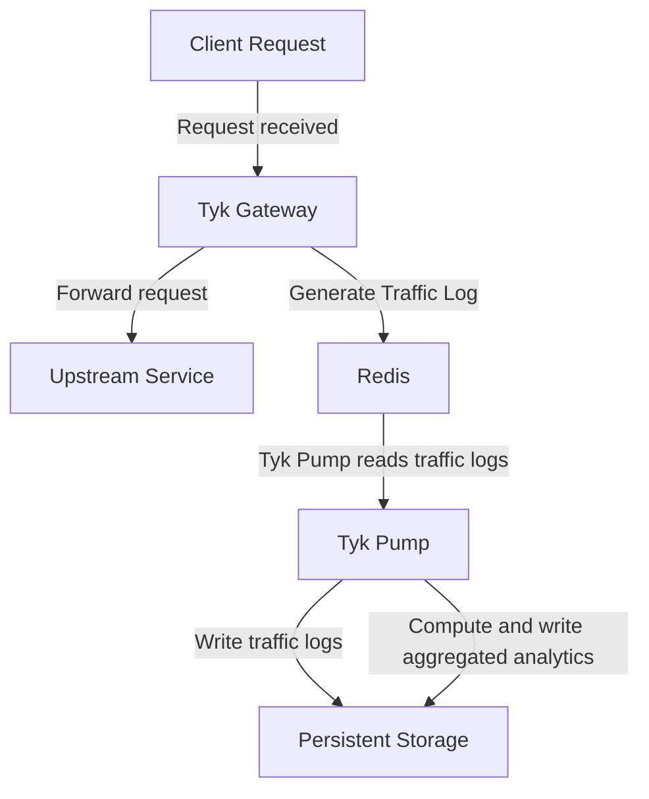
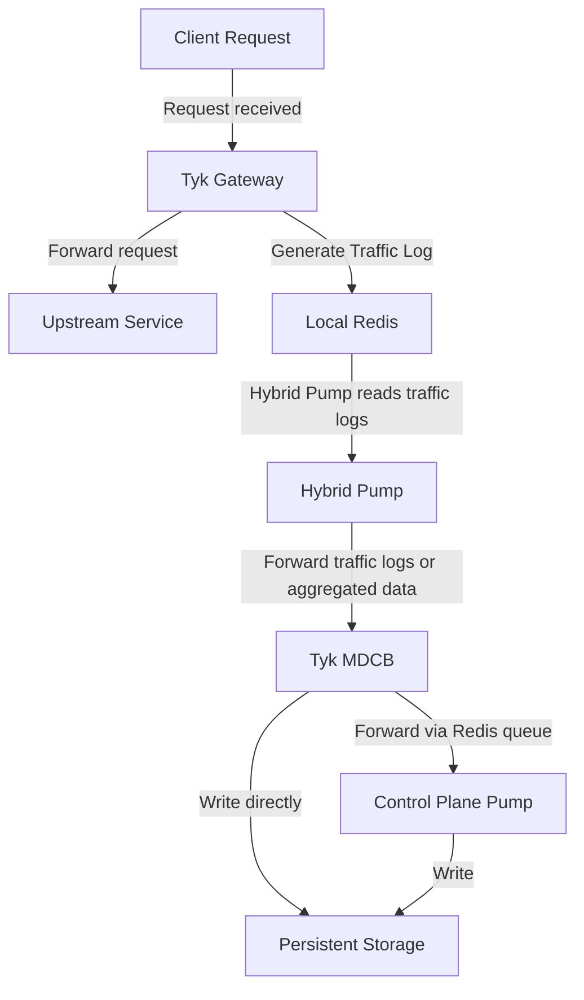

## What Is Dashboard Analytics

Tyk Dashboard presents [built-in analytics](/api-management/dashboard-configuration#traffic-analytics) giving visibility of the traffic passing through your APIs. It covers two levels of visibility, each gated by its own [Dashboard permission](/api-management/user-management#user-permissions-in-the-tyk-dashboard-api):

- **Traffic Analytics** (`analytics:read`): graphs and breakdowns of request volume, error rates, and latency, sliced by dimensions such as API, access key, or OAuth client.
- **Log Browser** (`log:read`): inspect individual requests and responses.

This data comes from traffic logs generated by Tyk Gateway for every request, delivered to Tyk Dashboard's persistent storage by [Tyk Pump](/api-management/tyk-pump), not by OpenTelemetry (OTel). This is true regardless of how far you've adopted OTel elsewhere: OTel traces and metrics export to external observability backends, but they don't feed Tyk Dashboard's own UI.

### Two Kinds of Data

Traffic Analytics and the Log Browser need different data, and can be enabled independently of each other:

| Dashboard Feature | Needs |
| :-- | :-- |
| Traffic Analytics | Aggregated analytics: hourly summaries computed from traffic logs |
| Log Browser | Traffic logs: the full detail of each request |

Aggregated analytics is cheaper to store and query, since it's summarized, while traffic logs preserve full request detail at the cost of storage volume. Many deployments enable both.

### How Aggregation Works

Aggregation calculates hourly analytics from traffic logs, grouped into a fixed set of dimensions, offloading this processing from Tyk Dashboard and reducing storage compared to keeping every traffic log:

| Dashboard Screen | Aggregated By | Field |
| :-- | :-- | :-- |
| [Activity by API](/api-management/dashboard-configuration#activity-by-api) | API proxy | `APIID` |
| [Activity by Endpoint](/api-management/dashboard-configuration#activity-by-endpoint) | API endpoint | `TrackPath` |
| [Activity by Errors](/api-management/dashboard-configuration#activity-by-error) | HTTP status code | `ResponseCode` |
| [Activity by Key](/api-management/dashboard-configuration#activity-by-key) | Client access key or token | `APIKey` |
| [Traffic per OAuth Client](/api-management/dashboard-configuration#activity-by-oauth-client) | OAuth client | `OauthID` |
| [Activity by Location](/api-management/dashboard-configuration#activity-by-location) | Client geographic location | `Geo` |
| n/a | API version | `APIVersion` |

`TrackPath` decides whether an endpoint is broken out individually in the Activity by Endpoint breakdown above; see [Controlling Which Endpoints Are Tracked](#controlling-which-endpoints-are-tracked) below for what sets it.

Additional [custom aggregation](#custom-aggregation-tags) is also supported for users requiring data aggregated by different dimensions.

### Pre-Computed vs Live Aggregation

An Aggregate Pump is not the only way to get this aggregated data. Tyk Dashboard can also compute it itself: on every request to a Traffic Analytics screen, live, it runs the equivalent aggregation directly against the traffic log collection or table (a MongoDB aggregation pipeline, or a SQL query), and discards the result once the screen has rendered.

Which of the two Tyk Dashboard uses is controlled by a single setting, [`enable_aggregate_lookups`](/tyk-dashboard/configuration#enable_aggregate_lookups):

- `true`: Tyk Dashboard reads pre-computed aggregated analytics, written by an [Aggregate Pump](/api-management/dashboard-analytics/control-plane-pumps#choosing-a-pump-type).
- `false` (the default): Tyk Dashboard computes the aggregation live instead, regardless of whether an Aggregate Pump is deployed and running; any aggregated analytics it computes and stores go unread.

Live computation is a legitimate way to run Tyk Dashboard, and needs no extra pump configuration. But it has a cost:

- It runs inside Tyk Dashboard itself, competing for the same CPU and database resources, rather than on a dedicated process built for this job (Tyk Pump). This can make Traffic Analytics screens feel slower to load, especially at higher traffic volumes or with several users viewing the Dashboard UI at once.
- It repeats the same aggregation on every screen load, rather than once per hour, so the cost grows with the volume of traffic logs it has to scan.

Deploying an Aggregate Pump and setting `enable_aggregate_lookups: true` is the recommended approach. It also means you can [cap or evict old traffic logs](/api-management/dashboard-analytics/analytics-storage-management) without losing the historical data behind these screens, since the aggregated summaries are preserved separately.

<Note>
For MCP proxy traffic, there's no working live fallback: live computation has no MCP-specific aggregation logic. If you're using [MCP Analytics](/ai-management/mcp-gateway/mcp-analytics), running an MCP Aggregate Pump with `enable_aggregate_lookups: true` is required, not just recommended.
</Note>

## Where the Data Comes From

When a client makes a request, Tyk Gateway generates a traffic log capturing the request and response details, and writes it to Redis.

<Note>
Traffic logs are not written to standard outputs such as [application and access logs](/api-management/logs#types-of-logs). They live in Redis, transiently, until Tyk Pump reads and purges them.
</Note>

Enable traffic logging by setting [`enable_analytics`](/tyk-oss-gateway/configuration#enable_analytics) in the Gateway configuration. To exclude specific APIs or endpoints, use the [do-not-track middleware](/api-management/traffic-transformation/do-not-track).

## What Data Is Captured

Every traffic log contains a fixed set of fields, including the method, path, response code, latency, and API/key/Organisation identifiers. See [Tyk Traffic Log Fields](/api-management/tyk-traffic-log-fields) for the full reference.

Individual request and response headers are not captured by default, aside from `User-Agent`. To capture the value of a specific header, use [Custom Aggregation Tags](#custom-aggregation-tags). The full set of headers is only stored when [Detailed Recording](#detailed-recording) is enabled, alongside the request and response bodies.

### Controlling Which Endpoints Are Tracked

By default, only some endpoints are broken out individually in the per-endpoint aggregates: Activity by Endpoint, and the per-endpoint breakdowns nested within Activity by Key and Traffic per OAuth Client. Which ones depends on the `TrackPath` field, set on each traffic log by the **Track Endpoint** middleware (`trackEndpoint` in Tyk OAS, `track_endpoints` in Tyk Classic), enabled per endpoint on the API definition:

- Endpoints with Track Endpoint enabled get `TrackPath: true`, and appear individually in these breakdowns.
- Endpoints without it get `TrackPath: false`. Their traffic is excluded from these per-endpoint breakdowns specifically, but still counted in every other aggregate dimension: API totals, error codes, API versions, key/OAuth-client counts, geo, and tags.

Set `track_all_paths: true` on an Aggregate Pump to override this and include every endpoint in these breakdowns, regardless of whether Track Endpoint is enabled on it.

<Note>
Track Endpoint only affects this aggregated per-endpoint breakdown. It has no effect on traffic logs or the Log Browser, and despite the similar name, it's unrelated to [Do Not Track](/api-management/traffic-transformation/do-not-track): Do Not Track suppresses the traffic log entirely, before it reaches aggregation at all.
</Note>

### Detailed Recording

Tyk Gateway does not usually include the full request and response, with headers and body, in traffic logs, to keep them small and to avoid capturing sensitive data.

If this level of detail is required, for example when debugging an API, you can use Tyk's **detailed recording** option. With this enabled, the complete request and response are included in wire format, base64-encoded, in the traffic log's ([`raw_request`](/api-management/tyk-traffic-log-fields#rawrequest) and [`raw_response`](/api-management/tyk-traffic-log-fields#rawresponse) respectively) fields. 

There are three levels of granularity at which detailed recording of logs can be configured:

1. [API level](#api-level) to capture detailed records for all requests made to a specific API
2. [Key level](#key-level) to capture detailed records for all requests made by a specific access token
3. [Gateway level](#gateway-level) to capture detailed records for all requests to APIs on the Gateway

<Note>
APIs with GraphQL enabled get detailed recording automatically, regardless of these config settings. See [GraphQL-Specific Detail](#graphql-specific-detail).
</Note>

<Note>
Enabling detailed recording significantly increases record size and storage requirements. Tyk Cloud users can enable detailed recording per API using the instructions below, or at the Gateway level through a support request; traffic logs are subject to the subscription's storage quota.
</Note>

<Tabs>
<Tab title="API Level">

Set [`server.detailedActivityLogs.enabled`](/api-management/gateway-config-tyk-oas#detailedactivitylogs) in the Tyk Vendor Extension, or use the **Record payload in traffic logs** option in the API Designer.


If using Tyk Classic APIs, set the equivalent [`enable_detailed_recording`](/api-management/gateway-config-tyk-classic#param-enable-detailed-recording), or use **Enable Detailed Logging** in **Core Settings** in the Tyk Classic API Designer.


With Tyk Operator, set `spec.enable_detailed_recording` to `true`:

```yaml {linenos=true, linenostart=1, hl_lines=["10-10"]}
apiVersion: tyk.tyk.io/v1alpha1
kind: ApiDefinition
metadata:
  name: httpbin
spec:
  name: httpbin
  use_keyless: true
  protocol: http
  active: true
  enable_detailed_recording: true
  proxy:
    target_url: http://httpbin.org
    listen_path: /httpbin
    strip_listen_path: true
```

</Tab>
<Tab title="Key Level">

Enable **Enable Detailed Logging** on the **2. Configurations** tab of the Key Designer to record detailed request and response data for transactions using that key (Session) only, useful for debugging a specific consumer.

Alternatively, add the following to the root of the Session's JSON, for example when creating or updating keys via the [Keys API](/tyk-dashboard-api):

```json
"enable_detailed_recording": true
```

<Note>
This setting is not available on [Policies](/api-management/policies), only directly on individual [Sessions](/api-management/access-control/sessions-and-keys/understanding-sessions).
</Note>

</Tab>
<Tab title="Gateway Level">

Enable [detailed recording](/tyk-oss-gateway/configuration#analytics_config-enable_detailed_recording) in `tyk.conf`, which affects all APIs on the Gateway:

```json
{
    "enable_analytics": true,
    "analytics_config": {
        "enable_detailed_recording": true
    }
}
```

</Tab>
</Tabs>

#### Controlling Detailed Recording per Destination

The detailed recording controls described above govern the content of the traffic logs generated by Tyk Gateway and stored in Redis. Tyk Pump has additional controls to determine whether and how the encoded request and response data are transmitted to their destination:

- **[Omit them entirely](/api-management/tyk-pump#omit-detailed-recording)**: set `omit_detailed_recording` on a specific pump to drop `raw_request` and `raw_response` before that pump writes its record. Useful for keeping detailed request/response data out of one destination, such as an external sink, while still storing it for the Log Browser.
- **[Decode them](/api-management/tyk-pump#decode-raw-request-and-raw-response)**: set `raw_request_decoded` and `raw_response_decoded` on a specific pump to base64-decode these fields before writing, so their contents are searchable at the destination.

<Note>
Do not decode the request and response data when transferring the unaggregated traffic logs to the control plane's persistent storage for Tyk Dashboard's Log Browser. The Dashboard automatically base64-decodes this data when displaying a record; if this decoding has already been performed by Tyk Pump, the result will be nonsense in the Log Browser display. Only decode for destinations that read the data directly, such as an external sink.
</Note>

### Custom Aggregation Tags

Aggregation groups traffic logs by a fixed set of [standard fields](#how-aggregation-works). When those don't capture the dimension you care about, for example when several sub-accounts or environments share a single API key so the standard `APIKey` aggregation can't separate them, you can tag traffic logs with the value of any HTTP request header, such as `X-Account-ID`.

These custom aggregation tags are declared at the API level: Tyk Gateway checks every request to that API for the specified header, and tags the traffic log with its value whenever the header is present. Tyk Pump's aggregate pumps then compute an hourly aggregate for each distinct tag value observed, the same way they do for the standard fields.

Because every distinct tag value gets its own aggregate bucket, tagging a header whose value is unique per request, such as a timestamp or request ID, creates one bucket per request: no aggregation benefit, just storage growth. Tyk Pump logs a warning if it detects this happening.

You might also tag a header you never intended to aggregate at all, for example a request ID useful for finding one specific transaction in the Log Browser, but meaningless as an aggregate dimension.

In both cases, you can add the tag, or its prefix, to the aggregate pump type's `ignore_tag_prefix_list` setting. This only affects aggregation: the tag itself is still recorded on the traffic log and remains visible in the Log Browser either way.

#### Declaring a Custom Tag

Configure custom tags by adding the header name to `middleware.global.trafficLogs.tagHeaders` in the Tyk Vendor Extension. For example, including `x-account-id` tags every traffic log for a request that includes an `x-account-id` header, using the value `x-account-id-<value>`.

A request sent with `--header "x-account-id: 1234"` therefore produces a traffic log tagged `x-account-id-1234`, and the aggregate pump type computes an hourly aggregate for that tag value.

If using Tyk Classic APIs, the equivalent field is [tag_headers](/api-management/gateway-config-tyk-classic#traffic-logs), also available in the Tyk Classic API Designer under **Advanced Options**:


With Tyk Operator, set `spec.tag_headers`:

```yaml {linenos=true, linenostart=1, hl_lines=["10-12"]}
apiVersion: tyk.tyk.io/v1alpha1
kind: ApiDefinition
metadata:
  name: httpbin-tag-headers
spec:
  name: httpbin-tag-headers
  use_keyless: true
  protocol: http
  active: true
  tag_headers:
  - Host
  - User-Agent
  proxy:
    target_url: http://httpbin.org
    listen_path: /httpbin-tag-headers
    strip_listen_path: true
```

#### Viewing the Aggregated Data

In the Tyk Dashboard UI, use the **filter by tag** option on the [API Activity Dashboard](/api-management/dashboard-configuration#api-activity-dashboard) to see the aggregate graphs for a specific tag value. Programmatically, pass the tag as a `tags` parameter to the [Dashboard API](/tyk-dashboard-api)'s analytics endpoints.

### GraphQL-Specific Detail

For GraphQL APIs, traffic logs additionally capture the operation type (query, mutation, or subscription), the root fields invoked and any nested types and fields requested, the request variables, and any GraphQL response errors. This data is not currently surfaced in Tyk Dashboard; it's stored for export to external tools. See the Mongo GraphQL Pump and SQL GraphQL Pump sections of [Control Plane Pumps](/api-management/dashboard-analytics/control-plane-pumps#mongodb) for configuration.

<Note>
Enabling GraphQL on an API also turns on [Detailed Recording](#detailed-recording) for that API automatically, even if it isn't explicitly configured at any level. This is a separate effect: Tyk Gateway extracts the GraphQL-specific detail above independently, regardless of whether Detailed Recording is enabled.
</Note>

### MCP-Specific Detail

For MCP proxies, traffic logs additionally capture the JSON-RPC method called, such as `tools/call` or `resources/read`, the type of MCP primitive invoked (tool, resource, or prompt), and its specific name. See [MCP Analytics](/ai-management/mcp-gateway/mcp-analytics) for details.

## How Data Reaches Tyk Dashboard

How that data actually reaches Tyk Dashboard depends on your deployment topology. Tyk Gateway's side of the job, generating the traffic log and writing it to Redis, is identical either way; what differs is what reads it next.

In a combined control and data plane (the `tyk-stack` chart, no Tyk MDCB), Tyk Pump reads directly from that Redis instance and writes straight to the persistent storage (MongoDB or SQL), forwarding traffic logs, aggregated analytics, or both, in parallel:



In a distributed deployment, with separate control and data planes connected via Tyk MDCB, the Hybrid Pump (the pump type that runs on each data plane) reads from its own local Redis and forwards the data to Tyk MDCB instead, which then writes it to the persistent storage in the control plane, either using its own built-in writer or by forwarding it via a Redis queue to a Control Plane Pump:



See [Data Plane Pump](/api-management/dashboard-analytics/data-plane-pump) for that mechanism in full, including which of the two paths applies to traffic logs versus aggregated analytics.

Both paths write to the same MongoDB or SQL collections that Tyk Dashboard reads from.

## Storage Backends

Whichever topology you use, Tyk Pump ultimately writes traffic logs and aggregated analytics into either MongoDB or SQL (PostgreSQL or MySQL), and Tyk Dashboard reads from that same database.

- MongoDB stores each kind of data, traffic logs and aggregated analytics, in its own collection, and can optionally split traffic logs into a separate collection per Organisation.
- SQL also stores each kind of data in its own table, but has no per-Organisation split: every Organisation's rows share the same table, distinguished by an indexed `org_id` column.

See [Control Plane Pumps](/api-management/dashboard-analytics/control-plane-pumps#choosing-a-pump-type) for the specific pump types and configuration for each (or [Data Plane Pump](/api-management/dashboard-analytics/data-plane-pump) if your control and data planes are separate).

Tyk Dashboard's own configuration file has a `storage` section, with `analytics` and `logs` sub-sections used to connect it to those same databases; see the [Tyk Dashboard configuration reference](/tyk-dashboard/configuration#storage) for the full field list, and [Database Management](/planning-for-production/database-settings) for production sizing guidance.

For guidance on managing the size of that stored data over time, see [Analytics Storage Management](/api-management/dashboard-analytics/analytics-storage-management).
