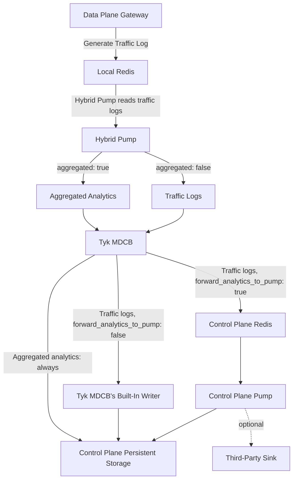

In a distributed deployment, the control plane and one or more data planes run separately, often in different regions or clouds, connected via [Tyk MDCB](/api-management/mdcb). This changes how traffic data reaches Tyk Dashboard's persistent storage: instead of Tyk Pump writing directly to MongoDB or SQL, as it does when the control and data planes are combined, a Data Plane Pump (`type: hybrid`) on each data plane is used to forward the data to Tyk MDCB on the control plane, which then writes it to the Control Plane's persistent storage.



## Why a Separate Pump Process

Tyk Gateway writes traffic logs to its own local Redis, which is not reachable from the control plane. Tyk MDCB never reaches into a data plane's Redis itself. It only receives data pushed to it over the RPC connection Gateways already use for configuration synchronization.

The Hybrid Pump is a Tyk Pump instance, configured with `type: hybrid`, deployed alongside your data plane Gateways. It reads traffic logs from the local Redis and forwards them, individually or as aggregated analytics, to Tyk MDCB, the same role Tyk Pump plays when the control and data planes are combined, adapted for a deployment where they're separate.

<Note>
Tyk Gateway also has a legacy built-in mechanism for this, enabled with `analytics_config.type: rpc`, which sends traffic logs to Tyk MDCB without a separate pump process. It has no aggregation support and runs inside the Gateway process itself. The Hybrid Pump is the current recommended approach.
</Note>

## Connecting the Hybrid Pump to Tyk MDCB

To connect to Tyk MDCB, on the control plane, the Hybrid Pump needs to know where to find it (`connection_string`) and a secret to authenticate with (`api_key`).

`api_key` is the API key of a Tyk Dashboard user, obtained by registering a user scoped to the same Organisation as your data plane. See [Tyk MDCB](/api-management/mdcb) for that setup.

Set `use_ssl: true` to encrypt this connection over TLS. The Hybrid Pump is the TLS client and Tyk MDCB the server; there's no client certificate involved, so this only encrypts the connection, it doesn't identify the Pump to MDCB (`api_key` does that). If Tyk MDCB's certificate isn't trusted by your system's CA pool, for example because it's self-signed, set `ssl_insecure_skip_verify: true` rather than skip TLS entirely.

## Hybrid Pump Meta

The Hybrid Pump is declared and configured like any other pump, as described in the [Tyk Pump configuration guide](/api-management/tyk-pump#declaring-pumps), with both [common](/api-management/tyk-pump#common-pump-settings) and pump-specific settings. The specific settings live in `meta`:

```json
{
  "pumps": {
    "hybrid": {
      "type": "hybrid",
      "meta": {
        "connection_string": "",       // required
        "api_key": "",                 // required
        "use_ssl": false,
        "ssl_insecure_skip_verify": false,
        "rpc_key": "",                 // unused
        "call_timeout": 10,
        "rpc_pool_size": 5,
        "aggregated": false,
        "track_all_paths": false,
        "store_analytics_per_minute": false,
        "enable_mcp_aggregation": false,
        "ignore_tag_prefix_list": []
      },
      ...
    }
  }
}
```

| Field | Default | Description |
| :-- | :-- | :-- |
| `connection_string` | - | Tyk MDCB's address, as `host:port`, for example `mdcb.example.com:9091`. **Required** |
| `api_key` | - | See [Connecting the Hybrid Pump to Tyk MDCB](#connecting-the-hybrid-pump-to-tyk-mdcb) above. **Required** |
| `use_ssl` | `false` | Connect to Tyk MDCB over TLS. |
| `ssl_insecure_skip_verify` | `false` | Skips TLS certificate verification when `use_ssl` is `true`. |
| `rpc_key` | - | Unused. |
| `call_timeout` | `10` | RPC call timeout, in seconds. |
| `rpc_pool_size` | `5` | RPC connection pool size. |
| `aggregated` | `false` | See [Traffic Logs or Aggregated Analytics](#traffic-logs-or-aggregated-analytics) below. |
| `track_all_paths` | `false` | See [Traffic Logs or Aggregated Analytics](#traffic-logs-or-aggregated-analytics) below. |
| `store_analytics_per_minute` | `false` | See [Traffic Logs or Aggregated Analytics](#traffic-logs-or-aggregated-analytics) below. |
| `enable_mcp_aggregation` | `false` | See [Traffic Logs or Aggregated Analytics](#traffic-logs-or-aggregated-analytics) below. |
| `ignore_tag_prefix_list` | (none) | Prefixes of [custom aggregation tags](/api-management/dashboard-analytics#custom-aggregation-tags) to exclude from aggregation, when `aggregated` is `true`. |

## Traffic Logs or Aggregated Analytics

The Hybrid Pump can send every traffic log to Tyk MDCB, or it can create [aggregated analytics](/api-management/dashboard-analytics#how-aggregation-works).

The `aggregated` field controls this behavior:

- `aggregated: false` (default): the Hybrid Pump sends every traffic log to Tyk MDCB individually. This is the appropriate mode to use if you need to see the traffic in Tyk Dashboard's Log Browser.
- `aggregated: true`: the Hybrid Pump summarizes traffic logs, before sending it to the Control Plane. This reduces the bandwidth requirement with less data crossing the (often expensive, sometimes cross-region) link to Tyk MDCB. The side-effect is that **the individual traffic logs are not available to view in the Log Browser**.

<Note>
The `tyk-data-plane` Helm chart sets `aggregated: true` by default, to minimize traffic out of the box.
</Note>

The following settings only take effect when `aggregated: true`; they have no effect on individual traffic logs:

- `track_all_paths`: aggregate all endpoints, not just [tracked ones](/api-management/dashboard-analytics#controlling-which-endpoints-are-tracked).
- `store_analytics_per_minute`: aggregate per minute rather than per hour.
- `enable_mcp_aggregation`: see [MCP Proxy Traffic](#mcp-proxy-traffic) below.

## How Tyk MDCB Handles The Data

Tyk MDCB receives either [traffic logs or aggregated analytics](#traffic-logs-or-aggregated-analytics) from each Hybrid Pump, and writes it into the Control Plane's persistent storage that Tyk Dashboard reads from.

Aggregated analytics (generated if the Hybrid Pump is configured with `aggregated: true`) are always written directly to persistent storage, for Tyk Dashboard's [Traffic Analytics graphs](/api-management/dashboard-configuration#traffic-analytics).

Traffic logs (`aggregated: false`) can be handled in one of two ways, controlled by Tyk MDCB's [`forward_analytics_to_pump`](/tyk-multi-data-centre/mdcb-configuration-options#forward_analytics_to_pump) setting:

| `forward_analytics_to_pump` | Behavior |
| :-- | :-- |
| `false` (default) | Tyk MDCB's [built-in writer](#tyk-mdcbs-built-in-writer) processes the data. |
| `true` | Tyk MDCB stores the traffic logs in the Control Plane Redis instead, for a Control Plane Pump to process. |

If you need to [export the data](/api-management/traces/external-data-sinks) from the Control Plane to a third-party sink such as Splunk or Datadog, you must first store it in the Control Plane Redis by setting `forward_analytics_to_pump: true`.

<Note>
**`forward_analytics_to_pump` has no effect on aggregated analytics.** Tyk MDCB always writes aggregated analytics straight to persistent storage, whichever way it's set. This means analytics aggregated in the data plane by the Hybrid Pump reliably populate Tyk Dashboard's Traffic Analytics graphs, but cannot be routed onward to a third-party sink through the Control Plane Pump.
</Note>

### Tyk MDCB's Built-In Writer

Tyk MDCB has much of the same capability as the dedicated Mongo/SQL pumps described in [Control Plane Pumps](/api-management/dashboard-analytics/control-plane-pumps), but not all of it. When `forward_analytics_to_pump` is `false`, this built-in writer will process the traffic logs received from the data planes.

This facility:

- Writes traffic logs directly to the persistent storage for the Log Browser
- In parallel, computes and writes aggregated analytics from that same data, for the Traffic Analytics graphs: the same computation the Mongo/SQL Aggregate Pumps perform

This is configured in Tyk MDCB's own config file, `tyk_sink.conf`, not in `pump.conf`:

```json
{
  "forward_analytics_to_pump": false,
  "analytics": {
    "type": "mongo",
    ...
  },
  "dont_store_selective": false,
  "dont_store_aggregate": false,
  "track_all_paths": false,
  "store_analytics_per_minute": false,
  "ignore_tag_prefix_list": []
}
```

The `analytics` object's connection fields exactly mirror [Common Mongo Meta](/api-management/dashboard-analytics/control-plane-pumps#common-mongo-meta) or [Common SQL Meta](/api-management/dashboard-analytics/control-plane-pumps#common-sql-meta), depending on `analytics.type`; see those for the full field list rather than a third copy of it here.

| Field | Default | Description |
| :-- | :-- | :-- |
| `forward_analytics_to_pump` | `false` | See [How Tyk MDCB Handles The Data](#how-tyk-mdcb-handles-the-data) above. |
| `analytics.type` | `mongo` | Storage backend: `mongo` or `postgres`. |
| `dont_store_selective` | `false` | If `true`, skips writing per-Organisation storage, which otherwise mirrors the [Per-Organisation Mongo Pump](/api-management/dashboard-analytics/control-plane-pumps#per-organisation-mongo-pump). |
| `dont_store_aggregate` | `false` | If `true`, skips computing aggregated analytics; only traffic logs are stored, for the Log Browser. |
| `track_all_paths` | `false` | Aggregate all endpoints, not just [tracked ones](/api-management/dashboard-analytics#controlling-which-endpoints-are-tracked). |
| `store_analytics_per_minute` | `false` | Aggregate per minute rather than per hour. |
| `ignore_tag_prefix_list` | (none) | Prefixes of [custom aggregation tags](/api-management/dashboard-analytics#custom-aggregation-tags) to exclude from aggregation. |

Limitations:

- **No filtering:** there's no equivalent to a Tyk Pump's `filters` setting (`org_ids`, `api_ids`, `response_codes`, and their `skip_*` counterparts). Every request that reaches Tyk MDCB is stored; you can't exclude specific APIs, Organisations, or response codes.
- **No MySQL support:** `analytics.type` only recognizes `mongo` and `postgres`; any other value, including `mysql`, is accepted but silently falls back to `mongo` rather than failing.
- **No GraphQL awareness:** GraphQL requests pass through as ordinary traffic logs and general aggregated analytics only; see [GraphQL Traffic](#graphql-traffic) below for what's missing.
- **No automatic MCP aggregation:** MCP traffic logs are stored, but not aggregated automatically the way REST traffic is; see [MCP Proxy Traffic](#mcp-proxy-traffic) below for how to populate Activity by MCP.

If you need MySQL, filtering, or a third-party sink, use a Control Plane Pump instead: set `forward_analytics_to_pump: true` and configure the Control Plane Pump as any other [Control Plane Pump](/api-management/dashboard-analytics/control-plane-pumps).

## Choosing a Configuration

This table covers REST traffic; see [GraphQL Traffic](#graphql-traffic) and [MCP Proxy Traffic](#mcp-proxy-traffic) below for how those differ.

| Goal | Hybrid Pump `aggregated` | Tyk MDCB `forward_analytics_to_pump` |
| :-- | :-- | :-- |
| Traffic Analytics graphs only, minimize WAN traffic | `true` | Either value; has no effect |
| Traffic Analytics graphs and Log Browser | `false` | `false` |
| Traffic Analytics graphs, Log Browser, and third-party sinks | `false` | `true`, with a Control Plane Pump configured to write to both the Control Plane persistent storage and your third-party sink |
| Third-party sink only, minimal Tyk Dashboard dependency | Run a separate [OpenTelemetry](/api-management/traces) integration on the Gateway instead | n/a |

## GraphQL Traffic

The mechanics above are for REST traffic. There is no dedicated path through the Hybrid Pump or Tyk MDCB for GraphQL.

The Hybrid Pump has no GraphQL-specific handling, so GraphQL requests pass through as ordinary, undifferentiated traffic logs: they're included in Log Browser and in the general aggregated analytics like any other request, but they never populate the GraphQL-specific [Activity by Graph](/api-management/dashboard-configuration#activity-by-graph) screen. That screen depends on the `sql-graph-aggregate` pump, which only exists for combined deployments; there's no distributed-deployment equivalent.

## MCP Proxy Traffic

The mechanics above are for REST traffic. MCP proxy traffic has its own dedicated path through the Hybrid Pump and Tyk MDCB. But unlike REST, storing MCP traffic logs doesn't also generate aggregated MCP analytics automatically, and Tyk Dashboard's Log Browser never reads MCP data at all, in any topology.

When `forward_analytics_to_pump` is `false`, Tyk MDCB stores MCP traffic logs in the Control Plane's persistent storage for your own downstream querying only, the same as the [Mongo MCP Pump](/api-management/dashboard-analytics/control-plane-pumps#mongo-mcp-pump) in a combined deployment. It doesn't compute and store MCP aggregated analytics.

To populate [Activity by MCP](/ai-management/mcp-gateway/mcp-analytics), you can either:

- Set `enable_mcp_aggregation: true` and `aggregated: true` on the Hybrid Pump. This aggregates MCP traffic logs on the data plane before sending: you gain Activity by MCP, but lose the individual MCP traffic logs. This is the same trade-off as REST API traffic has with `aggregated: true`.
- Keep the Hybrid Pump sending MCP traffic logs individually, set `forward_analytics_to_pump: true`, and configure a Control Plane Pump with an MCP aggregate pump type (`mongo-mcp-aggregate` or `sql-mcp-aggregate`) to compute Activity by MCP's data from that forwarded data.

<Note>
If `aggregated: true` on the Hybrid Pump but `enable_mcp_aggregation` is left `false` (the default), MCP analytics are dropped entirely rather than aggregated. Unlike REST traffic, which still gets aggregated in this mode, MCP traffic gets nothing at all: no aggregated data, and no traffic logs either, since `aggregated: true` already means individual traffic logs of any kind aren't sent.
</Note>
