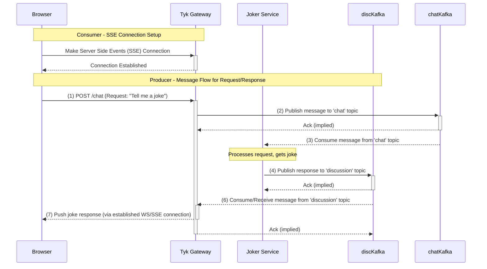
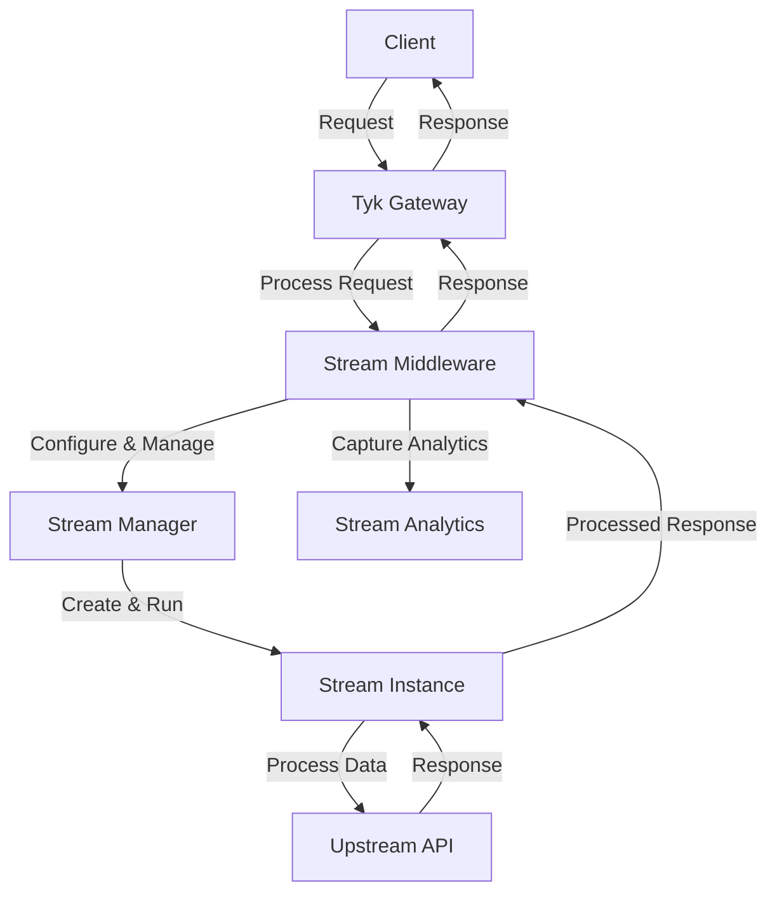
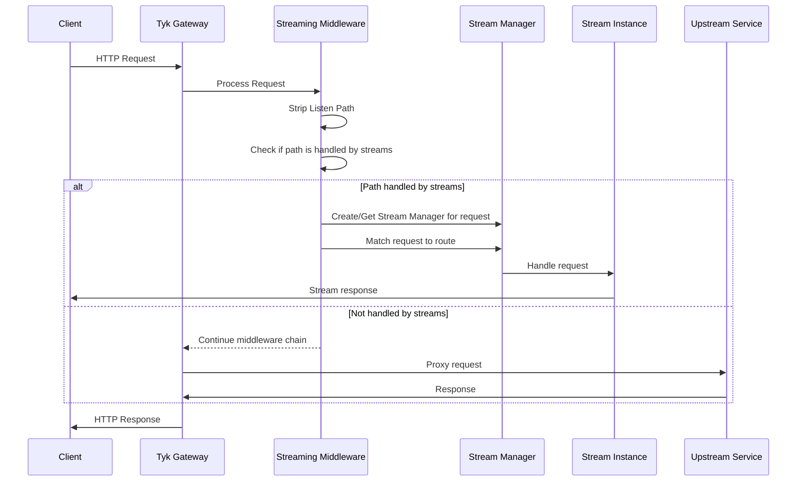

{/* ## TODO: Add availability */}

## Overview

*Tyk Streams* is a feature of the Tyk API management platform that enables organizations to securely expose,
manage and monetize real-time event streams and asynchronous APIs.

With *Tyk Streams*, you can easily connect to event brokers and streaming platforms, such as
[Apache Kafka](https://github.com/TykTechnologies/tyk-pro-docker-demo/tree/kafka), and expose them as
managed API endpoints for internal and external consumers.

<div style="display: flex; justify-content: center;">

</div>

The purpose of Tyk Streams is to provide a unified platform for managing both synchronous APIs (such as REST and
GraphQL) and asynchronous APIs, in addition to event-driven architectures. This allows organizations to leverage the
full potential of their event-driven systems while maintaining the same level of security, control and visibility they
expect from their API management solution.

### Why use Tyk Streams

Tyk Stream is a powerful stream processing engine integrated into the Tyk API Gateway, available as part of the Enterprise Edition. It allows you to manage asynchronous APIs and event streams as part of your API ecosystem. It provides a range of capabilities to support async API management, including:

- **Protocol Mediation**: Tyk Streams can mediate between different asynchronous protocols and API styles, such as WebSocket, Server-Sent Events (SSE), and Webhooks. This allows you to expose your event streams in a format compatible with your consumers' requirements.
- **Security**: Apply the same security policies and controls to your async APIs as you do to your synchronous APIs. This includes features like authentication and authorization.
- **Transformations**: Transform and enrich your event data on the fly using Tyk's powerful middleware and plugin system. This allows you to adapt your event streams to meet the needs of different consumers.
- **Analytics**: Monitor the usage and performance of your async APIs with detailed analytics and reporting. Gain insights into consumer behavior and system health.
- **Developer Portal**: Publish your async APIs to the Tyk Developer Portal, which provides a centralised catalog for discovery, documentation, and subscription management.

---
## Getting Started

This guide will help you implement your first event-driven API with Tyk in under 15 minutes. To illustrate the capabilities of Tyk Streams, let's consider an example: building a basic asynchronous chat application, nicknamed **Chat Jippity**. 

In this scenario, a user sends a message (e.g., asking for a joke) via a simple web interface and receives an asynchronous response generated by a backend service.

This application flow demonstrates two key patterns enabled by Tyk Streams: acting as an **API Producer Gateway** and an **API Consumer Gateway**.



Let's break down how Tyk Streams facilitates this, focusing on the distinct producer and consumer roles Tyk plays:

### Example Scenario

#### Tyk as an API Producer Gateway (Client to Stream)

*   **Goal:** Allow a client (like a browser or a script) to easily send a message into our asynchronous system without needing direct access or knowledge of the backend message broker (Kafka in this case).
*   **Scenario:** The user types "Tell me a joke" into the chat interface and hits send.
*   **Flow:**
    1.  The browser sends a standard HTTP `POST` request to an endpoint exposed by Tyk Gateway (e.g., `/chat`).
    2.  **Tyk Streams Role (Producer):** Tyk Gateway receives this `POST` request. An API definition configured with Tyk Streams defines this endpoint as an *input*. Tyk takes the request payload and *publishes* it as a message onto a designated backend topic (e.g., the `chat` topic in Kafka).
    3.  A backend service (our "Joker Service") listens to the `chat` topic for incoming requests.
*   **Value Demonstrated:**
    *   **Protocol Bridging:** Tyk translates a synchronous HTTP POST into an asynchronous Kafka message.
    *   **Decoupling:** The browser only needs to know the Tyk HTTP endpoint, not the Kafka details (brokers, topic name, protocol).
    *   **API Management:** Tyk can enforce authentication, rate limits, etc., on the `/chat` endpoint before the message even enters the Kafka system.

#### Tyk as an API Consumer Gateway (Stream to Client)

*   **Goal:** Deliver the asynchronous response (the joke) from the backend system to the client in real time.
*   **Scenario:** The "Joker Service" has processed the request and generated a joke. It needs to send this back to the originating user's browser session.
*   **Flow:**
    1.  The Joker Service *publishes* the joke response as a message onto a different backend topic (e.g., the `discussion` topic in Kafka).
    2.  **Tyk Streams Role (Consumer):** Tyk Gateway is configured via another (or the same) API definition to *subscribe* to the `discussion` topic.
    3.  When Tyk receives a message from the `discussion` topic, it *pushes* the message content (the joke) to the appropriate client(s) (provided they have already established a connection) using a suitable real-time protocol like Server-Sent Events (SSE) or WebSockets. 
    **Note:** In case of multiple clients, events would round-robin amongst the consumers.
    
*   **Value Demonstrated:**
    *   **Protocol Bridging:** Tyk translates Kafka messages into SSE messages suitable for web clients.
    *   **Decoupling:** The browser doesn't need a Kafka client; it uses standard web protocols (SSE/WS) provided by Tyk. The Joker Service only needs to publish to Kafka, unaware of the final client protocol.

The following sections will guide you through the prerequisites and steps to configure Tyk Gateway to implement this use case.

### Prerequisites

- **Docker**: We will run the entire Tyk Stack on Docker. For installation, refer to this [guide](https://docs.docker.com/desktop/setup/install/mac-install/).
- **Git**: A CLI tool to work with git repositories. For installation, refer to this [guide](https://git-scm.com/downloads)
- **Dashboard License**: We will configure Streams API using Dashboard. [Contact support](https://tyk.io/contact/) to obtain a license.
- **Curl and JQ**: These tools will be used for testing.

### Instructions

1. **Clone Git Repository:**

    The [tyk-demo](https://github.com/TykTechnologies/tyk-demo) repository offers a docker-compose environment you can run locally to explore Tyk streams. Open your terminal and clone the git repository using the command below.

    ```bash
    git clone https://github.com/TykTechnologies/tyk-demo
    cd tyk-demo
    ```

2. **Enable Tyk Streams:**

   By default, Tyk Streams is disabled. To enable Tyk Streams in the Gateway and Dashboard, you need to configure the following settings:

   Create an `.env` file and populate it with the values below:

   ```bash
   DASHBOARD_LICENCE=<your-dashboard-license>
   GATEWAY_IMAGE_REPO=tyk-gateway-ee
   TYK_DB_STREAMING_ENABLED=true
   TYK_GW_STREAMING_ENABLED=true
   ```

   - `DASHBOARD_LICENCE`: Add your license key. Contact [support](https://tyk.io/contact/) to obtain a license.
   - `GATEWAY_IMAGE_REPO`: Tyk Streams is available as part of the Enterprise Edition of the Gateway.
   - `TYK_DB_STREAMING_ENABLED` and `TYK_GW_STREAMING_ENABLED`: These must be set to `true` to enable Tyk Streams in the Dashboard and Gateway, respectively. Refer to the [configuration options](/tyk-oss-gateway/configuration#streaming) for more details.

3. **Start Tyk Streams**

    Execute the following command:
    ```bash
    ./up.sh
    ```

    

    <Note>
    This script also starts `Kafka` within a Docker container, which is necessary for this guide.
    </Note>


    This process will take a few minutes to complete and will display some credentials upon completion. Copy the Dashboard **username, password, and API key**, and save them for later use.
    ```
            ▾ Tyk Demo Organisation
                  Username : admin-user@example.org
                  Password : 3LEsHO1jv1dt9Xgf
          Dashboard API Key : 5ff97f66188e48646557ba7c25d8c601
    ```

4. **Verify Setup:**

    Open Tyk Dashboard in your browser by visiting [http://localhost:3000](http://localhost:3000) or [http://tyk-dashboard.localhost:3000](http://tyk-dashboard.localhost:3000) and login with the provided **admin** credentials.

5. **Create Producer API:**

    Create a file `producer.json` with the below content: (**Note:** `tyk-demo-kafka-1` is the hostname used to access Kafka running in a container; alternatively, you can use the IP address assigned to your computer.)

    

    <Expandable title={'Click to expand the API Definition'}>
    ```json
        {
            "components": {},
            "info": {
                "title": "jippity-chat",
                "version": "1.0.0"
            },
            "openapi": "3.0.3",
            "paths": {},
            "servers": [
                {
                    "url": "http://tyk-gateway.localhost:8080/jippity-chat/"
                }
            ],
            "x-tyk-api-gateway": {
                "info": {
                    "name": "jippity-chat",
                    "state": {
                        "active": true
                    }
                },
                "server": {
                    "listenPath": {
                        "value": "/jippity-chat/",
                        "strip": true
                    }
                },
                "upstream": {
                  "url": ""
                }
            },
            "x-tyk-streaming": {
                "streams": {
                    "default_stream": {
                        "input": {
                            "http_server": {
                                "address": "",
                                "allowed_verbs": [
                                    "POST"
                                ],
                                "path": "/chat",
                                "rate_limit": "",
                                "timeout": "5s"
                            },
                            "label": ""
                        },
                        "output": {
                            "kafka": {
                                "addresses": ["tyk-demo-kafka-1:9092"],
                                "max_in_flight": 10,
                                "topic": "chat"
                            },
                            "label": ""
                        }
                    }
                }
            }
        }
        ```
    </Expandable>


    
    Create the API by executing the following command. Be sure to replace `<your-api-key>` with the API key you saved earlier:

    ```bash
    curl -H "Authorization: <your-api-key>" -H "Content-Type: application/vnd.tyk.streams.oas" http://localhost:3000/api/apis/streams -d @producer.json
    ```

    You should expect a response similar to the one shown below, indicating success. Note that the Meta and ID values will be different each time:
    ```bash
    {"Status":"OK","Message":"API created","Meta":"67e54cadbfa2f900013b501c","ID":"3ddcc8e1b1534d1d4336dc6b64a0d22f"}
    ```

5. **Create Consumer API:**

    Create a file `consumer.json` with the below content: (**Note:** `tyk-demo-kafka-1` is the hostname used to access Kafka running in a container; alternatively, you can use the IP address assigned to your computer.)

    

    <Expandable title={'Click to expand the API Definition'}>
    ```json
        {
            "components": {},
            "info": {
                "title": "jippity-discuss",
                "version": "1.0.0"
            },
            "openapi": "3.0.3",
            "paths": {},
            "servers": [
                {
                    "url": "http://tyk-gateway.localhost:8080/jippity-discuss/"
                }
            ],
            "x-tyk-api-gateway": {
                "info": {
                    "name": "jippity-discuss",
                    "state": {
                        "active": true
                    }
                },
                "server": {
                    "listenPath": {
                        "value": "/jippity-discuss/",
                        "strip": true
                    }
                },
                "upstream": {
                  "url": ""
                }
            },
            "x-tyk-streaming": {
                "streams": {
                    "default_stream": {
                        "input": {
                            "kafka": {
                                "addresses": ["tyk-demo-kafka-1:9092"],
                                "auto_replay_nacks": true,
                                "checkpoint_limit": 1024,
                                "consumer_group": "tyk-streams",
                                "target_version": "3.3.0",
                                "topics": ["discussion"]
                            },
                            "label": ""
                        },
                        "output": {
                            "http_server": {
                                "address": "",
                                "allowed_verbs": [
                                    "GET"
                                ],
                                "stream_path": "/sse"
                            },
                            "label": ""
                        }
                    }
                }
            }
        }
        ```
    </Expandable>


    
    Create the API by executing the following command. Be sure to replace `<your-api-key>` with the API key you saved earlier:

    ```bash
    curl -H "Authorization: <your-api-key>" -H "Content-Type: application/vnd.tyk.streams.oas" http://localhost:3000/api/apis/streams -d @consumer.json
    ```

    You should expect a response similar to the one shown below, indicating success. Note that the Meta and ID values will be different each time:
    ```bash
    {"Status":"OK","Message":"API created","Meta":"67e54cadbfa2f900013b501c","ID":"3ddcc8e1b1534d1d4336dc6b64a0d22f"}
    ```

7. **Start Joker Service:**

    Create a file `joker-service.sh` with the below content:

    

    <Expandable title={'Click to expand Joker Service'}>
    ```bash
        #!/bin/bash

        # Container name
        CONTAINER="tyk-demo-kafka-1"

        # Kafka bootstrap server
        BOOTSTRAP_SERVER="localhost:9092"

        # Topics
        SOURCE_TOPIC="chat"
        TARGET_TOPIC="discussion"

        # Kafka consumer and producer commands
        CONSUMER_CMD="/opt/kafka/bin/kafka-console-consumer.sh --bootstrap-server $BOOTSTRAP_SERVER --topic $SOURCE_TOPIC"
        PRODUCER_CMD="/opt/kafka/bin/kafka-console-producer.sh --broker-list $BOOTSTRAP_SERVER --topic $TARGET_TOPIC"

        # Joke API URL
        JOKE_API="https://icanhazdadjoke.com/"

        echo "Starting to listen for messages on '$SOURCE_TOPIC'..."

        # Run the consumer in the container, pipe output to a while loop
        docker exec -i $CONTAINER bash -c "$CONSUMER_CMD" | while IFS= read -r message; do
            # Skip empty lines
            [ -z "$message" ] && continue

            echo "Received message from $SOURCE_TOPIC: $message"
        
            # Fetch a random joke from the API and extract it with jq
            joke=$(curl -s -H "Accept: application/json" "$JOKE_API" | jq .joke)
        
            # Check if joke was fetched successfully
            if [ -n "$joke" ]; then
                response_message="In response to '$message': Here's a dad joke - $joke"
            else
                response_message="In response to '$message': Couldn't fetch a joke, sorry!"
            fi
        
            # Send the response message to 'discussion' topic
            echo "$response_message" | docker exec -i $CONTAINER bash -c "$PRODUCER_CMD"
        
            echo "Posted to $TARGET_TOPIC: $response_message"
        done

        echo "Consumer stopped."
        ```
    </Expandable>


    Make the file executable and start the service.

    ```bash
    chmod +x joker-service.sh
    ./joker-service.sh
    ```

8. **Test the API:**

   Open a terminal and execute the following command to start listening for messages from the Consumer API you created:

   ```bash
   curl -N http://tyk-gateway.localhost:8080/jippity-discuss/sse
   ```

   In a second terminal, execute the command below to send a message to the Producer API. You can run this command multiple times and modify the message to send different messages:

   ```bash
   curl -X POST http://tyk-gateway.localhost:8080/jippity-chat/chat -H "Content-Type: text/plain" -d "Tell me a joke."
   ```

   Now, you will see the message appear in the terminal window where you are listening for messages.

**Wrapping Up:** And that’s it—you’ve just created an Async API with Tyk Streams! From here, you can tweak the configuration to suit your needs, [explore glossary](/#glossary), or explore more [advanced use cases](/#use-cases).

---
## How It Works

Tyk Streams seamlessly integrates with the Tyk API Gateway, extending its capabilities beyond traditional synchronous request/response patterns to natively support asynchronous APIs and event-driven architectures.

This section details the architecture, components, and request processing flow of Tyk Streams.

### High-Level Architecture

At a high level, Tyk Streams operates within the Tyk ecosystem, interacting with several key elements:

*   **Tyk API Gateway**: The core API management platform. It is the entry point, handling initial request processing (like authentication and rate limiting) and routing requests.
*   **Tyk Streams Module**: An integrated extension within the Gateway designed explicitly for asynchronous communication. It intercepts relevant requests and manages the streaming logic.
*   **Event Brokers / Sources**: External systems that act as the origin or destination for data streams. Examples include Apache Kafka, NATS, MQTT brokers, or WebSocket servers. Tyk Streams connects to these systems based on API configuration.
*   **Upstream Services / APIs**: The backend systems, microservices, or APIs that ultimately produce or consume the data being streamed or processed via Tyk Streams.

Think of the Tyk Gateway as the central dispatch for all API traffic. When traffic requires asynchronous handling (like pushing data to Kafka or subscribing to an MQTT topic), the integrated Tyk Streams module manages the interaction with the specific Event Broker and Upstream Service according to the API's configuration.

### Internal Components of Tyk Streams

To manage these asynchronous interactions, the Tyk Streams module relies on several internal components operating within the Gateway:

1.  **Stream Middleware**: This component plugs into the Tyk Gateway's request processing chain. It runs *after* standard middleware like authentication and rate limiting but *before* the request would normally be proxied. Its job is to inspect incoming requests, identify if they match a configured stream path, and if so, divert them from the standard proxy flow into the stream handling logic.
2.  **Stream Manager**: Acts as the supervisor for streaming operations defined in an API. A given stream configuration is responsible for initializing, managing the lifecycle (starting/stopping), and coordinating the necessary `Stream Instances`. It ensures the correct streaming infrastructure is ready based on the API definition.
3.  **Stream Instance**: Represents a running, active instance of a specific stream processing task. Each instance executes the logic defined in its configuration – connecting to an event broker, processing messages, transforming data, handling connections, etc. There can be multiple instances depending on the configuration and workload.
4.  **Stream Analytics**: This component captures telemetry data specific to stream operations, such as message throughput, connection counts, processing latency, and errors. This data can be exported to popular analytics platforms like Prometheus, OpenTelemetry, and StatsD.

The following diagram shows the relationships and primary interactions between these internal components and how they relate to the Gateway and Upstream API:



### Request Processing Flow

Understanding how these components work together is key. Here’s the typical flow when a request interacts with a Tyk Streams-enabled API endpoint:



1.  **Request Arrival & Gateway Pre-processing**: A client sends a request to an API endpoint managed by Tyk Gateway. The request passes through the initial middleware, such as authentication, key validation, and rate limiting.
2.  **Streaming Middleware Interception**: The request reaches the `Stream Middleware`. It checks the request path against the stream routes defined in the API configuration.
3.  **Path Matching**:
    *   **If No Match**: The request is not destined for a stream. The `Stream Middleware` does nothing, and the request continues down the standard Tyk middleware chain, typically being proxied to the configured upstream service.
    *   **If Match**: The request is intended for a stream. The `Stream Middleware` takes control of the request handling.
4.  **Stream Manager Coordination**: The middleware interacts with the `Stream Manager` associated with the API's stream configuration. The `Stream Manager` ensures the required `Stream Instance`(s) are initialized and running based on the loaded configuration. This might involve creating a new instance or reusing a cached one.
5.  **Stream Instance Execution**: The instance then executes its defined logic, interacting with the configured `Upstream Service / Event Broker` (e.g., publishing a message to Kafka, subscribing to an MQTT topic, forwarding data over a WebSocket).
6.  **Analytics Capture**: The `Stream Analytics` component captures relevant metrics throughout the stream handling process.
8.  **Final Gateway Response**: The response or data stream generated by the streaming components is relayed back through the Gateway to the originating client.

### Scaling and Availability

The beauty of Tyk Streams is that it’s baked into the Tyk Gateway, so it scales naturally as your API traffic ramps up—no extra setup or separate systems required. It’s efficient too, reusing the same resources as the Gateway to keep things lean.

---
## Configuration Options

Configuring Tyk Streams involves two distinct levels:

1.  **System-Level Configuration:** Enabling the Streams functionality globally within your Tyk Gateway and Tyk Dashboard instances. This activates the necessary components but doesn't define any specific streams.
2.  **API-Level Configuration:** Defining the actual stream behaviors (inputs, outputs, processing logic) within a specific Tyk OAS API Definition using the `x-tyk-streaming` extension. This is where you specify *how* data flows for a particular asynchronous API.

Let's look at each level in detail.

### System-Level Configuration

Before you can define streams in your APIs, you must enable the core Streams feature in both the Tyk Gateway and, if you're using it for management, the Tyk Dashboard.

#### Tyk Gateway

Enable the Streams processing engine within the Gateway by setting `enabled` to `true` in the `streaming` section of your `tyk.conf` file or via environment variables.

<Tabs>
<Tab title="Config File">
```json
{
// Partial config from tyk.conf
    "streaming": {
        "enabled": true // Required to activate Streams functionality
    },
// ... more config follows
}
```
</Tab>
<Tab title="Environment Variable">
```bash
export TYK_GW_STREAMING_ENABLED=true
```
</Tab>
</Tabs>

Refer to the [Tyk Gateway Configuration Reference](/tyk-oss-gateway/configuration#streamingenabled) for more details on this setting.

#### Tyk Dashboard

If you manage your APIs via the Tyk Dashboard, you must also enable Streams support within the Dashboard configuration (`tyk_analytics.conf`) to expose Streams-related UI elements and functionality.

<Tabs>
<Tab title="Config File">
```json
{
// Partial config from tyk_analytics.conf
    "streaming": {
        "enabled": true // Required to activate Streams functionality
    },
// ... more config follows
}
```
</Tab>
<Tab title="Environment Variable">
```bash
export TYK_DB_STREAMING_ENABLED=true
```
</Tab>
</Tabs>

Refer to the [Tyk Dashboard Configuration Reference](/tyk-dashboard/configuration#streamingenabled) for more details.

### API-Level Configuration

Once Streams is enabled at the system level, you define the specific behavior for each asynchronous API within its Tyk Open API Specification (OAS) definition. This is done using the `x-tyk-streaming` vendor extension.

The core structure under `x-tyk-streaming` is the `streams` object, which contains one or more named stream configurations. Each named stream defines:

*   **`input`**: Specifies how data enters this stream (e.g., via an HTTP request, by consuming from Kafka, connecting via WebSocket).
*   **`output`**: Specifies where the data goes after processing (e.g., published to Kafka, sent over WebSocket, delivered via webhook).

```json
{
// Partial config from Tyk OAS API Definition
    "x-tyk-streaming": {
        "streams": {
            "your_stream_name": { // A unique name for this stream configuration within the API
                "input": {
                    // Input configuration object - specifies the data source
                    // Example: "http_server": { ... } or "kafka": { ... }
                },
                "output": {
                    // Output configuration object - specifies the data destination
                    // Example: "kafka": { ... } or "websocket_server": { ... }
                }
                // Optional processing/transformation steps can also be defined here
            },
            "another_stream": { // You can define multiple independent streams
                "input": { ... },
                "output": { ... }
            }
        }
    },
// ... more config follows
}
```

**Available Input and Output Types:**

Tyk supports various connector types for both `input` and `output`. **The specific types available (like `http_server`, `kafka`, `http_client`, etc.) and their respective configuration parameters are detailed in the [Tyk Streams Configuration Reference](/api-management/stream-config).** Please consult this reference page for the full list of options and how to configure each one.

**Example Configuration:**

<Tabs>

<Tab title="Tyk OAS API Definition">
```json
{
// Partial config from Tyk OAS API Definition
    "x-tyk-streaming": {
        "streams": {
            "http_to_kafka_chat": {
                "input": {
                    "http_server": {
                        "path": "/chat",
                        "allowed_verbs": [ "POST" ],
                        
                    },
                    "label": "HTTP Chat Input"
                },
                "output": {
                    "kafka": {
                        "addresses": ["kafka-broker:9092"],
                        "topic": "chat",
                        
                    },
                    "label": "Kafka Chat Output"
                }
            }
        }
    },
// ... more config follows
}
```

For comprehensive details on all fields within `x-tyk-streaming`, see the [Tyk OAS Extension documentation](/api-management/gateway-config-tyk-oas#xtykstreaming).

</Tab>

<Tab title="Dashboard UI">

The Tyk Dashboard provides a wizard to create Streams APIs, which generates the underlying Tyk OAS configuration shown above.

1.  Navigate to **APIs > Add New API**.
2.  Select the **Streams** API type and give your API a name. Click **Configure API**.
    
3.  In the **API Designer**, under the **Streams** tab, configure your desired `Input` and `Output`. Select the types (e.g., HTTP Server for input, Kafka for output) and fill in the required parameters based on the [Streams Configuration Reference](/api-management/stream-config).
    
4.  Configure any other API settings (e.g., Authentication, Rate Limiting) as needed in the other tabs.
5.  **Save** the API. The Dashboard translates your UI configuration into the `x-tyk-streaming` JSON structure within the API definition. You can view the generated JSON in the **Advanced Options** tab under **API Definition**.

</Tab>

<Tab title="Tyk Classic API Definition">

Tyk Streams configuration (`x-tyk-streaming`) is **only supported** within **Tyk OAS API Definitions**. It is not available for legacy Tyk Classic API Definitions.

</Tab>

</Tabs>

### Supported Connectors and Protocols

Tyk Streams provides out-of-the-box connectors for popular event brokers and async protocols, including:

- [Apache Kafka](https://kafka.apache.org/documentation/)
- [WebSocket](https://websocket.org/guides/websocket-protocol/)
- [Server-Sent Events](https://en.wikipedia.org/wiki/Server-sent_events) (SSE)
- [Webhooks](https://en.wikipedia.org/wiki/Webhook)


---
## Use Cases

Tyk Streams brings full lifecycle API management to asynchronous APIs and event-driven architectures. It provides a
comprehensive set of capabilities to secure, transform, monitor and monetize your async APIs.

### Security

[Tyk Streams](/api-management/event-driven-apis#) supports all the authentication and authorization options available for traditional synchronous APIs. This
ensures that your async APIs are protected with the same level of security as your REST, GraphQL, and other API types. 

Refer this docs, to know more about [Authentication](/api-management/client-authentication) and [Authorization](/api-management/policies) in Tyk.

### Transformations and Enrichment

[Tyk Streams](/api-management/event-driven-apis#) allows you to transform and enrich the messages flowing through your async APIs. You can modify message payloads, filter events, combine data from multiple sources and more.

- **[Transformation](/api-management/traffic-transformation)**: Use Tyk's powerful middleware and plugin system to transform message payloads on the fly. You can convert between different data formats (e.g., JSON to XML), filter fields, or apply custom logic.
- **[Enrichment](/api-management/plugins/overview)**: Enrich your async API messages with additional data from external sources. For example, you can lookup customer information from a database and append it to the message payload.

### Analytics and Monitoring

Tyk provides comprehensive analytics and monitoring capabilities for async APIs. You can track usage metrics, monitor performance, and gain visibility into the health of your event-driven systems.
Tyk captures detailed analytics data for async API usage, including message rates, latency, and error counts. This data can be exported to popular analytics platforms like Prometheus, OpenTelemetry, and StatsD.

### Monetization

[Tyk Streams](/api-management/event-driven-apis#) enables you to monetize your async APIs by exposing them through the Developer Portal. Developers can discover, subscribe to and consume your async APIs using webhooks or streaming subscriptions.

- **Developer Portal Integration**: Async APIs can be published to the Tyk Developer Portal, allowing developers to browse, subscribe, and access documentation. Developers can manage their async API subscriptions just like traditional APIs.
- **Webhooks**: Tyk supports exposing async APIs as webhooks, enabling developers to receive event notifications via HTTP callbacks. Developers can configure their webhook endpoints and subscribe to specific events or topics.

### Complex Event Processing

Tyk Streams allows you to perform complex event processing on streams of events in real-time. You can define custom processing logic to:

- Filter events based on specific criteria
- Aggregate and correlate events from multiple streams
- Enrich events with additional data from other sources
- Detect patterns and sequences of events
- Trigger actions or notifications based on event conditions

Here's an example of a Tyk Streams configuration that performs complex event processing, specifically it creates a new event stream, which filters high-value orders and enriches them with customer email addresses, by making an additional HTTP request.
 
```yaml
input:
  kafka:
    addresses:
      - "localhost:9092" # Replace with actual Kafka broker addresses
    consumer_group: my-group
    topics:
      - orders
output:
  http_server:
    allowed_verbs:
      - GET
    path: /high-value-orders
pipeline:
  processors:
    - bloblang: |
        root = if this.order_value > 1000 {
          this
        } else {
          deleted()
        }
    - branch:
        processors:
          - http:
              headers:
                Content-Type: application/json
              url: http://customer-api.local/emails
              verb: POST
        request_map: |-
          root = {
            "customer_id": this.customer_id
          }
        result_map: root.customer_email = this.customer_email
    - bloblang: |
        root = this.merge({ "high_value_order": true })
```

In this example:

- **Tyk Streams Setup**: Consumes events from a Kafka topic called *orders*.
- **Processor Block Configuration**: Utilizes a custom Bloblang script that performs the following operations:
    - **Filters** orders, only processing those with a value greater than 1000.
    - **Enriches** the high-value orders by retrieving the customer ID and email from a separate data source.
    - **Adds** a new high_value_order flag to each qualifying event.
- **Output Handling**: Processed high-value order events are exposed via a WebSocket stream at the endpoint */high-value-orders*.

### Legacy Modernization

Tyk Streams can help you modernise legacy applications and systems by exposing their functionality as async APIs. This allows you to:
- Decouple legacy systems from modern consumers
- Enable real-time, event-driven communication with legacy apps
- Gradually migrate away from legacy infrastructure

Here's an example of exposing a legacy application as an async API using Tyk Streams:

```yaml
input:
  http_client:
    url: "http://legacy-app/orders"
    verb: GET
    rate_limit: "60s"
pipeline:
  processors:
    - bloblang: |
        root.order_id = this.id
        root.total = this.total
        root.timestamp = this.timestamp
output:
  kafka:
    addresses: ["localhost:9092"]
    topic: "orders"
```

In this configuration:
- Tyk Streams periodically polls the legacy */orders* REST endpoint every 60 seconds
- The *processor* transforms the legacy response format into a simplified event structure
- The transformed events are published to a Kafka topic called *orders*, which can be consumed by modern applications

### Async API Orchestration

Tyk Streams enables you to orchestrate multiple async APIs and services into composite event-driven flows. You can:
- Combine events from various streams and sources
- Implement complex routing and mediation logic between async APIs
- Create reactive flows triggered by event conditions
- Fanout events to multiple downstream consumers

Here's an example async API orchestration with Tyk Streams:

```yaml
input:
  broker:
    inputs:
      - kafka:
          addresses: ["localhost:9092"]
          topics: ["stream1"]
          consumer_group: "group1"
      - kafka:
          addresses: ["localhost:9092"]
          topics: ["stream2"]
          consumer_group: "group2"
pipeline:
  processors:
    - switch:
        cases:
          - check: 'meta("kafka_topic") == "stream1"'
            processors:
              - bloblang: |
                  root.type = "event_from_stream1"
                  root.details = this
              - branch:
                  processors:
                    - http:
                        url: "http://api1.example.com/process"
                        verb: POST
                        body: '${! json() }'
                  result_map: 'root.api1_response = this'
          - check: 'meta("kafka_topic") == "stream2"'
            processors:
              - bloblang: |
                  root.type = "event_from_stream2"
                  root.details = this
              - branch:
                  processors:
                    - http:
                        url: "http://api2.example.com/analyze"
                        verb: POST
                        body: '${! json() }'
                  result_map: 'root.api2_response = this'
    - bloblang: 'root = if this.type == "event_from_stream1" && this.api1_response.status == "ok" { this } else if this.type == "event_from_stream2" && this.api2_response.status == "ok" { this } else { deleted() }'
output:
  broker:
    pattern: "fan_out"
    outputs:
      - kafka:
          addresses: ["localhost:9092"]
          topic: "processed_stream1"
          client_id: "tyk_fanout1"
      - kafka:
          addresses: ["localhost:9092"]
          topic: "processed_stream2"
          client_id: "tyk_fanout2"
      - http_client:
          url: "https://webhook.site/unique-id"
          verb: POST
          body: '${! json() }'
```

1. **Input Configuration**
    - Uses a broker to combine events from two different Kafka topics, stream1 and stream2, allowing for the integration of events from various streams.
2. **Complex Routing and Processing**
    - A switch processor directs messages based on their origin (differentiated by Kafka topic metadata).
    - Each stream’s messages are processed and conditionally sent to different APIs.
    - Responses from these APIs are captured and used to decide on message processing further.
3. **Reactive Flows**
    - Conditions based on API responses determine if messages are forwarded or discarded, creating a flow reactive to the content and success of API interactions.
    - Fanout to Multiple Consumers:
    - The broker output with a fan-out pattern sends processed messages to multiple destinations: two different Kafka topics and an HTTP endpoint, demonstrating the capability to distribute events to various downstream consumers.

These are just a few examples of the advanced async API scenarios made possible with Tyk Streams. The platform provides a flexible and extensible framework to design, deploy and manage sophisticated event-driven architectures.

### Monetize APIs using Developer Portal

Tyk Streams seamlessly integrates with the Tyk Developer Portal, enabling developers to easily discover, subscribe to, and consume async APIs and event streams. This section covers how to publish async APIs to the developer portal, provide documentation, and enable developers to subscribe to events and streams.


#### Publishing Async APIs to the Developer Portal

Publishing async APIs to the Tyk Developer Portal follows a similar process to publishing traditional synchronous APIs. API publishers can create API products that include async APIs and make them available to developers through the portal.

To publish an async API:
- In the Tyk Dashboard, create a new API and define the async API endpoints and configuration.
- Associate the async API with an API product.
- Publish the API product to the Developer Portal.
- Copy code

{/* [Placeholder for screenshot or GIF demonstrating the process of publishing an async API to the Developer Portal] */}


#### Async API Documentation

Providing clear and comprehensive documentation is crucial for developers to understand and effectively use async APIs. While Tyk Streams does not currently support the AsyncAPI specification format, it allows API publishers to include detailed documentation for each async API.

When publishing an async API to the Developer Portal, consider including the following information in the documentation:
- Overview and purpose of the async API
- Supported protocols and endpoints (e.g., WebSocket, Webhook)
- Event types and payloads
- Subscription and connection details
- Example code snippets for consuming the async API
- Error handling and troubleshooting guidelines

{/* [Placeholder for screenshot showcasing async API documentation in the Developer Portal] */}


#### Enabling Developers to Subscribe to Events and Streams

Tyk Streams provides a seamless way for developers to subscribe to events and streams directly from the Developer Portal. API publishers can enable webhook subscriptions for specific API products, allowing developers to receive real-time updates and notifications.
To enable webhook subscriptions for an API product:
1. In the Tyk Developer Portal, navigate to the API product settings.
2. Enable the "Webhooks" option and specify the available events for subscription.
3. Save the API product settings.


{/* [Placeholder for screenshot showing the API product settings with webhook configuration] */}

Once webhook subscriptions are enabled, developers can subscribe to events and streams by following these steps:
- In the Developer Portal, navigate to the My Apps page.
- Select the desired app.
- In the "Webhooks" section, click on "Subscribe".
- Provide the necessary details:
    - *Webhook URL*: The URL where the event notifications will be sent.
    - *HMAC Secret*: Provide a secret key used to sign the webhook messages for authentication.
    - *Events*: Select the specific events to subscribe to.
- Save the subscription settings.
- Copy code
{/* [Placeholder for screenshot illustrating the developer's view of subscribing to webhooks] */}


To configure the async API stream for webhook subscriptions, use the following output configuration in your API definition:

```yaml
outputs:
  - portal_webhook:
      event_type: bar
      portal_url: http://localhost:3001
      secret: <portal-api-secret>
```

Replace *`<portal-api-secret>`* with the secret key for signing the webhook messages.

Enabling webhook subscriptions allows developers to easily integrate real-time updates and notifications from async APIs into their applications, enhancing the overall developer experience and facilitating seamless communication between systems.
{/* [Placeholder for a diagram illustrating the flow of webhook subscriptions and event notifications] */}

With Tyk Streams and the Developer Portal integration, API publishers can effectively manage and expose async APIs, while developers can discover, subscribe to, and consume event streams effortlessly, enabling powerful real-time functionality in their applications.


---
## Glossary

### Event

An event represents a significant change or occurrence within a system, such as a user action, a sensor reading, or a data update. Events are typically lightweight and contain minimal data, often just a unique identifier and a timestamp.

### Stream

A stream is a continuous flow of events ordered by time. Streams allow for efficient, real-time processing and distribution of events to multiple consumers.

### Publisher (or Producer)

A publisher is an application or system that generates events and sends them to a broker or event store for distribution to interested parties.

### Subscriber (or Consumer)

A subscriber is an application or system that expresses interest in receiving events from one or more streams. Subscribers can process events in real-time or store them for later consumption.

### Broker

A broker is an intermediary system that receives events from publishers, stores them, and forwards them to subscribers. Brokers decouple publishers from subscribers, allowing for scalable and flexible event-driven architectures.

### Topic (or Channel)

A topic is a named destination within a broker where events are published. Subscribers can subscribe to specific topics to receive relevant events.

---
## FAQ

<AccordionGroup>
<Accordion title={'What is Tyk Streams and what problem does it solve?'}>
Tyk Streams is an extension to the Tyk API Gateway that supports asynchronous APIs and event-driven architectures. It solves the challenge of managing both synchronous and asynchronous APIs in a unified platform, allowing organizations to handle real-time event streams alongside traditional REST APIs.
</Accordion>

<Accordion title={'Which event brokers and protocols does Tyk Streams support?'}>
Refer this [documentation](/#supported-connectors-and-protocols).
</Accordion>

<Accordion title={'How can I enable Tyk Streams on Tyk Cloud?'}>
Currently, Tyk Streams is only available for hybrid customers on Tyk Cloud. To enable it, [contact support](https://tyk.io/contact/).
</Accordion>

<Accordion title={'Can I publish Tyk Streams APIs to the Developer Portal?'}>
Yes, as of Tyk v5.7.0, you can publish Tyk Streams APIs to the Tyk Developer Portal. The process is similar to publishing traditional APIs: create a Tyk Streams API, create a Policy to protect it, and publish it to the Developer Portal Catalog.
</Accordion>

<Accordion title={'What deployment considerations should I keep in mind for Tyk Streams?'}>
Tyk Streams is embedded within the Tyk Gateway and scales with your existing Tyk infrastructure. No additional infrastructure is required.
</Accordion>

<Accordion title={'Is Tyk Streams available in all Tyk editions?'}>
Tyk Streams is available exclusively in the `enterprise` edition. Currently, it is only accessible for hybrid customers using Tyk Cloud. Please refer to the latest documentation or reach out to [Tyk support](https://tyk.io/contact/) for specific availability in your edition.
</Accordion>
</AccordionGroup>
