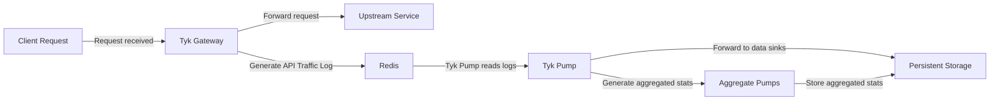

A log is a timestamped text record, either structured (recommended) or unstructured, with some metadata.

Tyk logs are written to `stderr` and `stdout`. In a typical installation, these will be handled or redirected by the service manager running the process, and depending on the Linux distribution, will either be output to `/var/log/` or `/var/log/upstart`.

## Types of Logs

Tyk Gateway generates two types of logs:

- **Application Logs:** Captures internal events of the system, such as health-checks, status, configuration changes, and errors, which are typically used for monitoring and debugging.
- **Access Logs:** Traditional server logs that record basic information about each request to your API Gateway.
- **API Traffic Logs:** API Traffic logs (also called Analytics logs) are comprehensive records of all API requests processed by your Tyk Gateway. They capture detailed information about each request and response for analysis and reporting purposes.

## Configuring Logs

You can configure log verbosity and format for the following Tyk components:

### Log Verbosity

Tyk can generate application logs at four levels of verbosity:
- `error` is the most minimal level of logging, reporting only errors
- `warn` will log warnings and errors
- `info` logs errors, warnings and some additional information and is the default logging level
- `debug` generates a high volume of logs for maximum visibility of what Tyk is doing when you need to debug an issue

<Note>
Debug log level generates a significant amount of data and is not recommended unless debugging.
</Note>

You can set the logging verbosity for each Tyk Component using the appropriate `log_level` setting in its configuration file (or the equivalent environment variable).

| Tyk component  | Config option | Environment variable | Default value if unset   |
| :---------------- | :--------------- | :---------------------- | :-------------------------- |
| Tyk Dashboard | Not Available  | Not Available       | `info`                   |
| [Tyk Gateway](/tyk-oss-gateway/configuration#log_level)   | `log_level`   | `TYK_GW_LOGLEVEL`    | `info`                   |
| [Tyk Pump](/tyk-pump/tyk-pump-configuration/tyk-pump-environment-variables#log_level)     | `log_level`   | `TYK_PMP_LOGLEVEL`   | `info`                   |
| [Tyk MDCB](/tyk-multi-data-centre/mdcb-configuration-options#log_level)      | `log_level`   | `TYK_MDCB_LOGLEVEL`  | `info`                   |
| [Tyk Developer Portal](/product-stack/tyk-enterprise-developer-portal/deploy/configuration#portal_log_level) | `logLevel`  | `PORTAL_LOG_LEVEL`   | `info`   |

### Log Format

You can configure the format in which logs will be generated; it can be either `text` (default) or `json`.

<Tip>
As a general performance tip, the `json` output format incurs less memory allocation overhead than the `text` format. For optimal performance, it's recommended to configure logging in the JSON format.
</Tip>

<Tabs>
<Tab title="Text Format">

```
time="Sep 05 09:04:12" level=info msg="Tyk API Gateway v5.6.0" prefix=main
```

</Tab>
<Tab title="JSON Format">

```json
{"level":"info","msg":"Tyk API Gateway v5.6.0","prefix":"main","time":"2024-09-05T09:01:23-04:00"}
```

</Tab>
</Tabs>

| Tyk component          | Config option  | Environment variable   | Default value if unset |
| :--------------------- | :------------- | :--------------------- | :--------------------- |
| Tyk Gateway (from `v5.6.0`) | log_format   | TYK_GW_LOGFORMAT     | text                 |
| Tyk Pump               | log_format   | TYK_PMP_LOG_FORMAT   | text                 |
| Tyk Dashboard (System) | log_format   | TYK_DB_LOGFORMAT     | text                 |
| Tyk Dashboard (Audit)  | audit.format | TYK_DB_AUDIT_FORMAT  | text                 |
| Tyk MDCB               | Not Available  | Not Available          | text             |
| Tyk Developer Portal   | LogFormat    | PORTAL_LOG_FORMAT     | prod (equivalent to json)   |

## Access Logs

<Badge color="orange">Gateway Only</Badge>

Access logs are simple, traditional server logs that record basic information about each request to your API Gateway and are written directly to stdout/stderr.

As of Tyk Gateway v5.8.0, you can configure the Gateway to log individual API requests. To enable this feature, set the `TYK_GW_ACCESSLOGS_ENABLED` environment variable to `true`.

You can also configure which fields are logged by configuring the `TYK_GW_ANALYTICSLOGS_TEMPLATE` environment variable. Below are the available values you can include:

### Configurable Fields

<ParamField path="api_key">
  Obfuscated or hashed API key used in the request.
</ParamField>

<ParamField path="client_ip">
  IP address of the client making the request.
</ParamField>

<ParamField path="host">
  Hostname of the request.
</ParamField>

<ParamField path="method">
  HTTP method used in the request (for example, GET or POST).
</ParamField>

<ParamField path="path">
  URL path of the request.
</ParamField>

<ParamField path="protocol">
  Protocol used in the request (for example, HTTP/1.1).
</ParamField>

<ParamField path="remote_addr">
  Remote address of the client.
</ParamField>

<ParamField path="upstream_addr">
  Full upstream address, including scheme, host, and path.
</ParamField>

<ParamField path="upstream_latency">
  Round-trip duration between the gateway sending the request to the upstream service and receiving the response.
</ParamField>

<ParamField path="latency_total">
  Total time taken to process the request, including upstream latency and additional gateway processing.
</ParamField>

<ParamField path="user_agent">
  User agent string provided by the client.
</ParamField>

<ParamField path="status">
  HTTP response status code.
</ParamField>

#### Default Template Example

<Tabs>
<Tab title="Configuration File">


Configuration using `tyk.conf`

```json
{
    "access_logs": {
        "enabled": true
    }
}
```

</Tab>
<Tab title="Environment Variables">


Configuration using environment variables:

```
TYK_GW_ACCESSLOGS_ENABLED=true
```

</Tab>
</Tabs>

Output:

```
time="Jan 29 08:27:09" level=info api_id=b1a41c9a89984ffd7bb7d4e3c6844ded api_key=00000000 api_name=httpbin client_ip="::1" host="localhost:8080" latency_total=62 method=GET org_id=678e6771247d80fd2c435bf3 path=/get prefix=access-log protocol=HTTP/1.1 remote_addr="[::1]:63251" status=200 upstream_addr="http://httpbin.org/get" upstream_latency=61 user_agent=PostmanRuntime/7.43.0
```

#### Custom Template Example

<Tabs>
<Tab title="Configuration File">

Configuration using `tyk.conf`

```json
{
    "access_logs": {
        "enabled": true,
        "template": [
            "api_key",
            "remote_addr",
            "upstream_addr"
        ]
    }
}
```
</Tab>

<Tab title="Environment Variables">

Configuration using environment variables:

```
TYK_GW_ACCESSLOGS_ENABLED=true
TYK_GW_ACCESSLOGS_TEMPLATE="api_key,remote_addr,upstream_addr"
```
</Tab>
</Tabs>

Output:

```
time="Jan 29 08:27:48" level=info api_id=b1a41c9a89984ffd7bb7d4e3c6844ded api_key=00000000 api_name=httpbin org_id=678e6771247d80fd2c435bf3 prefix=access-log remote_addr="[::1]:63270" upstream_addr="http://httpbin.org/get"
```

#### Performance Considerations

Enabling access logs introduces some performance overhead:

- **Latency:** Increases consistently by approximately 4%–13%, depending on CPU allocation and configuration.
- **Memory Usage:** Memory consumption increases by approximately 6%–7%.
- **Allocations:** The number of memory allocations increases by approximately 5%–6%.

<Note>
While the overhead of enabling access logs is noticeable, the impact is relatively modest. These findings suggest the performance trade-off may be acceptable depending on the criticality of logging to your application.
</Note>

### Configure track_404_logs

The [track_404_logs](/tyk-oss-gateway/configuration#track_404_logs) is a configuration in Tyk Gateway. When you set it to `true`, the gateway will log all incoming HTTP requests that result in a 404 `Not Found` error because they don't match any of your configured API listen paths.

Before this, the gateway would silently drop these requests, making it difficult to troubleshoot misconfigured clients or detect potential security probes.

## API Traffic Logs

<Badge color="orange">Gateway Only</Badge>

API Traffic logs (also called Traffic Analytics) are comprehensive records of all API requests processed by Tyk Gateway. They capture detailed information about each request and response for analysis and reporting purposes.

<Note>
API Traffic logs are not written to stdout/stderr, unlike application and access logs. Instead, they are stored in Redis, then processed and forwarded by Tyk Pump to configured data sinks, such as databases or other external tools.
</Note>

### How API Traffic Logging Works



When a client makes a request to the Tyk Gateway, the details of the request and response are captured and stored in Redis.

Tyk Pump reads the API traffic records from Redis every 10 seconds and then flushes them after processing. It processes the records and forwards them to the configured data sinks, such as databases or other external tools.

You can configure multiple pumps to send different types of data to different sinks. This setup allows you to route raw or processed analytics data wherever you need it.

The Mongo Aggregate Pump and SQL Aggregate Pump aggregate raw analytics records before storing the summarized statistics in MongoDB or SQL databases. When you use Tyk Dashboard, the [Aggregate Pump](/api-management/tyk-pump#tyk-dashboard) collates this aggregated data and displays it in the [analytics UI](/api-management/dashboard-configuration#traffic-analytics).

### Configure API Traffic Logs

You can enable API traffic logging at the Gateway level by setting the [`enable_analytics`](/tyk-oss-gateway/configuration#enable-analytics) field in the configuration file or by defining the equivalent environment variable, `TYK_GW_ENABLEANALYTICS`.

To prevent transaction records from being generated for specific endpoints, enable the [do-not-track middleware](/api-management/traffic-transformation/do-not-track) on those endpoints. This approach gives you fine-grained control over request tracking.

For a complete list of analytics configuration options available in the Gateway, refer to the [analytics configuration reference documentation](/tyk-oss-gateway/configuration#analytics-config).

<Note>
To use analytics in the Tyk Dashboard, configure both per-request and aggregated pumps for your chosen database platform. For step-by-step guidance, see the [Setup Dashboard Analytics](/tyk-oss-gateway/configuration#analytics-config) section.
</Note>
### Configure Detailed Recording

By default, the Tyk Gateway does **not** include request and response payloads in API traffic logs. This behavior keeps log records small and reduces the risk of capturing sensitive data.

You can configure Tyk Gateway to capture request and response payloads in the API traffic log when required. Tyk refers to this capability as **detailed recording**. 

You can enable it at different levels of granularity, following this order of precedence:

1. [API level](/api-management/logs-metrics#configure-at-api-level)
2. [Key level](/api-management/logs-metrics#configure-at-key-level)
3. [Gateway level](/api-management/logs-metrics#configure-at-gateway-level)

<Note>
- Be aware that enabling detailed recording increases the size of the records and will require more storage space, as Tyk will store the entire request and response in wire format.
- Tyk Cloud users can enable detailed recording per-API following the instructions on this page or, if required at the Gateway level, via a support request. The traffic logs are subject to the subscription's storage quota, so we recommend enabling detailed logging only if necessary to avoid unnecessary costs.
</Note>

<Tabs>
<Tab title="API Level">

You can enable detailed recording for an individual API by setting the [server.detailedActivityLogs.enabled](/api-management/gateway-config-tyk-oas#detailedactivitylogs) flag within the Tyk Vendor Extension.

In the Dashboard UI, you can configure detailed recording using the **Enable Detailed Activity Logs** option in the API Designer.


**Tyk Classic APIs**

When working with Tyk Classic APIs, you should configure the equivalent `enable_detailed_recording` flag in the root of the API definition.

In the Tyk Classic API Designer, the **Enable Detailed Logging** option can be found in **Core Settings**.


When using Tyk Operator with Tyk Classic APIs, you can enable detailed recording by setting `spec.enable_detailed_recording` to `true`, as in this example:

```yaml {linenos=true, linenostart=1, hl_lines=["10-10"]}
apiVersion: tyk.tyk.io/v1alpha1
kind: ApiDefinition
metadata:
  name: httpbin
spec:
  name: httpbin
  use_keyless: true
  protocol: http
  active: true
  enable_detailed_recording: true
  proxy:
    target_url: http://httpbin.org
    listen_path: /httpbin
    strip_listen_path: true
```

</Tab>

<Tab title="Key Level">

An alternative approach to controlling detailed recording is to enable it only for specific [access keys](/api-management/policies#what-is-a-session-object). This is particularly useful for debugging purposes, where you can configure detailed recording only for the key(s) that are reporting issues.

You can enable detailed recording for a key simply by adding the following to the root of the key's JSON file:

```
"enable_detailed_recording": true
```


<Note>
This will enable detailed recording only for API transactions that include this key in their requests.
</Note>

</Tab>

<Tab title="Gateway Level">

Detailed recording can be configured at the Gateway level, affecting all APIs deployed on the Gateway, by enabling the [detailed recording](/tyk-oss-gateway/configuration#analytics_configenable_detailed_recording) option in `tyk.conf`.

```.json
{
    "enable_analytics": true,
    "analytics_config": {
        "enable_detailed_recording": true
    }
}
```


</Tab>

</Tabs>

### Aggregated Analytics

The traffic logs generated by the Tyk Gateway are stored in the local [Redis](/api-management/logs-metrics#how-api-traffic-logging-works) temporal storage. They must be transferred to a persistent data store (such as MongoDB or PostgreSQL) for use by analytics tools, typically using Tyk Pump. Tyk Pump can also generate aggregated statistics from these data using the dedicated [Mongo Aggregate](/api-management/tyk-pump#mongodb) and [SQL Aggregate](/api-management/tyk-pump#sql) pumps. These offload processing from the Tyk Dashboard and reduce storage requirements compared to storing all raw logs.

The aggregate pumps calculate statistics from the analytics records, aggregated by hour, for the following keys in the traffic logs:

| Key            |  Analytics aggregated by         | Dashboard screen                                            |
| :---------------- | :---------------------------------- | :------------------------------------------------------------- |
| `APIID`        | API proxy                        | [Activity by API](/api-management/dashboard-configuration#activity-by-api)           |
| `TrackPath`    | API endpoint                     | [Activity by endpoint](/api-management/dashboard-configuration#activity-by-endpoint) |
| `ResponseCode` | HTTP status code (success/error) | [Activity by errors](/api-management/dashboard-configuration#activity-by-error)      |
| `APIVersion`   | API version                      | n/a                                                         |
| `APIKey`       | Client access key/token          | [Activity by Key](/api-management/dashboard-configuration#activity-by-key)           |
| `OauthID`      | OAuth client (if OAuth used)     | [Traffic per OAuth Client](/api-management/dashboard-configuration#activity-by-oauth-client) |
| `Geo`          | Geographic location of client    | [Activity by location](/api-management/dashboard-configuration#activity-by-location) |

#### Custom Aggregation Keys

Whereas Tyk Pump will automatically produce aggregated statistics for the keys in the previous section, you can also define custom aggregation keys using Tyk's custom analytics tag feature, which identifies specific HTTP request headers to be used as aggregation keys. This has various uses, for example

- You need to record additional information from the request into the analytics but want to avoid [detailed logging](/api-management/logs-metrics#capturing-detailed-logs) due to the volume of traffic logs. 
- You wish to track a group of API requests, for example:
  - Show me all API requests where `tenant-id=123`
  - Show me all API requests where `user-group=abc`

The Traffic Log middleware is applied to all endpoints in the API and so configuration is found in the `middleware.global` section of the Tyk Vendor Extension, within the `trafficLogs` section. Custom aggregation tags are specified as a list of HTTP headers in [middleware.global.trafficLogs.tagHeaders](/api-management/gateway-config-tyk-oas#trafficlogs) that Tyk should use for generation of custom aggregation tags for the API.

For example if we include the header name `x-user-id` in the list of headers, then Tyk will create an aggregation key for each different value observed in that header. These aggregation keys will be given the name `<header_name>-<header_value>`, for example `x-user-id-1234` if the request contains the HTTP header `"x-user-id":1234`.

**Tyk Classic APIs**

If you are using Tyk Classic APIs, then the equivalent field in the API definition is [tag_headers](/api-management/gateway-config-tyk-classic#traffic-logs).

In the Tyk Classic API Designer, the **Tag Headers** option can be found in **Advanced Options**.


When using Tyk Operator with Tyk Classic APIs, you can configure custom analytics tags by setting `spec.tag_headers` to `true`, as in this example:

```yaml {linenos=true, linenostart=1, hl_lines=["10-12"]}
apiVersion: tyk.tyk.io/v1alpha1
kind: ApiDefinition
metadata:
  name: httpbin-tag-headers
spec:
  name: httpbin-tag-headers
  use_keyless: true
  protocol: http
  active: true
  tag_headers:
  - Host
  - User-Agent
  proxy:
    target_url: http://httpbin.org
    listen_path: /httpbin-tag-headers
    strip_listen_path: true
```

In this example we can see that the `Host` and `User-Agent` headers exist within the `tag_headers` array. For each incoming request, Tyk will add `host-<header_value>` and `user-agent-<header_value>` tags to the traffic log.

**Suppressing generation of aggregates for custom keys**

If you don't want or need aggregated analytics for the headers you record with `tagHeaders`, you can configure Tyk Pump (or Tyk MDCB if it is performing the pump functionality) to discard those statistics when writing to the persistent analytics store.

For both cases, you add the tags you want to ignore, or their prefixes, to the `ignore_tag_prefix_list` field in the appropriate configuration file or environment variable:

- [Hybrid Pump config](/tyk-pump/tyk-pump-configuration/tyk-pump-environment-variables#pumpshybridmetaignore_tag_prefix_list)
- [Mongo Pump config](/tyk-pump/tyk-pump-configuration/tyk-pump-environment-variables#pumpsmongoaggregatemetaignore_tag_prefix_list)
- [Splunk Pump config](/tyk-pump/tyk-pump-configuration/tyk-pump-environment-variables#pumpssplunkmetaignore_tag_prefix_list)
- [SQL Pump config](/tyk-pump/tyk-pump-configuration/tyk-pump-environment-variables#pumpssqlaggregatemetaignore_tag_prefix_list)
- [MDCB config](/tyk-multi-data-centre/mdcb-configuration-options#ignore_tag_prefix_list)

<Note>
If you add headers to the tags list that are unique to each request, such as a timestamp or unique request Id, then Tyk Gateway will essentially create an aggregation point _per request_ and the number of these tags in an hour will be equal to the number of requests. Since there's no real value in aggregating something that has a total of one, we recommend that you add such headers to the ignore list.
</Note>

## Register Custom Log Handlers

[Custom logging event handlers](/api-management/gateway-events#logging-api-events) can be registered against **Gateway events** to customise the logs that are generated for those events.

## Exporting Logs

<Badge color="orange">Gateway Only</Badge>

Tyk Gateway can be configured to send log data to a range of 3rd party tools for aggregation and analysis.

<Tabs>
<Tab title="Sentry">

To enable Sentry as a log aggregator, update these settings in both your `tyk.conf` and your `tyk_analytics.conf`:

*   `use_sentry`: Set this to `true` to enable the Sentry logger, you must specify a Sentry DSN under `sentry_code`.

*   `sentry_code`: The Sentry-assigned DSN (a kind of URL endpoint) that Tyk can send log data to.

</Tab>

<Tab title="Logstash">

To enable Logstash as a log aggregator, update these settings in your `tyk.conf`:

*   `use_logstash`: Set this to `true` to enable the Logstash logger.

*   `logstash_transport`: The Logstash transport to use, should be `"tcp"`.

*   `logstash_network_addr`: Set to the Logstash client network address, should be in the form of `hostname:port`.

</Tab>

<Tab title="Graylog">


To enable Graylog as a log aggregator, update these settings in your `tyk.conf`:

*   `use_graylog`: Set this to `true` to enable the Graylog logger.

*   `graylog_network_addr`: The Graylog client address in the form of `<graylog_ip>:<graylog_port>`.

</Tab>

<Tab title="Syslog">

To enable Syslog as a log aggregator, update these settings in your `tyk.conf`:

*   `use_syslog`: Set this to `true` to enable the Syslog logger.

*   `syslog_transport`: The Syslog transport to use, should be `"udp"` or empty.

*   `syslog_network_addr`: Set to the Syslog client network address, should be in the form of `hostname:port`

</Tab>
</Tabs>