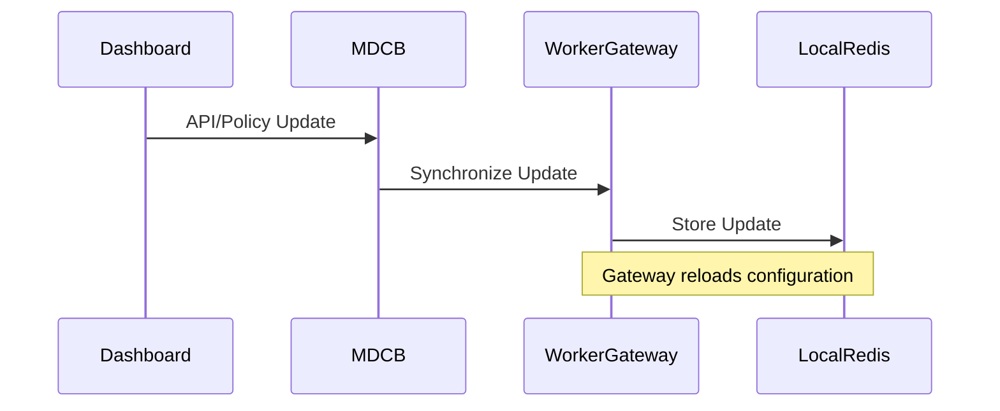

# MDCB Architecture: Tyk's Distributed Deployment Model

Tyk Multi Data Center Bridge (MDCB) enables distributed API management by separating your deployment into a central control plane and multiple data planes. This architecture allows you to deploy gateways closer to your users while maintaining centralized management.

## Architectural Overview

[Diagram showing the complete MDCB architecture with control plane and data planes]

MDCB creates a distributed architecture with two main components:

- **Control Plane**: Central management environment where APIs and policies are defined
- **Data Planes**: Edge environments where API traffic is processed

This separation provides geographic distribution, data residency compliance, and improved performance for global deployments.

## Control Plane Components

The control plane is the central management environment containing:

- **Tyk Dashboard**: The management UI and API for configuring APIs, policies, and analytics
- **Control Plane Gateway**: A standard Tyk Gateway that serves the Dashboard API and processes local API requests
- **MDCB Service**: The synchronization service that communicates with data planes
- **Redis**: Stores API definitions, policies, and keys for the control plane
- **MongoDB/PostgreSQL**: Stores Dashboard configurations, analytics, and user data

## Data Plane Components

Each data plane operates semi-independently and contains:

- **Worker Gateways**: Tyk Gateways configured to connect to the MDCB service
- **Local Redis**: Stores API definitions, policies, and keys for the data plane
- **Optional Pump**: Processes analytics data locally or forwards it to the control plane

Data planes can continue to operate even if the connection to the control plane is temporarily lost.

## Synchronization Mechanism

MDCB synchronizes configurations from the control plane to data planes through:

- **RPC Protocol**: Secure communication channel between MDCB and worker gateways
- **Resource Synchronization**: API definitions, policies, keys, and certificates are synchronized to data planes
- **Synchronizer Feature**: Ensures data planes have the latest configurations
- **Conflict Resolution**: Handles updates when data planes reconnect after disconnection

## Security Implementation

Security is implemented at multiple levels:

-   **Authentication**: Worker gateways authenticate to MDCB using organization-level API keys
-   **TLS**: All communication between control plane and data planes is encrypted
-   **Access Control**: Data planes only receive configurations relevant to their group
-   **Isolation**: Each data plane operates in its own security boundary

## Common Deployment Patterns

### Hub and Spoke Pattern

[Diagram of hub and spoke deployment]

-   Central control plane with multiple data planes
-   All management through the central Dashboard
-   Ideal for organizations with a central IT team and distributed operations

### Regional Control Planes

[Diagram of regional control planes]

-   Multiple control planes for different regions
-   Limited or no synchronization between control planes
-   Ideal for organizations with strong regional autonomy or compliance requirements

## Implementation Example: Global Financial Services API Platform

This example demonstrates how a financial services company implemented MDCB to:

-   Meet data residency requirements in EU, US, and APAC regions
-   Minimize latency for trading APIs
-   Maintain centralized governance and security policies

[Detailed diagram of the implementation with specific configuration details]

Key implementation decisions:

1.  Control plane located in primary data center
2.  Data planes in 5 geographic regions
3.  Local Redis clusters for high availability
4.  Regional Pumps for analytics aggregation
5.  Group-based API segmentation for regional differences

## Next Steps

-   [Global Deployment Strategies](http://localhost:8484/api-management/managing-deployments/distributed-deployments/global-deployments)
-   [Data Residency & Sovereignty](http://localhost:8484/api-management/managing-deployments/distributed-deployments/data-residency)
-   [Troubleshooting Distributed Deployments](http://localhost:8484/api-management/managing-deployments/distributed-deployments/troubleshooting)
