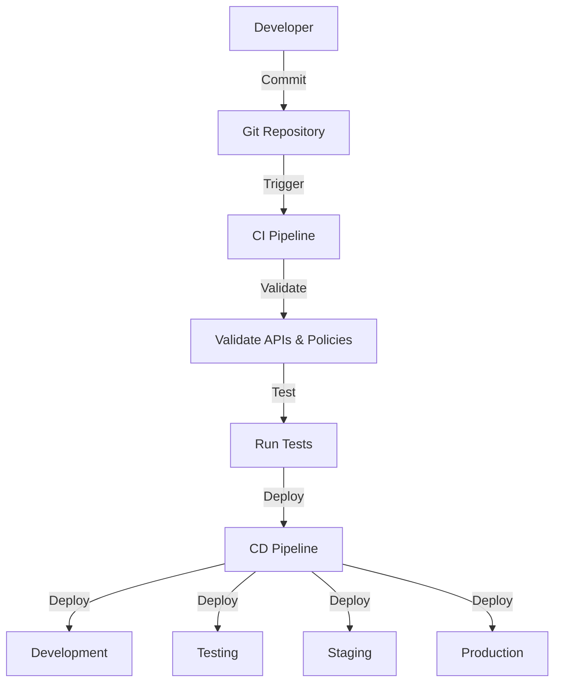

# Automation and CI/CD for Tyk Deployments

This guide covers strategies and tools for automating Tyk deployments, implementing CI/CD pipelines, and adopting GitOps practices for API management. Learn how to automate the entire API lifecycle from development to production.

## Automation Fundamentals

### Benefits of Automation

Automating Tyk deployments provides numerous benefits:

- **Consistency**: Eliminate manual errors and ensure reproducible deployments
- **Speed**: Accelerate deployment cycles and reduce time-to-market
- **Governance**: Enforce standards and compliance through automation
- **Auditability**: Maintain complete history of changes and approvals
- **Scalability**: Manage larger API ecosystems with fewer resources

### Automation Scope

Automation can be applied to various aspects of Tyk:

- **Infrastructure provisioning**: Servers, networks, and cloud resources
- **Installation and configuration**: Tyk components and dependencies
- **API definition management**: API creation, updates, and versioning
- **Policy management**: Security policies and access controls
- **Testing**: Functional, performance, and security testing
- **Deployment**: Promotion across environments
- **Monitoring**: Automated health checks and alerting

## Infrastructure as Code

### Infrastructure Provisioning

Use infrastructure as code (IaC) to provision Tyk environments:

- **Terraform**: Define cloud infrastructure (AWS, Azure, GCP)
- **Ansible**: Configure servers and install Tyk components
- **Kubernetes manifests**: Deploy Tyk in Kubernetes environments

Example Terraform configuration for Tyk Gateway on AWS:

```hcl
resource "aws_instance" "tyk_gateway" {
  ami           = var.ami_id
  instance_type = "t3.medium"
  count         = var.gateway_count
  
  vpc_security_group_ids = [aws_security_group.tyk_gateway_sg.id]
  subnet_id              = element(var.subnet_ids, count.index % length(var.subnet_ids))
  
  tags = {
    Name        = "tyk-gateway-${count.index}"
    Environment = var.environment
    Component   = "tyk-gateway"
  }
  
  user_data = templatefile("${path.module}/scripts/install_gateway.sh", {
    redis_host     = var.redis_host
    redis_port     = var.redis_port
    redis_password = var.redis_password
    dashboard_url  = var.dashboard_url
    api_secret     = var.api_secret
    org_id         = var.org_id
  })
}
```

### Configuration as Code

Manage Tyk configurations as code:

- **API definitions**: Store API definitions in version control
- **Policies**: Define policies as code
- **Environment-specific settings**: Parameterize configurations for different environments

Example API definition as code:

```json
{
  "name": "My API",
  "slug": "my-api",
  "api_id": "my-api",
  "org_id": "{{.OrgID}}",
  "use_keyless": false,
  "auth": {
    "auth_header_name": "Authorization"
  },
  "version_data": {
    "not_versioned": true,
    "versions": {
      "Default": {
        "name": "Default",
        "use_extended_paths": true
      }
    }
  },
  "proxy": {
    "listen_path": "/my-api/",
    "target_url": "{{.TargetURL}}",
    "strip_listen_path": true
  },
  "active": true
}
```

## Tyk-Specific Automation Tools

### Tyk Sync

Tyk Sync is a command-line tool for managing Tyk configurations:

- **Export**: Extract configurations from a running Tyk instance
- **Import**: Apply configurations to a Tyk instance
- **Diff**: Compare configurations between files and running instance
- **Validate**: Check configuration validity before applying

Example Tyk Sync usage:

```bash
# Export APIs and policies
tyk-sync dump -d="http://dashboard:3000" -s="secretkey" -t="./dump"

# Update specific APIs
tyk-sync update -d="http://dashboard:3000" -s="secretkey" -p="./dump/policies" -a="./dump/apis"

# Publish APIs to Gateway
tyk-sync publish -d="http://dashboard:3000" -s="secretkey" -p="./dump/policies" -a="./dump/apis"
```

### Tyk Operator

Tyk Operator provides Kubernetes-native API management:

- **Custom Resources**: Define APIs, policies, and security as Kubernetes resources
- **GitOps workflows**: Implement GitOps for API management
- **Kubernetes integration**: Leverage Kubernetes features for Tyk management

Example API definition as Kubernetes custom resource:

```yaml
apiVersion: tyk.tyk.io/v1alpha1
kind: ApiDefinition
metadata:
  name: httpbin
spec:
  name: httpbin
  use_keyless: false
  protocol: http
  active: true
  proxy:
    target_url: http://httpbin.org
    listen_path: /httpbin
    strip_listen_path: true
  version_data:
    default_version: Default
    not_versioned: true
  auth:
    use_keyless: false
    auth_header_name: Authorization
  org_id: acme
```

### Dashboard API

Automate using the Tyk Dashboard API directly:

- **Complete control**: Access all Dashboard functionality
- **Custom integration**: Build custom automation tools
- **Webhook integration**: Respond to external events

Example Dashboard API usage:

```bash
# Create an API
curl -X POST \
  https://dashboard:3000/api/apis \
  -H 'Authorization: $DASHBOARD_KEY' \
  -H 'Content-Type: application/json' \
  -d '{
    "api_definition": {
      "name": "My API",
      "slug": "my-api",
      "proxy": {
        "listen_path": "/my-api/",
        "target_url": "http://my-api.internal",
        "strip_listen_path": true
      },
      "active": true
    }
  }'
```

## CI/CD Pipeline Implementation

### Pipeline Architecture



Design an effective CI/CD pipeline for Tyk:

- **Source control**: Store all configurations in Git
- **CI pipeline**: Validate, test, and build configurations
- **CD pipeline**: Deploy to various environments
- **Approval gates**: Implement approvals for production deployments
- **Rollback capability**: Enable quick rollback of problematic changes

### Continuous Integration

Implement continuous integration for Tyk configurations:

- **Validation**: Check API definitions and policies for correctness
- **Linting**: Enforce style and best practices
- **Security scanning**: Check for security issues
- **Unit testing**: Test custom middleware and plugins
- **Integration testing**: Verify API behavior

Example GitHub Actions CI workflow:

```yaml
name: Tyk CI

on:
  push:
    branches: [ main, develop ]
  pull_request:
    branches: [ main, develop ]

jobs:
  validate:
    runs-on: ubuntu-latest
    steps:
      - uses: actions/checkout@v2
      
      - name: Set up Go
        uses: actions/setup-go@v2
        with:
          go-version: 1.17
          
      - name: Install Tyk Sync
        run: go install github.com/TykTechnologies/tyk-sync@latest
        
      - name: Validate API Definitions
        run: |
          for file in ./apis/*.json; do
            echo "Validating $file"
            tyk-sync validate -f "$file" || exit 1
          done
```

### Continuous Deployment

Implement continuous deployment for Tyk:

- **Environment promotion**: Promote configurations through environments
- **Deployment automation**: Automate deployment to each environment
- **Verification**: Verify successful deployment
- **Rollback**: Automatically roll back failed deployments

Example GitLab CI/CD deployment stage:

```yaml
deploy_to_staging:
  stage: deploy
  environment: staging
  script:
    - echo "Deploying to staging environment"
    - tyk-sync publish -d="$STAGING_DASHBOARD_URL" -s="$STAGING_DASHBOARD_KEY" -p="./policies" -a="./apis"
    - ./scripts/verify_deployment.sh staging
  only:
    - develop

deploy_to_production:
  stage: deploy
  environment: production
  when: manual
  script:
    - echo "Deploying to production environment"
    - tyk-sync publish -d="$PRODUCTION_DASHBOARD_URL" -s="$PRODUCTION_DASHBOARD_KEY" -p="./policies" -a="./apis"
    - ./scripts/verify_deployment.sh production
  only:
    - main
```

## Automated Testing Strategies

### API Definition Testing

Validate API definitions before deployment:

- **Schema validation**: Ensure API definitions match the expected schema
- **Policy validation**: Verify policies are correctly configured
- **Security testing**: Check for security misconfigurations
- **Custom validators**: Implement organization-specific validation rules

### Functional Testing

Automate functional testing of APIs:

- **Integration tests**: Verify API behavior against specifications
- **Contract testing**: Ensure APIs meet their contracts
- **End-to-end testing**: Test complete API workflows
- **Consumer-driven testing**: Test from the consumer perspective

Example API test with Postman/Newman:

```json
{
  "info": {
    "name": "My API Tests",
    "schema": "https://schema.getpostman.com/json/collection/v2.1.0/collection.json"
  },
  "item": [
    {
      "name": "Get User",
      "event": [
        {
          "listen": "test",
          "script": {
            "exec": [
              "pm.test(\"Status code is 200\", function () {",
              "    pm.response.to.have.status(200);",
              "});",
              "pm.test(\"Response has user data\", function () {",
              "    var jsonData = pm.response.json();",
              "    pm.expect(jsonData.id).to.exist;",
              "    pm.expect(jsonData.name).to.exist;",
              "});"
            ],
            "type": "text/javascript"
          }
        }
      ],
      "request": {
        "method": "GET",
        "url": "{{baseUrl}}/users/1",
        "header": [
          {
            "key": "Authorization",
            "value": "{{apiKey}}"
          }
        ]
      }
    }
  ]
}
```

## Implementation Example: Enterprise API Platform

This example demonstrates a comprehensive CI/CD implementation for an enterprise API platform.

### Requirements:

- Multi-environment deployment (Dev, Test, Staging, Production)
- Strict governance and approval processes
- Automated testing and validation
- Audit trail for all changes
- Self-service for API developers

### Implementation:

1. **Repository Structure**:
   ```
   /
   ├── apis/                  # API definitions
   │   ├── internal/          # Internal APIs
   │   └── external/          # External APIs
   ├── policies/              # Security policies
   ├── templates/             # Configuration templates
   ├── environments/          # Environment-specific variables
   │   ├── development/
   │   ├── testing/
   │   ├── staging/
   │   └── production/
   ├── scripts/               # Automation scripts
   ├── tests/                 # Automated tests
   └── .github/workflows/     # CI/CD workflows
   ```

2. **CI/CD Pipeline**:
   - Pull request triggers validation and testing
   - Merge to develop branch deploys to development environment
   - Promotion to testing requires automated tests to pass
   - Promotion to staging requires QA approval
   - Promotion to production requires security and business approval

3. **Automation Tools**:
   - GitHub Actions for CI/CD
   - Tyk Sync for configuration management
   - Postman/Newman for API testing
   - Custom validators for governance checks
   - Slack integration for notifications

### Results:

- 90% reduction in deployment time
- Zero configuration errors in production
- Complete audit trail for all API changes
- Improved developer productivity
- Consistent governance enforcement

## Best Practices

### Pipeline Design

- Start simple and expand gradually
- Focus on validation and testing
- Implement proper error handling
- Include notifications for key events
- Document the pipeline thoroughly

### Configuration Management

- Use a consistent structure for API definitions
- Implement templates for common patterns
- Separate environment-specific variables
- Validate configurations before deployment
- Maintain a history of all changes

### Security Considerations

- Secure storage of credentials and secrets
- Implement least privilege for automation users
- Include security scanning in the pipeline
- Audit all automated actions
- Implement approval gates for sensitive changes

### Documentation

- Document the automation architecture
- Create runbooks for common scenarios
- Maintain a knowledge base for troubleshooting
- Document the CI/CD pipeline
- Provide self-service guides for developers

## Next Steps

- [Configuration Management](/api-management/managing-deployments/operations/configuration-management)
- [Multi-Environment Management](/api-management/managing-deployments/operations/multi-environment-management)
- [Monitoring and Alerting](/api-management/managing-deployments/operations/monitoring-alerting)
